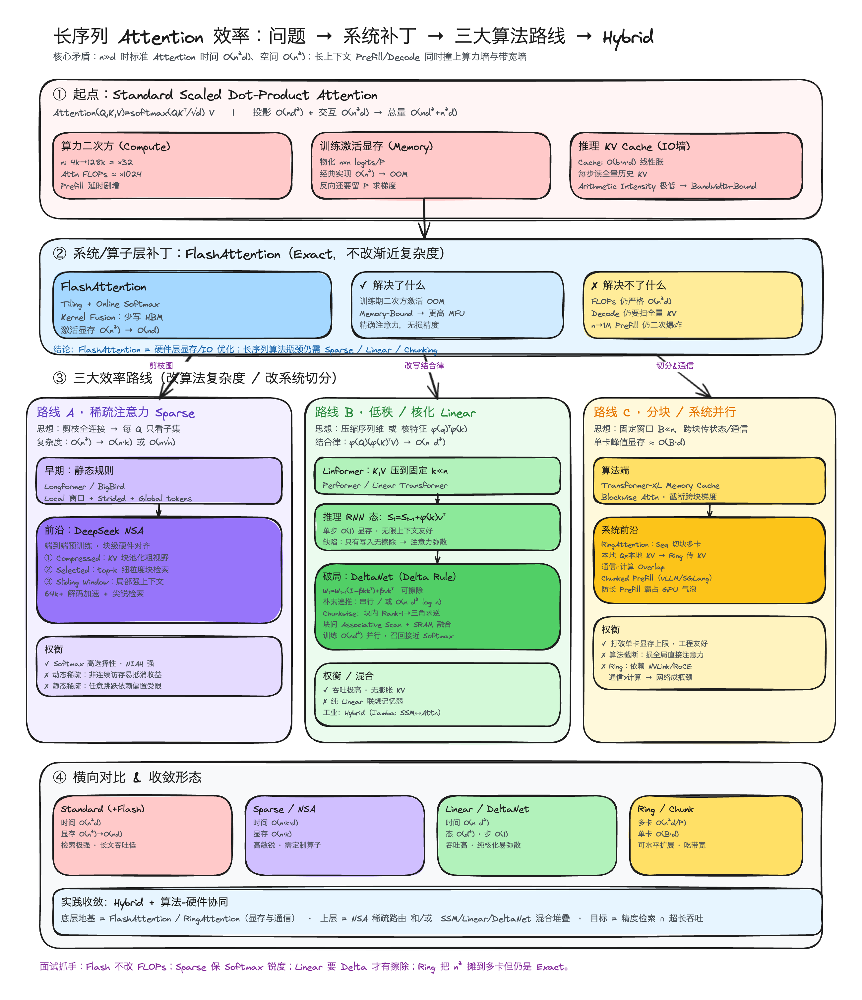

# ML Coding 01B · Transformer Architecture Variants: MHA Tensor Shapes, FLOPs Breakdown & KV Cache Hardware Optimizations

In large language model (LLM) system design and generative AI engineering, a rigorous grasp of Multi-Head Attention (MHA) tensor transformations, computational complexity (FLOPs) regime shifts, and autoregressive Key-Value (KV) cache memory scaling—alongside hardware-aware accelerations like FlashAttention, GQA, and PagedAttention—is fundamental for modern foundation model architecture, optimization, and large-scale serving.

This note systematically covers 5 foundational pillars of Transformer mechanisms:
1. **Transformer Architectural Taxonomies (Encoder-Only vs. Decoder-Only vs. Encoder-Decoder)**
2. **Multi-Head Attention (MHA) Mathematical Derivation, Tensor Shapes & Execution Pipeline**
3. **MHA FLOPs Complexity Decomposition & Context Regime Shifts**
4. **Autoregressive Inference Dynamics & Exact KV Cache Memory Footprint Modeling**
5. **Long-Context & Hardware-Aware Attention Optimizations (Global Efficiency Landscape, MQA / GQA, FlashAttention SRAM Tiling, PagedAttention & KV Quantization)**

---

## Module 1: Architectural Taxonomies, Masking Patterns & Cross-Attention

```text
Comparison of Attention Masking Patterns:
Encoder-Only (BERT):           Decoder-Only (GPT / LLaMA):     Encoder-Decoder (T5 / BART):
┌───┬───┬───┬───┐             ┌───┬───┬───┬───┐               ┌───┬───┬───┬───┐
│ 0 │ 0 │ 0 │ 0 │             │ 0 │ -∞│ -∞│ -∞│               │ 0 │ 0 │ 0 │ 0 │  (Encoder: Fully Bidirectional)
├───┼───┼───┼───┤             ├───┼───┼───┼───┤               ├───┼───┼───┼───┤
│ 0 │ 0 │ 0 │ 0 │             │ 0 │ 0 │ -∞│ -∞│               │ 0 │ 0 │ 0 │ 0 │
├───┼───┼───┼───┤             ├───┼───┼───┼───┤               └───┴───┴───┴───┘
│ 0 │ 0 │ 0 │ 0 │             │ 0 │ 0 │ 0 │ -∞│               ┌───┬───┬───┬───┐
├───┼───┼───┼───┤             ├───┼───┼───┼───┤               │ 0 │ -∞│ -∞│ -∞│  (Decoder: Causal Lower-Triangular)
│ 0 │ 0 │ 0 │ 0 │             │ 0 │ 0 │ 0 │ 0 │               └───┴───┴───┴───┘
└───┴───┴───┴───┘             └───┴───┴───┴───┘               + Cross-Attention: Q_dec × K_enc^T
[Bidirectional M_ij = 0]      [Causal Lower-Triangular]       [Bidirectional Enc + Causal Dec + Cross-Attn]
```

### Comprehensive Comparison of Transformer Archetypes

| Archetype | Attention Masking Pattern | Processing / Generation Paradigm | KV Cache Requirement | Canonical Models | Primary Use Cases |
|---|---|---|---|---|---|
| **Encoder-Only** | Fully bidirectional ($M_{ij} = 0$) | Non-autoregressive; processes all $S$ tokens in a single parallel forward pass | **No KV Cache required** | BERT, RoBERTa, DeBERTa | Text classification, NER, dense retrieval embeddings |
| **Decoder-Only** | Causal lower-triangular ($M_{ij} = -\infty$ for $j > i$) | Autoregressive; generates tokens sequentially conditioned on historical context | **KV Cache is mandatory** | GPT-4, LLaMA-3, Mistral, Qwen, DeepSeek | Generative foundation LLMs, instruction following, reasoning |
| **Encoder-Decoder** | Encoder bidirectional + Decoder causal + **Cross-Attention** | Bidirectional encoding of prompt; autoregressive generation of target | **Dual KV Cache required** (Static encoder + Dynamic decoder) | T5, BART, Whisper, Original Transformer | Machine translation, abstractive summarization, ASR |

#### Cross-Attention Mechanics
In an Encoder-Decoder model:
- **Queries ($Q$)**: Generated from the decoder's preceding hidden representations;
- **Keys ($K$) and Values ($V$)**: Generated from the final encoder representations;
- **Execution**: Encoder $K, V$ are computed once during prompt processing and reused across all subsequent decoding steps.

---

## Module 2: Multi-Head Attention (MHA) Math, Tensor Shapes & Execution Pipeline

Let batch size be $B$, sequence length $S$, hidden dimension $D$, number of attention heads $H$, and per-head dimension $d_k = D / H$.

```text
MHA Tensor Flow Lifecycle:
Input X (B, S, D)
  ├──> W_Q (D, D) ──> Q (B, S, D) ──> Reshape & Transpose ──> (B, H, S, d_k) ┐
  ├──> W_K (D, D) ──> K (B, S, D) ──> Reshape & Transpose ──> (B, H, S, d_k) ┼──> Scaled Dot-Product & Softmax
  └──> W_V (D, D) ──> V (B, S, D) ──> Reshape & Transpose ──> (B, H, S, d_k) ┘     │
                                                                                    ▼
                                                                           Score A (B, H, S, S)
                                                                                    │ × V (B, H, S, d_k)
                                                                                    ▼
                                                                           Context (B, H, S, d_k)
                                                                                    │
                                                                           Transpose & Concat (B, S, D)
                                                                                    │ × W_O (D, D)
                                                                                    ▼
                                                                           Output (B, S, D)
```

### Detailed 6-Step Tensor Transformation

1. **Linear Projections**:
   Input tensor $\mathbf{X} \in \mathbb{R}^{B \times S \times D}$ with projection weights $W_Q, W_K, W_V \in \mathbb{R}^{D \times D}$:

$$Q = \mathbf{X}W_Q, \quad K = \mathbf{X}W_K, \quad V = \mathbf{X}W_V \quad \in \mathbb{R}^{B \times S \times D}$$

2. **Head Reshaping and Transposition**:

$$\text{Reshape: } (B, S, D) \to (B, S, H, d_k) \xrightarrow{\text{Transpose (1, 2)}} (B, H, S, d_k)$$

3. **Scaled Dot-Product Attention Scores**:

$$A = \frac{Q K^T}{\sqrt{d_k}} \in \mathbb{R}^{B \times H \times S \times S}$$

   > **Why divide by $\sqrt{d_k}$?**  
   > Assuming $Q$ and $K$ components are independent random variables with zero mean and unit variance, the dot product $\sum_{i=1}^{d_k} q_i k_i$ has mean 0 and **variance $d_k$**. Scaling by $\frac{1}{\sqrt{d_k}}$ preserves unit variance, preventing dot products from exploding into extreme values that saturate softmax gradients.

4. **Masking & Softmax**:

$$\tilde{A} = \text{softmax}(A + M), \quad M_{ij} = \begin{cases} 0 & j \le i \\ -\infty & j > i \end{cases}$$

5. **Value Aggregation & Concatenation**:

$$\text{Head}_h = \tilde{A}_h V_h \in \mathbb{R}^{B \times H \times S \times d_k} \xrightarrow{\text{Transpose \& Reshape}} \text{MultiHead} \in \mathbb{R}^{B \times S \times D}$$

6. **Output Projection**:

$$\text{Output} = \text{MultiHead} \cdot W_O \in \mathbb{R}^{B \times S \times D}, \quad W_O \in \mathbb{R}^{D \times D}$$

---

## Module 3: MHA Computational Complexity & Regime Shift Analysis

Each multiply-accumulate operation corresponds to 2 FLOPs.

### 1. FLOPs Breakdown (for batch size $B=1$)

1. **Linear Projections ($Q, K, V, W_O$)**:
   Four matrix multiplications of shape $(S \times D) \times (D \times D)$:
   $$\text{FLOPs}_{\text{proj}} = 4 \times (2 \times S \times D \times D) = \mathbf{8 S D^2} \implies \mathcal{O}(S D^2)$$
2. **Attention Score Matrix ($Q K^T$)**:
   $H$ heads performing $(S \times d_k) \times (d_k \times S)$ multiplication:
   $$\text{FLOPs}_{QK^T} = H \times (2 \times S \times d_k \times S) = \mathbf{2 S^2 D} \implies \mathcal{O}(S^2 D)$$
3. **Value Aggregation ($\tilde{A} V$)**:
   $H$ heads performing $(S \times S) \times (S \times d_k)$ multiplication:
   $$\text{FLOPs}_{AV} = H \times (2 \times S \times S \times d_k) = \mathbf{2 S^2 D} \implies \mathcal{O}(S^2 D)$$
4. **Total MHA Layer FLOPs**:

$$\text{Total FLOPs}_{\text{MHA}} = 8 S D^2 + 4 S^2 D$$

---

### 2. Context Length Regime Shifts

```text
MHA FLOPs Component Crossover:
FLOPs
  ▲
  │                                    /  O(S² D) Attention MatMul
  │                                   /   (Dominates in long-context)
  │                                  /
  │            O(S D²) Projections  /
  │           (Dominates in short) /
  │         ─────────────────────/
  │                             /
  └────────────────────────────┴─────────────► Sequence Length S
                             S ≈ 2D (Crossover Point)
```

- **Short-Context Regime ($S < 2D$, e.g., $S=2048, D=4096$)**:
  $8 S D^2 > 4 S^2 D$. Projection matrix multiplications dominate compute ($>80\%$). GEMM throughput on Tensor Cores is the primary optimization objective.
- **Long-Context Regime ($S \gg D$, e.g., $S=32K \sim 128K, D=4096$)**:
  $4 S^2 D \gg 8 S D^2$. The quadratic attention matrix calculation explodes, dominating runtime and memory. Hardware-aware tiling (FlashAttention) and sparse/linear variants become essential.

---

## Module 4: Autoregressive Inference & KV Cache Memory Growth

### 1. Prefill Phase vs. Decode Phase

```text
Inference Phase Characteristics:
┌─────────────────────────┬────────────────────────────────────────────────────────────────────────┐
│ Phase                   │ Hardware Dynamics & Bottlenecks                                        │
├─────────────────────────┼────────────────────────────────────────────────────────────────────────┤
│ 1. Prefill Phase        │ • Parallel processing of entire prompt sequence ($S_{\text{prompt}}$)  │
│    (Prompt Processing)  │ • Computes initial KV cache                                            │
│                         │ • High arithmetic intensity $\implies$ **Compute-Bound**               │
├─────────────────────────┼────────────────────────────────────────────────────────────────────────┤
│ 2. Decode Phase         │ • Step-by-step single token input ($x_t \in \mathbb{R}^{1 \times D}$)  │
│    (Token Generation)   │ • Appends new $k_t, v_t$ to cache; computes $q_t K_{\le t}^T V_{\le t}$│
│                         │ • Must stream full model weights & KV cache per generated token        │
│                         │ • Arithmetic intensity $\approx 1 \text{ FLOP/Byte} \implies$ **Memory-Bound**│
└─────────────────────────┴────────────────────────────────────────────────────────────────────────┘
```

#### Why Is Query ($Q$) Never Cached?
- Query vector $q_t \in \mathbb{R}^{1 \times D}$ is only needed to compute attention against past keys $K_{\le t}$ for the current token;
- At step $t+1$, the newly generated token produces its own query $q_{t+1}$;
- **Past queries $q_1, \dots, q_t$ are never reused**, giving $Q$ an ephemeral lifespan.

---

### 2. KV Cache Memory Footprint Formula

For batch size $B$, sequence length $S$, number of layers $L$, number of key-value heads $H_{KV}$, per-head dimension $d_k$, and byte precision $b$ (e.g., $b=2$ for FP16/BF16):

$$\text{Memory}_{\text{KVCache}} = 2 \times B \times S \times L \times H_{KV} \times d_k \times b \quad \text{Bytes}$$

> *The factor of 2 accounts for Key and Value tensors.*

#### Case Study: LLaMA-3-70B
- Specifications: $L=80, D=8192, H_Q=64, H_{KV}=8 \text{ (GQA)}, d_k=128, b=2$
- Per-token memory footprint:
  $$\text{Per-Token Memory} = 2 \times 80 \times 8 \times 128 \times 2 = 327,680 \text{ Bytes} \approx \mathbf{320 \text{ KB / Token}}$$
- For batch $B=64$ and context $S=8192$:
  $$\text{Total Memory} = 64 \times 8192 \times 320 \text{ KB} \approx \mathbf{167.77 \text{ GB}}$$
  *(Exceeds the 140 GB static model weights footprint!)*

---

## Module 5: Long-Context & Hardware-Aware Attention Optimizations

### 1. Core Contradiction of Long-Context Attention & The Three Physical Walls

In standard Scaled Dot-Product Attention:
$$\text{Attention}(Q, K, V) = \text{softmax}\left(\frac{Q K^T}{\sqrt{d_k}}\right) V$$
The total computation comprises two distinct phases:
- **Linear Projections**: Four matrix multiplications for $Q, K, V, W_O$, with computational complexity $\mathcal{O}(S D^2)$;
- **Attention Interaction**: Score computation $Q K^T$ and aggregation $\tilde{A} V$, with time complexity $\mathcal{O}(S^2 D)$ and spatial complexity $\mathcal{O}(S^2)$ for intermediate matrices.

When the sequence length enters the long-context regime ($S \gg D$), the system bottleneck shifts fundamentally. During both Prefill and Decode phases, models collide simultaneously with **three physical walls**:

```text
The Three Physical Bottlenecks of Long Context:
┌─────────────────────────┬─────────────────────────┬─────────────────────────┐
│ 1. Quadratic Compute    │ 2. Training Activation  │ 3. Inference KV Cache   │
│    (Compute Wall)       │    Memory (Memory Wall) │    (IO Bandwidth Wall)  │
├─────────────────────────┼─────────────────────────┼─────────────────────────┤
│ • S scales 4K -> 128K:  │ • Materializing S×S     │ • Memory capacity       │
│   Length expands 32x    │   Logits & Attn scores  │   O(B·S·L·d) grows      │
│ • Attn FLOPs surge      │ • Naive O(S²) causes    │   monotonically linear  │
│   1024x                 │   GPU OOM crashes       │ • Decoding 1 token must │
│ • Prefill latency       │ • Backward pass retains │   read full history KV  │
│   explodes quadratically│   dense gradient graphs │ • Low arithmetic        │
│                         │                         │   intensity, mem-bound  │
└─────────────────────────┴─────────────────────────┴─────────────────────────┘
```

To resolve these contradictions, modern LLM systems follow an evolutionary roadmap: **Systems/Operator Patch $\to$ Three Algorithmic & Partitioning Trajectories $\to$ Hybrid Convergence**:



---

### 2. Systems/Operator Patch: FlashAttention (Exact Attention, Invariant Asymptotics)

FlashAttention (Dao et al.) has become foundational infrastructure for modern LLM training and inference. Its definitive trait is **exact mathematical equivalence (zero loss in model precision)**.

#### (1) Core Mechanisms
- **Tiling (On-Chip SRAM Chunking)**: Partitions input tensors $Q, K, V$ into blocks sized to fit inside ultra-fast GPU on-chip SRAM (100 KB–228 KB per SM). All matrix multiplications and normalizations execute within SRAM;
- **Online Softmax (Incremental Normalization)**: Standard Softmax requires materializing the complete row to compute running maxima and exponential sums. Online Softmax maintains running scaling factors $m_i$ and $l_i$, dynamically updating intermediate attention blocks as chunks stream through SRAM. **This completely eliminates reading and writing the $S \times S$ intermediate matrix to slow High Bandwidth Memory (HBM)**;
- **Recomputation in Backward**: The backward pass discards intermediate forward attention matrices and recomputes them on-the-fly inside SRAM, shrinking training activation memory from $\mathcal{O}(S^2)$ to $\mathcal{O}(S D)$.

#### (2) Trade-Off Analysis: What It Solves vs. What It Cannot Solve
- **$\checkmark$ What It Solves**:
  - Eliminates training-time $\mathcal{O}(S^2)$ activation memory OOM crashes;
  - Drastically curtails low-efficiency HBM memory round-trips, shifting kernels from memory-bandwidth-bound regimes into high compute utilization (MFU increases 2–4×);
  - Outputs are mathematically identical to standard attention, requiring zero weight modifications or retraining.
- **$\times$ What It Cannot Solve**:
  - **Total FLOPs remain strictly $\mathcal{O}(S^2 D)$**; asymptotic computational complexity is untouched;
  - Autoregressive decoding must still load the full historical KV Cache step-by-step;
  - As context reaches 1M+ tokens, quadratic Prefill latency remains computationally prohibitive.
- **Core Engineering Takeaway**: **FlashAttention is a hardware-level IO-aware access optimization. Overcoming asymptotic FLOPs and decoding throughput bottlenecks requires algorithmic and structural paradigms (Sparse, Linear, Chunking).**

---

### 3. Three Algorithmic & Systems Efficiency Trajectories

#### Trajectory A: Sparse Attention (Pruning the Attention Graph)
* **Core Idea**: Prune non-essential edges in the fully connected attention bipartite graph. Each Query attends only to a dedicated subset of Keys, lowering complexity from $\mathcal{O}(S^2)$ to $\mathcal{O}(S \cdot k)$ or $\mathcal{O}(S\sqrt{S})$.
* **Static Heuristics**:
  * **Longformer / BigBird**: Handcrafted hybrid attention patterns combining local sliding windows (capturing syntactic locality) + strided/dilated windows (capturing mid-range context) + global anchor tokens (such as `[CLS]` broadcasting across the entire document).
  * **Limitations**: Hardcoded rules fail to capture dynamic semantic shifts across irregular context dependencies.
* **Modern Frontier: Hardware-Aligned End-to-End Native Sparse Attention (DeepSeek NSA)**:
  * Eliminates irregular, non-contiguous token-level indexing in favor of **block-aligned native dynamic sparsity**:
    1. **Compressed Tokens (Coarse-Grained View)**: Aggregates consecutive token blocks into single pooled vectors; Queries scan at coarse granularity to locate potentially relevant context regions;
    2. **Selected Tokens (Top-$k$ Fine-Grained Retrieval)**: Based on coarse scores, only top-$k$ critical blocks are scheduled into fast on-chip memory for exact fine-grained attention;
    3. **Sliding Window (Fine Local Context)**: Preserves full causal attention over adjacent recent tokens.
  * **Engineering Gains**: Delivers multi-fold pretraining and decoding speedups on 64K+ context lengths while retaining high score sharpness on Needle-In-A-Haystack (NIAH) benchmarks.
* **Trade-Offs**:
  * $\checkmark$ Preserves the exponential contrastive sharpening of Softmax; maintains strong associative retrieval fidelity;
  * $\times$ Dynamic sparse indexing requires block-level hardware alignment; otherwise, irregular memory gather/scatter overhead nullifies arithmetic savings.

#### Trajectory B: Linear & Kernelized Attention (Rewriting Associativity & Delta Rule)
* **Core Idea**: Decomposes Softmax via feature maps $\phi(\cdot)$ such that $\text{Sim}(Q, K) = \phi(Q)\phi(K)^T$. Applying matrix multiplication associativity transforms the computation:
  $$\text{Standard: } (Q K^T) V \in \mathcal{O}(S^2 D) \implies \text{Linear: } \phi(Q) \left(\phi(K)^T V\right) \in \mathcal{O}(S \cdot D^2)$$
* **Evolution**:
  * **Linformer**: Projects sequence dimensions of $K, V$ to a fixed low-rank dimension $k \ll S$;
  * **Performer / Linear Transformer**: Employs Positive Random Features (PRF) to approximate Gaussian kernels.
* **Constant-State Autoregressive Decoding**:
  During causal decoding, Key-Value accumulation reduces to a streaming recurrent state:
  $$S_t = S_{t-1} + \phi(k_t) v_t^T \in \mathbb{R}^{d \times d}, \quad o_t = \phi(q_t) S_t$$
  Each decoding step updates a constant-sized hidden state $S_t$. **Inference memory and time complexity per step are strictly $\mathcal{O}(1)$**, completely eliminating the linearly expanding KV Cache!
* **Fatal Flaw & Delta Rule Breakthrough (DeltaNet / RetNet / Mamba-2)**:
  * **Memory Saturation & Attention Dilution**: Because pure accumulation ($S_t = S_{t-1} + k_t v_t^T$) only writes without erasing, historical noise rapidly saturates the bounded state matrix, eroding retrieval discrimination over long horizons.
  * **The Delta Rule (DeltaNet / RetNet)**: Introduces associative memory erasure:
    $$W_t = W_{t-1}(I - \beta_t k_t k_t^T) + \beta_t v_t k_t^T$$
    When a new Key conflicts with historical memory, the model subtracts old projections before writing new values.
  * **Chunkwise Parallel Training**: Converts within-chunk rank-1 updates into lower-triangular solvable systems and bridges cross-chunk states using fused associative parallel scans, achieving full $\mathcal{O}(S D^2)$ parallel training with retrieval recall rivaling standard Softmax.
* **Trade-Offs**:
  * $\checkmark$ Unbounded generation throughput, zero KV cache explosion, constant inference memory footprint;
  * $\times$ Pure linear attention still trails standard attention on complex associative recall and few-shot in-context learning (ICL);
  * **Industrial Convergence**: **Hybrid Architectures** (e.g., **Jamba**, **Nemotron-4**), interleaving standard causal attention layers periodically among SSM/linear layers to achieve full associative precision with minimal memory overhead.

#### Trajectory C: Chunking & System-Level Parallelism (Altering System Partitioning)
* **Core Idea**: Fix local attention blocks $B \ll S$ at the algorithmic level, or partition long sequences across multiple GPUs at the systems level, capping peak per-GPU activation memory at $\mathcal{O}(B \cdot D)$.
* **Algorithmic Chunking**:
  * **Transformer-XL**: Maintains segment-level memory caches, truncating backpropagation gradients across chunk boundaries while preserving forward hidden state recurrence.
* **Distributed Systems Frontier: RingAttention (Liu et al.)**:
  * Partitions a long sequence into $P$ chunks distributed across $P$ GPUs;
  * **Ring Topology Execution**: Each GPU holds its local $Q$ chunk while $K, V$ blocks rotate in a peer-to-peer ring across the interconnect;
  * **Compute-Communication Overlap**: While GPU $p$ calculates attention for block $i$, asynchronous non-blocking communications concurrently send and receive block $i+1$ from adjacent peers, masking network transit latencies;
  * **Chunked Prefill (vLLM / SGLang)**: Slices ultra-long prompts into scheduled chunks, preventing large Prefills from monopolizing compute units and causing latency spikes (Head-of-Line Blocking) for ongoing Decode requests.
* **Trade-Offs**:
  * $\checkmark$ Obliterates single-device memory limits, enabling multi-million context handling on standard clusters;
  * $\times$ Algorithmic chunking sacrifices direct cross-chunk attention; RingAttention imposes heavy bandwidth demands on inter-GPU interconnects (NVLink / RoCE).

---

### 4. Architectural Head Reduction (MHA vs. MQA vs. GQA) & Serving Memory Optimizations

Beyond operator and algorithmic shifts, modern LLMs compress inference memory footprints structurally by reducing Key/Value head counts:

```text
MHA vs. MQA vs. GQA Comparison:
MHA (Multi-Head Attention):        MQA (Multi-Query Attention):       GQA (Grouped-Query Attention):
Q Heads:   [1] [2] [3] [4] [5] [6] [7] [8]  Q Heads:   [1] [2] [3] [4] [5] [6] [7] [8]  Q Heads:   [1][2] [3][4] [5][6] [7][8]
K/V Heads: [1] [2] [3] [4] [5] [6] [7] [8]  K/V Heads: [         1 (Shared)        ]  K/V Heads:  [ 1 ]  [ 2 ]  [ 3 ]  [ 4 ]
(KV Cache 100%, highest VRAM)               (KV Cache 1/H, capacity loss)               (LLaMA-3 Standard: Balanced)
```

- **Multi-Head Attention (MHA)**: $H_Q = H_{KV}$. Every Query head pairs with a distinct Key/Value head. Highest expressive capacity, but largest KV cache footprint;
- **Multi-Query Attention (MQA)**: $H_Q = H, H_{KV} = 1$. All Query heads share a single Key/Value head. Compresses KV cache by $H\times$, but degrades multi-turn reasoning and complex associative capacity;
- **Grouped-Query Attention (GQA)**: $H_Q = H, H_{KV} = G$ ($1 < G < H$). Partitions Query heads into $G$ groups, each sharing one Key/Value head (e.g., 64:8 in LLaMA-3-70B). Empirical results show **GQA preserves $\approx 99\%$ of MHA performance while achieving memory bandwidth and throughput improvements close to MQA**.

#### PagedAttention & KV Cache Quantization
- **PagedAttention (vLLM Core Engine)**: Adapts virtual memory paging to map continuous logical KV tensors into non-contiguous physical pages (e.g., 16 tokens/block), compressing KV memory fragmentation from $60\% \sim 80\%$ down to $<4\%$;
- **KV Cache Quantization (FP8 / INT4)**: Quantizes cached Key/Value vectors to 8-bit or 4-bit precision, halving or quartering memory capacity demands and significantly elevating decode concurrency in memory-bandwidth-bound regimes.

---

### 5. Multi-Paradigm Comparison Matrix & Industrial Convergence

| Paradigm / Mechanism | Compute Complexity | Training Memory | Inference KV State Memory | Core Strengths | Core Limitations & Engineering Overhead |
|---|---|---|---|---|---|
| **Standard (+FlashAttention)** | $\mathcal{O}(S^2 D)$ | $\mathcal{O}(S D)$ | $\mathcal{O}(B \cdot S \cdot L \cdot d_k)$ Linear | Exact Softmax, zero quality loss, sharp associative recall | Prefill & FLOPs remain quadratic; low throughput at long sequences |
| **Sparse / NSA (DeepSeek)** | $\mathcal{O}(S \cdot k \cdot D)$ | $\mathcal{O}(S \cdot k)$ | $\mathcal{O}(B \cdot k \cdot L \cdot d_k)$ Sparse | Retains Softmax contrastive sharpness; high NIAH retrieval; 64K+ decode speedup | Requires hardware-aligned block kernels; non-contiguous memory access risks |
| **Linear / DeltaNet** | $\mathcal{O}(S \cdot D^2)$ | $\mathcal{O}(S D)$ | $\mathcal{O}(D^2)$, Step $\mathcal{O}(1)$ | Extreme decoding throughput; zero KV Cache expansion | Pure accumulation suffers from memory saturation; weaker ICL than Softmax |
| **Ring / Chunked Parallel** | Distributed $\mathcal{O}(S^2 D / P)$ | Per-GPU $\mathcal{O}(B_{\text{chunk}} D)$ | Distributed slices | Breaks single-device memory limits; scales to 1M+ context | Heavy reliance on high-speed interconnects (NVLink/RoCE); network can bottleneck |

#### Industrial Convergence: Hybrid Architectures & Hardware-Algorithmic Co-Design
In ultra-long-context production systems handling millions of tokens, efficiency paradigms converge into a cohesive, multi-layered stack:
- **Hardware & Communication Foundation**: **FlashAttention** handles single-GPU SRAM-HBM IO optimization, while **RingAttention** orchestrates cross-node sequence slicing;
- **Algorithm & Model Architecture**: **GQA** shrinks inference head footprints, paired with **NSA native dynamic sparsity** or **SSM/DeltaNet hybrid interleaving**;
- **Core Engineering Principles**:
  * *FlashAttention does not alter FLOPs; it solves the IO bandwidth wall and activation OOM;*
  * *Sparse Attention preserves Softmax sharpness, succeeding only through block-aligned hardware design;*
  * *Linear Attention rewrites associativity, requiring Delta-rule updates to actively erase stale memory;*
  * *RingAttention distributes quadratic compute across a cluster without compromising exact mathematical outputs.*

---

## Module 6: Core Engineering Formulas & Technical Reference

### Q1: Calculate the FLOPs for a single MHA layer with sequence length $S=4096$ and hidden dimension $D=4096$.
> **Answer**:
> 1. Linear projections ($4$ matmuls): $\text{FLOPs}_{\text{proj}} = 8 S D^2 = 8 \times 4096 \times (4096)^2 \approx \mathbf{5.498 \times 10^{11} \text{ FLOPs} \ (550 \text{ GFLOPs})}$.
> 2. Attention matrix math ($QK^T$ and $\tilde{A}V$): $\text{FLOPs}_{\text{attn}} = 4 S^2 D = 4 \times (4096)^2 \times 4096 \approx \mathbf{2.749 \times 10^{11} \text{ FLOPs} \ (275 \text{ GFLOPs})}$.
> 3. Total MHA FLOPs: $\approx \mathbf{825 \text{ GFLOPs}}$.

### Q2: Why does FlashAttention achieve a 2–4× speedup while producing mathematically exact attention outputs?
> **Answer**:
> GPUs compute much faster than they transfer data between HBM and compute units. Standard attention is bottlenecked by repeated $O(S^2)$ memory round-trips to HBM for intermediate attention score matrices. FlashAttention fuses operations inside fast on-chip SRAM using tiling and online softmax, reducing HBM IO complexity from $O(S^2)$ to $O(S)$.
