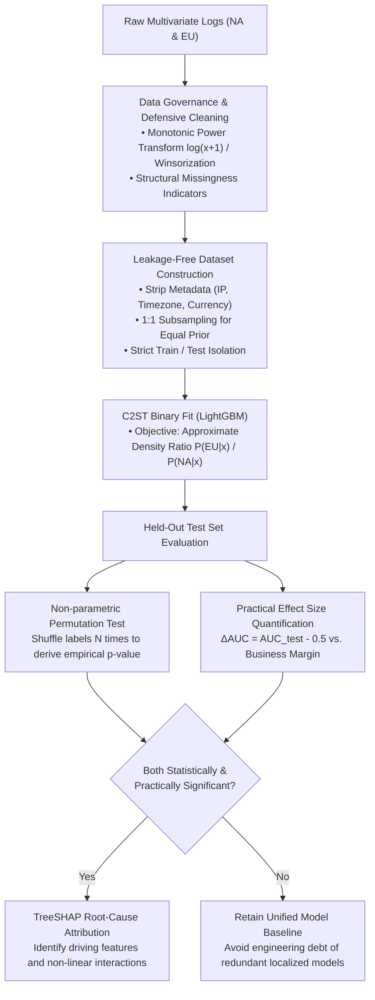

# ML Coding 09 · Data Science & Statistical Testing: Multivariate Distribution Shift, Classifier Two-Sample Tests & Causal Data Governance

## Module Introduction & Knowledge Framework

In Data Science and Machine Learning Engineering, assessing whether the underlying population distributions of two sample cohorts differ significantly is a foundational, ubiquitous task:
- **Feature & Concept Drift Detection (Data Drift / Covariate Shift)**: Determining whether online production inference inputs have drifted away from offline training baselines;
- **Cross-Market / Cohort User Persona Comparison**: Evaluating whether behavioral patterns between North America (NA) and Europe (EU) exhibit structural divergence, deciding whether to train a unified global model or deploy region-specific localized rankers;
- **Causal Inference & A/B Testing Sanity Checks**: Validating whether treatment and control cohorts satisfy rigorous covariate balance prior to experimental intervention.

This module adopts an **Essential Methodology (Foundations) + Production Case Study (Practical Problem & Reproducible Code)** architecture to unpack high-dimensional statistical testing from mathematical mechanics to production deployment.

---

## Module 1: Statistical Testing Foundations & Methodology Toolkit

### 1. The Classical Hypothesis Testing Paradigm & Physical Limits

Every statistical test operates on a pair of mutually exclusive hypotheses:
- **Null Hypothesis ($H_0$)**: Typically represents "no effect", "no difference", or "retention of baseline parity";
- **Alternative Hypothesis ($H_1$)**: Represents "significant effect" or "distributional divergence".

Statistical decision-making entails two inevitable error modes:
1. **Type I Error ($\alpha$ / False Positive)**: Rejecting $H_0$ when it is actually true. Rigidly constrained via a chosen significance level (e.g., $\alpha = 0.05$ or $0.01$);
2. **Type II Error ($\beta$ / False Negative)**: Failing to reject $H_0$ when true divergence exists. Statistical Power is defined as $\text{Power} = 1 - \beta$, denoting the sensitivity to detect genuine divergence.

> [!WARNING]
> **The Large Sample Fallacy ($p$-value Breakdown)**:
> In modern big-data settings with millions of samples ($N > 10^6$), standard errors scale as $\text{SE} \propto \frac{1}{\sqrt{N}} \to 0$. In this regime, an infinitesimal, practically meaningless noise perturbation of $0.0001$ will mechanically drive $p < 10^{-10}$, triggering a statistically "significant" result.
> **Production Rule**: At scale, never make architectural or business decisions based solely on $p$-values. Always report an accompanying **Effect Size** to evaluate whether the detected difference is practically meaningful (Practical Significance).

---

### 2. Univariate Tests vs. Multivariate Joint Distribution Testing

A frequent pitfall among junior practitioners is running multiple independent univariate tests (e.g., $D$ separate two-sample $t$-tests or Kolmogorov-Smirnov tests) across a feature vector $\mathbf{x} = [x_1, x_2, \dots, x_D]^T$. This suffers from two fundamental flaws:

```text
       Feature X2
           ▲
           │          • EU Samples (y=x)
           │        •   NA Samples (y=-x)
           │      •   •
           │    •       •
           │  •           •
───────────┼─────────────────────────► Feature X1
           │  •           •
           │    •       •
           │      •   •
           │        •
           │
  Marginal Projections:
  • X1 mean=0, std=1 for both NA & EU -> Identical Marginal Distributions!
  • X2 mean=0, std=1 for both NA & EU -> Identical Marginal Distributions!
  Yet the Joint Distributions are completely orthogonal and distinct!
```

1. **Destruction of Covariance & Higher-Order Interactions**:
   - Two cohorts can have identical marginal distributions (identical means, variances, and quantiles per feature), yet exhibit entirely different correlation structures (e.g., NA exhibits high session duration with high CTR, while EU exhibits high duration with low CTR). Independent univariate tests have a **100% false negative miss rate** on such structural shifts;
2. **Family-Wise Error Rate (FWER) Inflation**:
   - When evaluating $D$ independent features, the family-wise error rate satisfies $\text{FWER} = 1 - (1 - \alpha)^D$. For $D=30$ and $\alpha=0.05$, the probability of falsely declaring at least one feature significant when no difference exists is $1 - 0.95^{30} \approx 78.5\%$.

---

### 3. Three Multivariate Testing Paradigms Compared

| Testing Paradigm | Representative Methods | Mathematical Mechanics & Core Formulation | Strengths & Engineering Trade-Offs |
| :--- | :--- | :--- | :--- |
| **Parametric Tests** | **Hotelling's $T^2$** / **MANOVA** | Multivariate generalization of the two-sample $t$-test based on the **Mahalanobis Distance** between mean vectors:<br>$T^2 = \frac{n_1 n_2}{n_1 + n_2} (\bar{\mathbf{x}}_1 - \bar{\mathbf{x}}_2)^T \mathbf{S}_{\text{pooled}}^{-1} (\bar{\mathbf{x}}_1 - \bar{\mathbf{x}}_2)$ | • **Pros**: Extremely fast closed-form solution ($F$-distribution); optimal power under true normality.<br>• **Cons**: Assumes multivariate normality and homoscedasticity; **only tests mean vectors, completely blind to variance, kurtosis, or non-linear correlation shifts**. |
| **Kernel Non-parametric** | **Maximum Mean Discrepancy (MMD)** / **Energy Distance** | Maps distributions into a **Reproducing Kernel Hilbert Space (RKHS)** via universal kernels (e.g., RBF) to evaluate mean embedding distances:<br>$\text{MMD}^2(P, Q) = \mathbb{E}[k(x, x')] - 2\mathbb{E}[k(x, y)] + \mathbb{E}[k(y, y')]$ | • **Pros**: Free of distributional assumptions; provably zero iff $P=Q$; captures infinite-order moment discrepancies.<br>• **Cons**: Full-sample pairwise distance calculation scales as $\mathcal{O}(N^2)$, incurring prohibitive memory and compute bottlenecks at scale. |
| **Machine Learning Classifiers** | **Classifier Two-Sample Test (C2ST)** | Reformulates two-sample testing as a **pseudo-labeled supervised binary classification task** (NA=0, EU=1). The test statistic is evaluated via out-of-sample discriminability (AUC / Accuracy) on a strictly held-out test split. | • **Pros**: **The de-facto industrial standard**. Invariant to feature scales and skewness; automatically extracts high-order non-linear interactions; pairs natively with **TreeSHAP** for instant root-cause attribution.<br>• **Cons**: Requires disciplined sample partitioning to avoid overfitting artifacts. |

---

## Module 2: Core Practical Exercise

### Problem: Cross-Market Multivariate User Behavioral Distribution Testing & Attribution

> **Problem Description**:
> A global technology enterprise collects user interaction logs across two primary markets: North America (NA) and Europe (EU). Each user is represented by a vector of continuous behavioral features:
> $$\mathbf{x} = [\text{session\_duration}, \text{CTR}, \text{purchase\_CVR}, \text{order\_amount}, \dots]^T \in \mathbb{R}^D$$
> The engineering organization must decide whether to deploy a unified global ranking model or fork dedicated regional recommendation pipelines.
> Design an end-to-end statistical and machine learning testing methodology to determine whether the multivariate joint distribution of user behavior differs significantly between NA and EU:
> 1. Establish the statistical hypothesis system ($H_0$ vs $H_1$);
> 2. Detail data governance and defensive cleaning (heavy tails, robust scaling, missing data);
> 3. Provide mathematical mechanics, training data construction, and model selection for the Classifier Two-Sample Test (C2ST);
> 4. Evaluate statistical significance (Permutation Test) alongside practical effect size;
> 5. Guard against production confounders, non-IID clustering, and post-hoc multiple testing inflation.

---

### Comprehensive Technical Solution

An interview-grade solution follows the **"Hypothesis Formulation $\to$ Data Governance $\to$ C2ST Deep-Dive $\to$ Effect Size Valuation $\to$ Pitfall Mitigation"** architectural loop:



---

#### 1. Formal Hypothesis Formulation

- **Joint Distribution Hypothesis (Global Non-parametric Goal)**:
  $$H_0: P_{\text{NA}}(\mathbf{x}) = P_{\text{EU}}(\mathbf{x}) \quad \forall \mathbf{x} \in \mathbb{R}^D$$
  $$H_1: P_{\text{NA}}(\mathbf{x}) \neq P_{\text{EU}}(\mathbf{x}) \quad \exists \mathbf{x} \in \mathbb{R}^D$$
  The null hypothesis $H_0$ asserts that the joint probability density functions (Joint PDFs) over the full continuous behavioral feature space are identical. $H_1$ posits that the distributions diverge on at least one marginal moment or cross-feature interaction.
- **Mean Vector Hypothesis (Degenerate Parametric Formulation)**:
  $$H_0: \boldsymbol{\mu}_{\text{NA}} = \boldsymbol{\mu}_{\text{EU}} \quad \text{vs} \quad H_1: \boldsymbol{\mu}_{\text{NA}} \neq \boldsymbol{\mu}_{\text{EU}}$$
- **Interview Takeaway**: Testing mean vectors alone is strictly insufficient. Two cohorts can share identical average session durations and conversion rates while exhibiting opposing covariance structures or severe heteroscedasticity.

---

#### 2. Data Governance & Defensive Cleaning

Industrial user activity records exhibit severe distributional anomalies that must be stabilized prior to modeling:

1. **Heavy Tails & Extreme Skewness**:
   - Behavioral metrics (dwell time, purchase totals) adhere to power-law / Pareto distributions.
   - **Remediation**: Apply non-linear monotonic smoothing: $\log(x + 1)$ or the **Yeo-Johnson transformation** (supporting zero and negative inputs);
   - **Winsorization**: Soft-cap extreme values at the $99.5$th percentile to neutralize outlier bot traffic or extreme whales from dominating loss gradients.
2. **Robust Standardization**:
   - Avoid standard $z$-score normalization ($\text{StandardScaler}$), whose variance metric is fragile to extreme outliers.
   - Employ **RobustScaler** based on medians and interquartile ranges:
     $$x_{\text{scaled}} = \frac{x - \text{median}(x)}{\text{IQR}(x)} = \frac{x - Q_2(x)}{Q_3(x) - Q_1(x)}$$
3. **Missing Data Typologies & Indicators**:
   - **Informative / Structural Missingness**: E.g., a user without ad impressions has an undefined CTR ($0/0$). Filling with global mean artificially generates a synthetic density spike;
   - **Production Standard**: Impute baseline values and generate an explicit **Missingness Indicator** $I_{\text{missing}} \in \{0, 1\}$, allowing the model to treat the absence of an action as a distinct behavioral signal.

---

#### 3. Core Engine: Classifier Two-Sample Testing (C2ST)

##### (1) Training Data Construction & Leakage Elimination
- **Input Feature Vector $X$**:
  - **Retain**: Only the genuine continuous behavioral metrics specified in the problem statement $\mathbf{x} = [\text{session\_duration}, \text{CTR}, \text{purchase\_CVR}, \dots]^T$;
  - **Purge All Leakage**: **Exile all extrinsic metadata that directly or indirectly discloses geographical identity** (user IP, timezone offsets, local currency formats, language headers, OS locale strings). Retaining currency symbols yields an artificial 100% classification accuracy that reflects data leakage rather than genuine behavioral drift.
- **Construct Pseudo-Labels $Y$**:
  - North America (NA): $Y = 0$;
  - Europe (EU): $Y = 1$.
- **Equal Prior Subsampling ($1:1$ Balanced Sampling)**:
  - If NA contains $1,000,000$ records while EU contains $200,000$, randomly downsample NA to $200,000$, enforcing balanced priors:
    $$P(Y=0) = P(Y=1) = 0.5$$
- **Strict Out-of-Sample Partitioning (Train / Test Split)**:
  - Partition data into a $50\% / 50\%$ Train and Held-Out Test split.
  - **The model trains exclusively on the training split; test statistics (AUC / Accuracy) are evaluated strictly on the unobserved test split**, eliminating false positives induced by classifier overfitting.

##### (2) Mathematical Mechanics: Density Ratio Estimation
When trained under Binary Cross-Entropy loss:
$$\mathcal{L}(\theta) = -\mathbb{E}_{(\mathbf{x}, y)} \left[ y \ln f_\theta(\mathbf{x}) + (1 - y) \ln (1 - f_\theta(\mathbf{x})) \right]$$
The model converges asymptotically toward the true posterior probability:
$$f^*(\mathbf{x}) = P(Y=1 \mid \mathbf{x})$$

Applying Bayes' Rule under equal priors ($P(Y=0) = P(Y=1) = 0.5$):
$$P(Y=1 \mid \mathbf{x}) = \frac{p_{\text{EU}}(\mathbf{x}) P(Y=1)}{p_{\text{EU}}(\mathbf{x}) P(Y=1) + p_{\text{NA}}(\mathbf{x}) P(Y=0)} = \frac{p_{\text{EU}}(\mathbf{x})}{p_{\text{EU}}(\mathbf{x}) + p_{\text{NA}}(\mathbf{x})}$$

Taking the logit (log-odds) of the optimal predictor:
$$\text{logit}(f^*(\mathbf{x})) = \ln \left( \frac{f^*(\mathbf{x})}{1 - f^*(\mathbf{x})} \right) = \ln \left( \frac{P(Y=1 \mid \mathbf{x})}{P(Y=0 \mid \mathbf{x})} \right) = \ln \left( \frac{p_{\text{EU}}(\mathbf{x})}{p_{\text{NA}}(\mathbf{x})} \right)$$

> **Fundamental Theoretical Insight**:
> **A binary classifier trained on group indicators non-parametrically estimates the multivariate Density Ratio between the two target populations!**
> 1. **Under $H_0$ ($p_{\text{EU}}(\mathbf{x}) \equiv p_{\text{NA}}(\mathbf{x})$)**:
>    The density ratio equals $1$ everywhere, the log-odds equal $0$, and the Bayes-optimal prediction is identically $f^*(\mathbf{x}) \equiv 0.5$. On out-of-sample test data, the classifier performs no better than a fair coin toss: **$\text{Accuracy} \equiv 0.5$ and $\text{ROC-AUC} \equiv 0.5$**;
> 2. **Under $H_1$ (Divergent Distributions)**:
>    In regions where EU users are dense and NA users are sparse, the ratio exceeds $1$, driving $f^*(\mathbf{x}) > 0.5$. The classifier captures meaningful separating surfaces, yielding **$\text{ROC-AUC} > 0.5$**.

##### (3) Model Selection: Why GBDTs Dominate in Production

- **Industrial Standard: GBDT (LightGBM / XGBoost / CatBoost)**:
  - **Invariance to Monotonic Transformations**: Decision trees split on order statistics, making them immune to power-law skewness and monotonic scaling;
  - **Automatic High-Order Interactions**: Tree splits naturally capture multi-feature conditional dependencies without manual feature engineering;
  - **Native TreeSHAP Support**: Allows instant calculation of Shapley additive explanations on the log-odds output, attributing distribution drift directly to individual features and pairwise interactions.
- **Inadvisable Architectures**:
  - **Logistic Regression**: Bounded by linear hyperplanes. Completely blind to equal-mean / unequal-covariance distributions (e.g., concentric circles or rotated covariances);
  - **Deep Neural Networks (MLP)**: Hyperparameter-sensitive, highly vulnerable to overfitting on tabular noise, and computationally heavy.

---

#### 4. Statistical Significance & Practical Effect Size

##### (1) Non-parametric Permutation Testing for $p$-values
To determine whether an out-of-sample $\text{AUC}_{\text{test}} = 0.53$ reflects true divergence or random sampling variance:
- **Core Premise**: Under $H_0$, true region labels $Y \in \{0, 1\}$ are independent of feature vectors $\mathbf{x}$.
- **Execution Protocol**:
  1. Record the baseline test-set metric $\text{AUC}_{\text{obs}}$ under authentic labels;
  2. For $b = 1, \dots, B$ (e.g., $B=1,000$), randomly shuffle the region labels across all samples;
  3. Retrain the classifier under shuffled labels using the identical pipeline and evaluate $\text{AUC}_b$ on the test split;
  4. Calculate the empirical $p$-value:
     $$p = \frac{1 + \sum_{b=1}^B \mathbb{I}(\text{AUC}_b \ge \text{AUC}_{\text{obs}})}{1 + B}$$
  5. Reject $H_0$ if $p < 0.01$.

##### (2) Practical Effect Size Quantification
Because $p$-values are trivial to drive to zero with large $N$, quantify effect size via excess AUC:
$$\Delta \text{AUC} = \text{AUC}_{\text{test}} - 0.5$$
- **If $\text{AUC}_{\text{test}} \in [0.500, 0.510]$ with $p < 10^{-6}$**:
  A minuscule distribution shift is detected, but behavioral overlap exceeds $99\%$. Business recommendation: **Retain a single unified global model**; the operational overhead of serving two models outweighs any minor ranking gain;
- **If $\text{AUC}_{\text{test}} \ge 0.65$ with $p < 10^{-6}$**:
  Substantial discriminability indicates structural divergence across user cohorts. Business recommendation: **Fork localized ranking models and customize market-specific strategies**.

---

#### 5. Real-World Production Pitfalls & Mitigation

##### Pitfall 1: Confounding Bias from Extrinsic Covariates
- **Symptom**: Test AUC reaches $0.70$, and SHAP attributes the divergence primarily to `purchase_CVR`. Further inspection reveals NA users have $65\%$ iOS penetration versus $35\%$ in EU, while iOS users globally exhibit higher purchasing power.
- **Root Cause**: The apparent behavioral shift is **confounded by device operating system**, rather than an intrinsic regional difference in preferences.
- **Mitigation**:
  - Apply **Propensity Score Matching (PSM)** or **Inverse Probability Weighting (IPW)** on platform, acquisition channel, and time-of-day before running C2ST to enforce covariate balance across non-behavioral variables.

##### Pitfall 2: Non-IID Observations & Clustered Sessions
- **Symptom**: Multiple session logs from repeat active users artificially inflate sample counts.
- **Root Cause**: Violates the Independent and Identically Distributed (IID) assumption. Auto-correlated intra-user observations lead to severe variance underestimation and rampant false positives.
- **Mitigation**:
  - Roll up session logs into **User-Level Snapshots** prior to testing;
  - Apply **GroupKFold / Clustered Partitioning** based on User ID to ensure no single user spans both training and evaluation splits.

##### Pitfall 3: Post-hoc Multiple Testing Inflation
- **Symptom**: Once C2ST confirms an overall multivariate difference, analysts perform $D$ individual univariate post-hoc tests to isolate specific drifted features.
- **Mitigation**:
  - Never report unadjusted naive $p$-values;
  - Control the **False Discovery Rate (FDR)** via the **Benjamini-Hochberg (BH)** procedure:
    Sort sorted $p$-values $p_{(1)} \le \dots \le p_{(D)}$, locate the largest rank $k$ satisfying $p_{(k)} \le \frac{k}{D} Q^*$, and reject only the top-$k$ feature hypotheses.

---

## Module 3: Production-Grade Python / LightGBM Testing & SHAP Attribution Code

The script below provides a modular, reproducible C2ST testing pipeline:
1. Generates synthetic multi-feature cohorts with identical marginal distributions but distinct non-linear interactions;
2. Constructs a strictly balanced $1:1$ pseudo-labeled task;
3. Trains a regularized LightGBM classifier with train/test isolation;
4. Runs a **Permutation Test** to derive an exact empirical $p$-value and effect size;
5. Extracts **TreeSHAP** feature attribution values to identify driving drift factors.

```python
import numpy as np
import pandas as pd
import lightgbm as lgb
from sklearn.model_selection import train_test_split
from sklearn.metrics import roc_auc_score
import shap

def generate_synthetic_user_logs(n_na=100000, n_eu=30000, random_state=42):
    """
    Synthesize user behavioral logs across two markets:
    - Feature 0 (session_duration): Heavy-tailed log-normal distribution.
    - Feature 1 (CTR): Beta distribution.
    - Feature 2 (CVR): Identical marginal mean across NA & EU, but exhibits
      a strong non-linear interaction with session_duration exclusively in EU!
    """
    np.random.seed(random_state)
    
    # 1. North American Users (NA)
    dur_na = np.random.lognormal(mean=2.0, sigma=0.8, size=n_na)
    ctr_na = np.random.beta(a=2.0, b=10.0, size=n_na)
    # Under NA, CVR is independent of session duration
    cvr_na = np.random.beta(a=1.5, b=20.0, size=n_na)
    
    # 2. European Users (EU)
    dur_eu = np.random.lognormal(mean=2.0, sigma=0.8, size=n_eu) # Identical marginal distribution
    ctr_eu = np.random.beta(a=2.0, b=10.0, size=n_eu)           # Identical marginal distribution
    # Under EU, users with above-median duration exhibit higher CVR (non-linear joint interaction)
    cvr_base = np.random.beta(a=1.5, b=20.0, size=n_eu)
    interaction = 0.05 * (dur_eu > np.median(dur_eu))
    cvr_eu = np.clip(cvr_base + interaction, 0.0, 1.0)
    
    df_na = pd.DataFrame({'session_duration': dur_na, 'CTR': ctr_na, 'CVR': cvr_na})
    df_na['market'] = 0  # NA = 0
    
    df_eu = pd.DataFrame({'session_duration': dur_eu, 'CTR': ctr_eu, 'CVR': cvr_eu})
    df_eu['market'] = 1  # EU = 1
    
    return pd.concat([df_na, df_eu], ignore_index=True)

class ClassifierTwoSampleTester:
    def __init__(self, n_permutations=100, test_size=0.5, random_state=42):
        self.n_permutations = n_permutations
        self.test_size = test_size
        self.random_state = random_state
        self.model = None
        self.observed_auc = None
        self.p_value = None

    def fit_test(self, df_features, labels):
        # 1. Strict 1:1 Prior Subsampling
        idx_pos = np.where(labels == 1)[0]
        idx_neg = np.where(labels == 0)[0]
        min_size = min(len(idx_pos), len(idx_neg))
        
        np.random.seed(self.random_state)
        idx_neg_sampled = np.random.choice(idx_neg, size=min_size, replace=False)
        idx_pos_sampled = np.random.choice(idx_pos, size=min_size, replace=False)
        
        balanced_idx = np.concatenate([idx_neg_sampled, idx_pos_sampled])
        X = df_features.iloc[balanced_idx].reset_index(drop=True)
        y = labels[balanced_idx]
        
        # 2. Strict Train / Test Isolation
        X_train, X_test, y_train, y_test = train_test_split(
            X, y, test_size=self.test_size, random_state=self.random_state, stratify=y
        )
        
        # 3. Train Baseline LightGBM Classifier
        train_data = lgb.Dataset(X_train, label=y_train)
        params = {
            'objective': 'binary',
            'metric': 'auc',
            'learning_rate': 0.05,
            'num_leaves': 15,
            'verbose': -1,
            'seed': self.random_state
        }
        self.model = lgb.train(params, train_data, num_boost_round=100)
        
        # 4. Evaluate Empirical Baseline AUC on Held-out Test Split
        y_pred = self.model.predict(X_test)
        self.observed_auc = roc_auc_score(y_test, y_pred)
        
        # 5. Non-parametric Permutation Testing for Empirical p-value
        perm_aucs = []
        for b in range(self.n_permutations):
            y_train_perm = np.random.permutation(y_train)
            train_data_perm = lgb.Dataset(X_train, label=y_train_perm)
            perm_model = lgb.train(params, train_data_perm, num_boost_round=100)
            perm_pred = perm_model.predict(X_test)
            perm_aucs.append(roc_auc_score(y_test, perm_pred))
            
        self.p_value = (1.0 + np.sum(np.array(perm_aucs) >= self.observed_auc)) / (1.0 + self.n_permutations)
        
        return {
            'observed_auc': self.observed_auc,
            'delta_auc': self.observed_auc - 0.5,
            'p_value': self.p_value,
            'X_test': X_test
        }

    def explain_with_shap(self, X_test):
        explainer = shap.TreeExplainer(self.model)
        shap_values = explainer.shap_values(X_test)
        vals = shap_values[1] if isinstance(shap_values, list) else shap_values
        mean_abs_shap = np.abs(vals).mean(axis=0)
        feature_importance = pd.DataFrame({
            'feature': X_test.columns,
            'mean_abs_shap': mean_abs_shap
        }).sort_values('mean_abs_shap', ascending=False)
        return feature_importance

if __name__ == "__main__":
    # Synthesize data
    data = generate_synthetic_user_logs(n_na=40000, n_eu=20000)
    features = data[['session_duration', 'CTR', 'CVR']]
    labels = data['market'].values
    
    # Run C2ST
    tester = ClassifierTwoSampleTester(n_permutations=50, random_state=42)
    results = tester.fit_test(features, labels)
    
    print("=== C2ST Execution Report ===")
    print(f"Held-out Test AUC: {results['observed_auc']:.4f}")
    print(f"Excess Effect Size (ΔAUC): {results['delta_auc']:.4f}")
    print(f"Permutation Empirical p-value: {results['p_value']:.4f}")
    
    if results['p_value'] < 0.05 and results['delta_auc'] > 0.05:
        print("Conclusion: Multivariate joint distributions diverge significantly!")
        print("\n=== SHAP Root-Cause Attribution ===")
        importance = tester.explain_with_shap(results['X_test'])
        print(importance.to_string(index=False))
    else:
        print("Conclusion: No practically meaningful distribution shift detected.")
```

---

## Module 4: Production Rules & High-Frequency Reference Matrix

| Engineering Dimension | Rigorous Standard & Rationale | Frequent Antipatterns |
| :--- | :--- | :--- |
| **Testing Scope** | Must target the **Multivariate Joint Distribution (Joint PDF)**, jointly testing means, variances, and non-linear interactions. | Running $D$ independent univariate $t$-tests/KS-tests, completely ignoring cross-feature covariance and triggering FWER false positive surges. |
| **Prior Balancing** | Enforce strict $1:1$ random downsampling to ensure baseline class balance $P(Y=0) = P(Y=1) = 0.5$. | Training on imbalanced class distributions, introducing uncalibrated prior shifts into test accuracy/AUC baselines. |
| **Leakage Isolation** | Strictly eliminate all extrinsic geographical metadata (IP, currencies, timezone offsets, browser locales). | Retaining localized currency codes, yielding artificial 100% classification accuracy that reflects data leakage rather than behavior. |
| **Overfit Prevention** | Model parameters must fit exclusively on the training split; test statistics must be computed **strictly on held-out test splits**. | Computing test metrics on the training set, where decision tree overfitting guarantees artificially inflated AUCs and false positive rejections. |
| **Decision Criteria** | **Statistical significance ($p < 0.01$) must be paired with substantial effect size ($\Delta\text{AUC} > \tau$)**. | Forking engineering pipelines based on $p < 10^{-10}$ when test AUC is $0.502$, incurring massive system debt for zero practical benefit. |
| **Confounder Auditing** | Always run propensity score matching (PSM) or stratification to control for device type, seasonality, and traffic sources. | Mistaking higher average purchase values driven by higher iOS penetration in NA for an intrinsic regional behavioral divergence. |
