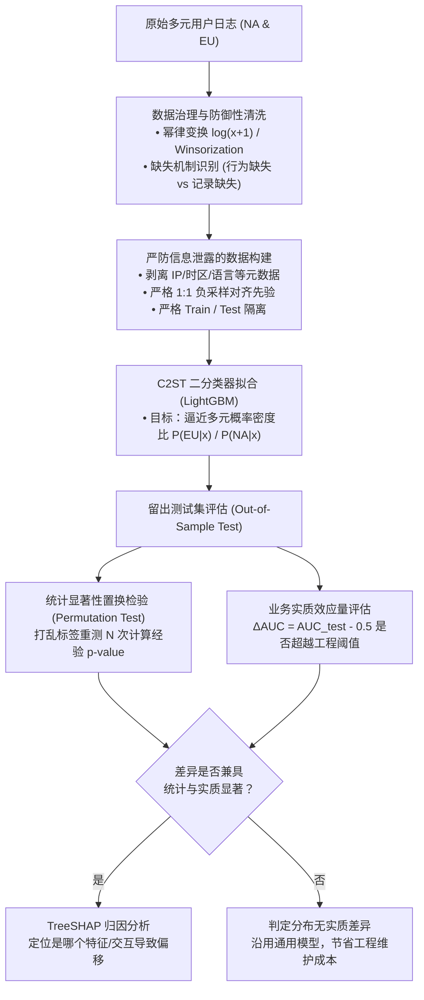

# ML Coding 09 · 数据科学与统计检验：多元分布差异、C2ST 分类器双样本检验与因果数据治理

## 模块导读与知识体系

在数据科学（Data Science）与现代机器学习工程（ML Engineering）中，判断两组样本的总体分布是否存在显著差异是极其高频的核心命题：
- **特征与概念漂移检测（Data Drift / Covariate Shift）**：判断生产环境线上推断数据分布是否偏离了训练集基线分布；
- **跨区域/跨客群用户画像对比（User Segmentation & Cross-Market Comparison）**：评估北美、欧洲等不同国家群体的行为模式是否存在系统性差异，以决定是训练统一的多任务大模型还是部署分区域的本地化模型；
- **因果推断与反事实评估（Causal Inference & A/B Testing Sanity Check）**：检验实验组（Treatment）与对照组（Control）在施加干预前是否满足协变量平衡（Covariate Balance）。

本模块采用**核心方法论（基础知识）+ 典型工业实战题（例题与可复用生产代码）**的架构，循序递进拆解高维统计检验的底层机理与工程落地。

---

## 模块一：统计检验的基础知识与方法库

### 1. 假设检验的基础范式与度量边界

任何统计检验均围绕一对互斥的统计假设展开：
- **零假设（Null Hypothesis, $H_0$）**：通常代表“无效应”、“无差异”或“保持基准现状”；
- **备择假设（Alternative Hypothesis, $H_1$）**：代表“存在显著效应”或“两分布存在差异”。

在决策过程中伴随两类不可避免的统计误差：
1. **第一类错误（Type I Error, $\alpha$ / 假阳性 False Positive）**：真实情况两组分布相同（$H_0$ 为真），却错误地拒绝了 $H_0$。通常通过显著性水平 $\alpha = 0.05$ 或 $0.01$ 进行刚性约束；
2. **第二类错误（Type II Error, $\beta$ / 假阴性 False Negative）**：真实情况分布存在显著差异（$H_0$ 为假），却未能拒绝 $H_0$。统计功效定义为 $\text{Power} = 1 - \beta$，即正确检出真实差异的概率。

> [!WARNING]
> **大样本 $p$ 值假象（Large Sample Fallacy）**：
> 在工业级千万规模（$N > 10^6$）的大数据场景下，标准误差 $\text{SE} \propto \frac{1}{\sqrt{N}}$ 会无限趋近于 0。此时哪怕两组用户的行为仅存在 $0.0001$ 的微小随机扰动，$p$ 值也会机械地跌破 $10^{-10}$ 并报告“极度显著”。
> **工业实践铁律**：在大数据量下，不能单凭 $p$ 值做决策，必须配套汇报**效应量（Effect Size）**，衡量差异的实际物理幅度是否具备业务实质价值（Practical Significance）。

---

### 2. 单变量检验 vs 多元联合分布检验的维度鸿沟

初级工程师常犯的一个错误是：面对多元特征向量 $\mathbf{x} = [x_1, x_2, \dots, x_D]^T$，分别对每个特征独立执行单变量双样本检验（例如跑 $D$ 次两样本 $t$ 检验或 Kolmogorov-Smirnov (KS) 检验）。这种做法存在两大底层缺陷：

```text
       Feature X2
           ▲
           │          • EU Samples (y=x)
           │        •   NA Samples (y=-x)
           │      •   •
           │    •       •
           │  •           •
───────────┼─────────────────────────► Feature X1
           │  •           •
           │    •       •
           │      •   •
           │        •
           │
  边际投影（Marginal Projection）：
  • X1 在两个群体的均值均为 0，方差均为 1，边际分布完全重合！
  • X2 在两个群体的均值均为 0，方差均为 1，边际分布完全重合！
  但联合分布（Joint Distribution）完全正交对立（完全不相同）！
```

1. **彻底破坏特征间的协方差与高阶相关结构（Higher-Order Interactions）**：
   - 两个群体在单特征的边际分布（Marginal Distribution）可能完全一致（如均值、方差均相同），但特征交互关系完全不同（例如北美用户是“高时长伴随高 CTR”，欧洲用户是“高时长伴随低 CTR”）；独立单变量检验对此类模式**完全盲目（漏检率 100%）**；
2. **触发多重假设检验的假阳性灾难（FWER 膨胀）**：
   - 检验 $D$ 个独立特征时，全族误差率（Family-Wise Error Rate）满足 $\text{FWER} = 1 - (1 - \alpha)^D$。若 $D=30, \alpha=0.05$，即使两个群体没有任何差异，误报至少一个特征“显著不同”的先验概率高达 $1 - 0.95^{30} \approx 78.5\%$。

---

### 3. 三大多元分布检验范式对比

| 检验范式 | 代表方法 | 核心机理与数学本质 | 适用场景与优劣评析 |
| :--- | :--- | :--- | :--- |
| **参数检验<br>(Parametric)** | **Hotelling's $T^2$** / **MANOVA** | 单变量两样本 $t$ 检验的多元泛化，基于样本协方差矩阵计算两组均值向量的**马氏距离（Mahalanobis Distance）**：<br>$T^2 = \frac{n_1 n_2}{n_1 + n_2} (\bar{\mathbf{x}}_1 - \bar{\mathbf{x}}_2)^T \mathbf{S}_{\text{pooled}}^{-1} (\bar{\mathbf{x}}_1 - \bar{\mathbf{x}}_2)$ | • **优点**：计算速度极快（毫秒级），小样本下统计功效高，具有精确渐近 F 分布解析解；<br>• **缺点**：强烈依赖多元正态性（Multivariate Normality）与协方差齐性（Homoscedasticity）假设；**只能检验均值差异，无法捕捉方差、峰度或高阶非线性关联差异**。 |
| **非参数核方法<br>(Kernel Non-parametric)** | **最大均值差异 (MMD)** / **能量距离 (Energy Distance)** | 利用正定核技巧（如 RBF 核）将高维样本映射至**再生核希尔伯特空间（RKHS）**，度量两总体在特征空间中的均值嵌入距离：<br>$\text{MMD}^2(P, Q) = \mathbb{E}[k(x, x')] - 2\mathbb{E}[k(x, y)] + \mathbb{E}[k(y, y')]$ | • **优点**：无需对数据做任何正态假设，数学理论保证只要核函数足够丰富（Universal Kernel），当且仅当 $P=Q$ 时 MMD 为 0，能全谱捕捉任意阶矩与复杂依赖；<br>• **缺点**：双重遍历样本的理论计算复杂度为 $\mathcal{O}(N^2)$，面对工业级数百万样本时内存与算力开销巨大。 |
| **机器学习分类器检验<br>(Classifier-based)** | **分类器双样本检验 (C2ST)** | 将多变量两样本检验重构为**伪标签监督二分类任务**。将北美样本标记为 $Y=0$，欧洲样本标记为 $Y=1$。在严格隔离的测试集上评估分类器的可区分性（AUC / 准确率）。 | • **优点**：**现代工业界首选范式**。自动免疫特征尺度与重尾偏斜，自动挖掘非线性高阶特征交互；显著后可结合 **SHAP 特征归因** 一键定位差异根因；<br>• **缺点**：依赖分类器的非过拟合划分与交叉验证设计。 |

---

## 模块二：核心实战例题

### 例题：跨区域用户多元行为分布差异性检验与归因

> **问题陈述**：
> 现有来自两个核心市场——北美地区（North America, NA）与欧洲地区（Europe, EU）的用户日志数据。每个用户被表示为一个多元连续行为特征向量：
> $$\mathbf{x} = [\text{session\_duration}, \text{CTR}, \text{purchase\_CVR}, \text{order\_amount}, \dots]^T \in \mathbb{R}^D$$
> 业务团队需要决策是否要对欧洲市场单独重构推荐排序与运营策略。
> 请设计一套完整的统计与机器学习工程方案，严格判定两地用户的多元总体分布是否存在显著差异，并系统性论述：
> 1. 原假设与备择假设的设计；
> 2. 面对高偏斜、重尾、缺失值的数据预处理；
> 3. 核心检验选型与 C2ST（分类器双样本检验）的数学本质与输入/目标构建；
> 4. 统计显著性（Permutation Test）与业务实质效应量（Effect Size）的汇报；
> 5. 规避现实混杂变量、非 IID 聚类、多重检验膨胀等业务陷阱。

---

### 核心解法深度剖析

面试中解答该题需遵循**“明确假设 $\to$ 数据治理 $\to$ 检验选型与 C2ST 剖析 $\to$ 效应量评估 $\to$ 现实陷阱规避”**的严密工程闭环：



---

#### 1. 建立正式的检验假设体系

- **联合分布全域非参数假设（核心终极目标）**：
  $$H_0: P_{\text{NA}}(\mathbf{x}) = P_{\text{EU}}(\mathbf{x}) \quad \forall \mathbf{x} \in \mathbb{R}^D$$
  $$H_1: P_{\text{NA}}(\mathbf{x}) \neq P_{\text{EU}}(\mathbf{x}) \quad \exists \mathbf{x} \in \mathbb{R}^D$$
  原假设 $H_0$ 表明两地区用户在整个多元行为空间中的**联合概率密度函数（Joint PDF）完全一致**；备择假设 $H_1$ 表明至少在某一个特征、某阶矩或特征交互上存在差异。
- **均值向量假设（若退化为参数检验）**：
  $$H_0: \boldsymbol{\mu}_{\text{NA}} = \boldsymbol{\mu}_{\text{EU}} \quad \text{vs} \quad H_1: \boldsymbol{\mu}_{\text{NA}} \neq \boldsymbol{\mu}_{\text{EU}}$$
- **考点辨析**：必须明确向面试官指出：**仅检验均值向量是严重不充分的**。两组用户的平均时长和平均转化率完全可以相同，但协方差完全不同（例如 NA 呈强正相关，EU 呈负相关），或者方差存在极大差异（Heteroscedasticity），单靠均值检验会产生严重漏检。

---

#### 2. 数据治理与鲁棒性清洗

在工业日志中，用户的行为特征天然具备高度病态的物理特性：

1. **处理极度重尾与偏斜（Heavy Tails & Extreme Skewness）**：
   - 用户单次时长、消费金额等天然符合帕累托分布（幂律长尾）。
   - **变换策略**：对非负右偏特征做单调平滑变换：$\log(x + 1)$ 或自动寻优参数的 **Yeo-Johnson 变换**（支持含零与负值特征）；
   - **离群点截断（Winsorization）**：将高于 $99.5\%$ 分位数的值软截断为该分位值，防止极少数爬虫或异常大 R 用户支配统计量。
2. **标准化与鲁棒尺度对齐**：
   - 避免使用受极端离群点破坏的标准差标准化（StandardScaler）；
   - 推荐使用基于中位数与四分位距的鲁棒缩放器 **RobustScaler**：
     $$x_{\text{scaled}} = \frac{x - \text{median}(x)}{\text{IQR}(x)} = \frac{x - Q_2(x)}{Q_3(x) - Q_1(x)}$$
3. **缺失值机制识别与针对性插补**：
   - **行为缺失（Structural Zero / Informative Missingness）**：例如用户从未在某页面点击，导致 CTR 在数学上是 $0/0$ 的未定义缺失。此时**绝不能简单粗暴填充均值**，否则会凭空捏造出一个虚假的密集分布峰；
   - **工程正解**：填充基准零值或指示常量，并**显式构造布尔指示特征（Missingness Indicator）** $I_{\text{missing}} \in \{0, 1\}$，将“缺失”本身作为一种核心行为特征输入模型。

---

#### 3. 重点突破：C2ST（分类器双样本检验）的数学机理与设计规范

在工业界面对高维连续混合特征时，**C2ST（Classifier Two-Sample Test）**是工业界兼具可落地性、高统计功效与强解释性的黄金标准。

##### (1) 选什么做训练（严防信息泄露的数据构建）
- **特征矩阵 $X$（Features）**：
  - **严格保留**：题目中指定的多元连续行为特征向量 $\mathbf{x} = [\text{session\_duration}, \text{CTR}, \text{purchase\_CVR}, \dots]^T$；
  - **严禁泄漏外生特征**：**必须百分之百剔除任何能够直接或间接泄露地区来源的元数据**（如用户 IP、时区、本地货币符号、设备语言、操作系统的本地化配置等）。若泄露了货币单位，分类器准确率达到 100% 只是证明了数据标签泄露，而与用户内在行为分布无关。
- **构造伪标签 $Y$（Target Labels）**：
  - 北美用户样本（NA）：标记为负类 $Y = 0$；
  - 欧洲用户样本（EU）：标记为正类 $Y = 1$。
- **严格 1:1 先验配比（Equal Prior Subsampling）**：
  - 若北美有 $100$ 万用户，欧洲有 $20$ 万用户，**必须对北美进行随机欠采样（Downsampling）至 20 万**，确保两类先验概率严格对齐：
    $$P(Y=0) = P(Y=1) = 0.5$$
- **严格隔离的划分机制（Train / Test Isolation）**：
  - 按 $50\% / 50\%$ 划分训练集与留出测试集；
  - **模型只在训练集拟合，检验统计量（AUC / 准确率）必须严格仅在未参与训练的测试集上评估**，从根本上杜绝模型过拟合导致的假阳性。

##### (2) 模型究竟在拟合什么？（多元概率密度比估计的数学本质）
分类器通常使用标准对数损失（Binary Cross-Entropy）进行训练：
$$\mathcal{L}(\theta) = -\mathbb{E}_{(\mathbf{x}, y)} \left[ y \ln f_\theta(\mathbf{x}) + (1 - y) \ln (1 - f_\theta(\mathbf{x})) \right]$$
模型学习到的预测值 $f_\theta(\mathbf{x})$ 在理论极值点上收敛于真实后验概率：
$$f^*(\mathbf{x}) = P(Y=1 \mid \mathbf{x})$$

根据贝叶斯定理，当正负样本先验完全相等（$P(Y=0) = P(Y=1) = 0.5$）时：
$$P(Y=1 \mid \mathbf{x}) = \frac{p_{\text{EU}}(\mathbf{x}) P(Y=1)}{p_{\text{EU}}(\mathbf{x}) P(Y=1) + p_{\text{NA}}(\mathbf{x}) P(Y=0)} = \frac{p_{\text{EU}}(\mathbf{x})}{p_{\text{EU}}(\mathbf{x}) + p_{\text{NA}}(\mathbf{x})}$$

对分类器的对数几率（Logit）进行代数变形：
$$\text{logit}(f^*(\mathbf{x})) = \ln \left( \frac{f^*(\mathbf{x})}{1 - f^*(\mathbf{x})} \right) = \ln \left( \frac{P(Y=1 \mid \mathbf{x})}{P(Y=0 \mid \mathbf{x})} \right) = \ln \left( \frac{p_{\text{EU}}(\mathbf{x})}{p_{\text{NA}}(\mathbf{x})} \right)$$

> **核心数学结论**：
> **二分类模型本质上是在非参数化地逼近两组总体的多元概率密度比（Density Ratio）**！
> 1. **若 $H_0$ 为真（$p_{\text{EU}}(\mathbf{x}) \equiv p_{\text{NA}}(\mathbf{x})$）**：
>    空间中任意点的密度比恒等于 $1$，对数几率恒等于 $0$，理论最优分类器输出恒为 $f^*(\mathbf{x}) \equiv 0.5$。在留出测试集上，分类器的预测结果等价于随机抛硬币，**理论准确率 $\text{Acc} \equiv 0.5$，ROC-AUC $\equiv 0.5$**；
> 2. **若 $H_1$ 为真（两地分布存在差异）**：
>    在欧洲用户密集而北美稀疏的区域，密度比 $\frac{p_{\text{EU}}(\mathbf{x})}{p_{\text{NA}}(\mathbf{x})} > 1$，分类器输出 $f^*(\mathbf{x}) > 0.5$；分类器能够学到有效的非线性决策面，**测试集 AUC 显著高于 0.5**。

##### (3) 选什么模型？（GBDT 为什么是工业绝对首选）

- **工业界首选：GBDT（LightGBM / XGBoost / CatBoost）**：
  - **天然免疫偏态与缩放**：基于树的特征切分依据数值排序，对单调变换（Monotonic Transformations）具有严格不变性，无须复杂的归一化与正态化；
  - **自动捕获高阶非线性交互**：树的分裂能够轻松捕获多个特征交织形成的局部密集峰，解决“边际相同但联合不同”的检验死角；
  - **原生 SHAP 解释支持**：一旦检验出显著差异，直接调用 TreeSHAP 计算各特征对对数几率的边际贡献，一键输出特征重要性排序，直接定位两地差异的核心驱动因素。
- **不推荐的模型**：
  - **Logistic 回归**：仅能拟合超平面线性边界。若两地用户分布呈同均值但异方差（一胖一瘦）或环形同心圆分布，线性分类器会彻底漏检；
  - **深度神经网络（MLP）**：调参复杂度高，对特征尺度极端敏感，在小样本上易产生过拟合伪特征。

---

#### 4. 统计显著性计算与业务实质效应量评估

##### (1) 非参数置换检验（Permutation Test for $p$-value）
如何判定留出测试集上的 $\text{AUC}_{\text{test}} = 0.53$ 是因为两组真实存在差异，还是纯粹由于样本抽样方差引起的随机波动？
- **置换原理**：在 $H_0$ 成立的零假设下，样本标签 $Y \in \{0, 1\}$ 与特征 $\mathbf{x}$ 之间是完全独立的。
- **算法流程**：
  1. 记录在真实标签下测试集获得的基准统计量 $\text{AUC}_{\text{obs}}$；
  2. 保持特征矩阵不变，将所有样本的区域标签 $Y$ 进行全局随机打乱（Shuffle）$B$ 次（如 $B=1000$）；
  3. 每次打乱后，用相同的流程重新训练模型并在测试集上计算打乱后的 $\text{AUC}_b$；
  4. 经验 $p$ 值的计算公式为：
     $$p = \frac{1 + \sum_{b=1}^B \mathbb{I}(\text{AUC}_b \ge \text{AUC}_{\text{obs}})}{1 + B}$$
  5. 若 $p < 0.01$，则在统计学上拒绝原假设 $H_0$。

##### (2) 业务实质效应量（Practical Effect Size）
在大数据量下，统计显著极为廉价。评估时必须以效应量为决策基准：
$$\Delta \text{AUC} = \text{AUC}_{\text{test}} - 0.5$$
- **若 $\text{AUC}_{\text{test}} \in [0.500, 0.510]$ 且 $p < 10^{-6}$**：
  说明统计学上虽然能检出微小统计差异，但两组用户的重合度超过 $99\%$（实质无差异）。业务决策上应当**维持统一全局模型**，避免维护两套模型带来的额外系统 Infra 维护开销；
- **若 $\text{AUC}_{\text{test}} \ge 0.65$ 且 $p < 10^{-6}$**：
  说明分类器具备极强辨别力，两地用户在行为空间中存在巨大结构性分化，必须推动精细化区域独立运营与分市场模型适配。

---

#### 5. 规避现实业务三大核心陷阱

##### 陷阱一：外生混杂因素导致的伪相关（Confounding Bias）
- **现象**：测试集显示 AUC 显著高达 0.70，但经过 SHAP 归因发现最重要的特征是 `purchase_CVR`。进一步下钻发现，北美用户的 iOS 设备占比达 $65\%$，而欧洲只有 $35\%$；而全平台上 iOS 用户的客单价和转化率天然显著高于 Android。
- **本质**：两地用户画像的差异**被“设备分布（Device Platform）”这一外生混杂变量严重污染**，而非由于两地用户的内在行为偏好不同。
- **防御机制**：
  - 采用**倾向评分匹配（Propensity Score Matching, PSM）**或**分层逆概率加权（IPW）**：先针对设备型号、时段、获客渠道等外生混杂变量构建倾向评分，使得两地样本在这些非行为维度达成完全协变量平衡（Covariate Balance）后再执行 C2ST 检验。

##### 陷阱二：非独立同分布与聚类自相关（Non-IID / Clustered Observations）
- **现象**：日志数据中混入了同一活跃用户的多条 Session 记录，或节假日大促时段的爆发式流量。
- **本质**：破坏了所有统计检验的基础假定——样本独立同分布（IID）。同用户的多次行为高度自相关，会导致有效样本量被虚假放大，方差严重低估，进而产生高比例假阳性。
- **防御机制**：
  - 数据粒度必须强制聚合成**独立用户级快照（User-Level Rollup）**，确保每个样本对应唯一独立用户；
  - 采样时按用户 ID 进行分组切分（GroupKFold / Clustered Split），杜绝同用户的行为跨入训练集与测试集。

##### 陷阱三：事后多重检验的假阳性膨胀（Post-hoc Multiple Testing）
- **现象**：C2ST 整体检验显示两地存在显著差异后，业务分析师通常会继续对全部 $D$ 个特征执行事后两样本检验，以找出“究竟哪些特征具体有差异”。
- **防御机制**：
  - 严禁直接使用朴素 $p$ 值汇报；
  - 必须引入 **Benjamini-Hochberg (BH)** 方法控制**错误发现率（False Discovery Rate, FDR）**：
    将 $D$ 个 $p$ 值按升序排序 $p_{(1)} \le p_{(2)} \le \dots \le p_{(D)}$，寻找满足 $p_{(i)} \le \frac{i}{D} Q^*$ 的最大索引 $k$，仅认定排名前 $k$ 的特征具有显著差异。

---

## 模块三：生产级 Python / LightGBM 检验与 SHAP 归因实战代码

以下脚本展示了一套完全可复用的工业级 C2ST 自动化流水线：
1. 合成包含高维非线性交互与长尾分布的两组模拟样本；
2. 构造严格隔离的 1:1 二分类任务；
3. 训练经过正则约束的 LightGBM 分类器；
4. 利用**置换检验（Permutation Test）**计算无偏经验 $p$ 值与效应量；
5. 调用 **TreeSHAP** 输出导致两地差异的核心特征驱动力。

```python
import numpy as np
import pandas as pd
import lightgbm as lgb
from sklearn.model_selection import train_test_split
from sklearn.metrics import roc_auc_score
import shap

def generate_synthetic_user_logs(n_na=100000, n_eu=30000, random_state=42):
    """
    模拟两地用户行为特征：
    - 特征 0 (session_duration): 重尾对数正态分布
    - 特征 1 (CTR): Beta 分布
    - 特征 2 (CVR): 在 NA 和 EU 均值完全相同，但在 EU 中与 session_duration 存在强非线性交互！
    """
    np.random.seed(random_state)
    
    # 1. 北美用户 (NA)
    dur_na = np.random.lognormal(mean=2.0, sigma=0.8, size=n_na)
    ctr_na = np.random.beta(a=2.0, b=10.0, size=n_na)
    # NA 下 CVR 独立于 duration
    cvr_na = np.random.beta(a=1.5, b=20.0, size=n_na)
    
    # 2. 欧洲用户 (EU)
    dur_eu = np.random.lognormal(mean=2.0, sigma=0.8, size=n_eu) # 均值边际分布完全相同
    ctr_eu = np.random.beta(a=2.0, b=10.0, size=n_eu)           # 均值边际分布完全相同
    # EU 下高时长用户的 CVR 显著提升（联合分布存在非线性差异）
    cvr_base = np.random.beta(a=1.5, b=20.0, size=n_eu)
    interaction = 0.05 * (dur_eu > np.median(dur_eu))
    cvr_eu = np.clip(cvr_base + interaction, 0.0, 1.0)
    
    df_na = pd.DataFrame({'session_duration': dur_na, 'CTR': ctr_na, 'CVR': cvr_na})
    df_na['market'] = 0  # NA = 0
    
    df_eu = pd.DataFrame({'session_duration': dur_eu, 'CTR': ctr_eu, 'CVR': cvr_eu})
    df_eu['market'] = 1  # EU = 1
    
    return pd.concat([df_na, df_eu], ignore_index=True)

class ClassifierTwoSampleTester:
    def __init__(self, n_permutations=100, test_size=0.5, random_state=42):
        self.n_permutations = n_permutations
        self.test_size = test_size
        self.random_state = random_state
        self.model = None
        self.observed_auc = None
        self.p_value = None

    def fit_test(self, df_features, labels):
        # 1. 严格 1:1 先验下采样
        idx_pos = np.where(labels == 1)[0]
        idx_neg = np.where(labels == 0)[0]
        min_size = min(len(idx_pos), len(idx_neg))
        
        np.random.seed(self.random_state)
        idx_neg_sampled = np.random.choice(idx_neg, size=min_size, replace=False)
        idx_pos_sampled = np.random.choice(idx_pos, size=min_size, replace=False)
        
        balanced_idx = np.concatenate([idx_neg_sampled, idx_pos_sampled])
        X = df_features.iloc[balanced_idx].reset_index(drop=True)
        y = labels[balanced_idx]
        
        # 2. 严格隔离的 Train / Test 划分
        X_train, X_test, y_train, y_test = train_test_split(
            X, y, test_size=self.test_size, random_state=self.random_state, stratify=y
        )
        
        # 3. 训练基准 LightGBM 分类器
        train_data = lgb.Dataset(X_train, label=y_train)
        params = {
            'objective': 'binary',
            'metric': 'auc',
            'learning_rate': 0.05,
            'num_leaves': 15,
            'verbose': -1,
            'seed': self.random_state
        }
        self.model = lgb.train(params, train_data, num_boost_round=100)
        
        # 4. 在测试集上评估真实观测 AUC
        y_pred = self.model.predict(X_test)
        self.observed_auc = roc_auc_score(y_test, y_pred)
        
        # 5. 执行置换检验（Permutation Test 计算经验 p-value）
        perm_aucs = []
        for b in range(self.n_permutations):
            y_train_perm = np.random.permutation(y_train)
            train_data_perm = lgb.Dataset(X_train, label=y_train_perm)
            perm_model = lgb.train(params, train_data_perm, num_boost_round=100)
            perm_pred = perm_model.predict(X_test)
            perm_aucs.append(roc_auc_score(y_test, perm_pred))
            
        self.p_value = (1.0 + np.sum(np.array(perm_aucs) >= self.observed_auc)) / (1.0 + self.n_permutations)
        
        return {
            'observed_auc': self.observed_auc,
            'delta_auc': self.observed_auc - 0.5,
            'p_value': self.p_value,
            'X_test': X_test
        }

    def explain_with_shap(self, X_test):
        explainer = shap.TreeExplainer(self.model)
        shap_values = explainer.shap_values(X_test)
        # 二分类 LightGBM 的 shap_values 可能为单数组或二元列表
        vals = shap_values[1] if isinstance(shap_values, list) else shap_values
        mean_abs_shap = np.abs(vals).mean(axis=0)
        feature_importance = pd.DataFrame({
            'feature': X_test.columns,
            'mean_abs_shap': mean_abs_shap
        }).sort_values('mean_abs_shap', ascending=False)
        return feature_importance

if __name__ == "__main__":
    # 生成数据
    data = generate_synthetic_user_logs(n_na=40000, n_eu=20000)
    features = data[['session_duration', 'CTR', 'CVR']]
    labels = data['market'].values
    
    # 执行 C2ST 检验
    tester = ClassifierTwoSampleTester(n_permutations=50, random_state=42)
    results = tester.fit_test(features, labels)
    
    print(f"=== C2ST 检验报告 ===")
    print(f"测试集观测 AUC: {results['observed_auc']:.4f}")
    print(f"超额效应量 (ΔAUC): {results['delta_auc']:.4f}")
    print(f"置换检验经验 p-value: {results['p_value']:.4f}")
    
    if results['p_value'] < 0.05 and results['delta_auc'] > 0.05:
        print("结论: 两地用户多元联合分布存在统计与业务实质性显著差异！")
        print("\n=== SHAP 差异根因分析 ===")
        importance = tester.explain_with_shap(results['X_test'])
        print(importance.to_string(index=False))
    else:
        print("结论: 未检出足以支持模型差异化拆分的实质分布偏移。")
```

---

## 模块四：核心工程法则与高频速查清单

| 维度 | 规范与核心逻辑 | 常见踩坑与反例 |
| :--- | :--- | :--- |
| **检验范围** | 必须针对**多元联合分布（Joint PDF）**设计，能同时检验均值、方差与高阶相关结构。 | 分别对各个特征做独立的单变量 $t$ 检验或 KS 检验，彻底忽略特征相关性并导致 FWER 假阳性爆炸。 |
| **先验对齐** | 严格执行 1:1 样本随机欠采样，确保基线平衡先验 $P(Y=0) = P(Y=1) = 0.5$。 | 未平衡样本直接训练，AUC 与准确率基线发生先验偏置。 |
| **信息防泄** | 严格剔除一切与业务行为无直接因果关联的外生元数据（IP、货币代码、语言）。 | 将含有本地货币符号的金额列直接送入训练，导致分类器 100% 辨识出地域假特征。 |
| **过拟合防御** | 模型只能在训练集拟合，AUC 统计量与置换检验必须**严格在留出测试集（Hold-out Test Set）上评估**。 | 在全量训练集上算 AUC，树模型的过拟合直接导致虚假的高 AUC 与假阳性拒绝 $H_0$。 |
| **决策准则** | **统计显著 ($p < 0.01$) 与效应量 ($\Delta\text{AUC} > \tau$) 必须并重**。 | 在数千万用户的大数据量下，因 $p < 10^{-10}$ 强行推进业务分流，实际上 $\text{AUC}=0.502$，纯属工程浪费。 |
| **混杂控制** | 发现差异后，必须使用倾向评分匹配（PSM）或分层分析排除设备系统、流量渠道的外生干扰。 | 将北美 iOS 高渗透率造成的自然高客单价，误判为两地用户的主观行为偏好差异。 |
