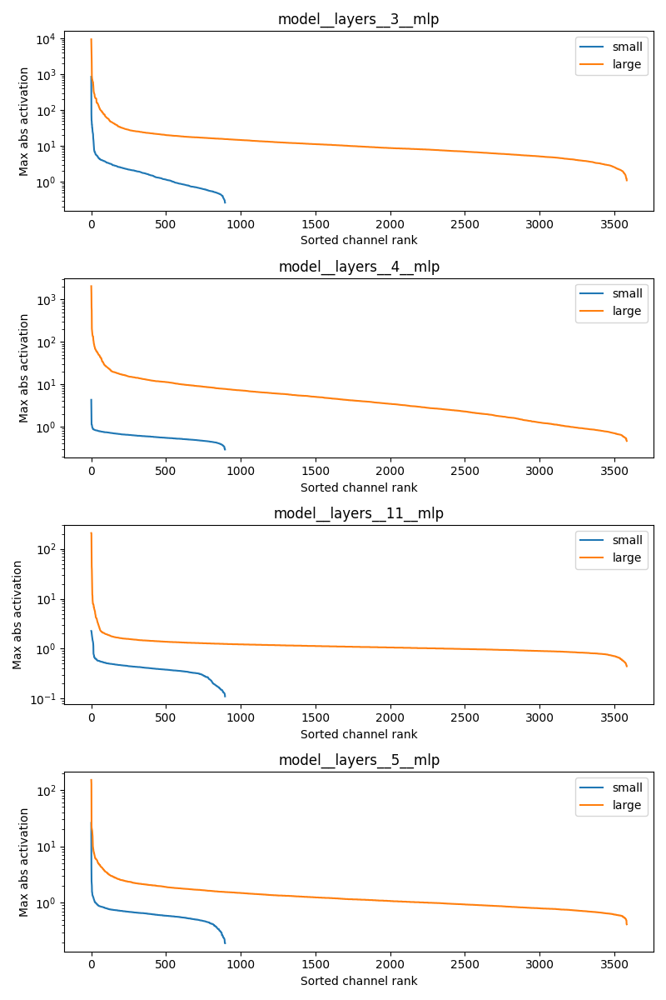

> 更好的阅读体验欢迎前往 GitHub → Currytang → MLSYS_tutorial
> 这一讲会特别详细，因为会做相关的research:)

# Low-bit Quantization 核心方法详解

## 背景与发展脉络

模型量化的研究可以追溯到深度学习兴起之前。早在信号处理和通信领域，量化就是将连续信号离散化的基本手段（如 PCM 编码），Shannon 的率失真理论为其奠定了信息论基础。进入深度学习时代后，2015-2016 年 BinaryConnect、BNN、XNOR-Net 等工作率先探索了极端低比特（1-bit）的权重和激活表示，试图用 XNOR + popcount 替代浮点乘法，但精度损失过大、且在现代 GPU Tensor Core 上并无实质加速优势。随后 2018-2019 年，PACT 和 LSQ 开创了 QAT（训练时量化）范式，通过将 clip 范围和量化步长设为可学习参数，在 STE 框架下使 4-bit 甚至 2-bit 训练变得可行。与此同时，混合精度训练（FP16/BF16 + FP32 master weights）成为标配，Micikevicius 等人的工作奠定了"低精度计算 + 高精度累积"的基本范式。
2020-2022 年，后训练量化（PTQ）在 CNN 上逐步成熟：AdaRound 将取整方向建模为可优化变量，BRECQ 引入逐 block 二阶重构，QDrop 通过随机跳过激活量化来平坦化损失面，将 CNN 的低 bit PTQ 推进到实用水平。这些方法为后续 LLM 量化提供了关键的方法论积累。
LLM 的量化研究从 2022 年开始爆发，核心驱动力是模型规模急剧膨胀带来的显存和推理成本压力。Dettmers 等人首先发现了大模型激活中的 emergent outlier 现象（少数通道值比其余大 100 倍以上），提出 LLM.int8() 用向量级混合精度应对。SmoothQuant 则通过等价数学变换将激活的量化难度预先迁移到权重侧，实现了真正的 W8A8 部署。在更激进的 4-bit 方向，GPTQ 将 OBQ 的二阶框架扩展到百亿参数规模，AWQ 发现保护与 salient activation 对应的权重列是关键。2024 年，QuaRot 和 SpinQuant 通过正交旋转从根源消除离群值，使全链路 W4A4+KV4 成为可能；KIVI 则专攻长上下文场景下 KV cache 的 2-bit 压缩。与此并行，FP8（E4M3/E5M2）作为 Hopper/Blackwell 架构的原生支持格式，正在成为训练和推理的新基线精度。

---

## 1 量化基础

### 1.1 均匀量化公式

将浮点张量 $x$ 映射到 $b$-bit 整数：

$$x_q = \text{clamp}\!\Big(\!\left\lfloor \frac{x}{s} \right\rceil + z,\; 0,\; 2^b - 1\Big)$$

反量化：

$$\hat{x} = s \cdot (x_q - z)$$

其中两个关键参数：

- **Scale $s$**（缩放因子）：控制量化步长，即相邻两个量化值之间的实际间距。$s$ 越大，可覆盖的浮点范围越广，但相邻量化级之间的间距也越大，精度越低；$s$ 越小，精度越高，但能表示的范围越窄，超出范围的值会被 clamp 截断。$s$ 本质上决定了"用有限的量化格子覆盖多大的数值区间"。
- **Zero-point $z$**（零点偏移）：整数域中对应浮点 0 的值。$z = 0$ 时浮点 0 恰好映射到整数 0（对称量化）；$z \neq 0$ 时整数范围可以偏移，使量化区间不必关于 0 对称，从而更紧凑地覆盖单侧偏斜的分布（如 ReLU 后全为正值的激活）。

两种常见配置：

- **对称量化**：$z = 0$，$s = \max(|x|)\;/\;(2^{b-1} - 1)$。整数范围关于 0 对称，实现简单，但若分布严重偏斜则浪费量化位。
- **非对称量化**：$z \neq 0$，$s = (x_{\max} - x_{\min})\;/\;(2^b - 1)$，$z = \lfloor -x_{\min}/s \rceil$。$z$ 将整数零点对齐到实际分布的下界，更紧凑地利用全部 $2^b$ 个量化级。

### 1.2 术语与记号

**量化对象**：模型中可以被量化的张量主要有以下几类，量化难度和收益各不相同：

- **权重（Weight）**：模型参数，推理时固定不变。分布相对稳定、易于离线分析，是最容易量化的对象。Weight-only quantization（只量化权重）是最常见的起点，GPTQ、AWQ 都属于此类。主要收益是压缩模型体积、减少权重加载的显存带宽瓶颈。
- **激活（Activation）**：每层的输入/输出，随输入数据动态变化。分布不稳定且容易出现离群值，量化难度远高于权重。但如果能同时量化权重和激活，GEMM 就可以完全在低 bit 整数上执行（如 INT8 × INT8），获得真正的计算加速而非仅带宽节省。
- **KV Cache**：Transformer 推理时缓存的 Key 和 Value 张量，长上下文场景下显存占比可远超模型权重本身（如 LLaMA-2-7B 在 128K context 下 KV cache 达数十 GB）。KIVI 等方法专攻此处，可压缩到 2-bit。
- **梯度（Gradient）**：训练时反向传播的梯度。FP8 训练中梯度通常用 E5M2 格式（更大动态范围）存储，分布对称但含稀疏大值，量化策略与权重/激活不同。
- **优化器状态（Optimizer State）**：Adam 的一阶动量 $m$ 和二阶动量 $v$ 各占模型大小的 FP32 存储，是训练显存的大头。bitsandbytes 的 8-bit optimizer 将其压缩到 INT8，节省约 75% 显存。

**WxAy 记号**：基于上述分类，量化领域用 W 代表 Weight、A 代表 Activation、数字代表比特数的缩写来描述量化配置。例如：

- **W8A8**：权重 8-bit，激活 8-bit。SmoothQuant 的典型配置，权重和激活都用 INT8 做 GEMM。
- **W4A16**：权重 4-bit，激活保持 FP16。GPTQ、AWQ 的典型配置，推理时权重 dequant 回 FP16 再做矩阵乘（weight-only quantization）。
- **W4A4**：权重和激活都 4-bit。QuaRot/SpinQuant 追求的全链路低 bit 配置，对 kernel 支持要求最高。

有时还会看到 **KV4**（KV cache 4-bit）、**W1.58**（BitNet b1.58 的三值权重）等写法。

**为什么量化会损害模型精度？** 根本原因是信息损失。将一个 FP32 浮点数（约 $4.2 \times 10^9$ 种可能取值）压缩到 INT8（仅 256 种取值）或 INT4（仅 16 种取值），大量原始数值被映射到同一个量化桶（quantization bin），产生不可逆的舍入误差。具体来说：

- **舍入误差累积**：单个权重的舍入误差可能很小，但矩阵乘会将误差沿计算图传播和放大。层数越深、模型越大，累积效应越明显。
- **离群值问题**：如果张量中存在少数极大值（outlier），量化的 scale 被拉大，导致大量正常值挤在很窄的量化区间内，精度急剧下降。这正是 LLM 量化的核心难点——Transformer 激活中的 emergent outlier 使得朴素量化直接崩溃。
- **动态范围不匹配**：低 bit 整数的可表示范围有限，超出范围的值被 clamp 截断，造成信息永久丢失。

量化研究的核心目标就是在尽可能低的 bit 数下，通过各种技巧（更好的 scale 选择、误差补偿、离群值处理等）将这些精度损失控制在可接受范围内。

### 1.3 量化粒度

| 粒度 | 含义 | 典型场景 |
|---|---|---|
| Per-tensor | 整个张量共享 $(s, z)$ | INT8 推理 |
| Per-channel | 权重每个输出通道一组 $(s, z)$ | CNN / Transformer 权重 |
| Per-group | 每 $g$ 个连续元素一组（$g$ 常取 128） | GPTQ / AWQ 的 4-bit 权重 |
| Per-token | 激活矩阵每行一组 | SmoothQuant W8A8 |
| Per-block | 固定大小 tile（如 32）一组 | FP8 microscaling / MXFP8 |

粒度越细，精度越高，但 scale/zero-point 的存储与计算开销也越大；硬件能否高效访问这些元数据是关键。

### 1.4 Straight-Through Estimator (STE)

**为什么需要 STE？** 量化的核心操作是取整 $\lfloor \cdot \rceil$，这是一个阶梯函数——输出在整数点跳变，其余地方完全平坦。数学上，它的梯度几乎处处为 0。这意味着如果我们想在训练中引入量化（即 QAT），反向传播到量化节点时梯度直接"断掉"，权重无法通过梯度下降更新，训练完全失效。STE 是解决这一矛盾的标准手段：前向传播老老实实做量化，反向传播时假装量化操作不存在，让梯度直接穿过去。

QAT 中用 STE 绕过：

$$\frac{\partial \mathcal{L}}{\partial x} \approx \frac{\partial \mathcal{L}}{\partial \hat{x}} \cdot \mathbf{1}\{x \in [\text{lo},\, \text{hi}]\}$$

clip 范围内梯度直通，范围外梯度为 0。**所有 QAT 方法**（PACT、LSQ、BitNet …）都建立在 STE 之上。

### 1.5 混合精度训练

> Micikevicius et al., 2018 · ICLR

**为什么不能直接用纯 FP16 训练？** 朴素地将所有张量从 FP32 换成 FP16 会遇到两个致命问题：(1) **梯度下溢**——FP16 最小正次正规数约 $6 \times 10^{-8}$，很多层的梯度绝对值小于此值，直接变 0，权重停止更新；(2) **权重更新消失**——即使梯度没有下溢，当 `learning_rate × gradient` 远小于权重本身时，FP16 的有限精度（10 bit 尾数）会让 `weight + update` 的加法舍入掉 update，等于没更新。混合精度训练正是为了解决这两个问题而设计的。

**核心思想**："**低精度计算 + 高精度累积**"——用 FP16/BF16 做前向和反向的 GEMM 以获得 2× 显存压缩和计算加速，同时保留 FP32 master weights 保证训练稳定性。

**三板斧**：

1. **FP16 存储与计算**：权重 / 激活 / 梯度存 FP16，前向和反向的 GEMM 用 FP16 Tensor Core 执行（A100 FP16 算力 312 TFLOPS vs FP32 19.5 TFLOPS，16× 差距）。显存 2× 压缩。
2. **FP32 master weights**：优化器维护一份 FP32 的权重副本。每步训练：FP32 master weights → cast 到 FP16 做前向/反向 → FP16 梯度 cast 回 FP32 → 在 FP32 上做 optimizer update。这样权重更新的微小增量不会被舍入吞掉。
3. **Loss scaling**：loss 乘以常数 $S$（如 1024），等价于所有梯度左移 10 bit，将原本下溢到 0 的小梯度拉入 FP16 可表示范围。optimizer update 前除以 $S$ 还原。实践中常用 **dynamic loss scaling**——从大 $S$ 开始，如果检测到梯度出现 inf/NaN 就减小 $S$，否则逐步增大。

```
混合精度训练一步的数据流：

FP32 master weights ──cast──→ FP16 weights
                                    │
                              前向传播 (FP16 Tensor Core GEMM)
                                    │
                                    ▼
                              loss × S  (loss scaling)
                                    │
                              反向传播 (FP16)
                                    │
                                    ▼
                          FP16 gradients / S ──cast──→ FP32 gradients
                                                          │
                                                   Optimizer update
                                                   (FP32 精度累积)
                                                          │
                                                          ▼
                                                FP32 master weights (更新后)
```

**显存分析**：以 1B 参数模型为例（每个参数 4 bytes in FP32）：

| 组件 | 纯 FP32 | 混合精度 |
|---|---|---|
| 模型权重 | 4 GB (FP32) | 2 GB (FP16) + 4 GB (FP32 master) = 6 GB |
| 激活 | 4× 看 batch | 2× 看 batch（FP16，减半） |
| 优化器 (Adam) | 8 GB (m + v, FP32) | 8 GB (m + v, 仍 FP32) |

看起来混合精度反而多了 FP16 权重副本？但激活是大头——激活显存随 batch size 和 seq len 线性增长，FP16 激活节省的显存远超多存一份 FP16 权重的开销。而且计算速度的 2× 提升是最大收益。

**BF16 vs FP16**：

| | FP16 | BF16 |
|---|---|---|
| 指数位 | 5 bit（最大 65504） | 8 bit（最大 $3.4 \times 10^{38}$，同 FP32） |
| 尾数位 | 10 bit | 7 bit |
| 需要 loss scaling？ | 必须 | 几乎不需要（动态范围足够大，梯度极少下溢） |
| 精度 | 更高 | 略低（但实践中对训练收敛影响很小） |
| 硬件支持 | 所有现代 GPU | A100+（V100 不支持） |

BF16 因为省去了 loss scaling 的复杂性且训练更稳定，已成为大模型训练的事实标准。PyTorch 中只需 `torch.autocast(device_type='cuda', dtype=torch.bfloat16)` 即可启用。

### 1.6 低精度数值格式一览

量化和低精度训练涉及多种浮点/整数格式。下表列出常见格式的构成与可表示范围，帮助直观理解不同精度的"信息容量"差异：

| 格式 | 构成（符号+指数+尾数） | 最大值 | 最小正次正规数 | 精度 | 典型用途 |
|---|---|---|---|---|---|
| **FP32** | 1 + 8 + 23 | $3.4 \times 10^{38}$ | $\sim 1.4 \times 10^{-45}$ | ~7 位十进制 | Master weights、优化器状态 |
| **FP16** | 1 + 5 + 10 | 65504 | $6.0 \times 10^{-8}$ | ~3 位十进制 | 混合精度训练（需 loss scaling） |
| **BF16** | 1 + 8 + 7 | $3.4 \times 10^{38}$ | $\sim 9.2 \times 10^{-41}$ | ~2 位十进制 | 大模型训练标配（动态范围同 FP32） |
| **FP8 E4M3** | 1 + 4 + 3 | 448 | $\sim 0.002$ | 3 bit 尾数 | 前向：权重 / 激活 |
| **FP8 E5M2** | 1 + 5 + 2 | 57344 | $\sim 6.1 \times 10^{-8}$ | 2 bit 尾数 | 反向：梯度（需更大动态范围） |
| **FP4 E2M1** | 1 + 2 + 1 | 6.0 | 0.5 | 1 bit 尾数 | 实验性，MXFP4 |
| **INT8** | 8 bit 整数 | 127（有符号） | 1 | 均匀间距 | PTQ 推理（W8A8） |
| **INT4** | 4 bit 整数 | 7（有符号） | 1 | 仅 16 级 | 权重压缩（W4A16） |

**关键对比**：
- **FP16 vs BF16**：同为 16-bit，FP16 精度更高（10 bit 尾数），但动态范围窄（最大 65504），大值易溢出需 loss scaling。BF16 动态范围与 FP32 一致，训练更稳定，是当前大模型首选。
- **E4M3 vs E5M2**：同为 FP8，E4M3 精度高但范围小（适合权重/激活），E5M2 范围大但精度低（适合梯度这类需要大动态范围的张量）。
- **浮点 vs 整数**：浮点格式的量化间距是非均匀的（小值处更密），整数量化间距均匀。对于近似正态分布的权重，非均匀量化（如 NF4 码本，§9.2）理论上更优。

---

## 2 量化方法总览：QAT vs PTQ

**为什么需要区分 QAT 和 PTQ？** §1.1 的量化公式看起来很简单——算个 scale，取个整就完了。但核心问题是：**scale 怎么选才最优？** 如果我们用 $\max(|x|)$ 来定 scale，那些罕见的极端值会拉大 scale，浪费大部分量化级；如果我们 clip 掉极端值收紧 scale，又会截断重要信息。更根本的矛盾是，量化会改变每一层的输出分布，这个误差沿着网络逐层传播和累积——单独优化每一层的 scale 并不能保证全局最优。

面对这个矛盾，有两条路：

- **QAT**：既然量化误差会传播，那就让模型在训练时就"看到"量化误差，通过端到端梯度下降自动调整权重分布去适应量化。代价是需要完整的训练流程。
- **PTQ**：模型已经训练好了，不动权重本身，而是用校准数据分析每层的分布特征，选择最优的量化参数（scale、取整方向等）来最小化输出误差。代价是没有训练的纠错能力，精度上限低于 QAT。

模型量化根据**是否需要训练**分为这两大范式。本节给出总览，具体 LLM 量化方法按问题递进在 §3-§6 展开。

### 2.1 QAT（Quantization-Aware Training）— 训练时量化

> QAT 的经典方法（PACT、LSQ 等）诞生于 CNN 时代（2018-2019），针对 ResNet、MobileNet 等视觉模型。LLM 场景的 QAT 代表是 BitNet（§7），走"原生低 bit 从头训练"路线。

**核心思路**：在训练中插入**伪量化节点（fake quantization）**——前向传播时对权重和激活做 quantize → dequantize（数据类型仍为 FP32，但值已含量化误差），让模型通过梯度下降学习对量化友好的分布。反向传播时用 STE（§1.4）让梯度穿过量化节点，正常更新 FP32 master weights。训练结束后导出真正的低 bit 权重。

```
┌─────────────────────────── 前向传播 ───────────────────────────┐
│                                                                │
│  x (FP32)                                                      │
│    │                                                           │
│    ▼                                                           │
│  ┌──────────────────┐                                          │
│  │  伪量化 (Fake Q)  │  quantize → dequantize                  │
│  │  x → x_q → x̂    │  数据类型仍为 FP32，但值已含量化误差      │
│  └────────┬─────────┘                                          │
│           ▼                                                    │
│  ┌──────────────────┐     w (FP32 master weight)               │
│  │  Linear(x̂, ŵ)   │ ◄── ŵ = dequant(quant(w))  同样伪量化    │
│  └────────┬─────────┘                                          │
│           ▼                                                    │
│         loss                                                   │
└────────────────────────────────────────────────────────────────┘

┌─────────────────────────── 反向传播 ───────────────────────────┐
│                                                                │
│  ∂L/∂loss                                                      │
│    │                                                           │
│    ▼                                                           │
│  ∂L/∂ŵ ──→ 遇到伪量化节点 ──→ STE 直通（§1.4）                  │
│    │                                                           │
│    ▼                                                           │
│  用 FP32 梯度正常更新 master weights                             │
└────────────────────────────────────────────────────────────────┘
```

**关键可学习参数**：QAT 的核心在于把量化公式中的超参数变为可学习的：

| 可学习对象 | 思路 | 代表工作 |
|---|---|---|
| Clip 范围 $\alpha$ | 学习每层最优截断范围，避免截断信息或浪费比特 | PACT (2018) |
| 量化步长 $s$ | Step size 作为可学习参数 + 梯度缩放保证稳定 | LSQ (2019) |
| 两者结合 | 同时学习 clip 范围和步长 | LSQ+ |

### 2.2 PTQ（Post-Training Quantization）— 后训练量化

> **LLM 量化的主流路线**。模型训练完成后，不再更新权重，仅用少量校准数据（几百条无标注样本）确定量化参数。GPTQ、AWQ、SmoothQuant 等 LLM 量化方法都属于 PTQ。

**基本流程**：加载预训练模型 → 校准数据前向推理收集统计信息 → 确定各层 scale/zero-point → 量化权重（部分方法也量化激活） → 评估精度。

**PTQ 的三个技术层次**：

| 层次 | 思路 | 精度 |
|---|---|---|
| **Round-to-Nearest (RTN)** | 直接最近整数取整，无优化 | 8-bit 可用，4-bit 通常崩溃 |
| **逐层/逐块重构** | 最小化输出重构误差 $\min \|\|Wx - \hat{W}x\|\|_F^2$，可优化取整方向 | 4-bit 可用 |
| **二阶误差补偿** | 用 Hessian 信息逐列量化 + 补偿残差到未量化列 | 4-bit 甚至 3-bit 可用 |

**重构优化的核心思想**：量化不一定要 round-to-nearest——某些权重 round up 比 round down 对输出误差更小。把取整方向建模为可优化变量，逐层最小化 $\min_{\hat{W}} \|Wx - \hat{W}x\|_F^2$（$x$ 来自校准数据）。实际中逐 block 重构是性价比最优的选择。CNN 时代的 AdaRound、BRECQ、QDrop 等工作建立了这套方法论，被 GPTQ、AWQ 等 LLM 方法直接继承。

### 2.3 QAT vs PTQ 对比

| | QAT | PTQ |
|---|---|---|
| 需要训练数据？ | 是（完整训练集） | 否（几百条无标注校准样本） |
| 计算成本 | 完整训练周期 | 分钟到小时 |
| 适用场景 | 极低 bit（2-3 bit）、从头训练 | 部署压缩、4-bit+、**LLM 主流** |
| 精度 | 更高（尤其低 bit） | 略低但通常足够 |
| LLM 代表 | BitNet（从头训练） | GPTQ / AWQ / SmoothQuant |

对 LLM 而言，全参数 QAT 的成本接近从头训练，因此实践中几乎所有"压缩已有模型"的工作都走 PTQ 路线。QAT 仅在 BitNet 等"原生低 bit 从头训练"的方向有应用。

---

## 3 LLM 量化的核心挑战：离群值

在 §1-§2 中我们建立了量化的基础工具箱。现在进入 LLM 量化的实战——但在看具体方法之前，必须先理解 **为什么 LLM 量化比 CNN 难得多**。

**Emergent Outlier 现象**（Dettmers et al., 2022）：Transformer 模型参数量超过约 6.7B 后，激活张量中会涌现出 **少数固定通道的值比其余通道大 100 倍以上**。这些离群值（outlier）是"涌现"的——小模型没有，大模型才有，且集中在特定的隐藏维度上，跨不同输入 token 稳定存在。

**离群值为什么会涌现？** 这个问题尚未完全解决，但有几个有影响力的解释：

- **LayerNorm + 残差连接的交互**：Bondarenko et al. (2023, "Quantizable Transformers") 提出，离群值本质上是 attention head 的 **"no-op"信号**。当某个 attention head 对当前 token 没有有意义的信息需要提取时，它需要一种方式"什么都不做"——但 softmax 强制注意力权重归一化，无法输出全零。模型学到的策略是：将注意力集中在某些固定维度的大值上，这些大值经过后续处理后对最终输出贡献可控。LayerNorm 的存在使得模型可以安全地在少数通道上使用极大值而不影响其余通道的数值稳定性。
- **Massive Activations**：Sun et al. (2024, "Massive Activations in Large Language Models") 系统研究了大激活值现象，发现它们出现在**固定位置**（如序列开头的 token）和**固定维度**，并且承担功能性角色——移除它们会严重损害模型性能。这说明离群值不是训练的"bug"，而是模型学到的一种**信息编码方式**。
- **规模涌现假说**：与大模型的其他涌现能力（in-context learning、chain-of-thought 等）类似，一种观点认为离群值是模型达到一定规模后才出现的相变现象——小模型的表示能力不足以"负担"这种将信息集中在少数通道的编码策略，大模型则可以利用冗余维度实现更高效的信息路由。

> 这里我们在qwen2.5的0.5b和7b两个scale上面复现了这个现象

**为什么离群值让朴素量化崩溃？** 回顾 §1.1 的量化公式，scale $s$ 由张量的最大绝对值决定。假设一个激活向量大部分值在 $[-1, 1]$，但有一个通道的值为 100：

- $s = 100 / 127 \approx 0.79$（INT8 对称量化）
- 正常值 $0.5$ 被量化为 $\lfloor 0.5 / 0.79 \rceil = 1$，反量化回 $0.79$，误差 58%
- 如果没有离群值：$s = 1 / 127 \approx 0.008$，$0.5$ 被量化为 $63$，反量化回 $0.50$，误差 < 1%

**一个离群值拉大了 scale，毁掉了其余 99.9% 正常值的量化精度。**

这就是 LLM 量化的核心矛盾：离群值不能丢（它们对模型输出至关重要），但它们的存在让整个张量难以用统一的 scale 量化。后续 §4-§6 的所有方法，本质上都在用不同策略解决这个矛盾。

```
LLM 量化的递进路线图：

§4  先解决能不能量化 ──→  W8A8：8-bit 推理
    策略：处理离群值         LLM.int8()（运行时分离离群）
                            SmoothQuant（预处理消除离群）
                                │
                                ▼
§5  再追求更高压缩比 ──→  W4A16：4-bit 权重量化
    策略：更智能的取整       GPTQ（二阶误差补偿）
                            AWQ（激活感知缩放）
                                │
                                ▼
§6  最终目标：全链路低 bit ──→  W4A4 + KV4
    策略：从根源消除离群      QuaRot（正交旋转分散离群）
                              SpinQuant（学习最优旋转）
                              KIVI（KV cache 专攻）
```

---

## 4 W8A8：8-bit 推理量化

> 第一步目标：让 LLM 能用 INT8 做 GEMM，获得 2× 带宽节省 + 计算加速。核心难点是如何处理激活中的离群值。

### 4.1 LLM.int8() — 运行时分离离群

> Dettmers et al., 2022 · NeurIPS

**思路**：既然离群值只占少数通道，就在运行时把它们分出来单独用 FP16 算，其余走 INT8。

```
输入 X ∈ ℝ^{n×d}, 权重 W ∈ ℝ^{d×m}

1. 检测离群维度  O = { j : max_i |X_ij| > τ },  τ = 6.0
2. 分离：
     X_out = X[:, O],  W_out = W[O, :]   →  FP16 GEMM
     X_reg = X[:, Ō],  W_reg = W[Ō, :]   →  INT8 absmax GEMM
3. Y = Y_out + Y_reg
```

- 离群维度通常占 0.1%–1%，绝大部分计算走 INT8。
- 无校准、无训练。175B 模型 PPL 增量 < 0.1。
- 局限：运行时检测离群 → kernel 需要支持分解拼接；FP16 部分限制整体带宽收益。

### 4.2 SmoothQuant — 预处理消除离群

> Xiao et al., 2022 · ICML 2023

**LLM.int8() 的问题**：虽然精度近乎无损，但它的运行时分离机制带来了显著的工程和性能代价：

1. **两次 GEMM 开销**：每个线性层都要做一次 INT8 GEMM + 一次 FP16 GEMM + 结果拼接，kernel launch 和同步的开销在小 batch 推理时占比显著。实测中 LLM.int8() 的推理速度经常**比纯 FP16 更慢**（尤其在单条推理时），因为节省的计算量被额外的 kernel 开销吞掉了。
2. **动态分支不友好**：离群维度的数量和位置需要运行时逐层检测，这种数据依赖的动态分支对 GPU 的并行执行和编译优化都不友好，难以被 torch.compile 等框架优化。
3. **无法用标准 INT8 kernel**：标准的 INT8 GEMM kernel（如 cuBLAS INT8）要求整个矩阵统一精度，LLM.int8() 的混合精度分解需要定制 kernel，限制了在不同硬件平台上的可移植性。

**SmoothQuant 的思路**：能不能在部署前就**预处理掉离群值**，让推理时直接全走 INT8，用标准 kernel 就能加速？

**核心洞察**：权重平滑（易量化），激活含离群（难量化）。用**数学等价变换**把难度从激活搬到权重。

对线性层 $Y = XW$，引入逐通道缩放 $\mathbf{s} \in \mathbb{R}^d$：

$$Y = \underbrace{(X\,\text{diag}(\mathbf{s})^{-1})}_{\hat{X}} \;\cdot\; \underbrace{(\text{diag}(\mathbf{s})\,W)}_{\hat{W}}$$

选择 $\mathbf{s}$ 平衡 $\hat{X}$ 与 $\hat{W}$ 的量化难度：

$$s_j = \frac{\big(\max_i |X_{ij}|\big)^{\alpha}}{\big(\max_k |W_{jk}|\big)^{1-\alpha}}, \qquad \alpha \in [0.5, 0.75]$$

**为什么这个公式能消掉离群值？** 用一个具体例子说明。假设某层激活 $X$ 的第 $j$ 通道是离群通道，$\max |X_{:,j}| = 100$，而对应的权重列 $\max |W_{j,:}| = 0.5$。取 $\alpha = 0.5$：

$$s_j = \frac{100^{0.5}}{0.5^{0.5}} = \frac{10}{0.707} \approx 14.1$$

变换后：
- 激活第 $j$ 通道：$\hat{X}_{:,j} = X_{:,j} / s_j = X_{:,j} / 14.1$，原来的 100 变成 ~7.1，**离群值被压下来了**
- 权重第 $j$ 行：$\hat{W}_{j,:} = s_j \cdot W_{j,:} = 14.1 \cdot W_{j,:}$，原来的 0.5 变成 ~7.1，**权重被放大了**

关键在于：**激活的离群通道恰恰对应权重中数值较小的行**（这是 LLM 中普遍观察到的现象——模型用大激活值乘以小权重来编码信息）。所以 $s_j$ 大 → 激活除以大数被压平 → 权重乘以大数被放大，但因为权重原本就小，放大后仍在合理范围内。变换后激活和权重的数值范围趋于接近，两边都变得"好量化"了。

数学上，$s_j$ 的公式就是在做**几何均衡**：$\alpha$ 控制把多少量化难度从激活搬到权重。$\alpha = 1$ 时完全按激活缩放（激活完全平滑，但权重可能爆炸）；$\alpha = 0$ 时不动激活。实践中 $\alpha \in [0.5, 0.75]$ 取得最佳平衡——因为权重分布比激活平滑得多，能"承受"更多难度转移。

**部署**：$s^{-1}$ 融合进前一层 LayerNorm/bias，$s$ 吸收进 $W$。推理时零额外计算，直接 **W8A8 INT8 GEMM**。

- 与 LLM.int8() 的区别：**预处理消除**离群，不在运行时分离。
- 局限：主要面向 INT8，向 4-bit 推进时平滑不够。

**校准过程详解**：SmoothQuant 需要用校准数据确定每个通道的缩放因子 $s_j$，具体流程：

1. **准备校准集**：从训练集或公开数据（如 Pile、C4）中随机抽取几百条无标注文本（通常 128–512 条），截断到固定长度（如 2048 tokens）。这些数据不需要标签，只需要能代表模型实际输入的分布。
2. **前向收集统计**：将校准数据逐条送入模型做前向推理（不做反向传播），在每个线性层的输入端记录激活张量的**逐通道最大绝对值** $\max_i |X_{ij}|$。由于不同输入的离群通道位置高度一致（§3 讨论过的 emergent outlier 特性），几百条数据的统计已经非常稳定。
3. **计算缩放因子**：结合激活统计和权重本身的逐通道最大值，按公式 $s_j = (\max_i |X_{ij}|)^\alpha / (\max_k |W_{jk}|)^{1-\alpha}$ 计算每层每个通道的 $s_j$。$\alpha$ 是唯一的超参数，通常在 $[0.5, 0.75]$ 范围内网格搜索，以校准集上的量化输出误差为指标选择。
4. **吸收缩放到权重**：$\text{diag}(\mathbf{s})$ 乘进权重矩阵 $W$，$\text{diag}(\mathbf{s})^{-1}$ 融合进前一层的 LayerNorm 参数（$\gamma \leftarrow \gamma / s$）。这步是离线完成的，修改后的模型保存为新的权重文件。
5. **确定量化参数**：对平滑后的权重和激活分别计算 INT8 量化的 scale/zero-point（权重 per-channel，激活 per-token），完成量化。

整个过程**只需前向推理**，不更新任何权重，耗时通常在几分钟到十几分钟。OPT-175B 上近乎无损。

这个校准范式也被 GPTQ、AWQ 等方法继承——它们同样用少量校准数据前向推理收集统计（GPTQ 收集 Hessian $H = 2X^TX$，AWQ 收集激活幅度 $\text{mean}_i |X_{ij}|$），区别只在于拿这些统计做什么优化。

### 4.3 W8A8 小结：基本已解决的问题

W8A8 在当前 LLM 量化中可以认为是**基本做到头了**。SmoothQuant 在主流模型（OPT、LLaMA、Mistral 等）上 PPL 增量通常 < 0.1，downstream 任务精度损失可忽略。剩余的边角问题包括：

- **$\alpha$ 调参**：不同模型、不同层的最优 $\alpha$ 可能不同，SmoothQuant 原版用全局统一 $\alpha$，后续工作（如 OS+）尝试逐层自适应 $\alpha$，但提升有限，说明全局 $\alpha$ 已经足够好。
- **特殊架构适配**：GQA（Grouped Query Attention）等新架构中 KV 投影的通道数不同，平滑因子的传播路径需要适配，但这是工程问题而非方法论瓶颈。
- **FP8 的替代**：H100+ 硬件原生支持 FP8 Tensor Core（§8.1），在很多场景下 FP8 推理比 INT8 更方便（不需要平滑变换，直接 cast），精度也够用。FP8 正在逐步取代 INT8 成为 8-bit 推理的默认选择。

**结论**：W8A8 的精度问题已经被 SmoothQuant 有效解决，研究前沿已全面转向更激进的 4-bit 甚至更低比特量化。W8A8 剩下的主要是工程落地和新硬件适配的工作。

---

## 5 W4A16：4-bit 权重量化

> W8A8 解决了"能不能量化"的问题。下一步自然是：**能不能压得更狠？** 4-bit 权重 = 模型体积再砍一半。这里只量化权重（weight-only），激活保持 FP16，推理时权重 dequant 回 FP16 做 GEMM。核心难点从"离群值"变成了"如何在只有 16 个量化级的情况下最小化权重量化误差"。

### 5.1 GPTQ — 近似二阶权重量化

> Frantar et al., 2023 · ICLR

**思路**：RTN（直接最近整数取整）在 4-bit 下精度崩溃。原因是每个权重的舍入误差会影响后续计算。GPTQ 用 Hessian 信息量化一个权重后，把误差**补偿到还没量化的权重上**，使整层输出误差最小。

**核心算法**：对权重矩阵的每一行，逐列量化。量化第 $i$ 列时：

$$\hat{w}_i = Q(w_i)$$

$$\delta_i = w_i - \hat{w}_i$$

$$w_{j>i} \;\leftarrow\; w_{j>i} - \delta_i \cdot \frac{[H^{-1}]_{ij}}{[H^{-1}]_{ii}}$$

$H = 2X^TX$ 是该行权重对应的 Hessian，只用校准数据前向一次即可。

**工程优化**：

| 优化 | 效果 |
|---|---|
| 固定列序（0→d-1） | 避免逐步贪心排序的 $O(d^2)$ 开销 |
| Cholesky 预算 $H^{-1}$ | 一次分解，逐列读取 |
| Block 量化（128 列一批） | 降低显存峰值，利用 GPU 并行 |
| Group quantization（g=128） | 每 128 列共享 scale，精度↑，存储开销可控 |

**数字**：128 条校准样本，单 GPU 几小时量化 175B。4-bit PPL 增量 < 0.5。

**局限**：Weight-only。端到端加速取决于 INT4×FP16 kernel（如 MARLIN，§9.1）。大 batch 时 dequant 开销不可忽视。

### 5.2 AWQ — 激活感知权重量化

> Lin et al., 2024 · MLSys (Best Paper)

**思路的递进**：GPTQ 用二阶信息做误差补偿，计算量不小。AWQ 换了个角度——与其优化取整方式，不如先**保护重要权重**再量化。

**核心洞察**：不是所有权重同等重要——与 **salient activation channels** 对应的权重列更关键，量化误差会被放大。

**算法**：

```
1. 校准数据统计激活幅度：  s_j = mean_i |X_{ij}|
2. 对 salient channels（top-1%），权重乘 α > 1，激活除 α
      Ŵ_{:,j} = W_{:,j} · α_j
      X̂_{:,j} = X_{:,j} / α_j
   数学恒等变换：X̂Ŵ = XW
3. Grid search 找最优 α，目标：min_α ‖Q(Ŵ)X̂ − WX‖
```

- 校准几分钟，无反向传播。
- 4-bit group (g=128) 在 LLaMA 系列上 **优于 GPTQ**。
- 配套 TinyChat：端到端 4-bit 推理，边缘设备 3×+ 加速。
- 局限：weight-only；不同硬件最优 $\alpha$ / group size 不同。

---

## 6 W4A4 + KV4：全链路低 bit 量化

> W4A16 只量化了权重，激活仍用 FP16——GEMM 还是 INT4×FP16 混合计算，加速有限。终极目标是 **权重、激活、KV cache 全部 4-bit 甚至更低**，让 GEMM 完全在低 bit 整数上执行。但 §3 分析过，激活中的离群值是全链路量化的最大障碍。SmoothQuant 的平滑技巧在 4-bit 下不够用了——需要更强的手段。

### 6.1 QuaRot — 正交旋转分散离群

> Ashkboos et al., 2024

**思路**：离群值本质是能量集中在少数维度。如果用**正交变换旋转坐标系**，把能量均匀分散到所有维度，离群就消失了——而且正交变换不改变向量范数和内积，模型输出不变。

**方法**：对隐藏状态做正交变换 $R$（随机 Hadamard 矩阵）：

$$Y = XW = (XR^T)(RW)$$

$R$ 正交 → $XR^T$ 把离群值**分散到所有维度**（旋转坐标系使能量不集中在少数轴）。

**插入位置**：

```
每个 Transformer block 的输入/输出处插入 R / Rᵀ

对 QKV 投影：
  Q' = QRᵀ,  K' = KRᵀ  →  KV cache 也去离群

R 可吸收进相邻权重矩阵（离线）
推理时只需在线 Hadamard 变换：O(d log d)  ≪  GEMM 的 O(d²)
```

- 权重 + 激活 + KV cache 全链路 4-bit 可行。
- 局限：需改 attention kernel；随机旋转方差大，不同种子结果差异明显。

### 6.2 SpinQuant — 学习最优旋转

> Liu et al., 2025 · ICLR

**思路的递进**：QuaRot 用随机 Hadamard 矩阵，效果依赖运气。能不能**学习一个最优的旋转矩阵**？

将 $R$ 作为可学习参数，Cayley 参数化保证正交：

$$R = (I + A)^{-1}(I - A), \qquad A = -A^T$$

优化目标：量化后输出重构误差 or 端到端 loss。

- 比 QuaRot 精度更高（尤其 W4A4）。
- 优化成本：几十到几百步梯度下降 ≪ QAT。
- 可只对部分层学习旋转。
- 局限：仍高于纯 PTQ 成本；旋转结构需 kernel 配合。

### 6.3 KIVI — KV Cache 2-bit 量化

> Liu et al., 2024 · ICML

**问题转向**：前面解决了权重和激活的全链路量化。但长上下文场景下还有一个显存大户—— **KV cache**。LLaMA-2-7B 在 128K context 下 KV cache 达数十 GB，远超模型权重本身。

**关键发现——Key 和 Value 的离群结构不同**：

| 张量 | 离群特征 | 适合的量化粒度 |
|---|---|---|
| **Key** | 离群集中在**固定通道**（跨 token 稳定） | Per-channel |
| **Value** | 离群在 **token 维**变化 | Per-token |

**方法**：

```
Key cache K ∈ ℝ^{T×d}:
  - 按通道（d 维）算 scale/zero-point
  - 新 token 沿用已有通道统计 or 滑动更新

Value cache V ∈ ℝ^{T×d}:
  - 按 token（T 维）算 scale/zero-point
  - 新 token 独立量化

均 2-bit 非对称，group size 可调（32/64/128）
```

- Tuning-free。2-bit KV 在 LLaMA-2 / Mistral 上 PPL 增量小。
- 峰值显存降 **2.6×+**，最大 batch 显著提升。
- 局限：与 attention kernel packing / 内存布局强绑定。

---

## 7 极端路线：1-bit / 三值网络

> 前面 §4-§6 都是压缩已有模型（PTQ）。另一条完全不同的路线：**从头训练就用极低 bit**，让模型天生适应量化。这是 QAT（§2.1）在 LLM 时代的激进应用。

### 7.1 经典路线

| 方法 | 权重 | 激活 | 核心操作 |
|---|---|---|---|
| BinaryConnect / BNN | {-1, +1} | 实值 or 二值 | XNOR + popcount |
| TWN | {-α, 0, +α} | 实值 | 阈值置零 + 缩放 |
| XNOR-Net | {-1, +1} | {-1, +1} | XNOR + popcount + 通道级 scale |

理论 32× 压缩，但精度鸿沟大，且二值运算在现代 GPU Tensor Core 上未必快于 FP16 GEMM。

### 7.2 BitNet

> Wang et al., 2023

用 **BitLinear** 替代 `nn.Linear`：

$$\hat{W} = \text{Sign}(W - \mathbb{E}[W])$$

激活量化到 8-bit，权重 {-1, +1}。训练用 STE。LayerNorm-before-quantization + absmax activation scaling。

### 7.3 BitNet b1.58

> Ma et al., 2024

权重 {-1, 0, +1}，即 $\log_2 3 \approx 1.58$ bit：

$$\hat{W} = \text{RoundClip}\!\left(\frac{W}{\gamma},\,-1,\,1\right), \qquad \gamma = \frac{\|W\|_1}{nm}$$

矩阵乘退化为**纯加减法**（无乘法）。

- **原生低 bit** 路线：从头训练，不压缩已有模型。
- 挑战：需专用 kernel；对齐 / RLHF 等复杂流程兼容性未充分验证。

---

## 8 训练侧低精度

> §4-§7 聚焦推理量化。训练同样有低精度需求——不是为了压缩模型，而是为了**节省训练显存和加速计算**。混合精度训练的基础已在 §1.5 介绍，本节聚焦更激进的 FP8 训练和低精度优化器。

### 8.1 FP8 训练与 Scaling

> Micikevicius et al., 2022

| 格式 | 指数 | 尾数 | 动态范围 | 典型用途 |
|---|---|---|---|---|
| **E4M3** | 4 | 3 | ±240 | 前向：权重 / 激活 |
| **E5M2** | 5 | 2 | ±57344 | 反向：梯度 |

FP8 动态范围有限 → 必须 scaling：

$$x_{\text{fp8}} = \texttt{cast\_fp8}(x \,/\, s)$$

| Scaling 策略 | 说明 | 精度 | 开销 |
|---|---|---|---|
| Per-tensor | 整张量一个 $s$ | 低 | 最低 |
| Per-token × per-channel | 激活按 token，权重按 channel | 中 | 中 |
| Per-block (MXFP8) | 固定 tile（如 32 元素）一个 $s$ | 高 | 较高 |
| Delayed scaling | 用前几步 amax 估 $s$ | 中 | 低（有时序依赖） |

- H100 (Hopper) 原生 FP8 Tensor Core；Blackwell 进一步支持 MXFP8。
- 端到端 FP8 训练：GEMM 用 FP8，master weights / optimizer state 仍 FP32/BF16。
- 瓶颈：如果只 GEMM 用 FP8、其余算子仍 FP16，整体加速有限。

### 8.2 低精度优化器

> Dettmers et al., 2021

**问题**：Adam 的 $m$（一阶动量）和 $v$（二阶动量）各占模型大小的 FP32 存储，是训练显存的大头。

**做法**：block-wise dynamic INT8 量化：

```
1. 将 m / v 切分为 block（如 B=2048 元素）
2. 每 block 独立算 absmax → 对称 INT8 量化
3. 更新时：反量化→FP32 Adam update→量化回 INT8
```

**Stable Embedding**：embedding 层梯度极稀疏且不稳定 → 保留 FP32 optimizer state。

- 显存节省约 75%（optimizer state 从 FP32 → INT8）。
- 收敛曲线几乎无损。
- `bnb.optim.Adam8bit` 即插即用。

---

## 9 Kernel 与系统落地

> 量化算法设计得再好，没有高效 kernel 支持就无法真正加速。本节从"算法到硬件"的视角看量化如何落地。

### 9.1 MARLIN — INT4×FP16 推理 Kernel

> Frantar et al., 2024

**问题**：4-bit 权重推理（§5 的 GPTQ/AWQ）需 dequant→FP16 GEMM。朴素实现 dequant 开销抵消压缩收益。

**设计**：

| 技术 | 作用 |
|---|---|
| **4:16 Packing Layout** | 4-bit 权重紧凑排列，对齐 128-byte cache line |
| **异步 Dequant + 计算 Pipeline** | async copy global→shared mem 隐藏 dequant，Tensor Core 同时执行上一批 GEMM |
| **Split-K 并行** | 小 batch（如 16 tokens decode）将 K 维切分到多 SM，减少尾延迟 |

A100 上 batch=16 时接近理想 **3.5–4× 加速**（vs FP16）。

### 9.2 bitsandbytes 量化实现

bitsandbytes 是 §1.1 均匀量化公式的典型工程实现，分 Python 接口和 CUDA kernel 两层。

**Python 层调用**：

```python
import bitsandbytes.functional as F

x_q, state = F.quantize_blockwise(x_fp32)   # 量化
x_deq = F.dequantize_blockwise(x_q, state)  # 反量化
```

`state`（`QuantState` 对象）保存 `absmax`（每 block 的最大绝对值 = scale）、`code`（码本）、`blocksize` 等。

**8-bit 对称量化（blockwise）**——对应 §1.1 的对称公式，但按 block（默认 2048 元素）独立计算 scale：

$$s_{\text{block}} = \frac{\text{absmax}_{\text{block}}}{127}, \qquad x_q = \left\lfloor \frac{x}{s_{\text{block}}} \right\rceil, \qquad \hat{x} = s_{\text{block}} \cdot x_q$$

分 block 的好处：避免全局少数大值拉高 scale，挤压其余正常值的量化精度。

**4-bit NF4 量化**（用于 QLoRA）——假设权重近似正态分布，预计算 16 个最优量化点作为码本：

```python
# NF4 码本（硬编码，信息论最优于 N(0,1)）
code = [-1.0, -0.6962, -0.5251, -0.3949, -0.2844, -0.1848, -0.0911, 0.0,
         0.0796,  0.1609,  0.2461,  0.3379,  0.4407,  0.5626,  0.7230, 1.0]

# 量化：归一化后找最近码本索引
x_norm = x / absmax_per_block
x_q = argmin_i |x_norm - code[i]|     # 4-bit index (0~15)

# 反量化
x_hat = absmax_per_block * code[x_q]
```

与均匀量化不同，NF4 的量化点分布是非均匀的，中心更密、尾部更稀，匹配正态分布的概率密度。

**CUDA kernel 层**（`csrc/kernels.cu`）伪代码：

```c
__global__ void kQuantizeBlockwise(float *x, uint8_t *out, float *absmax, int blocksize) {
    int block_idx = blockIdx.x;
    int local_idx = threadIdx.x;
    int global_idx = block_idx * blocksize + local_idx;

    // 1. shared memory 归约求 block 内 max|x|
    float local_abs = fabsf(x[global_idx]);
    float block_max = blockReduceMax(local_abs);
    if (local_idx == 0) absmax[block_idx] = block_max;
    __syncthreads();

    // 2. 量化：scale = absmax / 127
    float s = absmax[block_idx] / 127.0f;
    out[global_idx] = (uint8_t)roundf(x[global_idx] / s + 128.0f);  // 偏移存储为 uint8
}
```

**整体架构**：

```
Python API (functional.py)
  ├── quantize_blockwise()   →  对称 INT8，blocksize=2048
  ├── dequantize_blockwise()
  ├── quantize_nf4() / quantize_fp4()  →  4-bit 非均匀码本
  └── QuantState  ← 保存 absmax, code, blocksize, dtype
        │
CUDA kernels (csrc/kernels.cu)
  ├── kQuantizeBlockwise / kDequantizeBlockwise   ← 8-bit
  └── kQuantize4bit / kDequantize4bit             ← NF4/FP4
```

总结：bitsandbytes 在基础公式上加了两个关键工程优化：**Blockwise**（分 block 各算 scale，精度更高）和 **NF4 码本**（4-bit 时用正态分布最优量化点替代均匀量化，匹配权重分布）。

### 9.3 Runtime 对照

| Runtime | 支持格式 | 定位 |
|---|---|---|
| **vLLM** | GPTQ / AWQ / FP8 / Marlin / bitsandbytes | Serving，PagedAttention |
| **llama.cpp** | GGUF（Q2_K – Q8_0） | CPU / 边缘，自带 ppl / kld 评测 |
| **TensorRT-LLM** | W4A8 / W4A16 / FP8 / KV quant | NVIDIA 深度优化 |
| **TorchAO** | INT4 / INT8 / FP8 + torch.compile | PyTorch 原生，研究→生产过渡 |

---

## 10 评测体系

### 10.1 质量指标

| 指标 | 说明 |
|---|---|
| **PPL** | WikiText-2 / C4 上的 perplexity。最常用但不全面 |
| **lm-eval-harness** | 多任务（ARC / HellaSwag / MMLU / WinoGrande …）。更贴近真实能力退化 |
| **KLD** | 量化后 vs 原模型 logits 的 KL 散度。对离群误差更敏感（llama.cpp 社区常用） |

### 10.2 系统指标

| 指标 | 说明 |
|---|---|
| **Tokens/s** | 区分 prefill / decode |
| **TTFT** | 首 token 延迟（prefill latency） |
| **峰值显存** | 模型 + KV cache + activation |
| **量化耗时** | PTQ 本身的成本 |

### 10.3 常见陷阱

1. **只报 PPL 不报 downstream** → 隐藏指令遵循 / 推理 / 代码能力退化。
2. **不控 batch size / seq len** → 不同 batch 下量化收益差异巨大。
3. **不标 kernel / hardware** → 同一格式在不同 kernel 上性能差 2–3×。
4. **校准集 = 评测集分布** → 高估泛化能力。

---

## 11 方法定位速查

| 方法 | 时机 | 量化对象 | 比特 | 需训练？ | 核心思想 |
|---|---|---|---|---|---|
| LLM.int8() | PTQ | W+A | 8 | 否 | 离群维度走 FP16，其余 INT8 |
| SmoothQuant | PTQ | W+A | 8 | 否 | 等价缩放迁移激活难度到权重 |
| GPTQ | PTQ | W | 3-4 | 否 | 近似二阶逐列量化 + 误差补偿 |
| AWQ | PTQ | W | 4 | 否 | 激活感知等价缩放保护 salient channel |
| QuaRot | PTQ | W+A+KV | 4 | 否 | 正交旋转分散离群 |
| SpinQuant | PTQ | W+A+KV | 4 | 少量优化 | 学习最优旋转矩阵 |
| KIVI | PTQ | KV | 2 | 否 | Key per-ch / Value per-tok 非对称量化 |
| BitNet b1.58 | 从头训练 | W | 1.58 | 是 | 三值权重原生训练 |
| 8-bit Optim | 训练期 | Optimizer state | 8 | — | Block-wise INT8 量化 m/v |
| FP8 训练 | 训练期 | W+A+(Grad) | 8 | — | E4M3/E5M2 + scaling 策略 |
| MARLIN | Kernel | W4×A16 | 4(W) | — | 异步 dequant + pipeline + Split-K |