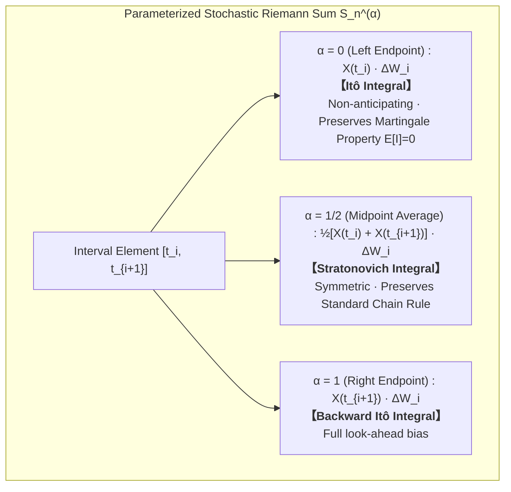
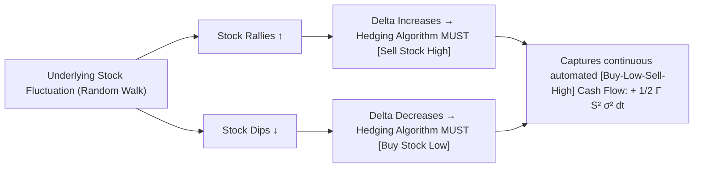

# Quant 12 · Brownian Motion, Itô Calculus, Stopping Times & Option Trading

This tutorial systematically unpacks the core continuous-time stochastic analysis framework in quantitative finance: from the continuous limit of 1D and 2D random walks (Brownian motion and Donsker's Invariance Principle), to sample path geometric irregularities (infinite first-order variation and finite quadratic variation), to Itô's Lemma and the structural divergence between Itô and Stratonovich integrals, continuous-time stopping times, exponential martingales, and the Reflection Principle, and finally to Geometric Brownian Motion, Black-Scholes-Merton PDE, Delta hedging Gamma PnL, and volatility signature arbitrage.

```text
Core Mental Model & Roadmap:
1. Path Geometry: Brownian motion W_t is almost surely continuous everywhere but nowhere differentiable. Its total variation is infinite, while its quadratic variation is deterministic [W]_t = t. Ordinary Riemann-Stieltjes calculus collapses; one must Taylor-expand to order (dW_t)^2 = dt.
2. 2D Random Walk & Donsker Limit: Discrete grid walks weakly converge to 2D Brownian motion. Discrete 2D walk is recurrent (Pólya's theorem). Continuous 2D Brownian motion is point-transient (never hits an exact pre-assigned point, capacity 0) but neighborhood-recurrent (visits any open ball B_eps(x) infinitely often), and possesses conformal invariance under analytic maps (Paul Lévy's Theorem).
3. Itô vs. Stratonovich Geometry: Itô evaluates at left endpoints (non-anticipating/adapted), maintaining the martingale property with E[I_t] = 0 (essential for financial causality and no-arbitrage). Stratonovich evaluates at midpoints, preserving standard chain rules but injecting an anticipating drift correction of +(1/2) dt.
4. Stopping Times & Reflection Principle: For the hitting time \tau_a = inf{t: W_t = a}, strong Markov property and spatial mirror symmetry yield P(M_t >= a) = 2 P(W_t >= a), leading directly to the Lévy distribution for first passage times.
5. Option Hedging & Volatility Signature: Delta hedging eliminates first-order directional risk dW_t. The instantaneous hedging PnL is d\Pi = (1/2) S^2 \Gamma (\sigma_{realized}^2 - \sigma_{implied}^2) dt - r \Pi dt. Long Gamma is fundamentally a bet that realized volatility will exceed implied volatility.
```

---

## Module 1: Basics & Path Geometry of Brownian Motion

### 1. Axiomatic Characterization

A standard one-dimensional Brownian motion (Wiener process) $\{W_t\}_{t \ge 0}$ defined on a probability space $(\Omega, \mathcal{F}, \mathbb{P})$ satisfies:

$$
\begin{aligned}
\text{(i) Starting Point:} &\ W_0 = 0 \text{ almost surely} \\
\text{(ii) Independent Increments:} &\ \forall 0 \le t_0 < t_1 < \dots < t_n,\ \text{increments } W_{t_1}-W_{t_0}, \dots, W_{t_n}-W_{t_{n-1}} \text{ are mutually independent} \\
\text{(iii) Stationary Gaussian Increments:} &\ \forall 0 \le s < t,\ W_t - W_s \sim \mathcal{N}(0, t - s) \\
\text{(iv) Sample Path Continuity:} &\ t \mapsto W_t(\omega) \text{ is continuous for almost all } \omega
\end{aligned}
$$

The covariance kernel for any $s, t \ge 0$ (assuming $s \le t$) is:

$$
\operatorname{Cov}(W_s, W_t) = \mathbb{E}[W_s W_t] = \mathbb{E}[W_s (W_s + W_t - W_s)] = \mathbb{E}[W_s^2] + 0 = s = \min(s, t)
$$

### 2. Path Geometry: Nowhere Differentiability and Quadratic Variation

For a partition $\Pi_n: 0 = t_0 < t_1 < \dots < t_n = T$ with mesh size $|\Pi_n| = \max_i |t_i - t_{i-1}| \to 0$:

#### (1) First-Order Total Variation Diverges to Infinity

$$
\operatorname{TV}_T(W) = \lim_{|\Pi_n| \to 0} \sum_{i=1}^n |W_{t_i} - W_{t_{i-1}}| = \infty \quad \text{almost surely}
$$

**Proof sketch**: Let $\Delta W_i = W_{t_i} - W_{t_{i-1}} = \sqrt{\Delta t_i} Z_i$ ($Z_i \sim \mathcal{N}(0, 1)$). Then $\mathbb{E}[|\Delta W_i|] = \sqrt{\frac{2}{\pi}} \sqrt{\Delta t_i}$. For uniform partitions $\Delta t = T/n$:

$$
\mathbb{E}\left[ \sum_{i=1}^n |\Delta W_i| \right] = n \cdot \sqrt{\frac{2}{\pi}} \sqrt{\frac{T}{n}} = \sqrt{\frac{2}{\pi}} \sqrt{T} \sqrt{n} \xrightarrow{n \to \infty} \infty
$$

#### (2) Quadratic Variation Converges Deterministically to $T$

$$
[W]_T = \lim_{|\Pi_n| \to 0} \sum_{i=1}^n (W_{t_i} - W_{t_{i-1}})^2 = T \quad \text{in } L^2 \text{ and in probability}
$$

**Proof**: Let $Q_n = \sum_{i=1}^n (\Delta W_i)^2$. The expectation is $\mathbb{E}[Q_n] = \sum \Delta t_i = T$. The variance is:

$$
\operatorname{Var}(Q_n) = \sum_{i=1}^n (\Delta t_i)^2 \operatorname{Var}(Z_i^2) = 2 \sum_{i=1}^n (\Delta t_i)^2 \le 2 |\Pi_n| \sum \Delta t_i = 2 |\Pi_n| T \xrightarrow{|\Pi_n| \to 0} 0
$$

In differential notation:

$$
(dW_t)^2 = dt
$$

> **Key Quant Takeaway**: Because $(dW_t)^2 = dt$ has the same first-order scale as $dt$, any Taylor expansion of a function along a Brownian path must include second derivatives.

```brownian-motion-demo
```

### 3. Symmetries and Invariant Transformations

1. **Brownian Scaling**: $\forall c > 0$, $X_t = \frac{1}{\sqrt{c}} W_{ct}$ is a standard Brownian motion.
2. **Time Inversion**: $Y_t = t W_{1/t}$ (with $Y_0 = 0$) is a standard Brownian motion.
3. **Spatial Reflection**: $Z_t = -W_t$ is a standard Brownian motion.

### 4. Transition Density & Heat Equation

The transition probability density from $x$ to $y$ across time $t$ is:

$$
p(t, x, y) = \frac{1}{\sqrt{2\pi t}} \exp\left( -\frac{(y-x)^2}{2t} \right)
$$

It directly satisfies the Heat Equation / Kolmogorov backward & forward PDE:

$$
\frac{\partial p}{\partial t} = \frac{1}{2} \frac{\partial^2 p}{\partial x^2} \quad (\text{Backward}) \qquad \frac{\partial p}{\partial t} = \frac{1}{2} \frac{\partial^2 p}{\partial y^2} \quad (\text{Forward / Fokker-Planck})
$$

---

## Module 2: 2D Random Walk & Brownian Motion

### 1. Donsker's Invariance Principle (Functional Central Limit Theorem)

Let $\xi_1, \xi_2, \dots$ be i.i.d. step vectors on the discrete integer lattice $\mathbb{Z}^2$, choosing each cardinal direction with probability $1/4$: $\mathbb{E}[\xi_i] = (0, 0)$, $\operatorname{Cov}(\xi_i) = \frac{1}{2} I_2$. Construct the piecewise linear random walk $S_k = \sum_{i=1}^k \xi_i$ and the rescaled process:

$$
B_N(t) = \frac{1}{\sqrt{N}} S_{\lfloor Nt  floor}
$$

Donsker's Invariance Principle states that as $N \to \infty$, $B_N(\cdot)$ converges weakly in $C([0, T], \mathbb{R}^2)$ to standard two-dimensional Brownian motion:

$$
B_N(t) \implies \left( \frac{1}{\sqrt{2}} B_t^{(1)}, \frac{1}{\sqrt{2}} B_t^{(2)} \right)
$$

```two-d-walk-demo
```

### 2. Recurrence vs. Transience: Pólya's Theorem and Topological Finesse

| Spatial Dimension $d$ | Discrete Grid Walk ($\mathbb{Z}^d$) | Continuous Brownian Motion ($\mathbb{R}^d$) | Properties |
| :--- | :--- | :--- | :--- |
| **$d = 1$** | **Recurrent** | **Recurrent** | Returns to origin almost surely, $\mathbb{E}[\tau] = \infty$ (null recurrent) |
| **$d = 2$** | **Recurrent** | **Neighborhood Recurrent, Point Transient** | Discrete: $P(\text{return}) = 1$; Continuous: $P(\exists t>0: B_t = 0) = 0$, but enters any open disk $B_\epsilon(x)$ infinitely often |
| **$d \ge 3$** | **Transient** | **Transient** | Discrete $d=3$: $P(\text{return}) \approx 0.340537$; Continuous: $\lim_{t\to\infty} \|B_t\| = \infty$ a.s. |

### 3. Conformal Invariance (Paul Lévy's Theorem)

Let $Z_t = B_t^{(1)} + i B_t^{(2)}$ be standard complex Brownian motion, and let $f: U \to V$ be a non-degenerate holomorphic (analytic) function. Then:

$$
f(Z_t) = \widetilde{Z}_{\tau_t}
$$

where $\widetilde{Z}$ is another standard complex Brownian motion and $\tau_t = \int_0^t |f'(Z_s)|^2 ds$ is a strictly increasing time change. Conformal mappings preserve the Brownian motion structure, enabling geometric transformations of complex boundary value problems.

---

## Module 3: Itô Calculus & Itô Geometry (Intuition First)

### 1. Historical Evolution & Timeline: From Pollen Grains to Modern Quantitative Finance

Stochastic calculus is not an abstract game of pure symbols; it is a profound revolution born out of physical particle diffusion and forged into the modern language of global quantitative trading:

| Year | Key Pioneer | Milestone Contribution & Publication | Significance to Quantitative Finance & Stochastic Analysis |
| :---: | :--- | :--- | :--- |
| **1827** | **Robert Brown** | Microscopic observation of continuous chaotic jittering of pollen grains in water | First physical discovery of macroscopic continuous stochastic motion |
| **1900** | **Louis Bachelier** | PhD thesis *Théorie de la Spéculation* models Paris stock exchange options via Brownian motion | **Predated Einstein by 5 years** in modeling asset price diffusion; father of mathematical finance |
| **1905** | **Albert Einstein** | Derives macroscopic diffusion PDE from molecular collisions: $\mathbb{E}[(\Delta x)^2] = 2Dt$ | Proved physics of diffusion and enabled experimental measurement of Avogadro's number |
| **1923** | **Norbert Wiener** | Establishes rigorous Wiener measure on path space $C[0, \infty)$ | Rigorously proved that Brownian sample paths are **continuous everywhere, nowhere differentiable** |
| **1944–1951** | **Kiyosi Itô** | Constructs non-anticipating stochastic integral via $L^2$ isometry & derives **Itô's Lemma** | Solved the breakdown of classical calculus on rough paths, creating modern SDE theory |
| **1973** | **Black-Scholes-Merton** | Replaces arithmetic BM with GBM; uses Itô's Lemma to build self-financing Delta hedges | Eliminated market risk to derive the Nobel Prize-winning option pricing & dynamic hedging formula |

---

### 2. What is a Diffusion Process & Itô Diffusion? (Foundations)

In quantitative finance and stochastic calculus, "**Diffusion Process**" and "**Itô Diffusion**" are fundamental concepts that are often used loosely. Here is the precise physical, mathematical, and financial breakdown:

#### (1) Physical Intuition: What is a Basic Diffusion?
* **Real-World Analogy**: When a drop of ink is released into still water, microscopic water molecules bombard ink particles in chaotic thermal motion (Brownian motion), causing ink to spread out from high to low concentration (Fick's laws).
* **Microscopic vs. Macroscopic Duality**:
  - **Microscopic Level (Single Particle)**: Follows a jagged **Brownian motion / random walk** $W_t$;
  - **Macroscopic Level (Probability Density / Concentration $ ho(t, x)$)**: Governed by the deterministic **Heat / Diffusion PDE**:
    $$\frac{\partial  ho}{\partial t} = \frac{1}{2}\sigma^2 \frac{\partial^2  ho}{\partial x^2}$$
* **Core Essence of Diffusion**: **The systematic expansion of uncertainty (variance) over time**. For standard Brownian motion, variance expands linearly with time: $\operatorname{Var}(W_t) = t$.

---

#### (2) Mathematical Formulation: The Drift-Diffusion Decomposition
Asset prices in real financial markets are neither deterministic straight lines nor pure zero-trend noise; they are a continuous mixture of **deterministic trend + random fluctuations**.

Any continuous-path continuous-state Markov process can be decomposed into a **Drift-Diffusion Stochastic Differential Equation (SDE)**:

$$\boxed{dX_t = \underbrace{\mu(t, X_t) dt}_{\text{Deterministic Drift Term}} + \underbrace{\sigma(t, X_t) dW_t}_{\text{Stochastic Diffusion Term}}}$$

* **Drift Term ($\mu(t, X_t)$)**:
  - **Physics**: External forces, gravity, fluid flow pulling the particle in a deterministic direction. If noise is turned off ($\sigma=0$), it reduces to an ODE $\frac{dX_t}{dt} = \mu(t, X_t)$;
  - **Finance**: The expected return, risk-free interest rate drift, or **mean-reverting gravitational pull**.
* **Diffusion Term ($\sigma(t, X_t)$)**:
  - **Physics**: The intensity/amplitude of microscopic thermal noise collisions;
  - **Finance**: The asset's **instantaneous volatility**, representing market price vibration per unit time.

---

#### (3) Mathematical Definition: What is an "Itô Diffusion"?
A stochastic process $X = \{X_t : t \ge 0\}$ is rigorously defined as an **Itô Diffusion** if it satisfies three foundational pillars:
1. **Driven by Brownian SDE**: It is the strong/weak solution to the integral equation:
   $$X_t = X_0 + \int_0^t \mu(s, X_s) ds + \int_0^t \sigma(s, X_s) dW_s$$
   where the second integral is a non-anticipating **Itô Stochastic Integral**;
2. **Strong Markov Property**: The process is "memoryless". Conditioned on the present state $X_\tau$ at stopping time $\tau$, the future evolution is completely independent of the past path history;
3. **Continuous Sample Paths**: Almost all trajectories $t \mapsto X_t(\omega)$ are continuous functions (**No Jumps**). If discontinuous jumps exist, it becomes an Itô-Lévy jump-diffusion.

---

#### (4) Master Cheatsheet: 5 Iconic Itô Diffusions in Quantitative Finance

| Model Name | Stochastic Differential Equation (SDE) | Drift $\mu(X_t)$ | Diffusion $\sigma(X_t)$ | Key Quantitative Application |
| :--- | :--- | :--- | :--- | :--- |
| **Standard Brownian Motion** | $dX_t = dW_t$ | $0$ (Zero drift) | $1$ (Unit diffusion) | Pure noise baseline, Martingale pricing foundation |
| **Arithmetic BM with Drift** | $dX_t = \mu dt + \sigma dW_t$ | $\mu$ (Constant) | $\sigma$ (Constant) | Bachelier option pricing model, short-term spread dynamics |
| **Geometric Brownian Motion (GBM)** | $dS_t = \mu S_t dt + \sigma S_t dW_t$ | $\mu S_t$ (Linear in price) | $\sigma S_t$ (Percentage volatility) | **Black-Scholes Stock & Index Option Model** |
| **Ornstein-Uhlenbeck (OU) Process** | $dX_t = \theta(\mu - X_t) dt + \sigma dW_t$ | $\theta(\mu - X_t)$ (Mean-reversion pull) | $\sigma$ (Constant) | **Vasicek Short Rate Model**, Statistical Arbitrage Pairs Trading |
| **Cox-Ingersoll-Ross (CIR) Process** | $dr_t = k(\theta - r_t) dt + \sigma \sqrt{r_t} dW_t$ | $k(\theta - r_t)$ (Mean-reversion pull) | $\sigma \sqrt{r_t}$ (Vanishes at 0, strictly non-negative) | **CIR Interest Rate Model**, **Heston Stochastic Volatility Model** |

---

### 3. Why Classical Calculus Fails: 3 Core Intuitive & Physical Mental Models

#### Mental Model 1: Why does $(dW_t)^2 = dt$ become a 100% deterministic constant?
> **The Coin Toss & Step Size Intuition**:
> Imagine tossing a coin every $\Delta t$ seconds. To make the total variance after 1 second equal to 1, the step size cannot be $\pm \Delta t$ (otherwise variance after $N = 1/\Delta t$ steps would vanish to 0). **The step size must be $\pm \sqrt{\Delta t}$**!
> 
> Now look at the squared step:
> $$(\pm \sqrt{\Delta t})^2 = +\Delta t$$
> **Regardless of whether the coin lands Heads ($+1$) or Tails ($-1$), squaring wipes out the sign and completely erases all randomness!**
> 
> Summing up all microscopic squared steps over 1 second:
> $$\sum_{i=1}^{1/\Delta t} (\Delta W_i)^2 = \left( \frac{1}{\Delta t} \right) \times \Delta t = 1 \text{ second}$$
> 
> **Core Insight**: On an infinitesimal scale, the square of random noise is a **100% deterministic, vibration-free constant flow of time**! $(dW_t)^2 = dt$ is not an approximation—it is an exact law of nature!

---

#### Mental Model 2: The Parabolic Bowl (Why is there a $+\frac{1}{2} f''(x) dt$ correction?)
> **The Bowl Bottom Intuition**:
> Imagine standing at the bottom of a parabolic bowl $f(x) = x^2$ at $x=0$:
> - A symmetric gust of wind pushes you randomly Left ($1$ meter) or Right ($1$ meter) with $50/50$ probability;
> - **Horizontally**: Your average displacement is $\frac{+1 + (-1)}{2} = 0$ (no drift);
> - **Vertically (Height)**: Moving Right lifts you up $(+1)^2 = 1$ meter; moving Left **also lifts you up $(-1)^2 = 1$ meter**!
> - **Result**: Even though horizontal wind is fair pure noise, the upward curvature of the bowl (convexity $f''(x) > 0$) **systematically pumps your average height upward by 1 meter on every jitter!**
> 
> This is **Jensen's Inequality operating in real-time continuous dynamics**:
> $$\mathbb{E}[f(X + \Delta W)] - f(X) \approx \underbrace{f'(X)\mathbb{E}[\Delta W]}_{= 0} + \frac{1}{2} f''(X) \underbrace{\mathbb{E}[(\Delta W)^2]}_{= \Delta t} = \frac{1}{2} f''(X) \Delta t$$
> 
> - The curvier the bowl ($f''(x)$), the more violent the jitter ($\sigma^2$), the faster the upward drift!
> - Under a concave ceiling ($f''(x) < 0$), symmetric noise systematically drags your expected value downward!

---

#### Mental Model 3: Volatility Drag ($-\frac{1}{2}\sigma^2 dt$: How Volatility Destroys Compound Growth)
> **Practical Trading & Portfolio Intuition**:
> Why is the actual geometric compounding return always lower than the arithmetic return by $-\frac{1}{2}\sigma^2$?
> 
> Consider a classic leveraged investment:
> - Day 1: Asset surges $+50\%$ ($100 \to 150$);
> - Day 2: Asset crashes $-50\%$ ($150 \to 75$);
> - **Arithmetic Average Return**: $\frac{+50\% - 50\%}{2} = 0\%$ (looks like break-even);
> - **Actual Portfolio Value**: Drops from \$100 to \$75—a net **$-25\%$ loss**!
> 
> That phantom $-25\%$ loss is discrete **Volatility Drag**!
> In continuous stochastic calculus, the logarithm $f(S) = \ln S$ is strictly concave ($f''(S) = -1/S^2 < 0$). Under continuous Brownian jitter, Itô's Lemma generates the exact geometric downward drag of **$-\frac{1}{2}\sigma^2 dt$**!

---

### 4. Itô's Lemma: Multiplication Table & 3-Step Interview Rule

For an Itô diffusion: $dX_t = \mu(t, X_t) dt + \sigma(t, X_t) dW_t$.


#### Itô Multiplication Table (Only Noise $\times$ Noise produces Time)

| $\times$ | $dt$ | $dW_t$ | Memory Intuition |
| :---: | :---: | :---: | :--- |
| **$dt$** | $0$ | $0$ | $dt \cdot dt \sim O(dt^2)$, negligible |
| **$dW_t$** | $0$ | **$dt$** | Two $\sqrt{dt}$ terms multiply to first-order time $dt$ |

#### Rapid 3-Step Recipe (Solve any derivative drift in 3 seconds):
1. **Step 1 (Standard Newton Differential)**: $\frac{\partial f}{\partial t} dt + \frac{\partial f}{\partial x} dX_t$;
2. **Step 2 (Add the Itô Curvature Kick)**: $+\frac{1}{2} \frac{\partial^2 f}{\partial x^2} (dX_t)^2$;
3. **Step 3 (Substitute $(dX_t)^2 = \sigma^2 dt$ & Collect $dt$ terms)**:

$$\boxed{df(t, X_t) = \left( \frac{\partial f}{\partial t} + \mu \frac{\partial f}{\partial x} + \frac{1}{2}\sigma^2 \frac{\partial^2 f}{\partial x^2} \right) dt + \sigma \frac{\partial f}{\partial x} dW_t}$$

---

### 5. Itô vs. Stratonovich Integrals: Master Guide, Conversions & the Wong-Zakai Theorem

In the historical development of stochastic calculus, the choice of evaluation point in the stochastic Riemann sum sparked two major mathematical schools and practical paradigms: the **Itô Integral** and the **Stratonovich Integral**.

```ito-geometry-demo
```

---

#### (1) Historical Background & Philosophical Division

* **The Kiyosi Itô Camp (1944 · Martingale Property & Temporal Causality First)**:
  - **Motivation**: Create a rigorous measure-theoretic stochastic calculus for Markov processes and physical diffusions.
  - **Core Philosophy**: **Time flows forward; looking into the future is strictly forbidden (No Anticipation)**. At time $t$, trading decisions or physical forces can only depend on filtration $\mathcal{F}_t$.
  - **Trade-off**: Sacrifices the standard Newton-Leibniz chain rule, requiring the second-order curvature correction in **Itô's Lemma**.
* **The Ruslan Stratonovich Camp (1966 & D. L. Fisk 1963 · Geometric Symmetry & Chain Rule First)**:
  - **Motivation**: Provide a stochastic calculus for physical dynamical systems, robotics, and differential geometry that preserves classical calculus rules.
  - **Core Philosophy**: **Calculus must be coordinate-invariant on smooth manifolds**, requiring symmetric midpoint evaluations.
  - **Trade-off**: **Loses the Martingale property**, creating phantom drift out of pure symmetric white noise.

---

#### (2) Mathematical Formulations: Left Endpoint vs. Midpoint Riemann Sums

Partition the interval $[0, T]$ as $0 = t_0 < t_1 < \dots < t_n = T$ with mesh size $|\Pi| = \max_i |t_{i+1} - t_i| \to 0$. Introduce evaluation point $\tau_i = (1-\alpha)t_i + \alpha t_{i+1}$ for $\alpha \in [0, 1]$:

$$S_n^{(\alpha)} = \sum_{i=0}^{n-1} X_{\tau_i} (W_{t_{i+1}} - W_{t_i})$$



* **Itô Integral ($\alpha = 0$, denoted $\int_0^T X_t dW_t$)**:
  $$\int_0^T X_t dW_t \triangleq \lim_{|\Pi| \to 0} \sum_{i=0}^{n-1} X_{t_i} (W_{t_{i+1}} - W_{t_i})$$
  - The integrand $X_{t_i}$ is evaluated at the **left endpoint**, making it $\mathcal{F}_{t_i}$-measurable and **completely independent** of the forward increment $\Delta W_i = W_{t_{i+1}} - W_{t_i}$.
* **Stratonovich Integral ($\alpha = 1/2$, denoted $\int_0^T X_t \circ dW_t$)**:
  $$\int_0^T X_t \circ dW_t \triangleq \lim_{|\Pi| \to 0} \sum_{i=0}^{n-1} \left( \frac{X_{t_i} + X_{t_{i+1}}}{2} \right) (W_{t_{i+1}} - W_{t_i})$$
  - The integrand is evaluated at the **trapezoidal midpoint**, creating an endogenous correlation between the integrand and future Brownian increment $\Delta W_i$.

---

#### (3) The Definitive Calculation Comparison: $\int_0^T W_t dW_t$ vs. $\int_0^T W_t \circ dW_t$

##### 1. Itô Integral Calculation:
Using $W_{t_i}(W_{t_{i+1}} - W_{t_i}) = \frac{1}{2}(W_{t_{i+1}}^2 - W_{t_i}^2) - \frac{1}{2}(W_{t_{i+1}} - W_{t_i})^2$:
$$\sum_{i=0}^{n-1} W_{t_i} \Delta W_i = \frac{1}{2} \underbrace{\sum_{i=0}^{n-1} (W_{t_{i+1}}^2 - W_{t_i}^2)}_{\text{Telescoping Sum} = W_T^2 - W_0^2 = W_T^2} - \frac{1}{2} \underbrace{\sum_{i=0}^{n-1} (\Delta W_i)^2}_{\text{Quadratic Variation} \to T}$$
$$\boxed{\int_0^T W_t dW_t = \frac{1}{2} W_T^2 - \frac{1}{2} T}$$
* **Expectation Check (Martingale Property)**:
  $$\mathbb{E}\left[ \int_0^T W_t dW_t \right] = \frac{1}{2} \mathbb{E}[W_T^2] - \frac{1}{2}T = \frac{1}{2}T - \frac{1}{2}T = \mathbf{0}$$
  Expected profit from pure noise is strictly zero (no free lunch).

##### 2. Stratonovich Integral Calculation:
$$\sum_{i=0}^{n-1} \left( \frac{W_{t_i} + W_{t_{i+1}}}{2} \right) (W_{t_{i+1}} - W_{t_i}) = \frac{1}{2} \sum_{i=0}^{n-1} (W_{t_{i+1}}^2 - W_{t_i}^2) = \frac{1}{2} W_T^2$$
$$\boxed{\int_0^T W_t \circ dW_t = \frac{1}{2} W_T^2}$$
* **Standard Classical Form**: Identical to Newton calculus $\int x dx = \frac{1}{2}x^2$.
* **Expectation Trap (Loses Martingale Property)**:
  $$\mathbb{E}\left[ \int_0^T W_t \circ dW_t \right] = \frac{1}{2} \mathbb{E}[W_T^2] = \mathbf{\frac{1}{2} T \ne 0}$$
  **Manufactures a fictitious positive deterministic drift of $+\frac{1}{2}T$ out of pure zero-mean noise!**

---

#### (4) Conversion Formulas & the Drift Correction

Itô and Stratonovich calculus are connected by an exact **algebraic conversion identity**:

$$\boxed{\int_0^T X_t \circ dW_t = \int_0^T X_t dW_t + \frac{1}{2} [X, W]_T}$$

For semimartingale $dX_t = \mu_t dt + \sigma_t dW_t$, the quadratic covariation is $d[X, W]_t = \sigma_t dt$.

##### 1. Differential Level:
$$X_t \circ dW_t = X_t dW_t + \frac{1}{2} \sigma_t dt$$

##### 2. SDE Level Conversion:
* **Stratonovich SDE $\to$ Itô SDE**:
  Given Stratonovich SDE: $dX_t = \underline{b}(X_t) dt + \sigma(X_t) \circ dW_t$
  The equivalent Itô SDE adds the **Wong-Zakai drift correction**:
  $$\boxed{dX_t = \left( \underline{b}(X_t) + \frac{1}{2} \sigma(X_t) \sigma'(X_t) \right) dt + \sigma(X_t) dW_t}$$
* **Itô SDE $\to$ Stratonovich SDE**:
  Given Itô SDE: $dX_t = \mu(X_t) dt + \sigma(X_t) dW_t$
  The equivalent Stratonovich SDE is:
  $$\boxed{dX_t = \left( \mu(X_t) - \frac{1}{2} \sigma(X_t) \sigma'(X_t) \right) dt + \sigma(X_t) \circ dW_t}$$

---

#### (5) Wong-Zakai Theorem: Why Physics Prefers Stratonovich

Ideal mathematical "white noise" (correlation time $\tau = 0$) does not exist in nature; all physical disturbances are **smooth colored noise** with tiny correlation time $\epsilon > 0$.

> **Wong-Zakai Theorem (1965)**:
> Let $W_t^{(\epsilon)}$ be a smooth, differentiable approximation of Brownian motion (e.g., via an Ornstein-Uhlenbeck mollifier).
> Consider the standard ODE driven by smooth noise:
> $$\frac{dX_t^{(\epsilon)}}{dt} = b(X_t^{(\epsilon)}) + \sigma(X_t^{(\epsilon)}) \dot{W}_t^{(\epsilon)}$$
> As correlation time $\epsilon \to 0$, the solution $X_t^{(\epsilon)}$ **converges in probability to the Stratonovich SDE, NEVER the Itô SDE!**
> $$\lim_{\epsilon \to 0} X_t^{(\epsilon)} = X_t^{\text{Stratonovich}}$$

* **Physical Intuition**:
  Physical bodies possess inertia and cannot respond instantaneously with zero delay. Physical damping naturally smooths microscopic collisions into an average midpoint response.

---

#### (6) Comprehensive Comparison Matrix (Master Table)

| Dimension | Itô Calculus | Stratonovich Calculus |
| :--- | :--- | :--- |
| **Sampling Point $\alpha$** | $\alpha = 0$ (Left endpoint) | $\alpha = 1/2$ (Trapezoidal midpoint) |
| **Information Filtration** | $\mathcal{F}_{t_i}$-adapted, **Non-anticipating (Strict Causality)** | Evaluates $X_{t_{i+1}}$, contains forward look-ahead |
| **Chain Rule Form** | **Second-Order Itô's Lemma**: $d(f) = f' dX + \frac{1}{2}f''\sigma^2 dt$ | **Classical Newton Chain Rule**: $d(f) = f'(X) \circ dX$ |
| **Martingale Property** | **Strictly Preserved**: $\mathbb{E}\left[ \int H dW \right] = 0$ | **Violated**: $\mathbb{E}\left[ \int W \circ dW \right] = \frac{T}{2} \ne 0$ |
| **Manifold Invariance** | Second-order drift breaks tensor covariance | **Preserves Lie group and Riemannian symmetries** |
| **Numerical Schemes** | Euler-Maruyama Scheme | Heun's Method / Stratonovich Runge-Kutta |
| **Primary Domain** | **Quantitative Trading, Derivatives Pricing, Risk Hedging** | **Statistical Physics, Robotics, Manifold Navigation** |

---

#### (7) Quant Interview Classic Questions & Traps

> **Question 1: What fatal flaw happens if a backtesting engine uses Stratonovich calculus for high-frequency market making?**
> * **Answer**:
>   It creates a **fictitious "infinite money glitch"**! Stratonovich discrete sampling peeks ahead half a tick. On pure zero-mean noise, backtests will report a guaranteed riskless profit of $+\frac{1}{2}\sigma^2 dt$ per second, which will catastrophically collapse in live execution.
>
> **Question 2: Convert the standard GBM Itô SDE $dS_t = \mu S_t dt + \sigma S_t dW_t$ into Stratonovich form.**
> * **Derivation**:
>   - Diffusion term $\sigma(S) = \sigma S \implies \sigma'(S) = \sigma$;
>   - Correction term: $\frac{1}{2}\sigma(S)\sigma'(S) = \frac{1}{2}(\sigma S)(\sigma) = \frac{1}{2}\sigma^2 S$;
>   - Stratonovich drift subtracts this term: $\underline{b}(S) = (\mu - \frac{1}{2}\sigma^2) S$;
>   - **Final Stratonovich SDE**:
>     $$\boxed{dS_t = \left( \mu - \frac{1}{2}\sigma^2 \right) S_t dt + \sigma S_t \circ dW_t}$$


---

## Module 4: Classic Applications & Analytical Tools of Itô Calculus

Having established the foundational theory of Itô stochastic calculus and Itô's Lemma, this module examines three quintessential applications in financial mathematics and quantitative modeling. These applications demonstrate how the second-order curvature term $\frac{1}{2}\sigma^2 f''(x) dt$ governs asset dynamics, option risk harvesting, and variance calculations.

---

### 1. Application 1: Closed-Form Solution of Geometric Brownian Motion (GBM) via Log-Transform

#### (1) Financial Motivation: Why Arithmetic Brownian Motion Fails
In 1900, Louis Bachelier modeled stock prices with Arithmetic Brownian Motion (ABM): $dS_t = \mu dt + \sigma dW_t$. However, ABM suffers from two major economic flaws:
1. **Negative Asset Prices**: Normal distributions have unbounded support $(-\infty, +\infty)$, which violates the limited liability of equities;
2. **Constant Absolute Dollar Volatility**: ABM assumes dollar fluctuations are identical whether a stock is trading at \$10 or \$1000. In reality, investors think in terms of **percentage returns**.

In 1965, Nobel laureate Paul Samuelson introduced **Geometric Brownian Motion (GBM)**, modeling relative instantaneous returns as normally distributed:

$$\frac{dS_t}{S_t} = \mu dt + \sigma dW_t \iff dS_t = \mu S_t dt + \sigma S_t dW_t \quad (S_0 > 0)$$

where $\mu$ is the expected drift return and $\sigma > 0$ is percentage volatility.

#### (2) Deriving the Analytical Closed-Form Solution via Itô's Lemma
Because state variable $S_t$ appears inside the diffusion term, standard Riemann integration is impossible. We apply the **logarithmic transformation**:
* Consider smooth non-linear map $f(S) = \ln S$;
* Derivatives: $f'(S) = \frac{1}{S}$, $f''(S) = -\frac{1}{S^2}$;
* Apply Itô's Lemma to $f(S_t) = \ln S_t$:
  $$d(\ln S_t) = f'(S_t) dS_t + \frac{1}{2} f''(S_t) (dS_t)^2 = \frac{1}{S_t} (\mu S_t dt + \sigma S_t dW_t) + \frac{1}{2} \left( -\frac{1}{S_t^2} \right) (\sigma^2 S_t^2 dt)$$
* Simplify to obtain a linear drift-diffusion equation for log-prices:
  $$d(\ln S_t) = \left( \mu - \frac{1}{2}\sigma^2 \right) dt + \sigma dW_t$$
* Integrate directly across $[0, t]$:
  $$\ln\left( \frac{S_t}{S_0} \right) = \left( \mu - \frac{1}{2}\sigma^2 \right) t + \sigma W_t$$
* Exponentiate both sides to reach the **exact analytical solution**:
  $$\boxed{S_t = S_0 \exp\left( \left( \mu - \frac{1}{2}\sigma^2 \right) t + \sigma W_t \right)}$$

#### (3) Statistical Moments & Interpretation of Volatility Drag
* **Log-Normal Distribution**: $\ln(S_t / S_0) \sim \mathcal{N}\left( (\mu - \frac{1}{2}\sigma^2)t, \sigma^2 t \right)$;
* **Expected Price**: Using the moment generating function $\mathbb{E}[e^{\sigma W_t}] = e^{\frac{1}{2}\sigma^2 t}$:
  $$\mathbb{E}[S_t] = S_0 e^{(\mu - \frac{1}{2}\sigma^2)t} \mathbb{E}[e^{\sigma W_t}] = S_0 e^{(\mu - \frac{1}{2}\sigma^2)t} e^{\frac{1}{2}\sigma^2 t} = S_0 e^{\mu t}$$
* **Trading Insight**: While the ensemble arithmetic expectation grows at rate $\mu$, almost every individual trajectory compound growth rate is penalized by the deterministic downward **Volatility Drag $-\frac{1}{2}\sigma^2$**.

---

> 📘 **Foundational Financial Engineering Primer**: For a systematic overview of options, futures, short-selling borrowing mechanics, Delta-neutrality, and Greeks, please refer to the introductory guide: [[Quant14 Financial Markets Asset Classes and Portfolio Theory.md|Quant 14 · Financial Engineering & Quant Trading Primer: Asset Classes, Derivatives, AMM, Portfolio Theory & Arbitrage]].

### 2. Application 2: Option Long Gamma & Delta Hedging Cash Flow (Gamma Scalping)

#### (1) Financial Background & Market Maker Dynamics
In modern options trading, market makers and proprietary desks construct **Delta-Neutral Portfolios** to neutralize first-order directional price risk.

A market maker holding a long derivative position $V(t, S_t)$ hedges directional exposure by shorting $\Delta_t = \frac{\partial V}{\partial S}$ shares of the underlying stock:

$$\Pi_t = V(t, S_t) - \Delta_t S_t$$

#### (2) Second-Order PnL Decomposition
In an infinitesimal interval $dt$, portfolio change is $d\Pi_t = dV(t, S_t) - \Delta_t dS_t$.
Expanding $V(t, S_t)$ via Itô's Lemma:

$$dV = \frac{\partial V}{\partial t} dt + \frac{\partial V}{\partial S} dS_t + \frac{1}{2} \frac{\partial^2 V}{\partial S^2} (dS_t)^2 = \Theta dt + \Delta dS_t + \frac{1}{2} \Gamma \sigma^2 S_t^2 dt$$

Substituting into portfolio PnL:

$$d\Pi_t = \left( \Theta dt + \Delta dS_t + \frac{1}{2} \Gamma \sigma^2 S_t^2 dt \right) - \Delta dS_t = \underbrace{\Theta dt}_{\text{Time Decay Loss (Theta)}} + \underbrace{\frac{1}{2} \Gamma \sigma^2 S_t^2 dt}_{\text{Second-Order Volatility Cash Inflow (Gamma)}}$$



#### (3) The Trader's Intuition: Volatility Harvesting (Gamma Scalping)
* **Long Gamma Position ($\Gamma > 0$)**:
  - When the stock surges, Delta rises, forcing the algorithm to sell stock at high prices to rebalance to neutral;
  - When the stock drops, Delta falls, forcing the algorithm to buy stock at low prices to rebalance;
* **Conclusion**: Market volatility mechanically forces the dynamic delta hedger to **Buy Low and Sell High**!
* The continuous cash harvested from this rebalancing is exactly equal to $\frac{1}{2}\Gamma S^2 \sigma^2 dt$, which compensates for daily Theta time decay.

---

### 3. Application 3: Itô Isometry & Stochastic Integral Variance Calculations

#### (1) Core Intuition: What Exactly is the Integrand $H_t$? (Notation & Financial Meaning)

In introductory stochastic calculus, students encountering the stochastic integral $I_T = \int_0^T H_t dW_t$ often wonder: *"Is $H_t$ a variable, a function, or a random variable? Why is it called an integrand process, and why does it have so many technical conditions?"*

In modern quantitative finance and continuous-time portfolio theory, **$H_t$ is not an abstract symbol; it has a very concrete physical and trading meaning**:

1. **$W_t$ and $dW_t$ (Random Market Shocks)**:
   - $W_t$ is standard Brownian motion, modeling the unpredictable random walk of market prices;
   - The differential $dW_t \sim \mathcal{N}(0, dt)$ represents the **unpredictable white-noise shock** received by the asset price in infinitesimal time $dt$.
2. **$H_t$ (Your Dynamic Asset Holding / Trading Position)**:
   - **Physical Meaning**: **$H_t$ represents the number of shares or portfolio weight of the risky asset held by the trader or algorithm at time $t$**!
   - **Example 1 (Option Delta Hedging)**: $H_t = \Delta_t = \frac{\partial V}{\partial S}$, the exact number of shares held dynamically to offset directional risk;
   - **Example 2 (Quant Momentum / StatArb Strategy)**: $H_t$ is the real-time position size dictated by the quantitative signal at time $t$.
3. **The Product $H_t dW_t$ (Instantaneous Stochastic PnL)**:
   - During interval $dt$, you hold $H_t$ shares and the asset price fluctuates by $dW_t$. Your **instantaneous trading profit/loss is precisely $H_t \cdot dW_t$**!
4. **Stochastic Integral $I_T = \int_0^T H_t dW_t$ (Cumulative Strategy PnL)**:
   - Summing continuous instantaneous gains/losses over $[0, T]$, **the stochastic integral $I_T$ represents the cumulative stochastic trading PnL of your dynamic trading strategy over time $[0, T]$**!

---

#### (2) Demystifying the Mathematical Notation & Conditions

| Mathematical Term | Formal Condition | Intuitive Trader Translation | Violation Consequence (Intuition) |
|---|---|---|---|
| **$H_t$ is $\mathcal{F}_t$-Adapted Process** | $H_t \in \mathcal{F}_t = \sigma(W_s, 0 \le s \le t)$ | **"Strictly No Time Travel, No Lookahead Bias"**: Your position decision $H_t$ at time $t$ can only depend on **historical market information up to time $t$**, and cannot peek at future price shocks $W_{t+\Delta t}$. | If lookahead were allowed, you would hold $+100\%$ when $dW_t > 0$ and $-100\%$ when $dW_t < 0$, printing infinite money with zero risk—impossible in reality. |
| **$H_t$ is Square-Integrable** | $\mathbb{E}\left[ \int_0^T H_t^2 dt \right] < \infty$ | **"Finite Leverage & Capital Constraint"**: The trader cannot take infinite leverage. Cumulative variance exposure must have finite expectation. | Infinite leverage causes strategy variance to explode to infinity, guaranteeing guaranteed ruin. |

---

#### (3) Theoretical Motivation: Why Do We Need Itô Isometry?

In quantitative risk management, the chief risk officer needs to calculate the **variance (volatility risk)** of the dynamic strategy's total PnL $I_T = \int_0^T H_t dW_t$.
Using ordinary calculus and probability theory to expand the squared term:

$$\mathbb{E}\left[ \left( \int_0^T H_t dW_t \right)^2 \right] = \int_0^T \int_0^T \mathbb{E}\left[ H_s H_t dW_s dW_t \right]$$

This requires computing a daunting continuous double integral containing cross-time covariance terms $\mathbb{E}[H_s H_t dW_s dW_t]$ for all $s \neq t$!

**Kiyosi Itô's Breakthrough (Itô Isometry)**:
Because Brownian motion increments possess the **independent increments (Martingale) property**, future increments $dW_t$ are **statistically orthogonal and independent** of all past information (including past positions $H_s, H_t$ and past shocks $dW_s$)!
- For any $s \neq t$: $\mathbb{E}[H_s H_t dW_s dW_t] = 0$ (all cross-covariance terms vanish completely);
- Only the diagonal term $s = t$ survives: $(dW_t)^2 = dt$!

This collapses the continuous double covariance integral into a simple one-dimensional integral:

> **Itô Isometry Theorem**:
> For any square-integrable adapted process $H_t$, the second moment of the stochastic integral strictly equals the time integral of the expected squared position:
> 
> $$\boxed{\mathbb{E}\left[ \left( \int_0^T H_t dW_t \right)^2 \right] = \int_0^T \mathbb{E}[H_t^2] dt}$$
> 
> Since the expectation of an Itô integral is zero ($\mathbb{E}\left[ \int_0^T H_t dW_t \right] = 0$), the total variance of the dynamic trading strategy is:
> 
> $$\boxed{\operatorname{Var}\left( \int_0^T H_t dW_t \right) = \int_0^T \mathbb{E}[H_t^2] dt}$$
> 
> 💡 **Trader's Plain-English Takeaway**: **"The total cumulative risk (variance) of your dynamic trading strategy strictly equals the time-sum of your squared positions!"**

---

#### (4) Concrete Quantitative Examples
* **Example 1: Variance of $\int_0^T t dW_t$**
  - Integrand is a deterministic linear ramp $H_t = t$;
  - By Itô Isometry, directly compute the 1D integral:
    $$\operatorname{Var}\left( \int_0^T t dW_t \right) = \int_0^T t^2 dt = \left[ \frac{1}{3} t^3 \right]_0^T = \frac{1}{3} T^3$$
* **Example 2: Variance in Vasicek Short-Rate Model $\int_0^T e^{\kappa t} dW_t$**
  - Integrand is $H_t = e^{\kappa t}$;
  - By Itô Isometry:
    $$\operatorname{Var}\left( \int_0^T e^{\kappa t} dW_t \right) = \int_0^T e^{2\kappa t} dt = \frac{e^{2\kappa T} - 1}{2\kappa}$$

---

## Module 5: Financial Derivatives Landscape & Option Exercise Styles

### 1. Foundations: The Financial Derivatives Landscape (Forwards/Futures vs. Options)

> 📘 **Comprehensive Primer**: For a complete overview of foundational asset classes (equities, bond duration/convexity, ETF arbitrage), DeFi AMMs, and modern portfolio theory (CAPM/Sharpe/Markowitz), see the primer: [[Quant14 Financial Markets Asset Classes and Portfolio Theory.md|Quant 14 · Financial Engineering & Quant Trading Primer: Asset Classes, Derivatives, AMM, Portfolio Theory & Arbitrage]].

Before exploring stochastic calculus and options pricing, we establish the structural taxonomy of financial derivatives:
* **Linear Derivatives**: Forwards and Futures — symmetric mandatory execution obligations with linear payoff: $\text{Payoff} = S_T - K$;
* **Non-Linear Derivatives**: Options — asymmetric right versus obligation with convex payoff: $\text{Payoff} = \max(S_T - K, 0)$;
* **Exercise Mechanisms**: European style (exercisable strictly on maturity $T$), American style (exercisable continuously at any stopping time $\tau \le T$), and Path-Dependent Exotics (barrier hitting times and lookback running extrema).

#### (1) Linear Contracts: Forwards & Futures
* **Core Mechanism**: Both parties enter a binding agreement to buy or sell the underlying asset at a predetermined delivery price $K$ on maturity date $T$;
* **Symmetric Obligation**: **Both parties are legally obligated to execute (Obligation)**; neither party can unilaterally walk away;
* **Terminal Payoff**:
  - **Long Position**: $\text{Payoff} = S_T - K$ (a straight line);
  - **Short Position**: $\text{Payoff} = K - S_T$;
* **Initial Premium**: Under no-arbitrage equilibrium, entering a forward contract costs \$0 upfront.

#### (2) Non-Linear Contracts: Options
* **Core Mechanism**: The buyer pays an upfront **Premium** for the **Right (but NOT obligation)** to buy or sell the underlying asset at strike $K$; the seller collects the premium and assumes the **passive obligation** to fulfill the trade if exercised;
* **Asymmetric Convex Payoffs**:
  - **Call Option (Right to Buy)**: Payoff is $\max(S_T - K, 0)$;
  - **Put Option (Right to Sell)**: Payoff is $\max(K - S_T, 0)$.

---

### 2. Exercise Styles: European, American & the Natural Mapping to Stopping Times

#### (1) Contractual Origins & Trader Dilemma (Why Exercise Styles?)

In financial engineering and options trading, options are classified by their **exercise time window**:
* **Clarifying the Terminology**: "European", "American", and "Bermudan" are **not geographic designations**; they are standard legal clauses established by exchanges like CBOE:
  - **European Style**: The buyer can **ONLY exercise on the expiration date $T$** (common in index options like S&P 500 SPX, settled in cash);
  - **American Style**: The buyer can exercise at **any continuous trading moment $\tau \in [t, T]$** prior to expiration (standard for equity options like AAPL, TSLA);
  - **Bermudan Style**: The buyer can only exercise on a **specified discrete set of dates** prior to expiration (geographically, Bermuda lies between Europe and America).

* **The Trader's Dynamic Micro-Dilemma**:
  - In a European option, the holder is passive, waiting until terminal date $T$;
  - In an American option, the holder faces an **irreversible real-time dilemma at every microsecond $t$**:
    $$\text{"Should I stop now and pocket the immediate intrinsic cash payoff, or continue holding to capture potential future upside?"}$$
  - This dynamic search for the optimal liquidation boundary is mapped directly and rigorously into **Optimal Stopping Theory** and **Free Boundary Partial Differential Equations (PDEs)**!

---

#### (2) Mathematical Formulation & Comprehensive Notation Breakdown

The no-arbitrage pricing formulas under the risk-neutral measure display striking mathematical symmetry:

$$\boxed{V_{\text{Eur}}(t, S_t) = e^{-r(T-t)} \mathbb{E}^\mathbb{Q} \left[ \Phi(S_T) \;\middle|\; \mathcal{F}_t \right]}$$

$$\boxed{V_{\text{Am}}(t, S_t) = \sup_{\tau \in \mathcal{T}_{[t, T]}} \mathbb{E}^\mathbb{Q} \left[ e^{-r(\tau - t)} \Phi(S_\tau) \;\middle|\; \mathcal{F}_t \right]}$$

A comprehensive breakdown of each mathematical notation and its financial trading meaning:

| Notation | Mathematical Definition | Financial / Trading Meaning | Trader's Intuition |
|---|---|---|---|
| **$t$ & $T$** | Current time parameter and terminal horizon | $t$ is current valuation time; $T$ is contract maturity / expiration | $T - t$ is remaining time to maturity |
| **$S_t$** | State of continuous stochastic process at $t$ | Spot market price of underlying asset at $t$ | Follows Geometric Brownian Motion (GBM): $dS_t = r S_t dt + \sigma S_t dW_t^\mathbb{Q}$ |
| **$r$** | Continuous compounding drift parameter | Risk-free interest rate in the economy | Opportunity cost of capital / time value of money |
| **$e^{-r(T-t)}$ / $e^{-r(\tau-t)}$** | Discount Factor | Present value multiplier | Future \$1 received at $\tau$ is worth only $e^{-r(\tau-t)}$ today |
| **$\mathbb{Q}$** | Equivalent Martingale Measure | **Risk-Neutral Measure** | Under no-arbitrage, discounted asset prices are martingales under $\mathbb{Q}$, drifting at rate $r$ rather than real-world $\mu$ |
| **$\mathcal{F}_t$** | Filtration (Information history) | **All publicly observable market history up to time $t$** | $\mathbb{E}^\mathbb{Q}[\cdot \mid \mathcal{F}_t]$ is conditional expectation given known historical information |
| **$\Phi(S)$** | Payoff Function | Immediate **intrinsic value** realized upon exercise | Call: $\Phi(S) = (S - K)^+$; Put: $\Phi(S) = (K - S)^+$ ($K$ is strike price) |
| **$\tau$** | Stopping Time Random Variable | **The random moment the holder chooses to early-exercise** | **Core constraint**: $\{\tau \le s\} \in \mathcal{F}_s$. **Trader rule**: decisions can only use past and present prices, **strictly no peeking into the future**! |
| **$\mathcal{T}_{[t, T]}$** | Family of Stopping Times | The set of **all admissible adapted stopping times** in $[t, T]$ | The candidate set of all valid exercise strategies |
| **$\sup_{\tau}$** | Supremum Operator | **Optimal Decision Search** | The rational option holder chooses an **optimal stopping time $\tau^* \in \mathcal{T}_{[t, T]}$** to maximize discounted expected payoff |

---

#### (3) Deep Mathematical Mapping: Stopping Times to Free Boundary Problems

At each moment $t$, the American option holder evaluates:
1. **Immediate Exercise Value (Intrinsic Value)**: $\Phi(S_t)$；
2. **Continuation Value**:
   $$C(t, S_t) = \mathbb{E}^\mathbb{Q} \left[ e^{-r(\tau^* - t)} \Phi(S_{\tau^*}) \;\middle|\; \mathcal{F}_t \right] \quad (\text{for } \tau^* > t)$$

The fair market value of the American option is the upper envelope:
$$V_{\text{Am}}(t, S_t) = \max\left( \Phi(S_t), \; C(t, S_t) \right)$$

This partitions the price-time state space $(t, S)$ into two regions separated by an unknown time-varying curve $S^*(t)$:

```text
Underlying Stock Price S
     ^
     |     [Continuation Region C]
     |     V_Am(t, S) > Φ(S)
     |     Holding the option is superior to exercising; satisfies Black-Scholes PDE
     |
  S*(t) - - - - - - - - - - - - - - - - - - - - - Optimal Early Exercise Free Boundary
     |     [Stopping Region S]
     |     V_Am(t, S) = Φ(S)
     |     Option price is pinned to intrinsic value; must exercise immediately!
     +---------------------------------------------> Time t (Maturity T)
```

* **The Free Boundary $S^*(t)$**: Because the boundary $S^*(t)$ is unknown a priori and must be solved simultaneously with the PDE, **American options have no simple closed-form Black-Scholes analytical formula**. In practice, they are solved via numerical methods (Binomial Trees, Finite Difference Methods, or Longstaff-Schwartz Least Squares Monte Carlo LSM).

---

#### (4) Classic Quant Interview Twin Propositions

##### Proposition 1: Why is it NEVER optimal to early-exercise an American Call on a non-dividend-paying stock?
* **Rigorous Proof**:
  Under no-arbitrage, the European call satisfies:
  $$C_{\text{Eur}}(t, S_t) \ge S_t - K e^{-r(T-t)} > S_t - K \quad (\text{for } r > 0 \text{ and } T > t)$$
  - Early exercising yields only $S_t - K$;
  - Selling the option in the secondary market yields fair value $C(t, S_t) > S_t - K$;
  - Exercising early forfeits time value and forfeits interest earned on strike cash $K$.
* **Conclusion**: The optimal stopping time collapses to the terminal boundary $\tau^* = T$. Hence, **an American Call on a non-dividend stock is identically valued to a European Call ($C_{\text{Am}} = C_{\text{Eur}}$)**.

---

##### Proposition 2: Why MUST Deep In-The-Money American Puts be Early-Exercised?
* **Counter-Proof via Extremes**:
  Consider an underlying firm going bankrupt ($S_t \to 0$). Intrinsic payoff hits its theoretical maximum: $\Phi(S_t) = K - 0 = K$.
  - **Strategy A (Hold to maturity $T$)**: Collect $K$ at maturity date $T$;
  - **Strategy B (Exercise immediately at $t$)**: Collect $K$ in cash now and deposit it in the bank at risk-free rate $r$. Wealth at $T$ becomes $K e^{r(T-t)} > K$!
* **Conclusion**: When a put is deep in-the-money, **earning risk-free bank interest on strike cash $K$ dominates the near-zero remaining time value**! There exists an optimal exercise boundary $S^*(t) < K$, below which exercising early is strictly optimal.

---

#### (5) Path-Dependent Exotic Options & Brownian Extremes

Beyond European and American options, stopping times apply directly to exotic derivatives:
* **Barrier Options**: Triggered (knock-in or knock-out) when price touches level $B$, governed by the **First Hitting Time** $\tau_B = \inf\{t \ge 0 : S_t = B\}$;
* **Lookback Options**: Payoffs depend on historical extrema (e.g., $\max_{0 \le t \le T} S_t$), analytically priced via the **Reflection Principle and Running Maximum distribution** of Brownian motion.


---

## Module 6: Black-Scholes-Merton Model, Greeks & Quant Trading Applications

### 6.1 Option Terminology, Moneyness & Value Decomposition

Before deriving partial differential equations, we define the foundational mechanics of option contracts:

#### (1) The 5 Core Pricing Inputs
1. **Spot Price ($S$)**: Current market price of the underlying asset;
2. **Strike Price ($K$)**: Agreed contract execution price at delivery;
3. **Time to Maturity ($\tau = T - t$)**: Annualized time remaining until contract expiration;
4. **Risk-Free Interest Rate ($r$)**: Continuous annualized riskless borrowing/lending rate;
5. **Volatility ($\sigma$)**: Annualized standard deviation of percentage returns.

#### (2) Option Value Decomposition: Intrinsic Value vs. Time Value
Any option market price $V$ decomposes uniquely into:

$$\boxed{\text{Total Option Value } V = \text{Intrinsic Value} + \text{Time Value (Extrinsic Value)}}$$

* **Intrinsic Value**: The immediate payoff if exercised right now: $\max(S - K, 0)$ for Call, $\max(K - S, 0)$ for Put;
* **Time Value**: The market premium paid for the probability that future volatility will move the option deeper in-the-money. Time value decays monotonically to zero as $t \to T$.

#### (3) The 3 States of Moneyness
* **In-The-Money (ITM)**: Intrinsic value $> 0$. Call: $S > K$; Put: $S < K$;
* **At-The-Money (ATM)**: $S \approx K$. Intrinsic value $\approx 0$. **Time value, Gamma (curvature), and Vega (volatility sensitivity) are all maximized at ATM**;
* **Out-Of-The-Money (OTM)**: Intrinsic value $= 0$. Call: $S < K$; Put: $S > K$. The contract is 100% pure time value and expires worthless if $S$ fails to cross $K$.

---

### 6.2 Underlying Asset Dynamics: Geometric Brownian Motion (GBM)


In the Black-Scholes framework, the underlying price process $\{S_t\}_{t \ge 0}$ follows a Geometric Brownian Motion (GBM) stochastic differential equation:

$$
\frac{dS_t}{S_t} = \mu dt + \sigma dW_t \iff dS_t = \mu S_t dt + \sigma S_t dW_t
$$

where $\mu \in \mathbb{R}$ is the expected rate of return (drift), $\sigma > 0$ is the volatility (diffusion), and $W_t$ is a standard Brownian motion.

**Analytical Log-Normal Solution**:
Applying Itô's Lemma to $f(S) = \ln S$ (with $f' = 1/S$ and $f'' = -1/S^2$):

$$
d(\ln S_t) = \frac{1}{S_t} dS_t - \frac{1}{2 S_t^2} (dS_t)^2 = \left( \mu - \frac{1}{2}\sigma^2 \right) dt + \sigma dW_t
$$

Integrating over $[0, t]$:

$$
\ln\left( \frac{S_t}{S_0} \right) = \left( \mu - \frac{1}{2}\sigma^2 \right) t + \sigma W_t \implies \boxed{S_t = S_0 \exp\left( \left( \mu - \frac{1}{2}\sigma^2 \right) t + \sigma W_t \right)}
$$

Thus, $\ln(S_t/S_0) \sim \mathcal{N}\left( (\mu - \frac{1}{2}\sigma^2)t, \sigma^2 t \right)$, meaning $S_t$ is log-normally distributed with moments:

$$
\mathbb{E}[S_t] = S_0 e^{\mu t}, \qquad \operatorname{Var}(S_t) = S_0^2 e^{2\mu t} \left( e^{\sigma^2 t} - 1 \right)
$$

---

### 6.3 Core Assumptions of the Black-Scholes-Merton World

1. **Asset Dynamics**: The underlying price follows a GBM with constant drift $\mu$ and constant volatility $\sigma$;
2. **Frictionless Markets**: Zero transaction costs, zero taxes, and zero bid-ask spread with continuous trading of arbitrary fractional shares;
3. **Unrestricted Short Selling**: Full access to borrowing and shorting at the risk-free rate;
4. **Constant Risk-Free Rate**: Lending and borrowing occur at a constant rate $r > 0$;
5. **No Arbitrage**: No riskless free lunches exist;
6. **European Style**: The derivative can only be exercised at maturity $T$, with no discrete dividend payments before $T$ (extendable to continuous dividend yield $q$).

---

### 6.4 Historical Background & The Paradigm Shift: From Bachelier's Conundrum to No-Arbitrage Replication

#### (1) The 70-Year Impasse and the Subjective Discount Rate Trap

Prior to the 1973 breakthrough by Fischer Black, Myron Scholes, and Robert C. Merton, quantitative economics was trapped in a conceptual dead-end regarding option valuation for over seven decades:

* **Louis Bachelier (1900)**:
  - In his Sorbonne doctoral thesis *Théorie de la spéculation*, Bachelier introduced **Arithmetic Brownian Motion (ABM)** to model stock prices and price options, preceding Einstein's physical Brownian motion work by 5 years;
  - However, his model suffered from three fatal shortcomings:
    1. **Negative Stock Prices**: Arithmetic Brownian motion allows asset prices to become negative, violating limited corporate liability;
    2. **Subjective Drift Dependence**: His formula explicitly depended on traders' subjective forecasts of market direction;
    3. **Absence of Time Value of Money**: It ignored discounting and the risk-free rate $r$.
* **Paul Samuelson (1965) & James Boness (1964)**:
  - Upgraded asset modeling to **Geometric Brownian Motion (GBM)**, enforcing strictly positive log-normal prices;
  - However, they ran directly into the **discount rate trap**:
    $$\text{"At what interest rate should an option's expected future terminal payoff be discounted back to present value?"}$$
    - Discounting at the risk-free rate $r$ was rejected on economic grounds because options are highly levered, risky contingent claims;
    - Discounting at the underlying stock's expected return $\mu$ was invalid because options carry far higher percentage volatility and asymmetric convexity than the underlying equity;
    - Introducing an ad-hoc option discount rate $\beta$ meant fair value depended crucially on the **aggregate risk aversion** of all market investors.
  - **The Conceptual Impasse**: Because the subjective psychological risk preferences of thousands of market participants cannot be measured or aggregated, economists believed that an objective, universal closed-form option pricing formula was mathematically impossible!

#### (2) The 1973 Breakthrough: From Speculative Forecast to Synthetic Replication

In 1973, Fischer Black and Myron Scholes published *The Pricing of Options and Corporate Liabilities* in the *Journal of Political Economy*, while Robert C. Merton published *Theory of Rational Option Pricing* in the *Bell Journal of Economics and Management Science*.

Their groundbreaking realization can be summarized in a single governing principle:
$$\mathbf{\text{"The fair price of an option is not determined by subjective expectations of future price growth, but by the marginal cost of synthetically replicating it in the spot market!"}}$$

* **Dynamic Hedging & Replication**:
  Both the option price $V(t, S_t)$ and the underlying stock $S_t$ are driven by the **exact same single source of continuous stochastic risk (Brownian motion $W_t$)**. By dynamically updating a hedge ratio:
  $$\Delta_t = \frac{\partial V}{\partial S}$$
  funded through risk-free borrowing, the random fluctuations $dW_t$ of the short option position and the long stock shares **cancel each other out 100% on an infinitesimal tick-by-tick basis**!
* **The Law of One Price**:
  The hedged portfolio $\Pi_t = V_t - \Delta_t S_t$ is **instantaneously riskless** over interval $dt$ (its variance is zero). Under no-arbitrage, any asset bearing zero variance **must earn strictly the risk-free rate $r$**!
* **The Profound Consequence**:
  - The subjective physical drift $\mu$ and all investor risk preferences **completely cancel out and evaporate** from the valuation equation!
  - Option value depends exclusively on five objective, observable parameters: spot $S$, strike $K$, time to maturity $T-t$, risk-free rate $r$, and volatility $\sigma$;
  - A seemingly intractable financial conundrum was mapped directly to a classical **parabolic partial differential equation (the heat diffusion equation)** from mathematical physics!

#### (3) The Industrial Revolution of Derivatives Market Making (Wall Street & 1997 Nobel Prize)

* **Arrival of the CBOE Era**: In April 1973, the Chicago Board Options Exchange (CBOE) launched listed options trading. BSM became the industrial production calculator for Wall Street option market makers;
* **From Directional Bets to Algorithmic Market Making**: Traders loaded BSM code into handheld Texas Instruments (TI) calculators hung around their necks in the trading pits. Market makers no longer had to gamble on market direction; continuous dynamic hedging allowed them to harvest volatility spreads (Gamma scalping);
* **The 1997 Nobel Memorial Prize in Economic Sciences**: Awarded to Myron Scholes and Robert C. Merton (Fischer Black passed away in 1995; the Nobel committee explicitly honored Black's seminal contribution).

---

### 6.5 Dual Derivations of the Black-Scholes PDE

Let $V(t, S)$ denote the fair price of a European derivative with terminal payoff $\Phi(S_T)$ at maturity $T$.

#### Method 1: No-Arbitrage Delta Replicating Portfolio (The Classical BSM Approach)

Construct a portfolio $\Pi_t$: **Long 1 unit of the derivative $V(t, S_t)$, Short $\Delta_t$ shares of the underlying $S_t$**:

$$
\Pi_t = V(t, S_t) - \Delta_t S_t
$$

Over an infinitesimal interval $dt$:

$$
d\Pi_t = dV(t, S_t) - \Delta_t dS_t
$$

By Itô's Lemma, expanding $V(t, S_t)$ to order $dt$:

$$
dV = \left( \frac{\partial V}{\partial t} + \mu S \frac{\partial V}{\partial S} + \frac{1}{2}\sigma^2 S^2 \frac{\partial^2 V}{\partial S^2} \right) dt + \sigma S \frac{\partial V}{\partial S} dW_t
$$

Substituting $dV$ and $dS_t = \mu S dt + \sigma S dW_t$ into $d\Pi_t$:

$$
d\Pi_t = \left( \frac{\partial V}{\partial t} + \mu S \frac{\partial V}{\partial S} + \frac{1}{2}\sigma^2 S^2 \frac{\partial^2 V}{\partial S^2} - \Delta_t \mu S \right) dt + \sigma S \left( \frac{\partial V}{\partial S} - \Delta_t \right) dW_t
$$

To eliminate the stochastic noise $dW_t$ completely, set the **Delta Hedge**:

$$
\Delta_t = \frac{\partial V}{\partial S}
$$

The portfolio becomes locally riskless. Under the no-arbitrage principle, its return must equal the risk-free rate: $d\Pi_t = r \Pi_t dt = r (V - \Delta_t S) dt$. Equating both sides yields the **Black-Scholes-Merton PDE**:

$$
\boxed{\frac{\partial V}{\partial t} + r S \frac{\partial V}{\partial S} + \frac{1}{2}\sigma^2 S^2 \frac{\partial^2 V}{\partial S^2} = r V}
$$

> **Crucial Insight**: The subjective expected drift $\mu$ disappears entirely! The option value is purely determined by volatility $\sigma$, interest rate $r$, spot price $S$, strike $K$, and time to expiry $\tau = T - t$.

---

#### Method 2: Risk-Neutral Measure, Zero-Drift Martingale Property, and Feynman-Kac Theorem (Modern Martingale Approach)

While Method 1 approaches the problem from the physical world $\mathbb{P}$ via dynamic Delta hedging, modern quantitative finance provides a more foundational, elegant **martingale perspective**:

##### Step 1: Construct the Risk-Neutral Measure $\mathbb{Q}$
By the First Fundamental Theorem of Asset Pricing (FTAP 1) and Girsanov's theorem, no arbitrage is equivalent to the existence of an equivalent martingale measure $\mathbb{Q}$. Defining the market price of risk $\theta = \frac{\mu - r}{\sigma}$, the physical drift $\mu$ is replaced by the risk-free rate $r$:
$$
dS_t = r S_t dt + \sigma S_t d\widetilde{W}_t
$$
where $\widetilde{W}_t$ is a standard Brownian motion under $\mathbb{Q}$.

##### Step 2: Martingale Property of the Discounted Derivative Process
Under no-arbitrage pricing theory, the derivative value discounted by the money market account $B_t = e^{rt}$:
$$
Y_t \triangleq \frac{V(t, S_t)}{B_t} = e^{-rt} V(t, S_t)
$$
**must be a strict martingale under $\mathbb{Q}$**! That is:
$$
Y_t = \mathbb{E}^\mathbb{Q} \left[ Y_T \;\middle|\; \mathcal{F}_t \right] = \mathbb{E}^\mathbb{Q} \left[ e^{-rT} \Phi(S_T) \;\middle|\; \mathcal{F}_t \right]
$$
Multiplying both sides by $e^{rt}$ yields the fundamental risk-neutral pricing formula:
$$
V(t, S_t) = e^{-r(T-t)} \mathbb{E}^\mathbb{Q} \left[ \Phi(S_T) \;\middle|\; \mathcal{F}_t \right]
$$

##### Step 3: Infinitesimal Expansion — The Essence of a Martingale is Zero Drift
Because $Y_t = e^{-rt} V(t, S_t)$ is a continuous martingale, by stochastic calculus, **its drift term ($dt$ coefficient) in the Itô differential must be identically zero**:
$$
\text{Drift}(dY_t) \equiv 0
$$

Applying Itô's Lemma to the product $Y_t = e^{-rt} V(t, S_t)$:
$$
dY_t = d\left(e^{-rt}\right) V + e^{-rt} dV + d\left(e^{-rt}\right) dV
$$
Since $e^{-rt}$ has finite variation, $d(e^{-rt}) = -r e^{-rt} dt$ and $d(e^{-rt}) dV = 0$.

Expanding $V(t, S_t)$ to order $dt$:
$$
dV = \frac{\partial V}{\partial t} dt + \frac{\partial V}{\partial S} dS_t + \frac{1}{2} \frac{\partial^2 V}{\partial S^2} (dS_t)^2
$$
Substituting $dS_t = r S_t dt + \sigma S_t d\widetilde{W}_t$ and $(dS_t)^2 = \sigma^2 S_t^2 dt$:
$$
dV = \left( \frac{\partial V}{\partial t} + r S_t \frac{\partial V}{\partial S} + \frac{1}{2}\sigma^2 S_t^2 \frac{\partial^2 V}{\partial S^2} \right) dt + \sigma S_t \frac{\partial V}{\partial S} d\widetilde{W}_t
$$

Combining terms into $dY_t$:
$$
\begin{aligned}
dY_t &= -r e^{-rt} V dt + e^{-rt} \left[ \left( \frac{\partial V}{\partial t} + r S_t \frac{\partial V}{\partial S} + \frac{1}{2}\sigma^2 S_t^2 \frac{\partial^2 V}{\partial S^2} \right) dt + \sigma S_t \frac{\partial V}{\partial S} d\widetilde{W}_t \right] \\
&= e^{-rt} \left( \frac{\partial V}{\partial t} + r S_t \frac{\partial V}{\partial S} + \frac{1}{2}\sigma^2 S_t^2 \frac{\partial^2 V}{\partial S^2} - r V \right) dt + e^{-rt} \sigma S_t \frac{\partial V}{\partial S} d\widetilde{W}_t
\end{aligned}
$$

##### Step 4: Setting Drift to Zero Recovers the BSM PDE
Since $Y_t$ is a $\mathbb{Q}$-martingale, the $dt$ drift term must vanish almost surely:
$$
\frac{\partial V}{\partial t} + r S \frac{\partial V}{\partial S} + \frac{1}{2}\sigma^2 S^2 \frac{\partial^2 V}{\partial S^2} - r V = 0
$$
Rearranging:
$$
\boxed{\frac{\partial V}{\partial t} + r S \frac{\partial V}{\partial S} + \frac{1}{2}\sigma^2 S^2 \frac{\partial^2 V}{\partial S^2} = r V}
$$
subject to terminal condition $V(T, S) = \Phi(S)$.
**Without shorting stock or constructing a replication portfolio, the BSM PDE emerges purely from the first principle that discounted tradable asset prices are martingales!**

---

##### Step 5: The Full Bridge of the Feynman-Kac Theorem
Why is this mathematically equivalent to the **Feynman-Kac Theorem**?
Physicists Richard Feynman and Mark Kac established the following general equivalence:

> **Feynman-Kac Theorem**:
> Consider the Cauchy problem for the parabolic PDE:
> $$
> \frac{\partial u}{\partial t} + \mu(t, x) \frac{\partial u}{\partial x} + \frac{1}{2}\sigma^2(t, x) \frac{\partial^2 u}{\partial x^2} - r(t, x) u = 0, \quad u(T, x) = \psi(x)
> $$
> The unique solution admits the stochastic representation:
> $$
> u(t, x) = \mathbb{E}\left[ \exp\left(-\int_t^T r(s, X_s) ds\right) \psi(X_T) \;\middle|\; X_t = x \right]
> $$
> where $dX_s = \mu(s, X_s) ds + \sigma(s, X_s) dW_s$.

In the Black-Scholes framework:
- Drift $\mu(t, x) = r x$;
- Diffusion $\sigma(t, x) = \sigma x$;
- Discount rate $r(t, x) = r$;
- Terminal condition $\psi(x) = \Phi(x)$.

The Feynman-Kac theorem proves that **solving a parabolic PDE and taking a conditional expectation under a diffusion process are two mathematical formulations of the exact same object**:
- PDE $\to$ Expectation: Solve differential equations numerically via Monte Carlo or analytical Gaussian integrals;
- Expectation $\to$ PDE: Any discounted conditional expectation under a diffusion process automatically solves the corresponding parabolic PDE.

---

### 6.6 Analytical Closed-Form Derivation of the Call and Put Formulas

Consider a European Call option with payoff $\Phi(S_T) = \max(S_T - K, 0)$ and time to maturity $\tau = T - t$.
Under $\mathbb{Q}$, the terminal price is $S_T = S_t \exp\left( (r - \frac{1}{2}\sigma^2)\tau + \sigma\sqrt{\tau} Z \right)$ where $Z \sim \mathcal{N}(0, 1)$.

$$
C(S_t, t) = e^{-r\tau} \int_{-\infty}^\infty \max\left( S_t e^{(r - \frac{1}{2}\sigma^2)\tau + \sigma\sqrt{\tau} z} - K, 0 \right) \frac{1}{\sqrt{2\pi}} e^{-z^2/2} dz
$$

#### Step 1: Integration Lower Bound
$S_T > K$ if and only if $z > -d_2$, where:

$$
\boxed{d_2 = \frac{\ln(S_t/K) + (r - \frac{1}{2}\sigma^2)\tau}{\sigma\sqrt{\tau}}}
$$

#### Step 2: Decomposition into Asset and Cash Integrals

$$
C(S_t, t) = \underbrace{e^{-r\tau} \int_{-d_2}^\infty S_t e^{(r - \frac{1}{2}\sigma^2)\tau + \sigma\sqrt{\tau} z} \frac{e^{-z^2/2}}{\sqrt{2\pi}} dz}_{I_1} - \underbrace{K e^{-r\tau} \int_{-d_2}^\infty \frac{e^{-z^2/2}}{\sqrt{2\pi}} dz}_{I_2}
$$

#### Step 3: Evaluating Cash Integral $I_2$

$$
I_2 = K e^{-r\tau} P(Z \ge -d_2) = K e^{-r\tau} \Phi(d_2)
$$

#### Step 4: Evaluating Asset Integral $I_1$ via Completing the Square

$$
I_1 = S_t e^{-\frac{1}{2}\sigma^2\tau} \int_{-d_2}^\infty \frac{1}{\sqrt{2\pi}} \exp\left( -\frac{z^2 - 2\sigma\sqrt{\tau} z}{2} \right) dz
$$

Completing the square: $z^2 - 2\sigma\sqrt{\tau} z = (z - \sigma\sqrt{\tau})^2 - \sigma^2\tau$. The factor $e^{\frac{1}{2}\sigma^2\tau}$ cancels $e^{-\frac{1}{2}\sigma^2\tau}$ exactly:

$$
I_1 = S_t \int_{-d_2}^\infty \frac{1}{\sqrt{2\pi}} \exp\left( -\frac{(z - \sigma\sqrt{\tau})^2}{2} \right) dz
$$

Substituting $u = z - \sigma\sqrt{\tau}$ changes the lower bound to $-d_2 - \sigma\sqrt{\tau} \triangleq -d_1$:

$$
d_1 = d_2 + \sigma\sqrt{\tau} = \frac{\ln(S_t/K) + (r + \frac{1}{2}\sigma^2)\tau}{\sigma\sqrt{\tau}} \implies I_1 = S_t \Phi(d_1)
$$

#### Step 5: Master Black-Scholes Pricing Formula

$$
\boxed{C(S, t) = S \Phi(d_1) - K e^{-r(T-t)} \Phi(d_2)}
$$

Via Put-Call Parity $P = C - S + K e^{-r\tau}$:

$$
\boxed{P(S, t) = K e^{-r(T-t)} \Phi(-d_2) - S \Phi(-d_1)}
$$

---

### 6.7 Financial and Probabilistic Interpretations of $d_1$ and $d_2$

The pricing formula $C = S\Phi(d_1) - K e^{-r\tau}\Phi(d_2)$ represents an exact balance between two cash flow legs:
* **Asset Inflow Leg**: $S \cdot \Phi(d_1)$ — Discounted expected stock value upon exercise (replicating hedge position value $\Delta \cdot S$);
* **Cash Outflow Leg**: $K e^{-r\tau} \cdot \Phi(d_2)$ — Discounted expected cash payment reserve (discounted strike $\times$ exercise probability).

1. **$\Phi(d_2) = \mathbb{Q}(S_T \ge K)$**: The exact risk-neutral probability that the option finishes in-the-money (ITM). $K e^{-r\tau} \Phi(d_2)$ represents the discounted cash reserve needed to deliver the strike price upon exercise.
2. **$\Phi(d_1) = \Delta = \frac{\partial C}{\partial S}$**: The replicating delta (number of underlying shares to hold). Under the Share Measure $\mathbb{Q}^S$ (taking $S_t$ as numeraire), $\Phi(d_1) = \mathbb{Q}^S(S_T \ge K)$ is the probability of exercise.
3. **The Core Derivative Identity**:

$$
\boxed{S \phi(d_1) = K e^{-r\tau} \phi(d_2)}
$$

This identity guarantees that cross terms vanish when calculating Greeks.

---

### 6.8 Put-Call Parity

For European options with identical strike $K$ and maturity $T$:

$$
\boxed{C_t - P_t = S_t - K e^{-r(T-t)}}
$$

---

### 6.9 Black-Scholes Greeks: Multi-Dimensional Risk Decomposition for Market Makers

#### (1) Why do Quantitative Traders Define "The Greeks"?
An option price is a highly non-linear multivariate surface: $V = V(S, t, \sigma, r, K)$.
A trading desk manages portfolios of thousands of option contracts across strikes and maturities. Traders cannot intuitively visualize five-dimensional surfaces; they use **Multivariate Taylor Expansions** to decompose aggregate portfolio risk into first- and second-order directional sensitivities known across Wall Street as **The Greeks**:

$$dV \approx \underbrace{\frac{\partial V}{\partial S}}_{\Delta} dS + \underbrace{\frac{1}{2} \frac{\partial^2 V}{\partial S^2}}_{\Gamma} (dS)^2 + \underbrace{\frac{\partial V}{\partial t}}_{\Theta} dt + \underbrace{\frac{\partial V}{\partial \sigma}}_{\text{Vega}} d\sigma + \underbrace{\frac{\partial V}{\partial r}}_{ ho} dr$$

---

#### (2) Comprehensive Greeks Master Formula Table

| Greek | Core Financial & Trading Meaning | Call Formula | Put Formula | Key Properties & Trader Rules of Thumb |
| :--- | :--- | :--- | :--- | :--- |
| **Delta ($\Delta$)** | Price Sensitivity $\frac{\partial V}{\partial S}$ | $\Phi(d_1)$ | $\Phi(d_1) - 1 = -\Phi(-d_1)$ | Call $\in (0, 1)$, Put $\in (-1, 0)$; ATM $\approx 0.5$ |
| **Gamma ($\Gamma$)** | Convexity / Curvature $\frac{\partial^2 V}{\partial S^2}$ | $\frac{\phi(d_1)}{S \sigma \sqrt{\tau}}$ | $\frac{\phi(d_1)}{S \sigma \sqrt{\tau}}$ | Strictly positive and identical ($\Gamma > 0$); peaks at ATM |
| **Vega ($\mathcal{V}$)** | Volatility Sensitivity $\frac{\partial V}{\partial \sigma}$ | $S \sqrt{\tau} \phi(d_1)$ | $S \sqrt{\tau} \phi(d_1)$ | Strictly positive and identical ($\mathcal{V} > 0$); decays near expiry |
| **Theta ($\Theta$)** | Daily Time Decay $\frac{\partial V}{\partial t}$ | $-\frac{S\phi(d_1)\sigma}{2\sqrt{\tau}} - r K e^{-r\tau}\Phi(d_2)$ | $-\frac{S\phi(d_1)\sigma}{2\sqrt{\tau}} + r K e^{-r\tau}\Phi(-d_2)$ | Negative for long positions (buyers bleed cash daily, sellers collect rent) |
| **Rho ($ ho$)** | Interest Rate Sensitivity $\frac{\partial V}{\partial r}$ | $K \tau e^{-r\tau} \Phi(d_2)$ | $-K \tau e^{-r\tau} \Phi(-d_2)$ | Call $ ho > 0$, Put $ ho < 0$ |

---

#### (3) The Market Maker's Conservation Law: The Eternal Theta-Gamma Trade-off

Substituting all Greeks back into the Black-Scholes PDE yields the fundamental **Theta-Gamma Equilibrium Law**:

$$\boxed{\Theta + \frac{1}{2}\sigma^2 S^2 \Gamma = r(V - S\Delta)}$$

* **Physical & Trading Intuition**:
  There is no free lunch in options trading:
  1. **Long Gamma ($\Gamma > 0$)**:
     - You gain an automated cash machine that harvests buy-low-sell-high profits as the stock oscillates ($+\frac{1}{2}\Gamma S^2 \sigma^2 dt > 0$);
     - In exchange, you must pay continuous rent to the market in the form of daily time value decay ($\Theta < 0$);
  2. **Short Gamma ($\Gamma < 0$)**:
     - You act as an insurance company, steadily collecting time value rent every day ($\Theta > 0$ generates positive carry);
     - In exchange, you sit on a negative convexity time bomb: if a black swan event occurs, negative Gamma accelerates your losses exponentially.


---

### 6.10 Dynamic Delta Hedging & Volatility Arbitrage

In practical market making, options are priced with implied vol $\sigma_I$, while the underlying moves with realized vol $\sigma_R$:

$$
\boxed{d\Pi_t = \frac{1}{2} S_t^2 \Gamma_t \left( \sigma_R^2 - \sigma_I^2 \right) dt}
$$

```delta-hedging-demo
```

- **Long Gamma ($\Gamma > 0$)**: Earns positive alpha when realized volatility exceeds implied volatility ($\sigma_R > \sigma_I$).
- **Short Gamma ($\Gamma < 0$)**: Harvests steady Theta decay in calm regimes ($\sigma_R < \sigma_I$), but carries tail risk during volatility shocks.

---

#### Module 7: Deep Quant Interview Problems, Generalizations & Scaffolded Practice (Core & Bridge Problems)

### Part 1: Scaffolded Practice Problems for Deep Intuition

To build rigorous intuition step-by-step before tackling hard interview questions, these 5 scaffolded practice problems cover **stochastic integration algebra**, **2D conformal angles**, **local bridge interpolation**, and **extreme value statistics**:

---

#### Practice 1: Cross-Covariances of Stochastic Integrals
**Problem**: Find $\operatorname{Cov}(W_T, X)$ and $\operatorname{Cov}(W_T, Y)$ for $X = \int_0^T W_t dt$ and $Y = \int_0^T t dW_t$.
**Solution**:
- $\operatorname{Cov}(W_T, X) = \int_0^T (T - t) dt = \frac{T^2}{2}$.
- $\operatorname{Cov}(W_T, Y) = \int_0^T t dt = \frac{T^2}{2}$.
- Sum: $\operatorname{Cov}(W_T, X + Y) = \operatorname{Cov}(W_T, T W_T) = T \operatorname{Var}(W_T) = T^2 = \frac{T^2}{2} + \frac{T^2}{2}$.

---

#### Practice 2: Conformal Wedge Exit Probabilities
**Problem**: For 2D Brownian motion in a wedge $D = \{r e^{i\theta} : r > 0, 0 < \theta < \alpha\}$ starting at $(r_0, \theta_0)$, find the probability of hitting the upper ray ($\theta = \alpha$) before the lower ray ($\theta = 0$).
**Solution**:
By scale invariance and harmonicity of $\theta$, $u(r_0, \theta_0) = \boxed{\frac{\theta_0}{\alpha}}$, independent of the initial radius $r_0$.

---

#### Practice 3: Three-Point Brownian Conditioning
**Problem**: For $0 < s < t < u < T$, given $W_s = a$ and $W_u = b$, find $\mathbb{E}[W_t \mid W_s = a, W_u = b]$.
**Solution**:
By the Markov property, over $[s, u]$ the trajectory is a bridge connecting $a$ and $b$:
$$\mathbb{E}[W_t \mid W_s = a, W_u = b] = \boxed{\frac{u - t}{u - s} a + \frac{t - s}{u - s} b}$$

---

#### Practice 4: Maximum of a Brownian Bridge (Kolmogorov-Smirnov Statistic)
**Problem**: For standard Brownian bridge $B_t$ on $[0, 1]$ ($B_0 = B_1 = 0$), find $\mathbb{P}(\max_{0 \le t \le 1} B_t \ge y)$ for $y > 0$.
**Solution**:
By the reflection principle conditioned on $W_1 = 0$, reflected paths end at $2y$:
$$\mathbb{P}\left( \max_{0 \le t \le 1} B_t \ge y \right) = \frac{\phi(2y)}{\phi(0)} = \boxed{e^{-2y^2}} \quad (y > 0)$$

---

#### Practice 5: Two-Sided Exit for Drifted Brownian Motion
**Problem**: $X_t = \mu t + \sigma W_t$ with barriers $-a < 0 < b$. Find hitting probability $p_b$ and expected exit time $\mathbb{E}[\tau]$.
**Solution**:
Using exponential martingale $M_t = \exp\left( -\frac{2\mu}{\sigma^2} X_t \right)$ with $\gamma = \frac{2\mu}{\sigma^2}$:
$$p_b = \boxed{\frac{e^{\gamma a} - 1}{e^{\gamma a} - e^{-\gamma b}}}, \qquad \mathbb{E}[\tau] = \boxed{\frac{b p_b - a(1 - p_b)}{\mu}}$$

---

### Part 2: The 3 Core Interview Problems & Parametric Generalizations

Having mastered the foundational bridges, we tackle three famous capstone quantitative interview problems from premier trading firms (Jane Street / Citadel / Two Sigma / Optiver).

---

#### Problem 1: Correlation of Brownian Time & Stochastic Integrals

> **Problem Statement (SIG / Akuna / Citadel Core Interview Question)**:
> 
> Let $W_t$ be a standard one-dimensional Brownian motion ($W_0 = 0$). Over the time horizon $[0, T]$, define two random variables:
> 
> $$
> X = \int_0^T W_t dt, \qquad Y = \int_0^T t dW_t
> $$
> 
> Find the correlation coefficient $\operatorname{Corr}(X, Y)$.

**Step-by-Step Derivation & Solution**:

**Step 1: Stochastic Integration by Parts**
Applying Itô's Lemma to $f(t, W_t) = t W_t$:

$$
d(t W_t) = t dW_t + W_t dt + (dt)(dW_t) = t dW_t + W_t dt
$$

Integrating over $[0, T]$:

$$
T W_T - 0 = \int_0^T t dW_t + \int_0^T W_t dt \implies T W_T = X + Y \implies X = T W_T - Y
$$

Alternatively, using $W_t = \int_0^t dW_s$ and changing the order of integration (stochastic Fubini):

$$
X = \int_0^T \left( \int_0^t dW_s \right) dt = \int_0^T \left( \int_s^T dt \right) dW_s = \int_0^T (T - t) dW_t
$$

Both $X$ and $Y$ are Itô integrals of deterministic functions with respect to standard Brownian motion, so $(X, Y)$ is jointly Gaussian with zero mean: $\mathbb{E}[X] = \mathbb{E}[Y] = 0$.

**Step 2: Variances and Covariance via Itô Isometry**
1. **Variance of $X$**:
   $$\operatorname{Var}(X) = \mathbb{E}\left[ \left( \int_0^T (T - t) dW_t \right)^2 \right] = \int_0^T (T - t)^2 dt = \left[ -\frac{(T - t)^3}{3} \right]_0^T = \frac{T^3}{3}$$
2. **Variance of $Y$**:
   $$\operatorname{Var}(Y) = \mathbb{E}\left[ \left( \int_0^T t dW_t \right)^2 \right] = \int_0^T t^2 dt = \left[ \frac{t^3}{3} \right]_0^T = \frac{T^3}{3}$$
3. **Covariance of $X$ and $Y$**:
   $$\operatorname{Cov}(X, Y) = \mathbb{E}[X Y] = \int_0^T (T - t) t dt = \int_0^T (T t - t^2) dt = \frac{T^3}{2} - \frac{T^3}{3} = \frac{T^3}{6}$$

**Step 3: Correlation Coefficient**

$$
\operatorname{Corr}(X, Y) = \frac{\operatorname{Cov}(X, Y)}{\sqrt{\operatorname{Var}(X) \operatorname{Var}(Y)}} = \frac{\frac{T^3}{6}}{\sqrt{\frac{T^3}{3} \cdot \frac{T^3}{3}}} = \frac{\frac{T^3}{6}}{\frac{T^3}{3}} = \boxed{\frac{1}{2}}
$$

**Consistency Check**:
$\operatorname{Var}(X + Y) = \operatorname{Var}(T W_T) = T^2 \operatorname{Var}(W_T) = T^3 = \operatorname{Var}(X) + \operatorname{Var}(Y) + 2\operatorname{Cov}(X, Y) = \frac{T^3}{3} + \frac{T^3}{3} + 2\left( \frac{T^3}{6} \right) = T^3$. Exact match!

---

#### Problem 2: 2D Brownian Motion Boundary Hitting Distribution (Generalized to Starting Point $(x_0, y_0)$)

> **Problem Statement (Jane Street / Two Sigma Capstone Interview Question)**:
> 
> A standard 2D Brownian motion $(X_t, Y_t)$ starts at an arbitrary point $(x_0, y_0)$ in the right half-plane ($x_0 > 0, y_0 \in \mathbb{R}$).
> It stops upon first hitting the $y$-axis, with stopping time $\tau = \inf\{t > 0 : X_t = 0\}$.
> 1. Find the probability that the stopping point $(0, Y_\tau)$ lies on the **positive $y$-axis ($Y_\tau > 0$)**: $\mathbb{P}(Y_\tau > 0)$;
> 2. Derive the full probability density function $f_{Y_\tau}(u)$ of the stopping ordinate $Y_\tau$.

<details class="solution">
<summary>Background Deep Dive: Brownian Motion and the Gaussian–Lévy–Cauchy Distribution Chain (Click to expand)</summary>

The structural relationship among these three core concepts forms a precise theoretical chain:

$$
\boxed{
\text{Brownian Motion}
\rightarrow
\text{Fixed-time position is Gaussian}
\rightarrow
\text{First hitting time is Lévy}
}
$$

Crucially, note that **"Lévy" has two distinct meanings** (Lévy Process vs. Lévy Distribution).

#### 1. Brownian Motion and Gaussian Distribution

Standard Brownian motion $\{W_t\}_{t\ge0}$ satisfies:

$$W_t-W_s\sim \mathcal{N}(0,t-s)$$

Specifically:

$$W_t\sim \mathcal{N}(0,t)$$

This means:

- $W_t$ is the evaluation of a stochastic process at time $t$;
- Fixing $t$, $W_t$ is a Gaussian random variable;
- The increment $W_t-W_s$ is also a Gaussian random variable.

**Why Gaussian?** Brownian motion is the continuous scaling limit of microscopic independent random walks; the Central Limit Theorem (CLT) causes the limiting distribution to become Gaussian.

#### 2. Lévy Processes and Brownian Motion

A “Lévy process” represents a broad family of stochastic processes characterized by:

- Independent increments;
- Stationary increments;
- Stochastic jumps or continuous diffusion.

Brownian motion is in fact the most classic and canonical Lévy process:

$$\boxed{\text{Brownian Motion} \subset \text{Lévy Processes}}$$

Its unique distinction is that its sample paths are almost surely continuous, with zero jumps.

#### 3. Lévy Distribution and Brownian First Hitting Time

The Lévy distribution discussed in this problem refers to a **specific heavy-tailed probability distribution**, not the general class of Lévy processes.

Define the first hitting time of level $a>0$ for 1D Brownian motion:

$$\tau_a=\inf\{t>0:W_t=a\}$$

Although the position $W_t$ at any fixed deterministic time $t$ is Gaussian, the stopping time $\tau_a$ **is not Gaussian at all, but follows the Lévy distribution**:

$$f_{\tau_a}(t) = \frac{a}{\sqrt{2\pi t^3}} \exp\left(-\frac{a^2}{2t}\right), \qquad t>0$$

**Why are the distributions completely different?**

- $W_t$: asks "Where has the particle reached at fixed time $t$?";
- $\tau_a$: asks "At what time does the particle first reach $a$?".

The latter depends on the entire continuous random path and is a nonlinear functional of the path supremum, leading to a completely different distribution (with $\mathbb{E}[\tau_a] = \infty$).

#### 4. Connecting Back to the 2D Problem

The 2D Brownian motion can be written as:

$$X_t=x_0+B_t^{(1)},\qquad Y_t=y_0+B_t^{(2)}$$

where the two orthogonal components are independent.

The stopping time:

$$\tau=\inf\{t>0:X_t=0\}$$

is determined solely by $X_t$, so $\tau$ follows the Lévy distribution.

Meanwhile, at any fixed deterministic time $t$:

$$Y_t\sim \mathcal{N}(y_0,t)$$

is Gaussian.

Given $\tau=t$:

$$Y_\tau\mid \tau=t\sim \mathcal{N}(y_0,t)$$

However, $\tau$ itself is random. The marginal distribution is obtained by mixing Gaussian distributions over the Lévy stopping time weights:

$$
\boxed{\text{Lévy Random Time}}
+
\boxed{\text{Gaussian Spatial Position}}
\longrightarrow
\boxed{\text{Cauchy Distribution}}
$$

Ultimately:

$$Y_\tau\sim \operatorname{Cauchy}(y_0,x_0)$$

Therefore, the core relationships governing this problem are:

$$
\boxed{
\begin{aligned}
&\text{Brownian motion position at fixed time: Gaussian distribution};\\
&\text{Brownian motion first hitting time of a boundary: Lévy distribution};\\
&\text{Observing an independent Brownian component at a Lévy stopping time: Cauchy distribution}.
\end{aligned}
}
$$

</details>

**Step-by-Step Derivation & Dual Perspectives**:

**Perspective 1: Independent Component Convolution & Lévy-Cauchy Mixture**
1. **Distribution of First Hitting Time $\tau$**:
   Since $X_t$ and $Y_t$ are independent, $\tau$ is the first hitting time of $0$ for the 1D horizontal Brownian motion $X_t$ starting at $x_0 > 0$. By the reflection principle, $\tau$ follows the **Lévy distribution**:
   $$f_\tau(t) = \frac{x_0}{\sqrt{2\pi t^3}} \exp\left( -\frac{x_0^2}{2t} \right) \quad (t > 0)$$
2. **Conditional Distribution of $Y_\tau \mid (\tau = t)$**:
   $Y_\tau \mid (\tau = t) \sim \mathcal{N}(y_0, t)$.
3. **Marginal Density of $Y_\tau$**:
   $$f_{Y_\tau}(u) = \int_0^\infty \frac{1}{\sqrt{2\pi t}} \exp\left( -\frac{(u - y_0)^2}{2t} \right) \cdot \frac{x_0}{\sqrt{2\pi t^3}} \exp\left( -\frac{x_0^2}{2t} \right) dt = \frac{x_0}{2\pi} \int_0^\infty \frac{1}{t^2} \exp\left( -\frac{x_0^2 + (u - y_0)^2}{2t} \right) dt$$
   Substituting $v = \frac{x_0^2 + (u - y_0)^2}{2t}$ gives:
   $$f_{Y_\tau}(u) = \boxed{\frac{1}{\pi} \frac{x_0}{x_0^2 + (u - y_0)^2}}$$
   This is the **Cauchy distribution** $\text{Cauchy}(y_0, x_0)$ with location $y_0$ and scale $x_0$!
4. **Probability of Hitting the Positive $y$-Axis**:
   $$\mathbb{P}(Y_\tau > 0) = \int_0^\infty \frac{x_0}{\pi (x_0^2 + (u - y_0)^2)} du = \left[ \frac{1}{\pi} \arctan\left( \frac{u - y_0}{x_0} \right) \right]_0^\infty = \boxed{\frac{1}{2} + \frac{1}{\pi} \arctan\left( \frac{y_0}{x_0} \right)}$$

**Perspective 2: Harmonic Measure & Conformal Angle Invariance**
- Let $u(x, y) = \mathbb{P}_{(x, y)}(Y_\tau > 0)$. By the strong Markov property of Brownian motion, $u(x, y)$ is **harmonic** ($\Delta u = 0$) in the right half-plane $\mathbb{H} = \{x > 0\}$.
- Boundary conditions along $x = 0$: $u(0, y) = 1$ for $y > 0$, and $u(0, y) = 0$ for $y < 0$.
- In polar coordinates, the angle $\theta = \arctan(y/x) \in (-\pi/2, \pi/2)$ is harmonic ($\text{Im}(\ln z) = \theta$).
- Matching boundary limits directly yields:
  $$u(x_0, y_0) = \frac{1}{\pi}\left( \theta + \frac{\pi}{2} \right) = \boxed{\frac{1}{2} + \frac{1}{\pi} \arctan\left( \frac{y_0}{x_0} \right)}$$

**Symmetry & Asymptotic Consistency Checks**:
- **Starting on the $x$-axis ($y_0 = 0$)**: $\mathbb{P} = 1/2 = 50\%$ (by vertical reflection symmetry).
- **Asymptotics**: As $y_0 \to +\infty$, $\mathbb{P} \to 1$; as $y_0 \to -\infty$, $\mathbb{P} \to 0$.

---

#### Problem 3: Brownian Bridge General Conditional Distribution & Regression (Generalized to $W_T = x$)

> **Problem Statement (Citadel / Optiver / Jump Trading Core Interview Question)**:
> 
> Let $W_t$ be a standard Brownian motion with $W_0 = 0$. Given the terminal condition $W_T = x$ ($T > 0, x \in \mathbb{R}$), for any intermediate time $t \in (0, T)$:
> 1. Find the conditional expectation $\mathbb{E}[W_t \mid W_T = x]$;
> 2. Find the conditional variance $\operatorname{Var}(W_t \mid W_T = x)$ and write the full conditional distribution;
> 3. Define the Brownian Bridge process $B_t = W_t - \frac{t}{T} W_T$, prove that $B_t$ is independent of $W_T$, and compute its covariance function $\operatorname{Cov}(B_s, B_t)$.

**Step-by-Step Derivation & Solution**:

**Step 1: Bivariate Gaussian Conditioning Formula**
The vector $(W_t, W_T)^T$ is jointly Gaussian:

$$
\begin{pmatrix} W_t \\ W_T \end{pmatrix} \sim \mathcal{N}\left( \begin{pmatrix} 0 \\ 0 \end{pmatrix}, \begin{pmatrix} t & t \\ t & T \end{pmatrix} \right)
$$

1. **Conditional Expectation**:
   $$\mathbb{E}[W_t \mid W_T = x] = \mathbb{E}[W_t] + \frac{\operatorname{Cov}(W_t, W_T)}{\operatorname{Var}(W_T)} (x - \mathbb{E}[W_T]) = 0 + \frac{t}{T}(x - 0) = \boxed{\frac{t}{T} x}$$
2. **Conditional Variance**:
   $$\operatorname{Var}(W_t \mid W_T = x) = \operatorname{Var}(W_t) - \frac{(\operatorname{Cov}(W_t, W_T))^2}{\operatorname{Var}(W_T)} = t - \frac{t^2}{T} = \boxed{\frac{t(T - t)}{T}}$$
3. **Full Conditional Distribution**:
   $$\boxed{W_t \mid (W_T = x) \sim \mathcal{N}\left( \frac{t}{T} x, \frac{t(T - t)}{T} \right)}$$

**Step 2: Orthogonal Increments Representation**
Let $X = W_t \sim \mathcal{N}(0, t)$ and $Y = W_T - W_t \sim \mathcal{N}(0, T - t)$ be independent increments.
Let $Z = W_T = X + Y$. Linear regression of $X$ on $Z$ yields $X = \beta Z + \epsilon$ where:

$$
\beta = \frac{\operatorname{Cov}(X, Z)}{\operatorname{Var}(Z)} = \frac{t}{T}, \qquad \epsilon = X - \frac{t}{T} Z = \frac{T - t}{T} X - \frac{t}{T} Y
$$

$\operatorname{Cov}(\epsilon, Z) = \frac{T - t}{T} t - \frac{t}{T}(T - t) = 0$. In joint Gaussian distributions, zero covariance implies statistical independence. Thus $\epsilon$ is independent of $W_T$ with $\operatorname{Var}(\epsilon) = \frac{t(T - t)}{T}$.

**Step 3: Brownian Bridge Covariance Function ($0 \le s \le t \le T$)**
For $B_t = W_t - \frac{t}{T} W_T$:

$$
\operatorname{Cov}(B_s, B_t) = \operatorname{Cov}(W_s, W_t) - \frac{t}{T}\operatorname{Cov}(W_s, W_T) - \frac{s}{T}\operatorname{Cov}(W_T, W_t) + \frac{st}{T^2}\operatorname{Var}(W_T) = s - \frac{st}{T} - \frac{st}{T} + \frac{st}{T} = \boxed{s \left( 1 - \frac{t}{T} \right)}
$$
