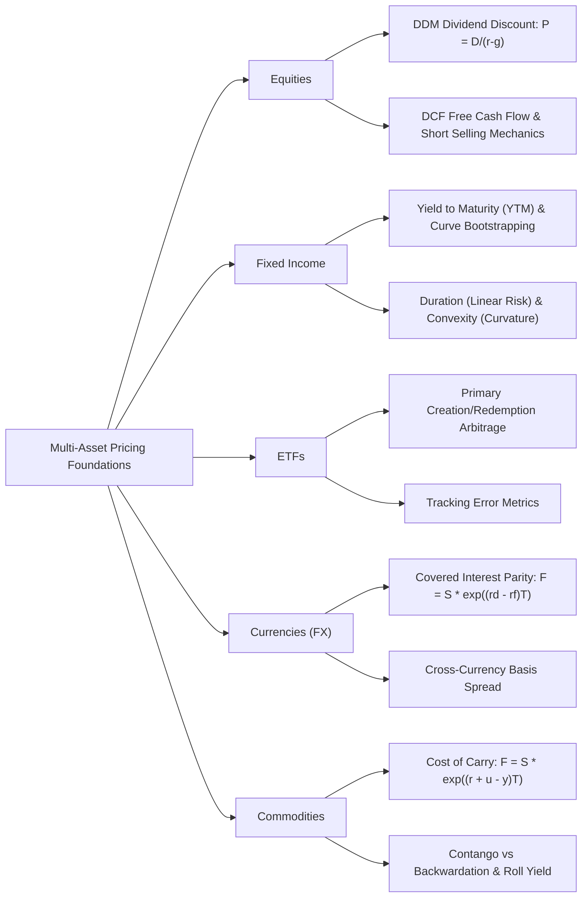
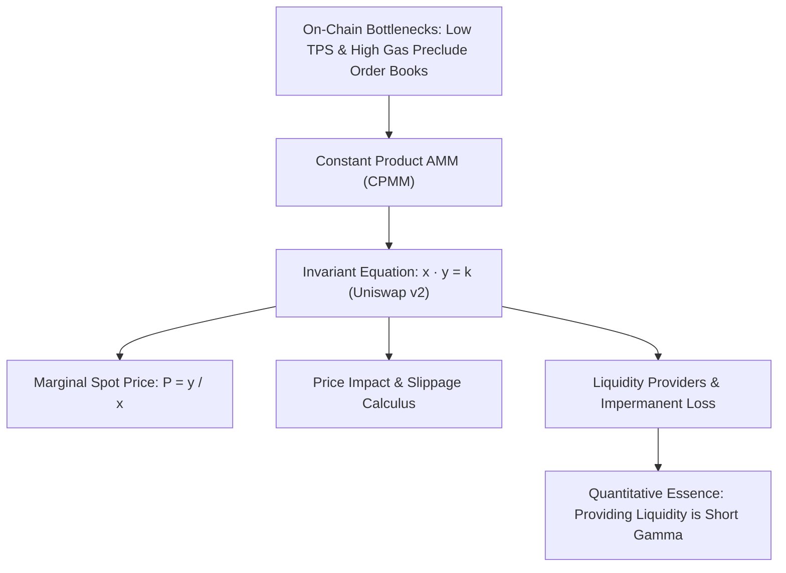

```mermaid
graph TD
    A["Quantitative Finance Architecture"] --> B["Microstructure & Execution<br>(LOB, Impact, Market Making)"]
    A --> C["Asset Classes Fundamentals<br>(Equities, Rates, ETFs, FX, Commodities)"]
    A --> D["DeFi & AMM Microstructure<br>(CPMM, Impermanent Loss, Short Gamma)"]
    A --> E["Derivatives Masterclass<br>(Forwards, Swaps, BSM, Greeks, Vol Surface)"]
    A --> F["Portfolio Theory & Allocation<br>(Mean-Variance, CAPM, Multi-Factor, Risk Parity)"]
    
    B --> B1["L1/L2/L3 Order Books & Micro-Price"]
    B --> B2["Almgren-Chriss Optimal Execution"]
    B --> B3["Avellaneda-Stoikov Market Making"]
    
    C --> C1["Cash Flow Discounting (DCF, DDM) & Short Selling"]
    C --> C2["Duration & Convexity"]
    C --> C3["ETF Primary Creation/Redemption Arbitrage"]
    C --> C4["Interest Rate Parities (CIP/UIP) & Commodities Contango"]
    
    D --> D1["Constant Product Formula: x · y = k"]
    D --> D2["Impermanent Loss Proof: IL(k) ≤ 0"]
    
    E --> E1["Cost of Carry & Futures Convexity"]
    E --> E2["BSM PDE Derivation & Martingale Pricing"]
    E --> E3["Greeks & Gamma Scalping PnL"]
    E --> E4["Volatility Skew & Local/Stochastic Vol"]
    
    F --> F1["Markowitz Frontier Matrix Derivation"]
    F --> F2["CAPM & Security Market Line (SML)"]
    F --> F3["Barra Structural Factor Risk Models"]
    F --> F4["Risk Parity (Equal Risk Contribution)"]
```

# Quant 14 · Financial Markets Microstructure, Asset Classes, Derivatives Masterclass & Modern Portfolio Theory

In Quantitative Research (QR) and Quantitative Trading (QT) interviews at premier Wall Street hedge funds and proprietary trading firms (e.g., Jane Street, Citadel, Millennium, Two Sigma, Optiver, IMC, SIG, Jump Trading), **financial market microstructure, multi-asset pricing, derivatives mathematical modeling, and modern portfolio theory** form the foundational technical pillar. Whether analyzing millisecond-level order book dynamics as a market maker, building statistical arbitrage or multi-factor equity portfolios, or actively hedging Greeks and volatility surfaces on an options desk, mastery of these interconnected domains is mandatory.

This tutorial provides a **rigorous, textbook-depth exposition** with complete first-principles mathematical derivations, intuitive economic models, production-grade Python implementations, and high-frequency Wall Street interview question breakdowns. It spans market microstructure, core asset classes (Equities, Fixed Income, ETFs, FX, Commodities), decentralized finance (AMM and Impermanent Loss), linear and non-linear derivatives, Black-Scholes-Merton PDE derivations, the complete Greeks framework, volatility surfaces, and modern portfolio theory (Markowitz MVO, CAPM, Barra risk models, and Risk Parity).

```text
Core Analytical Framework for Financial Markets, Derivatives & Portfolios:
1. Microstructure & Order Books: Prices are not continuous geometric paths, but discrete queues in a Limit Order Book (LOB). The Micro-price adjusts the mid-price based on Order Book Imbalance (OBI). The market maker's core challenge is balancing adverse selection against inventory risk (Avellaneda-Stoikov).
2. Fixed Income & Discounting: All asset pricing is fundamentally the discounted expectation of future cash flows under a risk-neutral measure. Macaulay duration measures effective maturity (first-order rate sensitivity), while convexity provides second-order curvature protection; curve bootstrapping is the no-arbitrage foundation of zero-coupon spot rate extraction.
3. Derivatives & No-Arbitrage Pricing: The purpose of derivatives pricing is never to forecast future direction, but to construct a replicating portfolio. Forwards and futures lock in the cash-and-carry basis; options eliminate underlying asset stochasticity through dynamic Delta hedging, yielding the BSM PDE and martingale expectations.
4. Greeks & Energy Conservation: Long Gamma provides convexity windfalls during large swings, but demands payment in Theta (time decay). The BSM PDE reveals the structural trade-off between Gamma and Theta. Hedging does not eliminate risk; it converts directional risk (Delta) into volatility risk (Vega) and curvature risk (Gamma).
5. Modern Portfolio Theory: Diversification is the only "free lunch" in finance. Markowitz mean-variance optimization produces the efficient frontier but acts as an error maximizer in practice; Risk Parity discards return forecasts to equalize Marginal Risk Contributions (MRC), forming the foundation of All-Weather macro allocation.
```

---



---

## Module 1: Financial Markets Architecture & Market Microstructure

### 1. Exchange Mechanisms & Continuous Double Auction (CDA)

Modern electronic exchanges (e.g., CME, NASDAQ, NYSE, Binance) operate via a **Continuous Double Auction (CDA)** powered by a **Limit Order Book (LOB)**.

```
          Asks / Offers
 Level 3: $100.03  |  15,000 shares
 Level 2: $100.02  |   8,200 shares
 Level 1: $100.01  |   3,500 shares  <--- Best Ask / Offer
------------------------------------ Bid-Ask Spread = $0.02
 Level 1: $99.99   |   4,100 shares  <--- Best Bid
 Level 2: $99.98   |   9,600 shares
 Level 3: $99.97   |  22,000 shares
          Bids
```

#### Order Types & Matching Priorities
- **Limit Order (LO)**: Specifies price and quantity, providing liquidity as a market maker (Maker). Carries execution uncertainty and adverse selection risk.
- **Market Order (MO)**: Executes immediately against resting liquidity at the current best available price (Taker). Guarantees immediate execution but crosses the spread and incurs market impact.
- **Pegged Orders**: Dynamically adjust their limit price relative to the primary quote (e.g., midpoint peg, market peg), widely used in dark pools and algorithmic execution.
- **Iceberg Orders**: Disclose only a fraction of their total size (Display Size) to the public book while keeping the remainder hidden, preventing adverse price discovery.
- **Matching Priority Rules**:
  - **Price Priority**: Highest bid executes before lower bids; lowest ask executes before higher asks.
  - **Time Priority (FIFO)**: At identical price levels, orders that arrived earlier execute first.
  - **Pro-Rata Allocation**: Common in short-term interest rate futures (e.g., CME SOFR futures), where executed volume is divided proportionally to resting order sizes at that price level.

---

### 2. Order Book Metrics & Micro-Price

#### (1) Bid-Ask Spread & Mid-Price
Let the best bid be $P_b$, best ask be $P_a$, and top-of-book quantities be $Q_b, Q_a$:

$$
S = P_a - P_b, \quad P_{\text{mid}} = \frac{P_a + P_b}{2}
$$

The simple mid-price ignores queue depth asymmetry. If the bid queue has 10,000 shares and the ask queue has only 100 shares, the probability of the next trade printing higher is substantially greater.

#### (2) Order Book Imbalance (OBI) & Micro-Price
Define the Level-1 Order Book Imbalance:

$$
I = \frac{Q_b - Q_a}{Q_b + Q_a} \in [-1, 1]
$$

The **Micro-Price** weights prices inversely by opposing book depth to correct for queue asymmetry:

$$
P_{\text{micro}} = \frac{Q_b P_a + Q_a P_b}{Q_b + Q_a} = P_b + \frac{Q_b}{Q_b + Q_a}(P_a - P_b) = P_{\text{mid}} + \frac{1}{2} I \cdot S
$$

In high-frequency trading, $P_{\text{micro}}$ is significantly more predictive of short-horizon price drifts than $P_{\text{mid}}$.

#### (3) Order Flow Toxicity: VPIN
When informed traders enter the market, they aggressively absorb one-sided liquidity. Easley, López de Prado, and O'Hara introduced **VPIN (Volume-Synchronized Probability of Toxicity)**, which slices trade flow into equal-volume buckets and measures buy/sell volume imbalances:

$$
\text{VPIN} = \frac{\sum_{\tau=1}^N |V_\tau^B - V_\tau^S|}{N \cdot V}
$$

where $V$ is bucket size and $V_\tau^B, V_\tau^S$ are estimated using Bulk Volume Classification (BVC). Sudden spikes in VPIN precede severe toxicity and liquidity dry-ups (e.g., the 2010 Flash Crash).

---

### 3. Market Impact & Optimal Execution (Almgren-Chriss Framework)

Executing large parent orders directly in the market creates prohibitive slippage. Optimal execution models slice parent orders into child orders over time.

#### (1) Impact Taxonomy
- **Temporary Impact**: Transient price displacement caused by clearing immediate liquidity at shallow levels, which decays as liquidity providers refill the book.
- **Permanent Impact**: Information leakage revealed by informed trading volume, causing a permanent shift in market consensus. In Kyle's (1985) model, permanent impact is linear in volume:

$$
\Delta P_{\text{perm}} = \lambda \cdot Q
$$

where $\lambda$ is **Kyle's Lambda** (illiquidity parameter).

#### (2) Almgren-Chriss (2000) Model
A trader must liquidate an initial inventory $X_0$ over time $[0, T]$ divided into $N$ intervals $t_k = k \tau$. The trajectory is $x_k$ (shares remaining), with trading rate $v_k = (x_{k-1} - x_k)/\tau$.

The price evolves as:

$$
S_k = S_{k-1} + \sigma \tau^{1/2} \xi_k - \tau \gamma(v_k)
$$

The objective minimizes the **expected transaction costs plus risk aversion $\lambda_{\text{risk}}$ times execution variance**:

$$
\min_{\{x_k\}} \mathbb{E}[x_{\text{cost}}] + \lambda_{\text{risk}} \operatorname{Var}(x_{\text{cost}})
$$

Under linear permanent impact $\gamma(v) = \gamma v$ and linear temporary impact $\eta(v) = \eta v$, calculus of variations yields the hyperbolic sine liquidation trajectory:

$$
x_j = \frac{\sinh(\kappa (T - t_j))}{\sinh(\kappa T)} X_0, \quad \kappa \approx \sqrt{\frac{\lambda_{\text{risk}} \sigma^2}{\eta}}
$$

- As $\lambda_{\text{risk}} \to 0$, $\kappa \to 0$, $x_j$ becomes linear in time, yielding standard **TWAP (Time-Weighted Average Price)**.
- For high risk aversion $\lambda_{\text{risk}}$, the schedule is heavily front-loaded to eliminate price volatility risk early.

---

### 4. Market Making & Inventory Risk (Avellaneda-Stoikov Model)

Market makers quote two-sided quotes to capture the bid-ask spread, facing two primary risks:
1. **Adverse Selection Risk**: Buying before prices drop, selling before prices surge;
2. **Inventory Risk**: Accumulating unbalanced positions and suffering market volatility.

Avellaneda and Stoikov (2008) solved this in continuous time. Assuming $dS_t = \sigma dW_t$ and inventory $q$, the market maker's **Reservation Price (Indifference Price)** is:

$$
r(s, q, t) = s - q \gamma \sigma^2 (T - t)
$$

where $\gamma$ is risk aversion and $T - t$ is remaining trading horizon.
- When $q > 0$ (long inventory), $r < s$. The market maker lowers their valuation, skewing quotes downwards (closer to the ask to get hit and sell, further from the bid to avoid buying more).
- Optimal spreads $\delta_a^*, \delta_b^*$ center around the reservation price $r(s, q, t)$, creating an automatic mean-reverting inventory mechanism.

---

## Module 2: Multi-Asset Classes & Pricing Fundamentals



### 1. Equities Valuation & Corporate Capital Structure

#### (1) Long vs. Short Selling Mechanics
- **Long Position**: Purchasing shares with equity or margin, enjoying dividends and upside capital appreciation with maximum downside loss capped at 100%.
- **Short Selling Workflow**:
  1. **Borrowing**: Borrowing shares from a prime broker or securities lending desk and selling them immediately in the spot market;
  2. **Covering**: Repurchasing shares in the open market at a future date to return them to the lender;
  3. **PnL Profile**: $\text{PnL} = S_{\text{entry}} - S_{\text{exit}} - \text{Borrow Fee}$.
- **Short Selling Core Risks**:
  - **Asymmetric Downside**: Stock price has no theoretical upper bound, creating infinite loss exposure;
  - **Cost of Borrow / Rebate Rate**: High-demand short targets become Hard-to-Borrow (HTB), with annualized borrow fees reaching double digits;
  - **Recall Risk**: Lenders retain the right to recall shares at any time, triggering forced liquidation if replacement shares cannot be located;
  - **Short Squeeze**: Rapidly rising prices force shorts into margin calls, causing cascading buy stops that drive prices exponentially higher.

#### (2) Dividend Discount Model (DDM)
The Gordon Growth Model assumes dividends grow indefinitely at rate $g$, discounted at cost of equity $r_e$:

$$
P_0 = \sum_{t=1}^\infty \frac{D_0 (1+g)^t}{(1+r_e)^t} = \frac{D_1}{r_e - g} \quad (r_e > g)
$$

#### (3) Discounted Cash Flow (DCF) & WACC
Firm Enterprise Value (EV) equals Free Cash Flow to Firm (FCFF) discounted at the Weighted Average Cost of Capital (WACC):

$$
\text{EV} = \sum_{t=1}^T \frac{\text{FCFF}_t}{(1 + \text{WACC})^t} + \frac{\text{Terminal Value}}{(1 + \text{WACC})^T}
$$

$$
\text{WACC} = \frac{E}{E+D} r_e + \frac{D}{E+D} r_d (1 - \tau_c)
$$

#### (4) Ex-Dividend Price Mechanics
On the ex-dividend date, the exchange automatically adjusts the opening reference price downwards by cash dividend $D$:

$$
S_{\text{ex}} = S_{\text{cum}} - D
$$

This price jump impacts option parity and creates critical early-exercise boundary conditions for American options.

---

### 2. Fixed Income, Bond Pricing & Interest Rate Curves

#### (1) Yield to Maturity (YTM)
For a coupon bond with par value $M$, annual coupon $C$, and maturity $T$, the price $P$ and YTM $y$ satisfy:

$$
P = \sum_{t=1}^T \frac{C}{(1+y)^t} + \frac{M}{(1+y)^T}
$$

#### (2) Bootstrapping the Zero-Coupon Yield Curve
Par bonds provide only discrete benchmark yields. Bootstrapping recursively extracts continuous zero-coupon spot rates $r(t)$ and discount factors $Z(t) = e^{-r(t) t}$:

$$
P_k = \sum_{i=1}^{k-1} C_k Z(t_i) + (C_k + M) Z(t_k) \implies Z(t_k) = \frac{P_k - \sum_{i=1}^{k-1} C_k Z(t_i)}{C_k + M}
$$

From which continuous spot rates follow: $r(t_k) = -\frac{\ln Z(t_k)}{t_k}$.

#### (3) The Trinity of Interest Rate Risk: Macaulay Duration, Modified Duration & Convexity
- **Macaulay Duration ($D_{\text{mac}}$)**: The cash-flow-weighted average maturity:

$$
D_{\text{mac}} = \frac{\sum_{t=1}^T t \cdot \frac{C_t}{(1+y)^t}}{P}
$$

- **Modified Duration ($D_{\text{mod}}$)**: First-order percentage price sensitivity to yield:

$$
D_{\text{mod}} = \frac{D_{\text{mac}}}{1+y} = - \frac{1}{P} \frac{dP}{dy} \implies \frac{dP}{P} \approx - D_{\text{mod}} \cdot dy
$$

- **DV01 / PV01 (Dollar Value of a Basis Point)**: Absolute dollar price change for a 1 bp ($0.0001$) yield shift:

$$
\text{DV01} = - \frac{dP}{10000 \cdot dy} = P \cdot D_{\text{mod}} \cdot 0.0001
$$

- **Convexity ($C$)**: Second-order curvature metric:

$$
C = \frac{1}{P} \frac{d^2 P}{dy^2} = \frac{\sum_{t=1}^T t(t+1) \frac{C_t}{(1+y)^{t+2}}}{P}
$$

- **Second-Order Taylor Approximation**:

$$
\frac{\Delta P}{P} \approx - D_{\text{mod}} \Delta y + \frac{1}{2} C (\Delta y)^2
$$

> **Quant Interview Axiom**: For standard option-free bonds, convexity is strictly positive ($C > 0$). Hence, the second-order term $\frac{1}{2} C (\Delta y)^2$ is **always positive regardless of whether yields rise or fall**. When yields drop, bond prices rise by more than linear duration predicts; when yields spike, bond prices fall by less. Bonds with higher convexity command a pricing premium (trade at lower yields).

---

### 3. ETFs & Index Funds (Exchange-Traded Funds)

#### (1) Primary Creation/Redemption & Arbitrage Mechanism
Unlike mutual funds which settle cash at daily NAV, ETFs maintain continuous secondary market liquidity with minimal price deviation via **Authorized Participants (APs)**:

```mermaid
sequenceDiagram
    participant Secondary as Secondary Market Traders
    participant AP as Authorized Participant (AP / Market Maker)
    participant Issuer as ETF Issuer (e.g., BlackRock)
    
    Note over Secondary,AP: Premium Scenario (Market Price > NAV)
    AP->>Secondary: Buy constituent basket of stocks in cash market
    AP->>Issuer: Deliver stock basket to Issuer (Creation)
    Issuer-->>AP: Issue equivalent new ETF shares
    AP->>Secondary: Sell ETF shares at market premium
    Note over AP: Arbitrage closed; ETF premium collapses to NAV
```

- **Premium Arbitrage ($P_{\text{ETF}} > \text{NAV}$)**: AP buys the underlying stock basket, delivers it to the issuer to create ETF units, and sells ETF shares at the premium in the secondary market.
- **Discount Arbitrage ($P_{\text{ETF}} < \text{NAV}$)**: AP buys undervalued ETF shares in the market, redeems them with the issuer for the underlying basket, and sells the shares in the cash market.

#### (2) Tracking Error (TE)
Standard deviation of excess returns relative to the underlying benchmark index:

$$
\text{TE} = \sqrt{\frac{1}{T-1} \sum_{t=1}^T (R_{\text{ETF}, t} - R_{\text{Index}, t} - \overline{\Delta R})^2}
$$

---

### 4. Currencies & International Parity Conditions (FX)

#### (1) Covered Interest Parity (CIP)
Let domestic rate be $r_d$, foreign rate be $r_f$, spot FX be $S$, and forward FX be $F$ (domestic currency per 1 unit of foreign currency). No-arbitrage replication requires:

$$
F = S \cdot e^{(r_d - r_f)T}
$$

If $r_d > r_f$, the foreign currency trades at a forward premium ($F > S$) to neutralize the interest rate differential.

#### (2) Uncovered Interest Parity (UIP) & FX Carry Trade
UIP posits $\mathbb{E}[S_T] = F$. However, the empirical **Forward Premium Puzzle** shows that high-yield currencies systematically fail to depreciate as theory predicts, driven by persistent capital flows chasing yield. Quant funds exploit this via the **FX Carry Trade** (borrowing low-yield JPY/CHF, investing in high-yield AUD/EM currencies).

---

### 5. Commodities: Cost of Carry, Contango & Backwardation

#### (1) Cost-of-Carry Model
For storable commodities (crude oil, metals, grains), physical storage costs/insurance $u$ and **convenience yield $y$** govern futures pricing:

$$
F(t, T) = S_t e^{(r + u - y)(T - t)}
$$

- **Convenience Yield ($y$)**: The implicit embedded option value of physically holding inventory to avoid production disruptions or capture local market squeezes.

#### (2) Term Structure Regimes
- **Contango**: Far-dated futures price higher than near-dated futures ($F_2 > F_1 > S$). Occurs during physical inventory gluts and high storage costs ($r + u > y$). Long futures positions suffer negative roll yields during rollover.
- **Backwardation**: Near-dated futures price higher than far-dated contracts ($S > F_1 > F_2$). Occurs during severe spot supply shortages ($y \gg r + u$). Long positions capture positive roll yields.

---

## Module 3: Decentralized Finance & Automated Market Makers (DeFi & AMM)

On blockchain rails, high transaction latency and gas fees impede central limit order books (CLOB), fostering the rise of **Automated Market Makers (AMM)**.



### 1. Constant Product Market Maker (CPMM, Uniswap v2)

Let the liquidity pool hold $x$ units of token $X$ and $y$ units of token $Y$. The pool preserves the invariant:

$$
x \cdot y = k
$$

#### (1) Marginal Spot Price
Differentiating the invariant:

$$
y dx + x dy = 0 \implies - \frac{dy}{dx} = \frac{y}{x}
$$

Thus the spot price of token $X$ in terms of token $Y$ is:

$$
P = \frac{y}{x}
$$

#### (2) Slippage & Price Impact
A trader deposits $\Delta x$ units of token $X$ to receive $\Delta y$ units of token $Y$:

$$
(x + \Delta x)(y - \Delta y) = k = x y \implies \Delta y = \frac{y \cdot \Delta x}{x + \Delta x}
$$

The execution price is:

$$
P_{\text{exec}} = \frac{\Delta y}{\Delta x} = \frac{y}{x + \Delta x} = \frac{P_{\text{spot}}}{1 + \frac{\Delta x}{x}}
$$

Large trades generate steep price impact, creating automatic stabilizing feedback.

---

### 2. Impermanent Loss (IL) First-Principles Proof

Liquidity providers deposit paired assets to earn swap fees, but suffer Impermanent Loss when relative prices diverge.

#### (1) Mathematical Derivation
1. **Initial State**: $x_0$ of token $X$ and $y_0$ of token $Y$, with spot price $P_0 = y_0 / x_0$. Total LP value in units of $Y$:
   $$V_0 = x_0 P_0 + y_0 = 2 y_0$$
2. **External Price Shift**: External arbitrage shifts the price to $P_1 = k P_0$ ($k > 0$):
   $$\frac{y_1}{x_1} = P_1 = k \frac{y_0}{x_0}, \quad x_1 y_1 = x_0 y_0$$
3. **Solving New Token Reserves**:
   $$x_1 = \frac{x_0}{\sqrt{k}}, \quad y_1 = y_0 \sqrt{k}$$
4. **Portfolio Value Comparison**:
   - **LP Portfolio Value**: $V_{\text{LP}} = x_1 P_1 + y_1 = 2 y_0 \sqrt{k}$
   - **HODL Portfolio Value**: $V_{\text{HODL}} = x_0 P_1 + y_0 = y_0 (1 + k)$
5. **Impermanent Loss Ratio**:

$$
\text{IL}(k) = \frac{V_{\text{LP}}}{V_{\text{HODL}}} - 1 = \frac{2 \sqrt{k}}{1 + k} - 1 = - \frac{(\sqrt{k} - 1)^2}{1 + k}
$$

#### (2) AM-GM Inequality & Short Gamma Essence
By the Arithmetic-Geometric Mean inequality, $\frac{1+k}{2} \ge \sqrt{k}$, with equality if and only if $k = 1$. Hence:

$$
\text{IL}(k) \le 0 \quad \forall k > 0
$$

> **Financial Engineering Insight**: Providing liquidity in an AMM pool is economically identical to **selling a straddle (Short Gamma)**. The LP earns fee income (Theta) every day, but incurs negative convexity losses (Gamma risk) whenever prices move in either direction. The strategy is profitable only if realized volatility is lower than the implied volatility implied by fee yields.

---

## Module 4: Derivatives Masterclass & Mathematical Pricing

Derivatives represent the mathematical centerpiece of quantitative finance. Here we develop full first-principles derivations for forwards, swaps, options, the Black-Scholes-Merton PDE, Greeks, and volatility surfaces.

---

### 1. Forwards & Futures: Mechanics & Convexity Bias

```
+-------------------+-----------------------------------+-----------------------------------+
| Feature           | Forward Contract                  | Futures Contract                  |
+-------------------+-----------------------------------+-----------------------------------+
| Trading Venue     | OTC Bilateral (Non-standardized)  | Central Exchange (CME, etc.)      |
| Credit Risk       | Counterparty default risk         | Clearinghouse guaranteed          |
| Settlement        | Single cash flow at maturity      | Daily Mark-to-Market (MTM) margin |
| Liquidity         | Illiquid, custom terms            | Hyper-liquid, standardized        |
+-------------------+-----------------------------------+-----------------------------------+
```

#### (1) No-Arbitrage Pricing Derivation
Let spot price be $S_0$, risk-free rate be $r$, and continuous dividend/convenience yield be $q$.
Construct two portfolios:
- **Portfolio A**: Long 1 forward contract maturing at $T$ with delivery price $K$, plus cash $K e^{-rT}$.
- **Portfolio B**: Long $e^{-qT}$ shares of the underlying asset, with all dividends reinvested.
At maturity $T$, Portfolio A is worth $(S_T - K) + K = S_T$. Portfolio B is worth $e^{-qT} \cdot S_T \cdot e^{qT} = S_T$.
Since their terminal payoffs are identical under all states of the world, no-arbitrage demands their initial costs be equal:

$$
F_0 = S_0 e^{(r - q)T}
$$

#### (2) Futures vs. Forward Convexity Bias
When interest rates are constant, futures and forward prices are identical. However, when **interest rates $r$ are stochastic**:
- If asset price $S$ and interest rates $r$ are **positively correlated**: As $S$ rises, futures longs receive daily variation margin gains that can be reinvested at higher interest rates. When $S$ drops, margin calls are financed at lower rates. Hence, futures are strictly preferred over forwards: **$\text{Futures Price} > \text{Forward Price}$**.
- Conversely, negative correlation implies forwards trade above futures.

---

### 2. Swaps & Credit Derivatives

#### (1) Vanilla Interest Rate Swap (IRS)
Two parties exchange cash flows on notional $N$. One party pays fixed rate $R_{\text{swap}}$, the other pays floating benchmark (e.g., SOFR).

```
   Fixed Payer  ------ Fixed Rate R_swap ------>  Floating Payer
                <----- Floating Rate SOFR ------- 
```

**Swap Rate Exact Derivation**:
At inception, the swap's net present value must equal zero ($V_{\text{IRS}} = 0$).
Because a floating-rate note resets to par (1.0) on every coupon date, the floating leg's value at $t=0$ simplifies to:

$$
V_{\text{floating}} = 1 - P(0, t_n)
$$

where $P(0, t_i)$ is the discount factor for date $t_i$.
The fixed leg pays $R_{\text{swap}} \tau_i$ at each coupon date:

$$
V_{\text{fixed}} = \sum_{i=1}^n R_{\text{swap}} \cdot \tau_i \cdot P(0, t_i) = R_{\text{swap}} \sum_{i=1}^n \tau_i P(0, t_i)
$$

Setting $V_{\text{floating}} = V_{\text{fixed}}$ yields the par swap rate:

$$
R_{\text{swap}} = \frac{1 - P(0, t_n)}{\sum_{i=1}^n \tau_i P(0, t_i)}
$$

The swap rate is fundamentally a **discount-factor-weighted average of future forward rates**.

#### (2) Credit Default Swap (CDS)
A CDS protects against default by a reference entity. The protection buyer pays annual spread $s$; the protection seller pays $(1 - R)$ (loss given default) upon a credit event.
Under a constant hazard rate $\lambda$, survival probability is $e^{-\lambda t}$. To first-order approximation:

$$
s \approx (1 - R) \lambda
$$

---

### 3. Options Fundamentals & No-Arbitrage Bounds

#### (1) Intrinsic Value vs. Time Value
For European call $C_T = \max(S_T - K, 0)$ and put $P_T = \max(K - S_T, 0)$:

$$
V = \text{Intrinsic Value} + \text{Time Value (Extrinsic Value)}
$$

where Call intrinsic value is $\max(S - K, 0)$. Time value represents the expected convexity windfall from future volatility before expiration.

#### (2) Put-Call Parity Proof & Arbitrage Strategies
For European options with strike $K$ and maturity $T$:

$$
C_t - P_t = S_t e^{-q(T-t)} - K e^{-r(T-t)}
$$

```
Proof (for q = 0):
Portfolio A: Long 1 European Call C + Cash K * exp(-r(T-t))
Portfolio B: Long 1 European Put P + Long 1 share of stock S

At expiration T:
State 1 (S_T >= K):
- Portfolio A: (S_T - K) + K = S_T
- Portfolio B: 0 + S_T = S_T
State 2 (S_T < K):
- Portfolio A: 0 + K = K
- Portfolio B: (K - S_T) + S_T = K

Both portfolios yield identical payoffs across all possible outcomes.
By the Law of One Price: C_t + K e^{-r(T-t)} = P_t + S_t  ==>  C_t - P_t = S_t - K e^{-r(T-t)}. Q.E.D.
```

- If $C - P > S - K e^{-rT}$ (Call overpriced): **Reversal Arbitrage** (Short Call, Long Put, Long Stock, Borrow cash).
- If $C - P < S - K e^{-rT}$ (Put overpriced): **Conversion Arbitrage** (Long Call, Short Put, Short Stock, Lend cash).

#### (3) American Option Early Exercise Boundaries
- **No-Dividend American Call Theorem**: On a non-dividend-paying stock, **an American call should never be exercised early** ($C_{\text{American}} \equiv C_{\text{European}}$).
  - *Proof*: By Put-Call parity and $P \ge 0$, $C \ge S - K e^{-r(T-t)} > S - K$ whenever $r > 0$. Exercising early yields only $S - K$. Selling the option in the market captures $C > S - K$. Furthermore, exercising surrenders cash $K$ early, forfeiting interest. Thus, early exercise is strictly suboptimal.
- **American Put Option**: When the stock falls below a critical early-exercise boundary $S^*(t) \le K$ (in the limit $S \to 0$), the holder **must exercise immediately** to collect $K$ and earn risk-free interest, rather than waiting for expiration and suffering the time value of money.

---

### 4. Black-Scholes-Merton (BSM) Framework: Full Derivation & Intuition

#### (1) Geometric Brownian Motion (GBM) Setup
Under the physical measure $\mathbb{P}$:

$$
\frac{dS_t}{S_t} = \mu dt + \sigma dW_t
$$

where $\mu$ is drift, $\sigma$ is constant volatility, and $W_t$ is a standard Brownian motion.

#### (2) First-Principles BSM PDE Derivation
Let derivative value be $V(S, t)$. Expanding via Itô's Lemma:

$$
dV = \left( \frac{\partial V}{\partial t} + \mu S \frac{\partial V}{\partial S} + \frac{1}{2} \sigma^2 S^2 \frac{\partial^2 V}{\partial S^2} \right) dt + \sigma S \frac{\partial V}{\partial S} dW_t
$$

Construct a delta-hedged portfolio $\Pi$: Short 1 option and Long $\Delta$ shares of stock:

$$
\Pi = - V + \Delta \cdot S
$$

The instantaneous change over $dt$ is:

$$
d\Pi = - dV + \Delta dS = \left( - \frac{\partial V}{\partial t} - \frac{1}{2} \sigma^2 S^2 \frac{\partial^2 V}{\partial S^2} + (\Delta - \frac{\partial V}{\partial S}) \mu S \right) dt + \left( \Delta - \frac{\partial V}{\partial S} \right) \sigma S dW_t
$$

**Eliminating Stochasticity**: Choose the hedge ratio $\Delta = \frac{\partial V}{\partial S}$. The $dW_t$ term vanishes completely:

$$
d\Pi = \left( - \frac{\partial V}{\partial t} - \frac{1}{2} \sigma^2 S^2 \frac{\partial^2 V}{\partial S^2} \right) dt
$$

Since the portfolio $\Pi$ is now riskless, absence of arbitrage dictates it must earn the risk-free rate $r$:

$$
d\Pi = r \Pi dt = r \left( -V + S \frac{\partial V}{\partial S} \right) dt
$$

Equating the two expressions for $d\Pi$ and rearranging yields the **Black-Scholes-Merton PDE**:

$$
\frac{\partial V}{\partial t} + r S \frac{\partial V}{\partial S} + \frac{1}{2} \sigma^2 S^2 \frac{\partial^2 V}{\partial S^2} - r V = 0
$$

> **Profound Economic Insight**: The physical drift $\mu$ **completely disappears from the equation**. Whether an investor is extremely bullish or bearish on the stock, the theoretical option price is identical because directional drift is eliminated by continuous Delta hedging.

#### (3) Risk-Neutral Measure & Martingale Closed-Form Solution
By Girsanov's theorem, under equivalent martingale measure $\mathbb{Q}$, discounted price $e^{-rt} S_t$ is a martingale:

$$
S_T = S_0 \exp\left( (r - \frac{1}{2}\sigma^2)T + \sigma \sqrt{T} Z \right), \quad Z \sim \mathcal{N}(0, 1)
$$

The call value is the discounted expected payoff under $\mathbb{Q}$:

$$
C_0 = e^{-rT} \mathbb{E}^{\mathbb{Q}}[(S_T - K)^+] = S \mathcal{N}(d_1) - K e^{-rT} \mathcal{N}(d_2)
$$

$$
P_0 = K e^{-rT} \mathcal{N}(-d_2) - S \mathcal{N}(-d_1)
$$

where:

$$
d_1 = \frac{\ln(S/K) + (r + \frac{1}{2}\sigma^2)T}{\sigma \sqrt{T}}, \quad d_2 = d_1 - \sigma \sqrt{T} = \frac{\ln(S/K) + (r - \frac{1}{2}\sigma^2)T}{\sigma \sqrt{T}}
$$

#### (4) Deep Intuition of $d_1$ and $d_2$
- **$\mathcal{N}(d_2)$**: The **risk-neutral probability of exercise**!
  $$\mathbb{Q}(S_T > K) = \mathcal{N}(d_2)$$
  Hence, $K e^{-rT} \mathcal{N}(d_2)$ is the present value of the expected strike payment.
- **$\mathcal{N}(d_1)$**: The **replication Delta $\Delta$**!
  It also represents the probability of exercise under the stock numeraire measure:
  $$\mathcal{N}(d_1) = \frac{\mathbb{E}^{\mathbb{Q}}[S_T \cdot \mathbf{1}_{\{S_T \ge K\}}]}{S_0 e^{rT}}$$
  Hence, $S \mathcal{N}(d_1)$ is the present value of the underlying asset received conditional upon exercise.

---

### 5. The Greeks & Dynamic Risk Management

```
Taylor Expansion of Option Price Changes:
dV ≈ Delta * dS + (1/2) * Gamma * (dS)^2 + Theta * dt + Vega * dσ + Rho * dr
```

| Greek | Formula (Call) | Economic Role |
| :--- | :--- | :--- |
| **Delta** ($\Delta$) | $\mathcal{N}(d_1) \in [0, 1]$ | Directional sensitivity; stock hedge ratio |
| **Gamma** ($\Gamma$) | $\frac{n(d_1)}{S \sigma \sqrt{T}} > 0$ | Convexity risk; rate of change of Delta; peaks at ATM |
| **Theta** ($\Theta$) | $-\frac{S n(d_1)\sigma}{2\sqrt{T}} - r K e^{-rT}\mathcal{N}(d_2)$ | Time decay per day (typically negative) |
| **Vega** ($\nu$) | $S \sqrt{T} n(d_1) > 0$ | Sensitivity to volatility; identical for Call and Put |
| **Rho** ($\rho$) | $K T e^{-rT} \mathcal{N}(d_2) > 0$ | Sensitivity to risk-free interest rates |

#### (1) Gamma-Theta Trade-off (Energy Conservation)
Substituting the Greeks into the BSM PDE:

$$
\Theta + \frac{1}{2} \sigma^2 S^2 \Gamma = r (V - S \Delta) = r \Pi
$$

When $r \approx 0$:

$$
\Theta \approx - \frac{1}{2} \sigma^2 S^2 \Gamma
$$

> **Trading Insight**: Long Gamma ($\Gamma > 0$) provides quadratic profit on big moves, but bleeding Theta ($\Theta < 0$) is the daily rent paid to maintain that convexity. There is no free lunch in convexity!

#### (2) Gamma Scalping PnL
For a Delta-hedged option portfolio rebalanced at interval $\Delta t$:

$$
d\Pi \approx \frac{1}{2} S^2 \Gamma \left( \sigma_{\text{realized}}^2 - \sigma_{\text{implied}}^2 \right) dt
$$

If realized volatility exceeds implied volatility paid ($\sigma_{\text{realized}} > \sigma_{\text{implied}}$), dynamic scalping generates systematic positive alpha.

#### (3) Higher-Order Greeks
- **Vanna** ($\frac{\partial \Delta}{\partial \sigma} = \frac{\partial \nu}{\partial S}$): Sensitivity of Delta to volatility changes.
- **Volga / Vomma** ($\frac{\partial \nu}{\partial \sigma} = \frac{\partial^2 V}{\partial \sigma^2}$): Convexity of Vega with respect to volatility.
- **Charm** ($\frac{\partial \Delta}{\partial t}$): Delta decay over time (critical for overnight risk budgeting).

---

### 6. Volatility Surfaces, Smiles & Skews

Real market implied volatilities violate the constant $\sigma$ assumption.

```
       Implied Volatility (IV)
           |        Equity Skew (Crashophobia)         FX Smile (Fat Tails)
           |             \                                \     /
           |              \                                \   /
           |               \____                            \_/
           +-------------------------> Strike K         --------------> Strike K
                         Deep OTM Put                                ATM
```

#### (1) Skew vs. Smile Mechanics
- **FX Volatility Smile**: Heavy demand for deep OTM puts and calls creates a symmetric smile, reflecting two-sided kurtosis (fat tails).
- **Equity Volatility Skew**: Driven by the **Leverage Effect** (falling stock prices increase debt/equity ratio, raising financial risk and volatility) and **Crashophobia** (institutional equity holders systematically overpaying for deep OTM protective puts).

#### (2) Beyond BSM Models
- **Dupire Local Volatility (1994)**: Discovers state-dependent $\sigma_{\text{local}}(S, t)$ analytically from the market option price surface:

$$
\sigma_{\text{local}}^2(K, T) = \frac{\frac{\partial C}{\partial T} + q C + (r - q) K \frac{\partial C}{\partial K}}{\frac{1}{2} K^2 \frac{\partial^2 C}{\partial K^2}}
$$

- **Heston Stochastic Volatility (1993)**: Models instantaneous variance as a mean-reverting CIR process correlated with asset returns ($\rho < 0$ reproduces negative skew).

---

## Module 5: Modern Portfolio Theory & Advanced Allocation

### 1. Risk & Return Metrics

- **Sharpe Ratio**: Excess return per unit of total risk:
  $$SR = \frac{\mathbb{E}[R_p] - R_f}{\sigma_p}$$
- **Sortino Ratio**: Penalizes only downside deviation below benchmark:
  $$\text{Sortino} = \frac{\mathbb{E}[R_p] - R_f}{\sigma_{\text{down}}}, \quad \sigma_{\text{down}} = \sqrt{\frac{1}{T}\sum_{t=1}^T \min(R_t - R_{\text{target}}, 0)^2}$$
- **Maximum Drawdown (MDD)**: Peak-to-trough historical decline:
  $$\text{MDD} = \max_{0 \le s \le t \le T} \frac{P_s - P_t}{P_s}$$

---

### 2. Markowitz Mean-Variance Optimization (MVO)

Let expected returns be $\boldsymbol{\mu} \in \mathbb{R}^N$ and covariance matrix be positive definite $\boldsymbol{\Sigma} \in \mathbb{R}^{N \times N}$. The portfolio weights $\mathbf{w}$ satisfy:

$$
\mu_p = \mathbf{w}^T \boldsymbol{\mu}, \quad \sigma_p^2 = \mathbf{w}^T \boldsymbol{\Sigma} \mathbf{w}
$$

#### (1) Lagrangian Derivation of the Efficient Frontier
Minimizing variance subject to target return $\mu_p$ and budget constraint $\mathbf{w}^T \mathbf{1} = 1$:

$$
\mathcal{L}(\mathbf{w}, \lambda_1, \lambda_2) = \frac{1}{2} \mathbf{w}^T \boldsymbol{\Sigma} \mathbf{w} - \lambda_1 (\mathbf{w}^T \mathbf{1} - 1) - \lambda_2 (\mathbf{w}^T \boldsymbol{\mu} - \mu_p)
$$

First-order conditions ($\nabla_{\mathbf{w}} \mathcal{L} = 0$):

$$
\mathbf{w}^* = \lambda_1 \boldsymbol{\Sigma}^{-1} \mathbf{1} + \lambda_2 \boldsymbol{\Sigma}^{-1} \boldsymbol{\mu}
$$

Define the fundamental scalar constants:

$$
A = \mathbf{1}^T \boldsymbol{\Sigma}^{-1} \mathbf{1}, \quad B = \mathbf{1}^T \boldsymbol{\Sigma}^{-1} \boldsymbol{\mu}, \quad C = \boldsymbol{\mu}^T \boldsymbol{\Sigma}^{-1} \boldsymbol{\mu}, \quad \Delta = AC - B^2 > 0
$$

Solving for multipliers yields the **Efficient Frontier Hyperbola**:

$$
\sigma_p^2 = \frac{A \mu_p^2 - 2B \mu_p + C}{\Delta}
$$

The **Global Minimum Variance (GMV)** portfolio is:

$$
\mu_{\text{GMV}} = \frac{B}{A}, \quad \mathbf{w}_{\text{GMV}} = \frac{\boldsymbol{\Sigma}^{-1} \mathbf{1}}{\mathbf{1}^T \boldsymbol{\Sigma}^{-1} \mathbf{1}}
$$

#### (2) Tangency Portfolio & Capital Market Line (CML)
With risk-free rate $R_f$, the Capital Market Line dominates the risky-only frontier:

$$
\mathbf{w}_{\text{tangency}} = \frac{\boldsymbol{\Sigma}^{-1} (\boldsymbol{\mu} - R_f \mathbf{1})}{\mathbf{1}^T \boldsymbol{\Sigma}^{-1} (\boldsymbol{\mu} - R_f \mathbf{1})}
$$

---

### 3. Capital Asset Pricing Model (CAPM) & Performance Attribution

Under market equilibrium:

$$
\mathbb{E}[R_i] = R_f + \beta_i (\mathbb{E}[R_m] - R_f), \quad \beta_i = \frac{\operatorname{Cov}(R_i, R_m)}{\operatorname{Var}(R_m)}
$$

```
CML (Capital Market Line) vs SML (Security Market Line):
+-------------------+------------------------------------+------------------------------------+
| Dimension         | Capital Market Line (CML)          | Security Market Line (SML)         |
+-------------------+------------------------------------+------------------------------------+
| X-Axis            | Total Risk: Standard Deviation     | Systematic Risk: Beta \beta_i      |
| Scope             | Valid ONLY for efficient portfolios| Valid for ANY single asset/portfolio|
| Risk Compensation | Total volatility compensation      | Non-diversifiable market risk      |
+-------------------+------------------------------------+------------------------------------+
```

#### Fundamental Law of Active Management (Grinold & Kahn)
Decomposing portfolio returns into alpha and beta:

$$
IR \approx IC \cdot \sqrt{BR}
$$

where $IR$ is Information Ratio, $IC$ is Information Coefficient (forecasting skill), and $BR$ is Breadth (number of independent bets per year).

---

### 4. Multi-Factor Models & Barra Risk Structure

```
Factor Model Milestones:
1976 APT (Ross): No-arbitrage multi-factor pricing
1993 Fama-French 3-Factor: Market + SMB (Size) + HML (Value)
1997 Carhart 4-Factor: + Momentum (WML)
2015 Fama-French 5-Factor: + RMW (Profitability) + CMA (Investment)
Barra Structural Risk Model: Style + Industry + Idiosyncratic risk decomposition
```

The Barra covariance structure reduces $N(N+1)/2$ estimation parameters to:

$$
\boldsymbol{\Sigma}_{N \times N} = \mathbf{X} \boldsymbol{\Omega}_F \mathbf{X}^T + \mathbf{D}
$$

where $\mathbf{X}$ is the $N \times K$ factor loading matrix, $\boldsymbol{\Omega}_F$ is the $K \times K$ factor covariance matrix, and $\mathbf{D}$ is the diagonal specific risk matrix.

---

### 5. Advanced Allocation: Risk Parity & Black-Litterman

#### (1) Markowitz as an "Error Maximizer"
Sample covariance matrix inversion $\boldsymbol{\Sigma}^{-1} \boldsymbol{\mu}$ severely magnifies estimation noise in expected returns, yielding erratic and unstable portfolio weights.

#### (2) Risk Parity & Equal Risk Contribution (ERC)
In a 60/40 equity/bond portfolio, equities typically contribute $>90\%$ of total portfolio volatility.
Risk Parity balances **Marginal Risk Contribution (MRC)**:

$$
\text{MRC}_i = \frac{\partial \sigma_p}{\partial w_i} = \frac{(\boldsymbol{\Sigma} \mathbf{w})_i}{\sigma_p}
$$

$$
\text{TRC}_i = w_i \cdot \text{MRC}_i = \frac{w_i (\boldsymbol{\Sigma} \mathbf{w})_i}{\sigma_p}
$$

By Euler's homogeneous function theorem: $\sum_{i=1}^N \text{TRC}_i = \sigma_p$.
Risk Parity enforces equal risk budgets: $\text{TRC}_1 = \dots = \text{TRC}_N = \frac{\sigma_p}{N}$.

---

## Module 6: Python Quantitative Finance Engine

### 1. BSM Analytical Pricing & Greeks Engine

```python
import math
from typing import Dict, Literal


class BSMOptionEngine:
    """Black-Scholes-Merton (BSM) analytical pricing and Greeks calculation engine."""

    @staticmethod
    def _phi(x: float) -> float:
        """Standard normal probability density function (PDF)."""
        return math.exp(-0.5 * x * x) / math.sqrt(2.0 * math.pi)

    @staticmethod
    def _n_cdf(x: float) -> float:
        """Standard normal cumulative distribution function (CDF)."""
        return 0.5 * (1.0 + math.erf(x / math.sqrt(2.0)))

    @classmethod
    def calculate(
        cls,
        s: float,
        k: float,
        t: float,
        r: float,
        sigma: float,
        option_type: Literal["call", "put"] = "call",
        q: float = 0.0,
    ) -> Dict[str, float]:
        """Compute fair value and first/second order Greeks.

        :param s: Spot price
        :param k: Strike price
        :param t: Time to expiry in years
        :param r: Continuous risk-free rate
        :param sigma: Annualized volatility
        :param option_type: 'call' or 'put'
        :param q: Continuous dividend yield
        :return: Dictionary containing price and Greeks
        """
        if t <= 0.0:
            payoff = max(s - k, 0.0) if option_type == "call" else max(k - s, 0.0)
            return {"price": payoff, "delta": 0.0, "gamma": 0.0, "theta": 0.0, "vega": 0.0, "rho": 0.0}

        sqrt_t = math.sqrt(t)
        d1 = (math.log(s / k) + (r - q + 0.5 * sigma * sigma) * t) / (sigma * sqrt_t)
        d2 = d1 - sigma * sqrt_t

        n_d1 = cls._phi(d1)
        cdf_d1 = cls._n_cdf(d1)
        cdf_d2 = cls._n_cdf(d2)
        cdf_neg_d1 = cls._n_cdf(-d1)
        cdf_neg_d2 = cls._n_cdf(-d2)

        df_r = math.exp(-r * t)
        df_q = math.exp(-q * t)

        if option_type == "call":
            price = s * df_q * cdf_d1 - k * df_r * cdf_d2
            delta = df_q * cdf_d1
            theta = (
                - (s * df_q * n_d1 * sigma) / (2.0 * sqrt_t)
                - r * k * df_r * cdf_d2
                + q * s * df_q * cdf_d1
            )
            rho = k * t * df_r * cdf_d2
        else:
            price = k * df_r * cdf_neg_d2 - s * df_q * cdf_neg_d1
            delta = - df_q * cdf_neg_d1
            theta = (
                - (s * df_q * n_d1 * sigma) / (2.0 * sqrt_t)
                + r * k * df_r * cdf_neg_d2
                - q * s * df_q * cdf_neg_d1
            )
            rho = - k * t * df_r * cdf_neg_d2

        gamma = (df_q * n_d1) / (s * sigma * sqrt_t)
        vega = s * df_q * sqrt_t * n_d1

        return {
            "price": price,
            "delta": delta,
            "gamma": gamma,
            "theta": theta / 365.0,  # 1-day decay
            "vega": vega / 100.0,    # 1% IV shift
            "rho": rho / 100.0,      # 1 bp rate shift
            "d1": d1,
            "d2": d2,
            "exercise_prob_q": cdf_d2 if option_type == "call" else cdf_neg_d2,
        }

    @classmethod
    def implied_volatility(
        cls,
        target_price: float,
        s: float,
        k: float,
        t: float,
        r: float,
        option_type: Literal["call", "put"] = "call",
        q: float = 0.0,
        max_iter: int = 100,
        tolerance: float = 1e-7,
    ) -> float:
        """Solve for Implied Volatility (IV) using Newton-Raphson iteration."""
        sigma = 0.25
        for _ in range(max_iter):
            res = cls.calculate(s, k, t, r, sigma, option_type, q)
            diff = res["price"] - target_price
            if abs(diff) < tolerance:
                return sigma
            vega_raw = res["vega"] * 100.0
            if abs(vega_raw) < 1e-12:
                break
            sigma -= diff / vega_raw
            if sigma <= 1e-5:
                sigma = 1e-5
        return sigma


if __name__ == "__main__":
    res = BSMOptionEngine.calculate(s=100.0, k=100.0, t=1.0, r=0.05, sigma=0.20, option_type="call")
    print("ATM European Call Analysis:")
    for k, v in res.items():
        print(f"  {k:16s}: {v:10.5f}")
```

---

### 2. Markowitz Frontier & Risk Parity Engine

```python
import numpy as np
from scipy.optimize import minimize


class QuantitativePortfolioEngine:
    """Solves Tangency (Max Sharpe) and Risk Parity (ERC) portfolios."""

    def __init__(self, expected_returns: np.ndarray, cov_matrix: np.ndarray):
        self.mu = np.array(expected_returns, dtype=float)
        self.cov = np.array(cov_matrix, dtype=float)
        self.n = len(self.mu)

    def portfolio_performance(self, weights: np.ndarray) -> tuple[float, float]:
        weights = np.array(weights)
        p_return = float(np.dot(weights, self.mu))
        p_vol = float(np.sqrt(np.dot(weights.T, np.dot(self.cov, weights))))
        return p_return, p_vol

    def solve_tangency_portfolio(self, rf: float = 0.02) -> np.ndarray:
        def neg_sharpe(w):
            r, v = self.portfolio_performance(w)
            return -(r - rf) / v if v > 1e-8 else 1e5

        constraints = [{"type": "eq", "fun": lambda w: np.sum(w) - 1.0}]
        bounds = tuple((0.0, 1.0) for _ in range(self.n))
        init_w = np.ones(self.n) / self.n

        opt = minimize(neg_sharpe, init_w, method="SLSQP", bounds=bounds, constraints=constraints)
        return opt.x

    def solve_risk_parity(self) -> np.ndarray:
        def risk_budget_objective(w):
            w = np.array(w)
            total_vol = np.sqrt(np.dot(w.T, np.dot(self.cov, w)))
            mrc = np.dot(self.cov, w) / total_vol
            trc = w * mrc
            target_trc = total_vol / self.n
            return np.sum((trc - target_trc) ** 2)

        constraints = [{"type": "eq", "fun": lambda w: np.sum(w) - 1.0}]
        bounds = tuple((0.001, 1.0) for _ in range(self.n))
        init_w = np.ones(self.n) / self.n

        opt = minimize(risk_budget_objective, init_w, method="SLSQP", bounds=bounds, constraints=constraints)
        return opt.x


if __name__ == "__main__":
    expected_ret = np.array([0.10, 0.04, 0.07])
    cov = np.array([
        [0.0400, 0.0020, 0.0080],
        [0.0020, 0.0025, 0.0010],
        [0.0080, 0.0010, 0.0225],
    ])

    engine = QuantitativePortfolioEngine(expected_ret, cov)
    w_tangency = engine.solve_tangency_portfolio(rf=0.02)
    w_rp = engine.solve_risk_parity()

    print("\nTangency Portfolio Weights:   ", np.round(w_tangency, 4))
    print("Risk Parity Portfolio Weights:", np.round(w_rp, 4))
```

---

## Module 7: High-Frequency Wall Street Top Quant Interview Questions

---

### Question 1: Put-Call Parity Violation & Arbitrage Construction

> **Question**:
> Stock is trading at $\$100$, continuous risk-free rate is $5\%$. A 1-year European call with strike $\$100$ trades at $\$10$; a 1-year European put with strike $\$100$ trades at $\$4$. No dividends.
> 1. Does an arbitrage opportunity exist?
> 2. Construct the exact cash-flow matrix showing locked-in risk-free profit.

#### 【Step-by-Step Derivation】
**Step 1: Check Put-Call Parity**
Theory requires:

$$
C - P = S_0 - K e^{-rT}
$$

- Left-hand side: $C - P = 10 - 4 = \$6.00$
- Right-hand side: $S_0 - K e^{-rT} = 100 - 100 e^{-0.05} = 100 - 95.123 = \$4.877$

Since $C - P = \$6.00 > \$4.877$, the call is overpriced relative to the synthetic position. We execute a **Reversal Arbitrage**.

**Step 2: Construct Arbitrage Table**
Sell Call ($+\$10$), Buy Put ($-\$4$), Buy Stock ($-\$100$), Borrow cash PV $\$95.123$ ($+\$95.123$):

| Position | Cash Flow $t=0$ | Cash Flow $t=T$ ($S_T \ge 100$) | Cash Flow $t=T$ ($S_T < 100$) |
| :--- | :---: | :---: | :---: |
| Short Call ($K=100$) | $+\$10.00$ | $-(S_T - 100) = 100 - S_T$ | $\$0.00$ |
| Long Put ($K=100$) | $-\$4.00$ | $\$0.00$ | $+(100 - S_T)$ |
| Long Stock | $-\$100.00$ | $+S_T$ | $+S_T$ |
| Borrow $\$95.123$ | $+\$95.123$ | $-\$100.00$ | $-\$100.00$ |
| **Total Net Cash Flow** | **$+\$1.123$** | **$\$0.00$** | **$\$0.00$** |

**Conclusion**: The arbitrageur pockets $+\$1.123$ today with zero net cash flow at maturity under all states.

---

### Question 2: ATM Binary Call Option Delta & Hedging Traps

> **Question**:
> A cash-or-nothing digital call pays $\$1$ if $S_T > K$ and $\$0$ otherwise.
> 1. Find its analytical price in the BSM model;
> 2. What happens to Delta as $S \to K$ and $T \to 0$? Can a market maker delta-hedge this?

#### 【Step-by-Step Derivation】
**Step 1: Pricing**
Under measure $\mathbb{Q}$:

$$
V_{\text{digital}} = e^{-rT} \mathbb{E}^{\mathbb{Q}}[\mathbf{1}_{\{S_T > K\}}] = e^{-rT} \mathcal{N}(d_2)
$$

**Step 2: Delta Singularity**
Differentiating with respect to $S$:

$$
\Delta_{\text{digital}} = \frac{\partial V}{\partial S} = e^{-rT} n(d_2) \frac{1}{S \sigma \sqrt{T}}
$$

As $T \to 0$ and $S \to K$: $d_2 \to 0$, $n(d_2) \to 1/\sqrt{2\pi}$, while the denominator $\sqrt{T} \to 0$. Thus:

$$
\lim_{T \to 0, S \to K} \Delta_{\text{digital}} = +\infty
$$

**Step 3: Market Making Reality**
The payoff features a discontinuous step jump at $K$. A continuous dynamic delta hedge fails catastrophically, forcing infinite turnover and bid-ask slippage. In production, desks hedge digital options statically using tight call spreads:

$$
V_{\text{digital}} \approx \frac{C(K - \epsilon) - C(K + \epsilon)}{2\epsilon}
$$

---

### Question 3: Volatility Impact & American Put Early Exercise Boundary

> **Question**:
> 1. Does higher volatility $\sigma$ always increase European and American option values?
> 2. Under what extreme scenario must an American put be exercised immediately? What is its value?

#### 【Step-by-Step Derivation】
**Step 1: Volatility Effect**
Option payoffs $\max(S_T - K, 0)$ are strictly convex functions of $S_T$. By Jensen's inequality, an increase in volatility creates a mean-preserving spread of terminal asset prices, strictly increasing the discounted expected value. Since American options maximize over stopping times, their value also strictly increases in $\sigma$.

**Step 2: American Put Exercise at Bankruptcy**
If the underlying firm goes bankrupt and $S \to 0$:
- Holding to maturity yields $K$ at date $T$, with present value $K e^{-r(T-t)} < K$ (for $r > 0$).
- Exercising immediately yields cash $K$ today, which grows to $K e^{r(T-t)} > K$ by reinvestment.
Hence, immediate exercise is strictly optimal:

$$
P_{\text{American}}(S=0) = K
$$

---

### Question 4: Macaulay Duration Derivation & Negative Duration Securities

> **Question**:
> 1. Derive Macaulay duration from the first derivative of bond price with respect to yield;
> 2. Do negative duration securities exist? Provide a real-world example and mechanism.

#### 【Step-by-Step Derivation】
**Step 1: Mathematical Proof**
Bond price: $P(y) = \sum_{t=1}^T \frac{C_t}{(1+y)^t}$. Taking the derivative:

$$
\frac{dP}{dy} = - \frac{1}{1+y} \sum_{t=1}^T t \frac{C_t}{(1+y)^t} \implies - \frac{1}{P}\frac{dP}{dy} = \frac{1}{1+y} \left[ \sum_{t=1}^T t \cdot \left( \frac{C_t / (1+y)^t}{P} \right) \right]
$$

Since weights $w_t = \frac{C_t / (1+y)^t}{P}$ sum to $1$, Macaulay duration $D_{\text{mac}} = \sum_{t=1}^T t \cdot w_t$ is mathematically the weighted average cash flow timing.

**Step 2: Negative Duration Assets**
When interest rates rise, asset price *rises* ($\frac{dP}{dy} > 0$).
- **MBS Interest-Only (IO) Strips**: When rates rise, refinancing and prepayment plummet. The life of high-coupon mortgages extends substantially, drastically boosting the aggregate coupon cash flows received by IO holders.

---

### Question 5: 60/40 Portfolio vs. Risk Parity Allocation

> **Question**:
> A portfolio holds equities ($\sigma_s = 18\%$) and bonds ($\sigma_b = 6\%$) with zero correlation.
> 1. Calculate the percentage variance contributed by equities and bonds in a 60/40 allocation;
> 2. Compute the unbacked capital weights under Risk Parity;
> 3. Why must Risk Parity deploy leverage, and what systemic risks does it introduce?

#### 【Step-by-Step Derivation】
**Step 1: 60/40 Variance Attribution**
Total variance:

$$
\sigma_p^2 = (0.6)^2(0.18)^2 + (0.4)^2(0.06)^2 = 0.011664 + 0.000576 = 0.01224
$$

- Equities variance contribution: $\frac{0.011664}{0.01224} = \mathbf{95.29\%}$!
- Bonds variance contribution: $\frac{0.000576}{0.01224} = \mathbf{4.71\%}$!

**Step 2: Risk Parity Nominal Weights**
Equalizing risk contribution requires $w_s \sigma_s = w_b \sigma_b \implies \frac{w_s}{w_b} = \frac{6}{18} = \frac{1}{3}$.
With $w_s + w_b = 1$:

$$
w_s = \mathbf{25\%}, \quad w_b = \mathbf{75\%}
$$

**Step 3: Leverage & Systemic Risk**
With $75\%$ in low-yielding bonds, unleveraged return is only $4\% \sim 5\%$. To hit pension return targets ($8\% \sim 10\%$), funds lever the portfolio $2\times \sim 3\times$.
- **Systemic Risk**: In inflationary shock regimes (e.g., 2022), stock-bond correlation flips positive as both sell off together, destroying diversification and triggering margin-call de-leveraging spirals.

---

### Question 6: Dividend-Driven American Call Early Exercise Decision

> **Question**:
> A stock goes ex-dividend tomorrow, paying cash dividend $D$. Spot is $S$, risk-free rate is $r$. You hold a deep ITM American call with strike $K$.
> Derive the exact necessary and sufficient condition to exercise before market close today.

#### 【Step-by-Step Derivation】
Let ex-dividend stock price be $S(t_+) = S(t_-) - D$.
- If **not exercised**, option value is $C(S(t_+), K)$. By Put-Call parity:
  $$C(S(t_+), K) = P(S(t_+), K) + S(t_-) - D - K e^{-r(T - t_+)}$$
- If **exercised today**, payoff is $S(t_-) - K$.

Optimal to exercise early if and only if:

$$
S(t_-) - K > P(S(t_+), K) + S(t_-) - D - K e^{-r(T - t_+)}
$$

Canceling $S(t_-)$ and rearranging:

$$
D > K (1 - e^{-r(T - t_+)}) + P(S(t_+), K)
$$

> **Economic Takeaway**: Exercising early is optimal only when the cash dividend $D$ exceeds the sum of:
> 1. The interest earned by delaying the payment of strike $K$: $K(1 - e^{-r\Delta t})$;
> 2. The protective put insurance value $P(S(t_+), K)$ forfeited by converting the option into stock.

---

### Question 7: AMM Impermanent Loss & Short Gamma Profile

> **Question**:
> 1. Express Impermanent Loss in Uniswap v2 ($x \cdot y = k$) as a function of relative price multiplier $k$, and prove $\text{IL}(k) \le 0$ strictly;
> 2. From an options pricing perspective, why is liquidity provision identical to being Short Gamma?

#### 【Step-by-Step Derivation】
**Step 1: Formula & Inequality Proof**
Let price change by factor $k$ ($P_1 = k P_0$). The Impermanent Loss ratio relative to HODL is:

$$
\text{IL}(k) = \frac{V_{\text{LP}}}{V_{\text{HODL}}} - 1 = \frac{2 \sqrt{k}}{1 + k} - 1 = - \frac{(\sqrt{k} - 1)^2}{1 + k}
$$

Because $(\sqrt{k} - 1)^2 \ge 0$ and $1 + k > 0$ for all $k > 0$, $\text{IL}(k) \le 0$ strictly holds, with equality if and only if $k = 1$.

**Step 2: Short Gamma Analogy**
- In options markets, a short ATM straddle collects Theta every day but loses quadratically if the underlying makes a large directional move (Gamma exposure);
- An AMM LP collects swap fees (Theta) constantly, but incurs quadratic divergence losses (Impermanent Loss = Short Gamma) whenever relative prices drift in either direction;
- If realized market volatility exceeds the implied volatility covered by fees, LPs systematically underperform passive holding.
