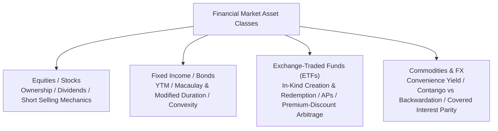
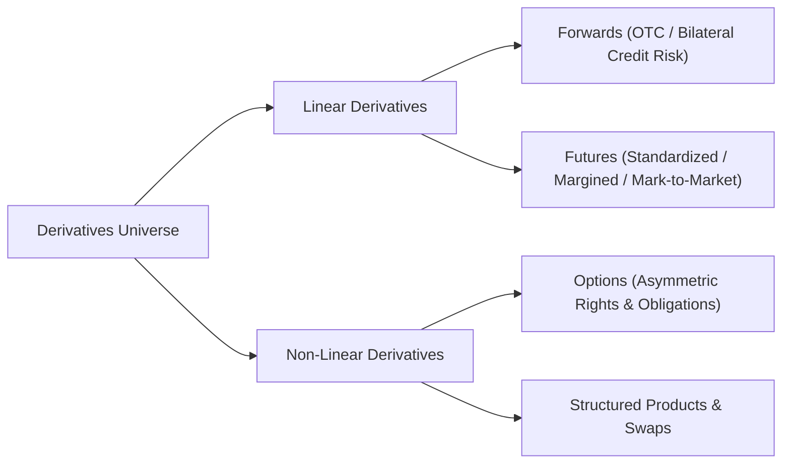
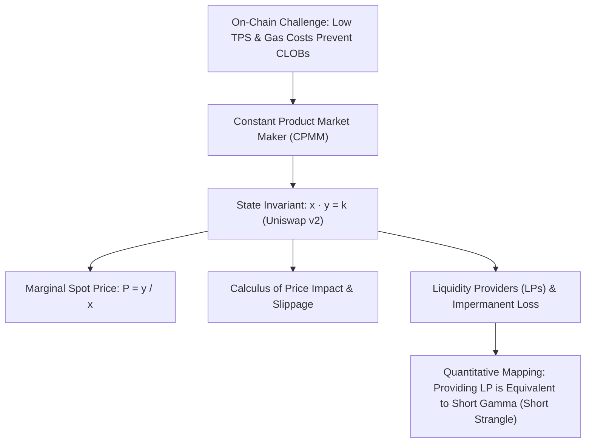
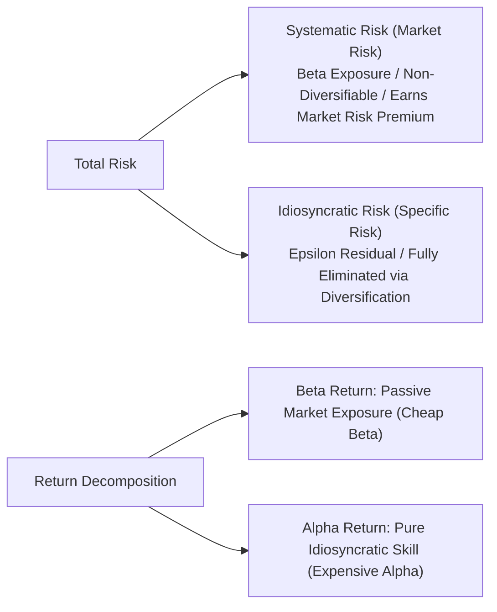
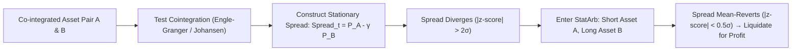

# Quant 14 · Financial Engineering & Quant Trading Primer: Asset Classes, Derivatives, AMM, Portfolio Theory & Arbitrage

> 💡 **Learning Objectives**: Build a complete cognitive map of modern quantitative finance and financial engineering. Starting from the four foundational asset classes (equities, bonds, ETFs, commodities/FX), understand linear (forwards/futures) and non-linear derivatives (options and the five Greeks), derive decentralized finance (DeFi) mechanisms (constant-product AMM $x \cdot y = k$ and rigorous proof of Impermanent Loss), and master quantitative performance metrics (Sharpe/Sortino/MDD), the CAPM model ($\alpha$ and $\beta$ decomposition), the Markowitz Efficient Frontier, and no-arbitrage pricing principles (cash-and-carry and Put-Call Parity).

---

## Module 1: Foundational Asset Classes (The Asset Class Landscape)

In quantitative trading and financial engineering, all complex derivatives and pricing models are built upon foundational underlying assets.



### 1. Equities & Stocks

#### (1) Core Characteristics & Cash Flow Structure
* **Residual Claim**: Common stock represents the holder's residual claim on a corporation's net assets and future cash flows;
* **Return Components**:
  $$\text{Total Return} = \text{Capital Gain} + \text{Dividend Yield}$$
* **Limited Liability**: Stock values have a theoretical floor at zero. Long positions have a maximum loss bounded by $-100\%$, while upside gains are unbounded.

#### (2) Long vs. Short Selling Mechanics
* **Long Position**: Purchasing assets with capital or leverage, expecting price appreciation;
* **Short Selling Workflow**:
  1. **Borrowing**: Borrow shares from a broker's lending pool and immediately sell them in the spot market, receiving cash;
  2. **Covering**: At a future date, purchase equivalent shares in the market at current prices and return them to the lender;
  3. **PnL Structure**: $\text{PnL} = S_{\text{entry}} - S_{\text{exit}} - \text{Borrow Fee}$;
* **Four Major Risks of Short Selling**:
  - **Asymmetric Losses**: Upward price movement is unbounded, exposing shorts to theoretical **infinite downside risk**;
  - **Cost of Borrow / Rebate Rate**: Heavily shorted or scarce shares carry steep borrowing fees (Hard-to-Borrow, HTB);
  - **Recall Risk**: The underlying lender retains the right to recall shares at any time. If replacement shares cannot be borrowed, the short seller is forcibly liquidated;
  - **Short Squeeze**: Rapid price rallies trigger cascade margin calls, forcing short sellers to panic-buy in the open market, creating a positive-feedback liquidation spiral.

#### (3) Market Microstructure: Central Limit Order Book (CLOB)
* **Central Limit Order Book (CLOB)**: A queue of all active limit orders sorted by price-time priority;
* **Bid-Ask Spread**:
  $$\text{Spread} = P_{\text{Ask}} - P_{\text{Bid}}$$
* **Maker vs. Taker**:
  - **Maker (Liquidity Provider)**: Submits passive limit orders that rest in the order book, earning rebates or paying lower fees;
  - **Taker (Liquidity Consumer)**: Submits aggressive market orders that fill immediately against resting orders, paying the cost of immediacy.

---

### 2. Fixed Income & Bonds

#### (1) Bond Essentials & Pricing Formula
* **Par Value / Face Value ($M$)**: Principal repaid at maturity (typically 100 or 1,000);
* **Coupon Rate ($c$)**: Annual coupon payment $C = c \cdot M$;
* **Yield to Maturity (YTM, $y$ hold-to-maturity rate)**: The internal rate of return (IRR) that equates discounted future cash flows to current market price $P$:
  $$P = \sum_{t=1}^T \frac{C}{(1 + y)^t} + \frac{M}{(1 + y)^T}$$

#### (2) Interest Rate Sensitivity: Duration & Convexity
Taylor-expanding the bond price formula with respect to yield $y$:
$$\frac{\Delta P}{P} \approx - D_{\text{mod}} \cdot \Delta y + \frac{1}{2} \text{Convexity} \cdot (\Delta y)^2$$

* **Macaulay Duration ($D_{\text{Mac}}$)**: Weighted-average time until cash flows are received:
  $$D_{\text{Mac}} = \frac{\sum_{t=1}^T t \cdot \frac{C_t}{(1+y)^t}}{P}$$
* **Modified Duration ($D_{\text{mod}}$)**:
  $$D_{\text{mod}} = \frac{D_{\text{Mac}}}{1 + y} = -\frac{1}{P} \frac{dP}{dy}$$
  *Intuition*: Measures percentage price change per $1\%$ (100 bps) shift in yield (the negative sign indicates inverse relationship).
* **Convexity**:
  $$\text{Convexity} = \frac{1}{P} \frac{d^2 P}{dy^2}$$
  *Intuition*: The second derivative/curvature of the price-yield function. Because $\text{Convexity} > 0$, price rallies when rates fall exceed linear estimates, and price drops when rates rise are milder than linear estimates. **Convexity is a free second-order hedge against rate shocks for bond holders.**

---

### 3. Exchange-Traded Funds (ETFs)

#### (1) The Lifeline of ETFs: In-Kind Creation & Redemption Mechanism
Traditional open-end mutual funds only settle cash at day-end NAV. ETFs trade intraday with high liquidity and minimal NAV tracking deviation because of **Authorized Participants (APs) operating in-kind creation and redemption**:

```mermaid
sequenceDiagram
    participant Secondary as Secondary Market Traders
    participant AP as Authorized Participant (AP / Market Maker)
    participant Issuer as ETF Issuer (e.g., BlackRock)
    
    Note over Secondary,AP: Premium Case (Market Price > NAV)
    AP->>Secondary: Purchases underlying basket of stocks
    AP->>Issuer: Delivers physical stock basket (In-Kind Creation)
    Issuer-->>AP: Mints corresponding ETF creation units
    AP->>Secondary: Sells ETF shares at premium in secondary market
    Note over AP: Arbitrage profits locked; market price forced down to NAV
```

* **Premium Arbitrage ($P_{\text{ETF}} > \text{NAV}$)**:
  APs buy the underlying basket cheap in the equity market, deliver it to the issuer to create new ETF shares, and sell them at the premium price, forcing price back to NAV.
* **Discount Arbitrage ($P_{\text{ETF}} < \text{NAV}$)**:
  APs buy underpriced ETF shares in the open market, redeem them with the issuer for the underlying basket, and sell the stock basket for a riskless spread.

#### (2) Performance Metrics
* **Tracking Error (TE)**: Sample standard deviation of return differences:
  $$\text{TE} = \sqrt{\frac{1}{T-1} \sum_{t=1}^T (R_{\text{ETF}, t} - R_{\text{Index}, t} - \overline{\Delta R})^2}$$

---

### 4. Commodities & Foreign Exchange (FX)

#### (1) Commodity Cost of Carry Model
Under no-arbitrage, spot price $S_0$ and futures price $F_0$ obey storage cost $u$ and convenience yield $y$:
$$F_0 = S_0 e^{(r + u - y)T}$$
* **Convenience Yield ($y$)**: The implicit operational value of holding physical inventory on hand rather than a paper futures contract during supply disruptions;
* **Contango ($F_0 > S_0$)**: Storage and interest costs dominate convenience yield; futures trade above spot. Rolling long contracts yields negative roll yield;
* **Backwardation ($F_0 < S_0$)**: Physical scarcity causes convenience yield to surge; futures trade at a discount. Rolling long contracts captures positive roll yield.

#### (2) Covered Interest Parity (CIP)
Without capital controls, currency forward rates $F$ and spot rates $S$ satisfy:
$$F = S \cdot \frac{1 + r_d}{1 + r_f} \quad \left( \text{Continuous form: } F = S e^{(r_d - r_f)T} \right)$$
where $r_d$ is the domestic risk-free rate and $r_f$ is the foreign risk-free rate.

---

## Module 2: Financial Derivatives (Linear vs. Non-Linear)



### 1. Forwards & Futures

* **Common Foundation**: Obligation to buy or sell an asset at predetermined future time $T$ and price $K$. **Both parties bear mandatory fulfillment obligations**;
* **Futures-Specific Mechanisms**:
  - **Initial & Maintenance Margin**: Leverage multiplier $\approx \frac{1}{\text{Margin Ratio}}$;
  - **Mark-to-Market (MTM)**: Daily settlement of gains/losses debited/credited to margin accounts, eliminating cumulative counterparty default risk.
* **Cash-and-Carry Arbitrage**:
  For an asset paying continuous dividend yield $q$, the theoretical forward price is:
  $$F_0 = S_0 e^{(r - q)T}$$
  - If $F_{\text{market}} > S_0 e^{(r - q)T}$: **Cash-and-Carry** (borrow cash, buy spot asset, short overpriced futures);
  - If $F_{\text{market}} < S_0 e^{(r - q)T}$: **Reverse Cash-and-Carry** (short spot, lend proceeds, long underpriced futures).

---

### 2. Options: Asymmetry & Convexity

#### (1) Rights vs. Obligations
* **Long Option (Buyer)**: Pays an upfront **Premium**. Acquires the right (not obligation) to exercise. **Downside is capped at the premium, upside is theoretically boundless**;
* **Short Option (Seller)**: Receives the premium, assumes unconditional obligation to settle. **Upside is capped at the premium, tail risk is severe**.

#### (2) Payoffs & Moneyness
| Option Type | Payoff at Maturity | In-the-Money (ITM) | At-the-Money (ATM) | Out-of-the-Money (OTM) |
|---|---|---|---|---|
| **Call Option** | $\max(S_T - K, 0)$ | $S_t > K$ | $S_t \approx K$ | $S_t < K$ |
| **Put Option** | $\max(K - S_T, 0)$ | $S_t < K$ | $S_t \approx K$ | $S_t > K$ |

$$\text{Option Market Price} = \text{Intrinsic Value} + \text{Time Value}$$
Prior to expiration, time value peaks at-the-money (ATM).

#### (3) The Greeks: Trader's Intuitive Map

| Greek | Definition | Physical / Trading Meaning | Risk Management Meaning |
|---|---|---|---|
| **Delta ($\Delta$)** | $\frac{\partial V}{\partial S}$ | Sensitivity of option value per \$1 change in spot; equivalent to **directional exposure** and **hedge ratio** | Maintain Delta-neutrality ($\Delta_{\text{port}} = 0$) to eliminate first-order spot directional risk |
| **Gamma ($\Gamma$)** | $\frac{\partial^2 V}{\partial S^2} = \frac{\partial \Delta}{\partial S}$ | Second-order curvature / acceleration of option price; sensitivity of Delta to spot price | Higher Gamma requires more frequent dynamic rebalancing, generating **Gamma Scalping cash inflows** |
| **Theta ($\Theta$)** | $\frac{\partial V}{\partial t}$ | Time decay rate. Daily erosion of option value (typically $\Theta < 0$) | The ongoing "rent / premium" paid by long volatility holders |
| **Vega ($\nu$)** | $\frac{\partial V}{\partial \sigma}$ | Absolute price change per $1\%$ shift in implied volatility | Pure volatility exposure; hedges market panic and uncertainty |
| **Rho ($\rho$)** | $\frac{\partial V}{\partial r}$ | Sensitivity of option price to $1\%$ shift in risk-free interest rates | Cost-of-carry sensitivity |

> 🔗 **Advanced Chapter Connection**: Market makers construct Delta-neutral portfolios to eliminate directional risk. Because options possess convexity ($\Gamma > 0$), price fluctuations force algorithms to mechanically sell high and buy low, earning second-order Itô cash flows $\frac{1}{2}\Gamma S^2 \sigma^2 dt$ that offset $\Theta dt$ time decay. This forms the financial foundation of [[Quant12 Brownian Motion Ito Calculus Stopping Times and Options.md#2-经典应用二期权多头-gamma-与-delta-动态对冲现金流机制gamma-scalping|Quant 12 Application 2: Gamma Scalping]]!

---

## Module 3: Decentralized Finance & Automated Market Makers (DeFi & AMM Primitives)

In blockchain and crypto-native finance (Web3), high-frequency limit order books (CLOB) face low TPS and high gas costs, leading to the invention of **Automated Market Makers (AMMs)**.



### 1. Constant Product Market Maker (CPMM, Uniswap v2)

For a pool containing $x$ units of token $X$ and $y$ units of token $Y$:
$$x \cdot y = k$$

#### (1) Marginal Spot Price
Differentiating both sides:
$$y dx + x dy = 0 \implies -\frac{dy}{dx} = \frac{y}{x}$$
The spot price of token $Y$ denominated in token $X$ is:
$$P = \frac{y}{x}$$

#### (2) Swap Equation & Price Impact (Slippage)
A trader deposits $\Delta x$ tokens of $X$ to receive $\Delta y$ tokens of $Y$:
$$(x + \Delta x)(y - \Delta y) = k = x y$$
Solving for $\Delta y$:
$$\Delta y = \frac{y \cdot \Delta x}{x + \Delta x}$$

The effective execution price $P_{\text{exec}}$ is:
$$P_{\text{exec}} = \frac{\Delta y}{\Delta x} = \frac{y}{x + \Delta x} = \frac{P_{\text{spot}}}{1 + \frac{\Delta x}{x}}$$
* **Microstructure Insight**:
  - When trade size $\Delta x \ll x$, $P_{\text{exec}} \approx P_{\text{spot}}$ with negligible slippage;
  - As order size scales relative to liquidity depth, execution price degrades non-linearly. This provides AMMs with self-stabilizing pricing and inherent price impact.

---

### 2. Impermanent Loss (IL): Rigorous Mathematical Proof

Liquidity providers (LPs) deposit tokens to earn transaction fees but suffer opportunity losses relative to holding if market prices diverge.

#### (1) Derivation
1. **Initial State**: Pool has $x_0, y_0$ with initial price $P_0 = y_0 / x_0$. Total portfolio value in terms of token $Y$ is:
   $$V_0 = x_0 P_0 + y_0 = 2 y_0$$
2. **Price Shift**: External markets move token $X$'s price to $P_1 = k P_0$ ($k > 0$). Arbitrageurs trade with the pool until internal price converges:
   $$\frac{y_1}{x_1} = P_1 = k \frac{y_0}{x_0}, \quad x_1 y_1 = x_0 y_0$$
3. **Solving for Pool Balances**:
   $$x_1 = \frac{x_0}{\sqrt{k}}, \qquad y_1 = y_0 \sqrt{k}$$
4. **Value Comparison**:
   * **LP Value in Pool**:
     $$V_{\text{LP}} = x_1 P_1 + y_1 = \left( \frac{x_0}{\sqrt{k}} \right) (k P_0) + y_0 \sqrt{k} = 2 y_0 \sqrt{k}$$
   * **HODL Value (Holding in Wallet)**:
     $$V_{\text{HODL}} = x_0 P_1 + y_0 = x_0 (k P_0) + y_0 = y_0 (1 + k)$$
5. **Impermanent Loss Ratio**:
   $$\text{IL}(k) = \frac{V_{\text{LP}}}{V_{\text{HODL}}} - 1 = \frac{2\sqrt{k}}{1 + k} - 1 = -\frac{(\sqrt{k} - 1)^2}{1 + k}$$

#### (2) AM-GM Inequality Analysis
By the Arithmetic-Geometric Mean (AM-GM) inequality:
$$\frac{1 + k}{2} \ge \sqrt{k} \implies \text{IL}(k) \le 0 \quad \forall k > 0$$
Equality holds if and only if $k = 1$ (no price change).

```text
Price Multiple k      0.25 (-75%)   0.50 (-50%)   1.00 (No change)   2.00 (+100%)   4.00 (+300%)
Impermanent Loss      -5.72%        -2.02%        0.00%              -2.02%         -5.72%
```

#### (3) The Trader's Mapping: LPing is Selling Gamma (Short Strangle)
* **Why "Impermanent"?** If the price ratio returns to its original level ($k = 1$), the loss vanishes;
* **Derivatives Equivalence**:
  - When token $X$ rises, arbitrageurs deposit token $Y$ and extract token $X$. The LP systematically sells the winning asset;
  - When token $X$ crashes, arbitrageurs dump token $X$ into the pool. The LP systematically absorbs the depreciating asset;
  - **Conclusion: Providing LP liquidity is structurally identical to selling a short strangle / short Gamma position!** The LP collects trading fees (analogous to option premiums) while absorbing convex losses during violent market trends.

---

## Module 4: Modern Portfolio Theory & Performance Metrics (MPT)

Quantitative investing balances return maximization against risk budget constraints.

### 1. Performance & Risk Metrics

#### (1) Expected Return & Volatility
* **Return Vector**: $\mathbf{R} = [R_1, \dots, R_N]^T$, mean vector $\boldsymbol{\mu} = \mathbb{E}[\mathbf{R}]$;
* **Covariance Matrix**: $\boldsymbol{\Sigma} = \mathbb{E}[(\mathbf{R} - \boldsymbol{\mu})(\mathbf{R} - \boldsymbol{\mu})^T]$;
* **Portfolio Weights**: $\mathbf{w} = [w_1, \dots, w_N]^T$, $\sum w_i = 1$;
* **Portfolio Expected Return & Variance**:
  $$\mu_p = \mathbf{w}^T \boldsymbol{\mu}, \qquad \sigma_p^2 = \mathbf{w}^T \boldsymbol{\Sigma} \mathbf{w}$$

#### (2) Four Essential Quant Performance Metrics
1. **Sharpe Ratio (SR)**:
   $$\text{SR} = \frac{\mathbb{E}[R_p] - R_f}{\sigma_p}$$
   Measures excess return per unit of total risk (standard deviation).
2. **Sortino Ratio**:
   $$\text{Sortino} = \frac{\mathbb{E}[R_p] - R_f}{\sigma_{\text{down}}}$$
   Unlike standard deviation, it only penalizes downside semi-variance ($\sigma_{\text{down}} = \sqrt{\frac{1}{T}\sum \min(R_t - R_f, 0)^2}$), ignoring upside volatility.
3. **Maximum Drawdown (MDD) & Calmar Ratio**:
   $$\text{MDD} = \max_{0 \le s \le t \le T} \frac{P_s - P_t}{P_s}, \qquad \text{Calmar} = \frac{\text{Annualized Excess Return}}{\text{MDD}}$$
4. **Information Ratio (IR)**:
   $$\text{IR} = \frac{\mathbb{E}[R_p - R_{\text{benchmark}}]}{\operatorname{Std}(R_p - R_{\text{benchmark}})} = \frac{\alpha}{\omega}$$
   Measures active management skill and consistency against a benchmark index.

---

### 2. CAPM & Alpha / Beta Decomposition

William Sharpe's Capital Asset Pricing Model (CAPM) decomposes asset returns into:

$$R_{i, t} - R_f = \alpha_i + \beta_i (R_{m, t} - R_f) + \epsilon_{i, t}$$



#### (1) Beta ($\beta$)
$$\beta_i = \frac{\operatorname{Cov}(R_i, R_m)}{\operatorname{Var}(R_m)} = \rho_{i, m} \frac{\sigma_i}{\sigma_m}$$
Sensitivity to broad market moves ($\beta = 1$: market co-movement; $\beta > 1$: aggressive; $\beta < 1$: defensive).

#### (2) Alpha ($\alpha$) & Treynor Ratio
* **Jensen's Alpha ($\alpha$)**:
  $$\alpha_i = \mathbb{E}[R_i] - \left( R_f + \beta_i (\mathbb{E}[R_m] - R_f) \right)$$
  The true risk-adjusted excess return attributable to active asset selection or market timing.
* **Treynor Ratio**: $\text{TR} = \frac{\mathbb{E}[R_p] - R_f}{\beta_p}$, measuring excess return per unit of systematic risk.

---

### 3. Markowitz Modern Portfolio Theory (MPT) & Efficient Frontier

#### (1) Diversification: The Only Free Lunch in Finance
For two assets with correlation $\rho \in [-1, 1]$:
$$\sigma_p^2 = w^2 \sigma_1^2 + (1-w)^2 \sigma_2^2 + 2w(1-w) \rho \sigma_1 \sigma_2$$
Whenever $\rho < 1$:
$$\sigma_p < w \sigma_1 + (1-w) \sigma_2$$
**As long as assets are imperfectly correlated ($\rho < 1$), portfolio variance is strictly less than the weighted average of individual asset variances.**

#### (2) Mean-Variance Optimization & The Efficient Frontier
* **Optimization Objective**:
  $$\min_{\mathbf{w}} \frac{1}{2} \mathbf{w}^T \boldsymbol{\Sigma} \mathbf{w} \quad \text{s.t.} \quad \mathbf{w}^T \boldsymbol{\mu} = \mu_{\text{target}}, \quad \mathbf{w}^T \mathbf{1} = 1$$
* **Efficient Frontier**: The upward-sloping boundary of portfolios offering minimum variance for any given expected return.

```text
Expected Return E[R]
     ^
     |              / (Capital Market Line CML)
     |             / 
     |            /|  Tangency Portfolio (Max Sharpe Ratio)
     |           / |
     |          *--+------------------- Efficient Frontier
     |         /   |                  /
     |        (    |                 /
     |       /|    |                /
     |      * |    |               /   Global Minimum Variance Portfolio (GMVP)
     |     /  |    |
     |----*   |    |
    Rf   /    |    |
     |  /     |    |
     +----------------------------------------> Volatility σ
```

#### (3) Tobin's Two-Fund Separation Theorem
Introducing a risk-free asset $R_f$ reveals that:
1. Every rational investor holds identical proportions of risky assets, defined by the **Tangency Portfolio** (highest Sharpe ratio);
2. Individual risk preferences only dictate capital allocation **between the risk-free asset $R_f$ and the tangency portfolio**.

---

## Module 5: Arbitrage Theory & The Law of One Price

Quantitative modeling relies on **no-arbitrage equilibrium constraints** rather than directional forecasting.

### 1. The No-Arbitrage Principle

* **Mathematical Definition of Arbitrage**:
  An investment strategy satisfying:
  1. Zero initial net investment: $V(0) = 0$;
  2. Future payoff is almost surely non-negative: $\mathbb{P}(V(T) \ge 0) = 1$;
  3. Probability of positive gain is strictly positive: $\mathbb{P}(V(T) > 0) > 0$.
* **The Law of One Price**:
  Two asset portfolios producing identical cash flows across all future states of nature must trade at identical prices today. Otherwise, longing the underpriced portfolio and shorting the overpriced one yields an infinite riskless money machine.

---

### 2. Put-Call Parity

Construct two portfolios to prove the fundamental relationship for European options:

#### (1) Portfolios
* **Portfolio A (Fiduciary Call)**:
  - Long 1 European Call (price $C_t$);
  - Discounted cash $K e^{-r(T-t)}$ deposited in a risk-free bond (worth $K$ at $T$);
  - Value: $V_A(t) = C_t + K e^{-r(T-t)}$.
* **Portfolio B (Protective Put)**:
  - Long 1 European Put (price $P_t$);
  - Long 1 unit of underlying stock (price $S_t$);
  - Value: $V_B(t) = P_t + S_t$.

#### (2) Terminal Cash Flows at Time $T$
* **If $S_T > K$**:
  - Portfolio A: Call exercised for $S_T - K$, bond delivers $K$, total $= S_T$;
  - Portfolio B: Put expires worthless, stock worth $S_T$, total $= S_T$;
* **If $S_T \le K$**:
  - Portfolio A: Call expires worthless, bond delivers $K$, total $= K$;
  - Portfolio B: Put exercised for $K - S_T$, stock liquidated for $S_T$, total $= K$.

**At time $T$, across all states of nature: $V_A(T) = \max(S_T, K) = V_B(T)$.**

By the Law of One Price:

$$\boxed{C_t + K e^{-r(T-t)} = P_t + S_t}$$

#### (3) Arbitrage Strategies
* If $C_t + K e^{-r(T-t)} > P_t + S_t$: **Reverse Conversion** (short Call, borrow cash, buy Put, buy stock);
* If $C_t + K e^{-r(T-t)} < P_t + S_t$: **Conversion Arbitrage** (buy Call, lend cash, short Put, short stock).

---

### 3. Statistical Arbitrage (StatArb) & Pairs Trading

In institutional quant trading, deterministic arbitrage is scarce, shifting focus to **statistical mean-reversion**.



#### (1) Correlation vs. Cointegration
* **Correlation Trap**: Two non-stationary $I(1)$ series (e.g., two bull-market tech stocks) can show $0.99$ correlation while their price spread diverges to infinity;
* **Cointegration**: Two non-stationary $I(1)$ series share a stationary linear combination $\text{Spread}_t = P_{A, t} - \gamma P_{B, t} \sim I(0)$.
  - Analogy: A drunk walker and a dog on a leash. Both paths wander randomly ($I(1)$), but the leash forces the distance between them to remain stationary and mean-reverting ($I(0)$).

#### (2) Ornstein-Uhlenbeck (OU) Mean-Reverting Process
The continuous-time spread is modeled via an OU process:
$$d X_t = \theta (\mu - X_t) dt + \sigma dW_t$$
* $\theta > 0$: Speed of mean reversion (half-life $t_{1/2} = \frac{\ln 2}{\theta}$);
* $\mu$: Long-term equilibrium spread;
* $\sigma$: Volatility.
Quant systems dynamically estimate the hedge ratio $\gamma$ via a Kalman filter, opening positions when $|z\text{-score}| > 2$ and closing as the spread reverts to zero.

---

## Module 6: Knowledge Roadmap & Further Study

| Topic | Primer Scope (This Note) | Advanced Next Step |
|---|---|---|
| **Options & Dynamic Hedging** | Payoffs, Greeks, Delta-neutrality | [[Quant12 Brownian Motion Ito Calculus Stopping Times and Options.md|Quant 12 · Brownian Motion, Itô Calculus & Option Trading]] |
| **Martingales & Pricing** | No-arbitrage, discount factors | [[Quant10 Betting Risk Neutral Pricing Martingales.md|Quant 10 · Betting Strategies, Risk-Neutral Pricing & Martingales]] |
| **Stopping Times & Boundaries** | American option early exercise | [[Quant11 Martingales Stopping Times Random Walks.md|Quant 11 · Martingales, Stopping Times & Random Walks]] |
| **Game Theory & Market Making** | Order book dynamics, liquidity game | [[Quant13 Game Theory and Strategic Decision Making.md|Quant 13 · Game Theory & Strategic Decision Making]] |
