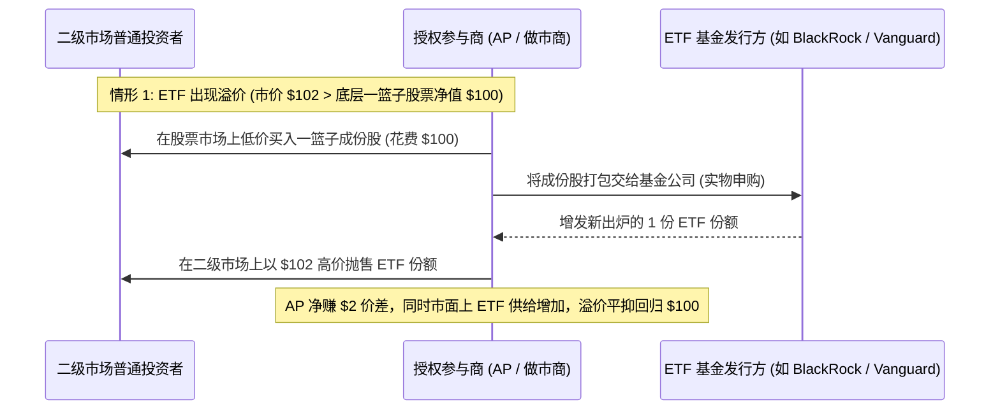

```mermaid
graph TD
    A["全球现代金融体系全景图"] --> B["市场组织架构与参与者生态<br>(Exchanges, Buy-Side, Sell-Side, Prop Trading)"]
    A --> C["多资产类别基础认知<br>(Equities, Fixed Income, ETFs, FX, Commodities)"]
    A --> D["衍生品全景生态与对冲<br>(Forwards, Futures, Swaps, Options, Greeks)"]
    A --> E["资产配置与量化投资哲学<br>(60/40, Risk Parity, Alpha vs Beta)"]
    
    B --> B1["一级市场 (IPO/融资) vs 二级市场 (交易/定价)"]
    B --> B2["场内标准化 (CME/NYSE) vs 场外定制 (OTC)"]
    B --> B3["买方 (对冲/资管/养老金) vs 卖方 (投行) vs 做市商 (Jane Street/Citadel)"]
    
    C --> C1["股票 (所有权凭证 / 融券做空机制)"]
    C --> C2["固定收益 (国债 / 信用利差 / 收益率曲线倒挂)"]
    C --> C3["ETF (一级市场实物申赎 AP 机制)"]
    C --> C4["外汇与商品 (全球流动性 / 现货溢价 Backwardation)"]
    
    D --> D1["远期与期货 (农业起家 / 清算所消除违约 / 盯市制度)"]
    D --> D2["互换 (利率互换 IRS / 信用违约互换 CDS / 2008危机)"]
    D --> D3["期权底层逻辑 (定金与保险 / 权利义务不对称)"]
    D --> D4["希腊字母交易语言 (Delta方向 / Gamma凸性 / Theta租金 / Vega恐慌)"]
    D --> D5["波动率曲面 (1987股灾后的崩盘恐惧 Skew)"]
    
    E --> E1["分散化: 金融唯一的免费午餐"]
    E --> E2["传统 60/40 组合的隐形陷阱 (股票贡献90%+波动)"]
    E --> E3["桥水全天候与风险平价 (按风险贡献分蛋糕)"]
```

# Quant 14 · 金融体系全景认知：金融市场架构、多资产类别、衍生品生态与现代投资组合（Financial Markets, Asset Classes, Derivatives & Financial System Overview）

在华尔街顶尖量化对冲基金与自营交易公司（如 Jane Street, Citadel, Millennium, Two Sigma, Optiver, IMC, SIG, Jump Trading）的面试中，许多理工科（数学、计算机、物理）背景的候选人常常陷入一个典型误区：**能够熟练推导随机微积分公式与偏微分方程，却对真实金融体系的底层运行逻辑、各个参与者的商业动机与资产类别的微观生态一无所知**。

在真实的量化研究与交易中，数学与算法只是工具，**理解金融体系（Financial System）的真实运作机理才是策略能够落地并赚钱的前提**。本文抛开枯燥繁琐的纯数学公式堆砌，以通俗清晰的脉络，系统拆解现代金融市场的全局拼图：从市场底层架构与买卖方生态，到股票、债券、外汇、商品的经济本质，再到衍生品（远期、期货、互换、期权与希腊字母）的诞生逻辑与现实应用，最终贯通到现代资产配置与量化投资理念。

```text
金融体系核心底层常识（The Core Mental Models）：
1. 金融的本质：跨期价值交换（把今天的钱搬到明天，或把明天的钱借到今天）与风险重新分配（把风险从承受不起的人手中转移给愿意承担并定价风险的人）。
2. 资产层级与偿付顺序：在破产清算时，资本结构（Capital Structure）有着森严的等级：抵押债 > 普通信用债 > 次级债 > 优先股 > 普通股。股票享有无限上涨潜力，但必须承担垫底的剩余索取风险。
3. 利率是全球金融资产的重力引力：利率是资金的时间成本。所有资产的定价本质上都是未来现金流贴现。利率上升，贴现率上升，远期现金流价值缩水，所有资产面临估值重估。
4. 衍生品不是赌博，而是商业的减震器：没有远期和期货，农场不敢大面积播种，航运和航空公司不敢在油价剧烈波动时售卖未来的机票；期权本质上是商业保险，买方支付保费锁定下行风险，卖方赚取确定性租金承担尾部风险。
5. 收益拆解——贝塔（Beta）与阿尔法（Alpha）：随波逐流的市场整体收益叫 Beta（廉价且容易获取）；超越市场平均、与大盘无关的独立超额收益叫 Alpha（极其昂贵且稀缺）。量化基金的终极使命是剥离 Beta，捕获纯净稳健的 Alpha。
```

---



---

## 模块一：金融市场基础架构与生态参与者（Market Architecture & Players）

### 1. 金融市场的两大分水岭：一级市场 vs 二级市场

```
┌──────────────────────────────────────────────────────────┐
│                      金融资产的全生命周期                │
├────────────────────────────┬─────────────────────────────┤
│   一级市场 (Primary Market) │    二级市场 (Secondary Market)│
├────────────────────────────┼─────────────────────────────┤
│ • 核心功能：资本形成与融资 │ • 核心功能：存量流通与价格发现│
│ • 交易对象：新发行的证券   │ • 交易对象：已发行的存量证券 │
│ • 资金流向：资金直接流向发行│ • 资金流向：资金在投资者之间 │
│   实体（企业、政府）       │   换手转移，发行人不再直接参与│
│ • 典型场景：IPO、定增、发债 │ • 典型场景：在股市买卖股票、买卖期货│
└────────────────────────────┴─────────────────────────────┘
```

- **一级市场（发行市场）**：企业缺钱扩产，或者政府需要基建，发行股票或债券，投行担任承销商协助定价并销售给早期机构。这里创造了新的金融资产。
- **二级市场（流通交易市场）**：投资者如果买了股票必须等公司清算才能拿回钱，就没有人敢投资了。二级市场（交易所、券商软件）提供了极其顺畅的变现通道（流动性），并且通过千千万万交易者的多空博弈，为资产提供公允、实时的“价格发现（Price Discovery）”。**量化交易员与二级市场做市商的核心战场就在二级市场**。

---

### 2. 交易组织形式：场内交易所（Exchange）vs 场外交易（OTC）

- **场内交易所（Exchange-Traded）**：
  - **代表场所**：纽交所（NYSE）、纳斯达克（NASDAQ）、芝商所（CME）、芝加哥期权交易所（CBOE）、港交所（HKEX）。
  - **核心特点**：
    - **高度标准化**：合约到期日、乘数、交割地点、最小变动价位全部统一，不能定制；
    - **中央清算所（Clearing House）**：清算所充当“所有买方的卖方、所有卖方的买方”，通过向双边收取**保证金（Margin）**与**每日盯市（Mark-to-Market）**，消除了双边交易对手违约的顾虑；
    - **信息透明**：挂单与成交公开展示在集中限价订单簿（CLOB）中。
- **场外交易市场（Over-the-Counter, OTC）**：
  - **核心特点**：
    - **定制化协议**：买卖双方（通常是大型金融机构、跨国企业）私下一对一签署协议（遵循 ISDA 国际掉期与衍生工具协会主协议），条款完全根据个性化需求定制；
    - **交易对手信用风险（Counterparty Risk）**：如果对方倒闭（如 2008 年雷曼兄弟倒闭），合约可能沦为废纸；
    - **体量极其庞大**：全球大多数外汇交易、大宗商品远期、绝大部分利率互换（IRS）与信用违约互换（CDS）均在场外进行。
- **暗池（Dark Pools）与电子撮合网络（ECN）**：
  - 大型对冲基金或养老金如果要买入 500 万股苹果股票，一旦在公开订单簿上挂出，全市场的量化算法都会瞬间察觉并抬高价格（市场冲击与滑点）。
  - 暗池允许大机构在不公开挂单数量和价格的前提下，在买卖双方之间以中间价隐蔽撮合成交，保护交易意图不被泄露。

---

### 3. 华尔街核心玩家生态谱系（The Wall Street Ecosystem）

理解金融体系，关键在于看清“谁的钱、谁在管、谁提供通道、谁在做对手盘”：

```
                    ┌──────────────────────────────┐
                    │    资产所有者 (Asset Owners)  │
                    │  养老金 / 主权财富基金 / 捐赠基金 │
                    └──────────────┬───────────────┘
                                   │ 委托出资 (LP)
                                   ▼
┌───────────────────────────────────────────────────────────────────┐
│                      买方机构 (The Buy-Side)                       │
├─────────────────────────────────┬─────────────────────────────────┤
│    传统公募 / 被动指数资管      │           对冲基金              │
│  (BlackRock, Vanguard, Fidelity)│  (Citadel, Millennium, Two Sigma│
│   • 追求与基准同步的低成本 Beta  │   • 追求绝对收益与无相关 Alpha   │
└─────────────────────────────────┴─────────────────────────────────┘
                                   │
                                   │ 交易委托 / 资金借贷 / 借券融券
                                   ▼
┌───────────────────────────────────────────────────────────────────┐
│                      卖方机构 (The Sell-Side)                       │
│             投资银行 (Goldman Sachs, Morgan Stanley, J.P. Morgan)  │
├─────────────────────────────────┬─────────────────────────────────┤
│       投资银行部 (IBD)          │       机构主经纪商 (Prime Broker) │
│    企业上市承销、债券发行与发售  │      为对冲基金提供杠杆借款、融券池│
└─────────────────────────────────┴─────────────────────────────────┘
                                   │
                                   │ 集中撮合 / 流动性供给
                                   ▼
┌─────────────────────────────────┬─────────────────────────────────┐
│       公开交易场所 (Venues)      │     专业做市商 (Market Makers)   │
│   (CME, NASDAQ, CBOE, 暗池)     │ (Citadel Securities, Jane Street,│
│                                 │      Optiver, IMC, Jump Trading) │
└─────────────────────────────────┴─────────────────────────────────┘
```

#### （1）买方（Buy-Side）：掌管资金并做出投资决策的买家
- **资产所有者（Asset Owners）**：资金的源头。包括国家主权财富基金（如中投 CIC、新加坡 GIC/淡马锡）、主权养老金（如挪威养老基金、加州教师退休基金 CalSTRS）、大学捐赠基金（如耶鲁捐赠基金）。他们追求超长周期（数十年）的资产保值增值。
- **公募资管公司（Asset Managers，如 BlackRock、Vanguard）**：主要发行共同基金与 ETF。他们绝大多数是**做多型、被动型投资**，按资产规模收取管理费，核心使命是紧跟标普 500、纳斯达克等指数。
- **对冲基金（Hedge Funds）**：投资工具不受限制（可做多、做空、加杠杆、买卖各类复杂衍生品），目标是**无论大盘涨跌都赚取绝对收益（Absolute Return）**。分为：
  - **主观多空（Equity Long/Short）**：基于公司基本面深度调研，买入好公司、做空差公司；
  - **全球宏观（Global Macro，如桥水 Bridgewater）**：基于各国通胀、利率、汇率、经济周期进行跨国资产下注；
  - **多策略基金（Multi-Strategy Pod Shops，如 Citadel, Millennium, Point72）**：旗下几十上百个高度独立的投资团队（Pods），设置严格止损红线，追求极高夏普比率；
  - **量化基金（Quant Funds，如 Renaissance Technologies 文艺复兴, Two Sigma, D.E. Shaw）**：用数学、统计与计算机算法挖掘微弱规律，进行海量分散化交易。

#### （2）卖方（Sell-Side）：投行与经纪服务商
- 包括高盛、大摩、小摩等。卖方不以“拿自有资金长期承担资产涨跌风险”为主要目的，其商业模式是**服务中介**：
  - **IBD（投行部）**：帮助企业发债、IPO、并购重组，赚取承销佣金；
  - **研究部（Research）**：撰写个股和行业研报，吸引买方来本行席位交易；
  - **主经纪商业务（Prime Brokerage, PB）**：为对冲基金提供生命线支持——融券做空借票源、融资配资放杠杆、交易清算与托管。

#### （3）专业自营做市商（Proprietary Trading & Market Makers）
- **代表公司**：Jane Street、Citadel Securities、Optiver、IMC、Flow Traders、Virtu Financial。
- **做市商的本质**：做市商**不是方向性投机者**，他们不关心苹果股票明天涨还是跌。做市商在订单簿的两端同时挂出买单（Bid）和卖单（Ask），为市场上的其他参与者即时提供流动性，赚取**买卖价差（Bid-Ask Spread）**。
- **做市商的核心挑战**：
  1. **逆向选择（Adverse Selection）**：跟“知情交易者”做对手盘。比如有人忽然疯狂吃掉卖单，往往说明对方掌握了你不知道的重大利好，你卖给他的仓位立刻产生浮亏；
  2. **库存风险（Inventory Risk）**：不能囤积大量单边敞口，必须在微秒到分钟级别通过期货、期权或对冲工具把库存风险降到最低。

---

## 模块二：多资产类别核心机制与经济本质（The Major Asset Classes）

在金融世界中，所有的金融模型都是以基础资产（Underlying Assets）为载体运行的。

### 1. 股票与权益资产（Equities）

- **本质与索取权**：普通股代表持有者对上市公司资产与未来自由现金流的**剩余索取权（Residual Claim）**。
- **破产清算优先顺序（Capital Structure Priority）**：
  $$\text{优先抵押债券} \to \text{普通公司无担保债券} \to \text{次级抵押贷款} \to \text{优先股} \to \mathbf{普通股（垫底）}$$
  如果公司破产，先卖掉资产清偿银行和债券持有人，最后剩下的一分钱才轮到普通股股东分。正是因为普通股承担了最高风险，在长期才享有最高的股权风险溢价（Equity Risk Premium）。
- **融券做空（Short Selling）在实务中的潜规则**：
  - 做空必须向券商的“融券池（Borrow Pool）”借入股票并在市场上卖出；
  - **借券成本（Borrow Fee）**：流动性好、市值大的大蓝筹（如微软、苹果），借券利率极低（年化 0.25% 左右，称为 General Collateral）；而如果一家公司被严重质疑造假、所有对冲基金都想做空，就会变成 **Hard-to-Borrow (HTB)**，年化借券成本可能飙升至 30% 甚至 100%；
  - **逼空风险（Short Squeeze）**：如果股价突然连续暴涨，空头的账户保证金迅速跌破警戒线，券商会强行平仓买入股票，成百上千空头的被动买入踩踏进一步推高股价，导致空头损失呈指数级无限放大（如 2021 年 GameStop 散户抱团逼空华尔街对冲基金 Melvin Capital）。

---

### 2. 固定收益与债券（Fixed Income）：全球金融资产的定价锚

全球债券市场的总规模（超 130 万亿美元）远超股票市场。华尔街有句名言：“**股票交易反映群众的情绪，债券交易反映经济的本质**。”

- **为什么债券利率是全球资产的“重力之源”？**
  任何资产的公允价值都是未来现金流的贴现：
  $$P = \sum \frac{CF_t}{(1 + r)^t}$$
  分母上的 $r$ 就是由基准债券收益率（无风险利率）加上风险溢价构成的。无风险利率一涨，所有资产的折现值立刻像受到重力下坠一样集体估值承压。
- **国债（Government Bonds / Sovereign Debt）**：
  - 拥有国家主权信用与税收背书，被视为名义无风险资产；
  - **收益率曲线（Yield Curve）与宏观晴雨表**：
    - **正常向上倾斜**：借钱时间越长，不确定性越大，长期利率应当高于短期利率（期限溢价 Term Premium）；
    - **收益率曲线倒挂（Inverted Yield Curve）**：如果 2 年期国债收益率高于 10 年期国债收益率，说明市场预期经济即将面临衰退，央行未来将被迫大幅降息。过去半个多世纪中，每一次美国经济严重衰退前，几乎都出现了国债收益率曲线倒挂！
- **信用利差（Credit Spread）**：
  - 企业债券收益率 = 同期限国债收益率 + **信用利差**。
  - 在牛市祥和时期，违约风险低，信用利差极窄；在金融危机或流动性危机来临时，企业违约风险剧增，投资者恐慌抛售垃圾债抢购国债（**Flight to Quality / 避险买盘**），信用利差迅速飙升。
- **久期（Duration）与凸性（Convexity）的直觉认识**：
  - **久期**：衡量的是“这笔债券的本金与利息平均需要多少年能收回来”。久期越长，对利率变动越敏感。比如 10 年期久期的债券，当市场基准利率上升 1% 时，债券市价大致直接暴跌 10%！
  - **凸性**：价格-收益率曲线具有向外突出的弯曲弧度。当利率下降时，债券价格上涨的速度越来越快；而当利率上升时，债券价格下跌的速度越来越慢。**凸性是债券持有人享有的天然二阶防护垫**。

---

### 3. ETF 与被动投资革命（Exchange-Traded Funds）

ETF 是过去二十年全球资产管理行业最伟大的金融创新，彻底重构了普通投资者与大型机构的配置方式。

- **为什么 ETF 能在盘中像股票一样买卖，而价格几乎从不偏离它的底层一篮子资产净值（NAV）？**
  关键在于：**一级市场实物申购赎回（In-Kind Creation / Redemption）机制**与**授权参与商（AP）的套利约束**。



- 如果二级市场疯狂追捧某只 ETF 导致其市价高于底层股票净值（溢价），AP 就会在股市低价买股票、换成 ETF、在二级市场卖出打压溢价；
- 如果二级市场恐慌抛售导致 ETF 出现折价，AP 就会低价买入 ETF、向基金公司换回成份股、在股市卖出股票拉升 ETF 价格。
- 这种机制保证了 ETF 市价始终与净值高度锁定，消除了封闭式基金常年大幅折价的顽疾。

---

### 4. 外汇与大宗商品（FX & Commodities）

- **外汇（FX）**：
  - 每日交易规模超 7.5 万亿美元，是全世界流动性最充沛的资产。由银行间网络（Interbank）跨时区 24 小时连续运作；
  - **息差交易（Carry Trade）**：长期以来，全球宏观对冲基金从低利率国家（如长期零利率的日本央行借日元），换成高利率货币（如澳元、墨西哥比索、美元）吃利息差。一旦全球市场突发流动性恐慌或日央行意外加息，套息资金集体撤离买回日元还债，便会引发惊人的日元单边暴涨与全球风险资产踩踏。
- **大宗商品（Commodities）**：
  - 具有实体工业或消费属性（原油、铜、黄金、大豆）；
  - **期货升水（Contango）**：远期期货价格 > 近期现货价格。通常由于现货供给过剩，远期买方需要替卖方支付仓储费、保险费和资金利息（如 2020 年 4 月全球原油储罐爆满，直接导致 WTI 5月原油期货破天荒跌至 **-$37.63 美元/桶**）；
  - **现货溢价（Backwardation）**：近期现货价格 > 远期期货价格。发生在现货突发极度短缺（地缘冲突、停产），实体企业宁愿支付高额溢价也要立即拿到现货生产，持有现货享有极高**便利收益（Convenience Yield）**。商品指数多头在此环境下享有持续的正向展期收益（Roll Yield）。

---

## 模块三：去中心化金融与自动做市商（DeFi & AMM Primitives）

在区块链与加密货币（Crypto）领域，受限于公链吞吐量瓶颈（TPS）与高额 Gas 费，传统纳斯达克式高频撮合限价订单簿（CLOB）无法运行，促成了**自动做市商（Automated Market Maker, AMM）**的爆发。

### 1. 恒定乘积做市商（CPMM, Uniswap v2）底层逻辑

资金池存放两种代币 $X$ 与 $Y$，其数量满足恒定不变量：

$$
x \cdot y = k
$$

- 任何人都可以向池子存入等价值的 $X$ 和 $Y$ 成为流动性提供者（LP），赚取交易流水的手续费；
- 当交易者向池子输入 $\Delta x$ 个代币 $X$ 购买 $Y$ 时，池子保证乘积不变：
  $$(x + \Delta x)(y - \Delta y) = k \implies \Delta y = \frac{y \Delta x}{x + \Delta x}$$
- 这一规则天然决定了：**单笔交易量相对池子越大，成交价格滑点（Slippage）呈非线性急剧恶化**。这构成了区块链链上微观结构的价格自我纠偏算法。

---

### 2. 无常损失（Impermanent Loss, IL）的金融本质

成为 AMM 的流动性提供者（LP）看似可以躺赚手续费，但面临严重的**无常损失**：
- 假设初始时代币 $X$ 和代币 $Y$ 价格相等。若随后外部市场中代币 $X$ 价格暴涨，搬砖套利者就会不断用便宜的 $Y$ 换走池子里的 $X$，导致池子里的优质升值资产 $X$ 越来越少，贬值资产 $Y$ 越来越多；
- 严密的数学证明表明，只要两种资产的相对价格偏离初始比例（无论 $X$ 相对 $Y$ 暴涨还是暴跌），**LP 资产总市值相比于一开始把两币放在钱包里死拿不动（HODL），永远是落后的**：

$$
\text{IL}(k) = \frac{2\sqrt{k}}{1+k} - 1 = - \frac{(\sqrt{k}-1)^2}{1+k} \le 0
$$

> **量化金融深刻本质**：AMM LP 的损益特征与传统金融中**卖出跨式期权（Short Straddle / 做空波动率 Short Gamma）**完全一致！LP 每天稳定收取手续费（相当于收取 Theta 租金），但在资产单边大涨或大跌时承受严重的凸性损失。如果手续费收入跑不赢资产发散带来的负 Gamma 亏损，做市就是亏本买卖。

---

## 模块四：衍生品深度全景指南（Derivatives Masterclass）

**衍生品（Derivatives）是量化金融领域的皇冠**。在量化对冲基金中，无论是期权做市团队、CTA 趋势跟踪团队还是统计套利团队，衍生品都是最核心的交易标的。

---

### 1. 为什么人类需要衍生品？风险转移的商业哲学

很多没有商业背景的人容易把衍生品等同于高杠杆赌博。但事实上，**衍生品是现代全球工商业不可或缺的“减震器”**。
- **农场主的困境（1848 年芝加哥期货交易所 CBOT 的诞生）**：
  春天播种小麦时，农场主不知道秋天收割时小麦价格是 10 美元还是 2 美元。如果秋天丰收导致粮价暴跌到 2 美元，农场主就会破产跳楼。而面粉加工厂也害怕春天粮荒粮价暴涨。双方迫切需要在春天就白纸黑字签下一份合同：“约定秋天以 6 美元交割 1 万袋小麦”。
- **风险转移的本质**：
  通过衍生品合约，不愿承担价格波动风险的企业（对冲者 Hedger）把风险**剥离**出来，转移给市场上有风险承受能力并试图通过敏锐定价赚取回报的人（投机者与量化基金 Speculators）。

---

### 2. 远期（Forwards）与期货（Futures）：锁定未来的交割契约

```
┌─────────────────────────────────────────────────────────────┐
│                 远期 (Forwards) vs 期货 (Futures)            │
├────────────────────────────┬────────────────────────────────┤
│      远期合约 (Forwards)    │       期货合约 (Futures)        │
├────────────────────────────┼────────────────────────────────┤
│ • 场外一对一协商 (OTC)     │ • 交易所标准化 (CME, etc.)      │
│ • 条款自由定制             │ • 品种、月份、数量严格标准统一  │
│ • 到期日一次性结算现金/货物│ • 每日盯市 (Mark-to-Market) 结算│
│ • 面临对方违约赖账的信用风险│ • 清算所集中担保，无违约风险    │
│ • 流动性差，平仓困难       │ • 极高流动性，随时可反向对冲平仓│
└────────────────────────────┴────────────────────────────────┘
```

#### （1）期货价格是由什么决定的？持有成本模型（Cost of Carry）
期货价格**不是由大家对未来的主观猜测随意决定的**，而是受到无套利套牢机制约束的：
假设股票现价是 100 美元，一年期无风险利率是 5%。那么一年期股票期货的合理价格必须是：

$$
F = S_0 \times e^{(r - q)T} \approx 100 \times (1 + 5\%) = 105 \text{ 美元}
$$

- 如果市场上期货报价高达 110 美元（远高出合理定价）：
  套利者就会做**正向期现套利（Cash-and-Carry Arbitrage）**：找银行借 100 美元现金买入现货股票，同时在期货市场上以 110 美元卖出期货。一年后把股票交割出去拿到 110 美元，连本带利还给银行 105 美元，**白捡 5 美元净无风险利润**！
- 这种搬砖套利的力量极其强大，会瞬间把期货价格压回 105 美元。

---

### 3. 互换合约（Swaps）：全球金融体系的“隐形巨无霸”

很多人只知道股市，却不知道全球场外利率互换的名义本金规模超过 **500 万亿美元**，是全球股票市值的数倍。

```
                    利率互换 (Vanilla Interest Rate Swap, IRS) 运作图
                    
┌──────────────────────┐        每年支付固定利息 3.5%         ┌──────────────────────┐
│  制造业实体企业      │ ─────────────────────────────────> │   商业银行机构       │
│  (不想承担浮动加息风险)│ <───────────────────────────────── │ (资产为固定利率房贷，│
└──────────────────────┘        每季度支付浮动利息 SOFR       │  负债为浮动存款利息) │
                                                              └──────────────────────┘
```

#### （1）普通利率互换（IRS）：固定换浮动
- **为什么需要它？**
  企业去银行贷款，拿到的是浮动利率（例如基准利率 SOFR + 1%）。企业最怕美联储连续加息导致利息支出翻倍破产。
  于是企业与投资银行签署一份 5 年期利率互换：企业每年付给投行固定的 3.5%，投行替企业偿付浮动的 SOFR。
- **互换的特点**：
  双方**从头到尾不需要交换任何名义本金**，每年到期日只算净差额。如果 SOFR 是 4%，投行净付给企业 0.5%；如果 SOFR 降到 2%，企业净补给投行 1.5%。

#### （2）信用违约互换（CDS）：债券的“意外保险单”与 2008 金融海啸
- **机制**：
  你买了恒大集团发行的 1000 万美元公司债，担心恒大会破产违约。你找到华尔街投行买一份 CDS 保险：你每年向投行支付 3% 的保费（CDS Spread）。若恒大安然无恙，投行净赚保费；一旦恒大正式宣告破产违约，投行必须按面值全额赔付你 1000 万美元资产损失。
- **《大空头》（The Big Short）中发生了什么？**
  在正常情况下，买车险的前提是你必须有一辆车（防止道德风险）。但在 2008 年危机前，华尔街允许**没有持有对应债券的人纯粹投机买卖 CDS**（裸买 CDS）。迈克尔·伯里（Michael Burry）等人敏锐地意识到美国次级房贷债券（Subprime CDO）必死无疑，于是花费极低廉的保费大肆买入天文数字级别的 CDS，在次贷违约全面爆发时从投行（如 AIG、雷曼）手中狂赚数十倍暴利。

---

### 4. 期权（Options）：收益不对称与风险非线性艺术

如果说期货和互换是“对称的义务”（涨了你赚、跌了你赔），那么**期权就是非对称的权利**。

#### （1）权利 vs 义务的根本不对称性
- **期权买方（Long）**：支付一笔初始门票钱（**权利金 Premium**），换取在未来某个时间以约定价格买入或卖出资产的**权利**。若到期时行情有利，行权大赚；若行情不利，买方可以潇洒地选择**放弃行权**，最大亏损仅仅是这一笔权利金。
- **期权卖方（Short）**：收取初始权利金，但承担了**无条件的被动履约义务**。行情平稳时净赚保费，一旦出现极端单边暴涨暴跌，卖方将面临理论上无上限的巨额亏损。

```
现实生活中的期权映射：
• 买看涨期权 (Call Option) ──> 类似购房交的“不可退意向定金”：
  你交了 10 万元定金，锁定半年后能以 500 万买下这套房。如果半年后房价涨到 800 万，你执行定金合同赚大钱；
  如果半年后房价腰斩到 250 万，你直接放弃定金违约不买，损失上限就是 10 万元。
• 买看跌期权 (Put Option) ──> 类似买车险/人寿财产险：
  你每年给保险公司交 5000 元保费（买 Put）。一年内如果车平安无事，保费消费归零；
  一旦车子出大事故全损报废，保险公司必须照单全额赔付整车价值（行权套现）。
```

#### （2）期权价格的解剖：内在价值 + 时间价值
任何期权的市场交易价格都可拆解为两部分：

$$
\text{期权价格} = \text{内在价值 (Intrinsic Value)} + \text{时间价值 (Time Value)}
$$

- **内在价值**：如果期权**此时此刻立刻行权**能够拿到手里的真金白银。
  - 对于行权价 100 美元的 Call：现货 110 美元时，内在价值为 10 美元（称为**实值期权 ITM**）；现货 90 美元时，内在价值为 0（称为**虚值期权 OTM**）。
- **时间价值**：只要距离到期日还有时间，资产未来就有可能剧烈波动带来惊喜。距离到期时间越长，时间价值越大。
- **临界点洞察**：**在现货价格刚好等于行权价时（平值期权 ATM），时间价值最高**，因为此时结果最扑朔迷离、不确定性最大。

#### （3）看涨-看跌平价（Put-Call Parity）：期权世界的第一物理定律
对于相同标的、相同行权价 $K$ 与相同到期日 $T$ 的欧式期权，必须严格满足：

$$
C - P = S - K e^{-rT}
$$

**直觉大白话解释**：
- 买一个看涨期权（享有向上涨的权利，下行被截断），同时卖出一个看跌期权（承担向下跌的亏损，上行无收益）；
- 这两份合约拼合起来，其合成收益曲线就是一条 45 度斜率贯通上下的直线——**在经济学上完全等价于直接持有现货股票加一笔贴现借款**！
- 如果市场上的期权报价偏离了这个等式，全世界的量化期权做市商会在一毫秒内进行“无风险转换/反转套利（Conversion / Reversal Arbitrage）”，直到价格重新焊死吻合。

#### （4）美式期权的常考关键常识
- **欧式期权（European）**：只能在到期日当天行权；
- **美式期权（American）**：在到期前任何一天都可以随时行权。
- **面试必考经典问题：对于不分红的股票，美式看涨期权（Call）应不应该提前行权？**
  - **答案：绝对不应该！**
  - **原因**：由 Put-Call Parity 可知，$C \ge S - K e^{-rT} > S - K$。期权的盘面市价 $C$ 严格大于提前行权能拿到的内在价值 $S - K$。如果你看好股票想变现，直接在二级市场上把期权卖掉换回现金，拿到的钱一定比你提前行权拿到的多；如果你想拿到股票，也不需要提前把行权价现金 $K$ 交出去损失利息。

---

### 5. Black-Scholes-Merton (BSM) 与无套利复制思维

1973 年 Fisher Black、Myron Scholes 和 Robert Merton 提出的 BSM 期权定价模型彻底改变了人类金融史，并斩获诺贝尔经济学奖。

#### （1）它最伟大的思想颠覆是什么？
在此之前，所有人（包括华尔街老交易员）都认为：期权该卖多少钱，取决于你认为这只股票未来涨的概率大、还是跌的概率大（即取决于对股票未来预期漂移率 $\mu$ 的主观判断）。
BSM 的划时代突破在于证明了：**期权的公允价格，跟任何人对股票未来涨跌的看好看空程度（$\mu$）完全没有半毛钱关系！**

#### （2）为什么不需要预测涨跌？动态 Delta 复制原理
BSM 的核心思想是**动态复制（Dynamic Replication）**：
- 假设股票现价 100 元，当股票涨 1 元时，期权涨 0.5 元。这意味着只要你在持有期权空头的同时，**在现货市场上买入 0.5 股股票（这 0.5 就叫 Delta $\Delta$）**；
- 在极短的下一瞬间：
  - 如果股票涨 1 元：期权头寸亏 0.5 元，股票头寸赚 0.5 元，两者严格抵消；
  - 如果股票跌 1 元：期权头寸赚 0.5 元，股票头寸亏 0.5 元，两者再次严格抵消！
- 既然股票随机涨跌的风险在每一个微小瞬间都被完全对冲消除了，那么这个组合就变成了**绝对无风险的资产**！既然无风险，它的收益率就必须不多不少正好等于银行无风险利率 $r$。
- 由此推导出著名的 **Black-Scholes-Merton 偏微分方程（PDE）**。

#### （3）什么是隐含波动率（Implied Volatility, IV）？
在 BSM 公式中，股票价格 $S$、行权价 $K$、剩余时间 $T$、无风险利率 $r$ 全都是公开透明的确定参数，**唯独一个参数谁也不知道——未来股票真实的年化波动率 $\sigma$**。
因此在交易实务中：
- 交易员把市场上正在成交的期权市价反代回 BSM 公式，反算出来的 $\sigma$ 就被称为**隐含波动率（Implied Volatility, IV）**；
- **隐含波动率代表了全市场最聪明的资金对未来资产风险与恐慌程度的共识定价**。华尔街注明的 VIX 指数（恐慌指数），就是用标普 500 一篮子期权的隐含波动率反算出来的。

---

### 6. 希腊字母体系（The Greeks）：交易员的风险仪表盘

量化期权交易员从来不说“我今天持仓感觉要涨”，他们只用希腊字母语言对话。

```
期权持仓损益拆解 (P&L Breakdown):
ΔV ≈ (Delta × 价格变动) + (1/2 × Gamma × 价格变动的平方) + (Theta × 天数消耗) + (Vega × 波动率变动)
```

| 希腊字母 | 形象比喻 | 现实交易含义 | 做市商如何使用 |
| :--- | :--- | :--- | :--- |
| **Delta ($\Delta$)** | **汽车的速度** | 标的价格每涨 \$1，期权价值变动多少；相当于持有多少股等价现货股票 | **Delta 对冲**：把组合总 Delta 调成 0，抹平方向性涨跌风险 |
| **Gamma ($\Gamma$)** | **汽车的加速度** | 价格变动时，Delta 变动有多快（曲率风险）；ATM 期权 Gamma 最大 | **Gamma Scalping**：股价剧烈震荡时高抛低吸动态调仓兑现凸性收益 |
| **Theta ($\Theta$)** | **每天交的停车费** | 时间流逝一天，期权价值自然蒸发多少（通常为负） | 买方每天在亏时间，卖方每天在收租金 |
| **Vega ($\nu$)** | **气温与恐慌度** | 市场隐含波动率每上升 1%，期权价格上涨多少 | 纯粹赌未来风平浪静还是惊涛骇浪 |
| **Rho ($\rho$)** | **油价涨跌** | 无风险利率变动 1%，期权价格敏感度 | 长期深实值期权的资金占用借贷成本 |

> **核心能量守恒定律：Gamma 与 Theta 的永恒宿命对决**
> 很多新手会想：“那我永远做多 Gamma（买期权），涨也赚钱、跌也赚钱，岂不是稳赢？”
> BSM 方程给出了残酷的真理：**天下没有免费的凸性**！
> $$\Theta + \frac{1}{2}\sigma^2 S^2 \Gamma \approx 0$$
> 做多 Gamma 享有的“大涨大跌都赚钱”的特权，其代价就是你每天必须无情地支付 Theta 时间价值损耗（天天交保费）。
> - 只有当标的资产**实际实现的波动（Realized Vol）远大于你买入时支付的隐含波动（Implied Vol）**时，做多 Gamma 才能真正赚到钱；反之在平静盘整市中，你会慢慢被 Theta 抽干流血致死。

---

### 7. 波动率微笑（Smile）与偏斜（Skew）的现实由来

BSM 模型假设底层资产的波动率是一个固定常数，这意味着如果画出不同行权价期权的隐含波动率，应该是一条水平直线。但在真实市场中从来不是直线！

```
     隐含波动率 IV
         |       股票指数典型的“偏斜” (Skew)          外汇典型的“微笑” (Smile)
         |            \                                  \     /
         |             \                                  \   /
         |              \____                              \_/
         +───────────────────────────> 行权价 K       ───────────────> 行权价 K
                      深度虚值 Put (防灾保单)                      ATM
```

- **外汇市场的“波动率微笑（Smile）”**：深度虚值的 Call 和 Put 隐含波动率都很高，呈现两头翘起的微笑。这是因为汇率经常受地缘政治、央行突发干预影响，双向暴涨暴跌的极端概率远高于正态分布（**肥尾效应 Fat Tails**）。
- **股票与股指市场的“波动率偏斜（Skew / Smirk）”**：行权价极低的虚值看跌期权（OTM Put），其隐含波动率高得不可思议！
  - **由来历史**：1987 年 10 月 19 日美国“黑色星期一”单日暴跌超 22%，将无数盲信正态分布的模型彻底粉碎。
  - **成因一：崩盘恐惧（Crashophobia）**。所有公募、养老金手中持有海量股票，最怕黑天鹅崩盘，宁愿长期支付高得离谱的溢价抢购低位 Put 作为保命符，结构性超额需求把虚值 Put 的价格推向了天花板。
  - **成因二：杠杆效应（Leverage Effect）**。公司股价越跌，其负债/资产净值比（财务杠杆）越高，公司抵抗风险能力越差，股票未来的真实波动率自然越高。

---

## 模块五：资产配置与现代投资组合哲学（Portfolio & Asset Allocation）

### 1. 分散化：金融学唯一的“免费午餐”

诺贝尔奖得主哈里·马科维茨（Harry Markowitz）在 1952 年提出了现代投资组合理论（MPT）。他用极其直观的数学揭示了一个真理：
- **只要两种资产的涨跌相关系数小于 1（$\rho < 1$），把它们放在一个组合里，就可以在不牺牲预期收益的前提下，把总风险（方差）降下来！**
- 如果两种资产完全负相关（$\rho = -1$），理论上甚至可以构建出一个完全消灭所有波动的无风险组合。

---

### 2. 现实中三大经典资产配置流派

从马科维茨的理论走出象牙塔，工业界演化出了三大最具代表性的配置哲学：

```
┌─────────────────────────────────────────────────────────────┐
│                    三大经典资产配置流派对比                  │
├─────────────────┬─────────────────┬─────────────────────────┤
│    流派名称     │    资产配比模式 │       底层核心逻辑      │
├─────────────────┼─────────────────┼─────────────────────────┤
│ 经典 60/40 组合 │ 60% 股票        │ • 股票赚取长期增长收益  │
│                 │ 40% 国债        │ • 债券在经济下行时抗跌  │
├─────────────────┼─────────────────┼─────────────────────────┤
│ 桥水风险平价    │ 股、债、商品、抗│ • 抛弃金额配比，按风险平分│
│ (All Weather)   │ 通胀债等动态杠杆│ • 无论通胀/通缩/繁荣/衰退│
│                 │ 配比            │   哪个宏观象限都能稳健盈利│
├─────────────────┼─────────────────┼─────────────────────────┤
│ 耶鲁捐赠基金    │ 重配 PE、VC、   │ • 牺牲短期流动性        │
│ (Swensen Model) │ 房地产与对冲基金│ • 捕获长达数十年的非流动│
│                 │ (低配传统流动性)│   性优质 Alpha 溢价     │
└─────────────────┴─────────────────┴─────────────────────────┘
```

#### （1）传统 60/40 组合的“隐形陷阱”
很多教科书推荐普通人配置 60% 标普 500 股票 + 40% 美国国债。
但量化风险分解后会发现一个惊人事实：**因为股票的波动率（通常 16%~20%）远大于国债（通常 5%~6%），这个组合中超过 90% 的风险颠簸完全是由股票决定的**！40% 的债券在股灾时根本起不到平衡作用。

#### （2）桥水全天候（All Weather）与风险平价（Risk Parity）
达利欧（Ray Dalio）敏锐地抓住了这个痛点：**按资金金额平分（Capital Allocation）是伪平衡，按风险贡献平分（Risk Allocation）才是真平衡**！
- 把宏观经济划分为四个箱子：**通胀高于预期、通胀低于预期、增长高于预期、增长低于预期**；
- 股票只在“增长高于预期”时表现好，大宗商品在“通胀高于预期”时表现好，长期国债在“增长低于预期（衰退）”时表现好；
- 为了让债券在组合中拥有与股票平等的发言权，基金通过低成本融资给波动极小的国债加上适度杠杆，让四大资产类别对组合总风险的贡献严格均等。这就是桥水全天候策略经受数十年风浪考验的核心基石。

---

### 3. 阿尔法（Alpha）vs 贝塔（Beta）：投资收益的解构

资本资产定价模型（CAPM）奠定了所有投资收益的“二元解构”：

$$
R_{\text{portfolio}} = R_f + \beta \times (R_{\text{market}} - R_f) + \alpha
$$

- **贝塔（$\beta$）——大风刮来的市场平均收益**：
  大盘今年涨了 20%，你买了一只股票基金涨了 20%，这不叫本事，这叫 Beta。现在买一只先锋领航（Vanguard）的标普 500 ETF，年管理费只需要 0.03%，几乎是免费的。
- **阿尔法（$\alpha$）——超越市场的真正纯超额收益**：
  不管大盘今年暴跌 30% 还是暴涨 30%，一个对冲基金团队通过深度的统计套利、另类数据分析或高频做市，能够稳稳做出每年 15% 与大盘走势毫无相关性的独立正收益。
- **为什么顶级量化基金极其稀缺昂贵？**
  机构投资者愿意给真正的 Alpha 支付 2% 的管理费和 20% 的业绩提成，因为与大盘脱钩的真正 Alpha 才是能够对抗经济周期的终极避风港。

---

## 模块六：Python 原生量化金融分析工具（Self-Contained Python Toolbox）

以下提供纯 Python（无复杂依赖）的轻量级工具脚本，帮助直观模拟期权定价、希腊字母与投资组合风险测算。

### 1. 期权 BSM 解析定价器与希腊字母计算器

```python
import math
from typing import Dict, Literal


class BSMAnalytics:
    """轻量级 Black-Scholes-Merton 期权分析工具箱"""

    @staticmethod
    def _phi(x: float) -> float:
        """标准正态分布概率密度函数 (PDF)"""
        return math.exp(-0.5 * x * x) / math.sqrt(2.0 * math.pi)

    @staticmethod
    def _cdf(x: float) -> float:
        """标准正态分布累积分布函数 (CDF)"""
        return 0.5 * (1.0 + math.erf(x / math.sqrt(2.0)))

    @classmethod
    def price_and_greeks(
        cls,
        spot: float,
        strike: float,
        time_to_maturity: float,
        risk_free_rate: float,
        volatility: float,
        option_type: Literal["call", "put"] = "call",
    ) -> Dict[str, float]:
        """计算期权价格与核心四大希腊字母 (Delta, Gamma, Theta, Vega)"""
        s, k, t, r, sigma = spot, strike, time_to_maturity, risk_free_rate, volatility

        if t <= 0:
            payoff = max(s - k, 0.0) if option_type == "call" else max(k - s, 0.0)
            return {"price": payoff, "delta": 0.0, "gamma": 0.0, "theta": 0.0, "vega": 0.0}

        sqrt_t = math.sqrt(t)
        d1 = (math.log(s / k) + (r + 0.5 * sigma**2) * t) / (sigma * sqrt_t)
        d2 = d1 - sigma * sqrt_t

        n_d1 = cls._phi(d1)
        cdf_d1 = cls._cdf(d1)
        cdf_d2 = cls._cdf(d2)

        df = math.exp(-r * t)

        if option_type == "call":
            price = s * cdf_d1 - k * df * cdf_d2
            delta = cdf_d1
            theta = -(s * n_d1 * sigma) / (2.0 * sqrt_t) - r * k * df * cdf_d2
        else:
            price = k * df * cls._cdf(-d2) - s * cls._cdf(-d1)
            delta = cdf_d1 - 1.0
            theta = -(s * n_d1 * sigma) / (2.0 * sqrt_t) + r * k * df * cls._cdf(-d2)

        gamma = n_d1 / (s * sigma * sqrt_t)
        vega = s * sqrt_t * n_d1

        return {
            "price": round(price, 4),
            "delta": round(delta, 4),
            "gamma": round(gamma, 4),
            "theta_daily": round(theta / 365.0, 4),  # 单日时间衰减
            "vega_1pct": round(vega / 100.0, 4),    # 波动率每变动 1% 的价值变动
            "prob_exercise_Q": round(cdf_d2 if option_type == "call" else cls._cdf(-d2), 4),
        }


# 快速运行测试
if __name__ == "__main__":
    res = BSMAnalytics.price_and_greeks(
        spot=100.0, strike=100.0, time_to_maturity=1.0, risk_free_rate=0.05, volatility=0.20, option_type="call"
    )
    print("平值 (ATM) 看涨期权分析结果:")
    for k, v in res.items():
        print(f"  {k:18s}: {v}")
```

---

### 2. 投资组合风险真实贡献测算器（揭开 60/40 组合的真相）

```python
def portfolio_risk_breakdown(
    weight_stock: float,
    weight_bond: float,
    vol_stock: float = 0.18,
    vol_bond: float = 0.06,
    corr: float = 0.0,
):
    """计算股债组合的方差与真实的风险贡献占比 (Risk Contribution)"""
    w_s, w_b = weight_stock, weight_bond
    sigma_s, sigma_b = vol_stock, vol_bond

    # 组合总方差
    variance_total = (
        (w_s * sigma_s) ** 2
        + (w_b * sigma_b) ** 2
        + 2 * w_s * w_b * sigma_s * sigma_b * corr
    )
    vol_total = variance_total**0.5

    # 欧拉边际风险分解
    mrc_stock = (w_s * sigma_s**2 + w_b * sigma_s * sigma_b * corr) / vol_total
    mrc_bond = (w_b * sigma_b**2 + w_s * sigma_s * sigma_b * corr) / vol_total

    trc_stock = w_s * mrc_stock  # 股票贡献的总波动率
    trc_bond = w_b * mrc_bond   # 债券贡献的总波动率

    pct_stock = (trc_stock / vol_total) * 100
    pct_bond = (trc_bond / vol_total) * 100

    print(f"资金配比: 股票 {w_s*100:.0f}% / 债券 {w_b*100:.0f}%")
    print(f"组合年化波动率: {vol_total*100:.2f}%")
    print(f"实际风险承担占比 -> 股票承担: {pct_stock:.2f}% | 债券承担: {pct_bond:.2f}%\n")


if __name__ == "__main__":
    print("--- 传统 60/40 组合的风险分配真相 ---")
    portfolio_risk_breakdown(weight_stock=0.60, weight_bond=0.40)

    print("--- 风险平价 (Risk Parity) 的资金配比 ---")
    # 不相关时资金比例反比于波动率: 0.06 / (0.18 + 0.06) = 25% 股票, 75% 债券
    portfolio_risk_breakdown(weight_stock=0.25, weight_bond=0.75)
```

---

## 模块七：华尔街顶级量化面试高频情境考题（商业逻辑与体系认知）

---

### 题 1：可转换债券（Convertible Bond）对创业公司与投资人各自的商业诱惑是什么？

> **面试问题**：
> 一家尚未产生正向净利润但未来爆发潜力巨大的科技公司，在融资时往往倾向于发行“可转换债券（Convertible Bond）”。请从资本结构与期权思维解释：为什么公司创始人喜欢它？为什么高盛、对冲基金也抢着买？

#### 【面试高分解答】
可转换债券在金融工程上本质是：**一份普通公司信用债 + 一份深度虚值股票看涨期权（Call Option）**。
1. **对初创公司创始人与现有股东的好处**：
   - **极低的借钱成本**：因为赠送了未来的看涨期权，可转债的票面利息通常极低（年化 0%~1% 甚至零息），大幅节省了公司在现金流紧张时期的利息开支；
   - **避免当前低价稀释股权**：转股价格通常比当前股价溢价 20%~30%，相当于在未来更高的价格延期定增发股，极大保护了创始人的控制权。
2. **对投资机构（如可转债套利对冲基金）的好处**：
   - **下有保底，上不封顶**：如果公司研发失败、股价暴跌，投资人可以选择不转股，到期要求公司还本付息（债性防御）；如果公司成为下一个英伟达股价暴涨 10 倍，投资人行使看涨期权转成股票，斩获十倍股权暴利（股性进攻）；
   - **量化可转债套利策略（Convertible Arbitrage）**：对冲基金买入被低估的可转债，同时融券卖出公司股票做 Delta 中性，纯粹剥离捕获其廉价的低估波动率（Vega）与时间价值。

---

### 题 2：为什么美联储加息会导致所有资产暴跌？为什么高估值科技成长股跌得最惨？

> **面试问题**：
> 2022 年美联储开启激进加息，标普 500 下跌近 20%，而纳斯达克和未盈利科技成长股暴跌 30%~60%。请从固定收益中的“久期（Duration）”概念解释这一现象。

#### 【面试高分解答】
1. **所有资产都是“带息债券”**：
   根据现金流贴现模型，无论是股票、房产还是大宗商品，现价都是未来所有现金流贴现到现在的总和。分母上的折现率中包含无风险利率。
2. **股票的“权益久期（Equity Duration）”差异**：
   - **传统成熟价值股（如宝洁、可口可乐）**：今天就能赚取海量真金白银并每年分红，其现金流主要集中在近端 1~3 年，**权益久期极短（类似短期债券）**，对利率变动不敏感；
   - **高增长科技股（如早期特斯拉、SaaS 软件公司）**：当前处于亏损或微利期，公司的所有估值故事都建立在“10 年后成为行业寡头，每年产生百亿美元利润”的远期大饼上。其主要现金流分布在 10~20 年后的遥远未来，**权益久期极长（类似超长期的 30 年零息国债）**；
3. **久期对折现率的指数级杀伤**：
   当贴现率从 1% 上升到 5% 时：
   - 1 年后到手的 100 元，现值从 99 元微跌到 95.2 元（跌幅仅 3.8%）；
   - 15 年后到手的 100 元，现值从 $\frac{100}{(1.01)^{15}} \approx 86.1$ 元暴跌到 $\frac{100}{(1.05)^{15}} \approx 48.1$ 元（**直接腰斩暴跌 44%**）！
   因此，成长股在加息周期中的雪崩本质上是长久期现金流在利率引力下的必然重估。

---

### 题 3：航空公司在油价处于低位时，常用的“零成本领口策略（Zero-Cost Collar）”是如何运作的？

> **面试问题**：
> 航油开支占据航空公司运营成本的 30% 以上。达美航空（Delta Air Lines）如果想在当前油价较低时规避未来航油暴涨的风险，但管理层又不想耗费大笔现金去买看涨期权，量化顾问通常会提供什么衍生品解决方案？

#### 【面试高分解答】
量化投行最常推荐的是**零成本领口策略（Zero-Cost Collar）**：
1. **策略构建步骤**：
   - **做买方（防风险）**：航空公司买入一份较高行权价的**航油看涨期权（OTM Call）**，比如行权价 80 美元。这样一旦发生中东地缘危机油价飙升至 120 美元，航空公司依然能以 80 美元锁定成本，封顶了最大燃料支出；
   - **做卖方（筹集保费）**：买 Call 需要支付一笔昂贵权利金。为了不掏真金白银，航空公司同时卖出一份较低行权价的**航油看跌期权（OTM Put）**，比如行权价 50 美元，把收到的卖 Put 权利金正好用于支付买 Call 的保费，实现**期初净现金流支出为零**！
2. **商业损益权衡（Trade-off）**：
   - **上行保护**：油价超过 80 美元时，风险全部被期权接走，经营安全无忧；
   - **让渡下行红利**：如果全球经济衰退油价暴跌到 30 美元，由于卖了 50 美元的 Put，航空公司必须履约按 50 美元兜底采购航油，享受不到 30 美元的极致超低成本；
   - **结论**：领口策略的本质是**用放弃极端低油价的好处，免费换取了免受极端高油价摧毁的保单**，完美契合了实体企业稳健经营的初心。

---

### 题 4：为什么 2008 年雷曼兄弟倒闭引发了全球信用冻结，而场内的期货交易所却在任何危机中安然无恙？

> **面试问题**：
> 为什么场外 OTC 市场的风险会演化成雷曼时刻系统性金融危机，而 CME 芝商所、ICE 洲际交易所这类场内交易所却能穿透历次黑天鹅？

#### 【面试高分解答】
核心差异在于**交易对手信用风险的消除机制**：
1. **场外交易（OTC）的网状信用脆弱性**：
   - 在场外市场中，交易是点对点的。A 欠 B、B 欠 C、C 欠雷曼。
   - 当雷曼突然倒闭时，所有持有雷曼衍生品合约的银行立刻面临百亿美元级坏账坏死；更致命的是**信任彻底蒸发**——没有人知道还有哪家银行跟雷曼签过巨额 OTC 协议，银行之间不知道谁快破产了，于是所有银行立刻停止向同行拆借资金，全球同业拆借流动性瞬间彻底冻结。
2. **场内期货交易所（Exchanges）的三道坚固防火墙**：
   - **中央对手方清算（CCP）**：清算所切断了所有私人连带关系，所有人的对手盘都是清算所本身；
   - **全额保证金（Initial & Maintenance Margin）**：参与者在开仓前必须存入真金白银的履约抵押品；
   - **逐日盯市与强制平仓（Daily Mark-to-Market & Liquidation）**：每天收盘立刻结算盈亏。如果某家机构今天亏损，资金必须在第二天开盘前划转补齐；一旦保证金不足，交易所算法会在毫秒级强行平仓卖出，绝不让亏损蔓延过夜。这彻底斩断了多米诺骨牌式的信用传染链条。

---

### 题 5：散户为什么做多期权容易亏光全部本金，做空期权容易一朝爆仓？专业做市商是如何双向防守的？

> **面试问题**：
> 很多业余散户在期权市场中抱怨：“做买方天天亏时间价值，做卖方赚了半年小钱一次黑天鹅爆仓负债累累”。为什么会出现这个现象？做市商的专业做法有什么本质不同？

#### 【面试高分解答】
1. **散户的认知盲区**：
   - **买方的陷阱（盲目单买 OTM Call/Put）**：散户喜欢买便宜的虚值期权，以为能以小博大翻几十倍。但虚值期权到期归零的概率高达 80%~90%，散户在不断支付 Theta 时间衰减租金中把本金慢慢消耗殆尽；
   - **卖方的陷阱（裸卖出 Naked Put/Call 赚蝇头小利）**：散户看到很多期权到期不值钱，就去裸卖期权收微小保费，自以为胜率极高（胜率 95%）。但金融市场存在肥尾极端行情，一旦遇到突发地缘战争或单日熔断暴跌，卖方的亏损是无限的，一次极端黑天鹅就会让散户倾家荡产甚至倒欠券商巨额保证金。
2. **专业做市商（Jane Street / Optiver / Citadel）的防守哲学**：
   - **绝不赌单边方向（保持严格 Delta 中性）**：做市商无论买卖多少期权，每分每秒都用现货或期货把总 Delta 调成零，不承担单边涨跌的非受迫性风险；
   - **绝不裸奔风险敞口（使用垂直/日历价差锁定最大尾部）**：卖出期权的同时，一定在更远端买入一张更深度的虚值期权作为防弹衣（构建 Spread），把任何黑天鹅来临时的最大亏损严格锁定在预定数字内；
   - **赚取高频价差与已实现波动率差额**：通过两边挂单赚取买卖价差（Spread），并利用 Gamma Scalping 在震荡中被动低吸高抛，将期权交易从一门“赌徒的博弈”转变为一门“高精度的工厂流水线生产”。
