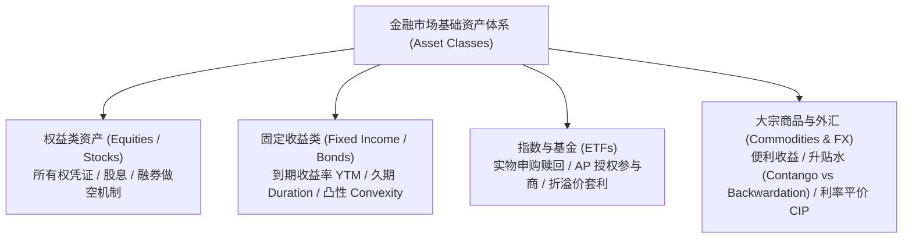
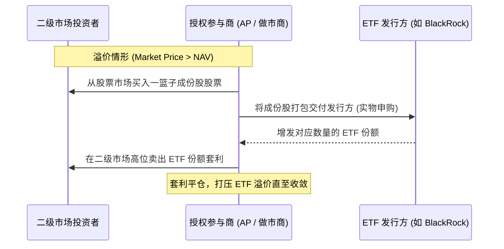
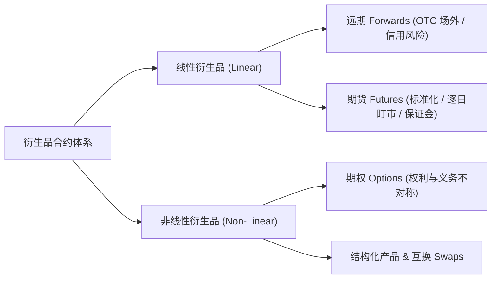
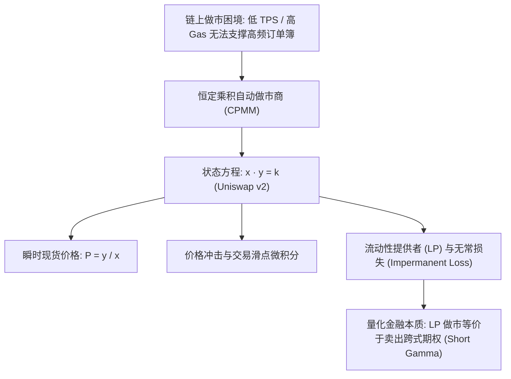
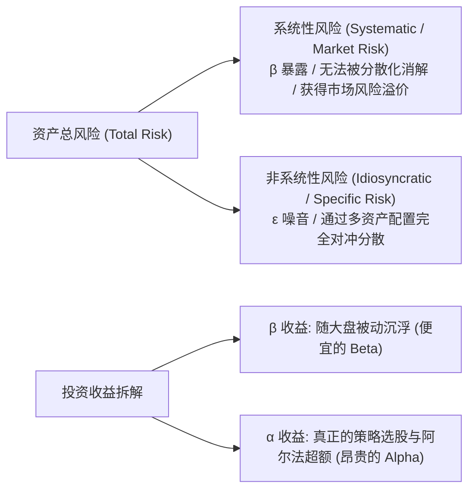

# Quant 14 · 金融工程与量化投资通识：基础资产、衍生品、AMM、资产组合理论与套利定价

> 💡 **学习目标**：建立现代量化金融与金融工程的完整认知地图。从底层四大基础资产（股票、债券、ETF、大宗/外汇）出发，理解线性（期货/远期）与非线性衍生品（期权与五大 Greeks），推导区块链 DeFi 核心机制（恒定乘积 AMM $x \cdot y = k$ 与无常损失严密证明），并掌握量化风险收益度量（夏普/索提诺/MDD）、CAPM 模型（$\alpha$ 与 $\beta$ 分解）、马科维茨有效前沿以及无套利定价原理（期现套利与 Put-Call Parity）。

---

## 模块一：核心金融标的与基础资产体系（The Asset Class Landscape）

在量化交易与金融工程中，所有复杂衍生品和定价模型都建立在基础资产（Underlying Assets）之上。



### 1. 股票与权益资产（Equities / Stocks）

#### （1）本质特征与现金流结构
* **所有权凭证**：普通股（Common Stock）代表持有者对上市公司净资产与未来净现金流的剩余索取权（Residual Claim）；
* **收益来源**：
  $$\text{总收益 (Total Return)} = \text{资本利得 (Capital Gain)} + \text{股息收益 (Dividend Yield)}$$
* **有限责任（Limited Liability）**：股票价值理论下限为 0，多头最大亏损为全部本金（$-100\%$），上行收益无上限。

#### （2）多头（Long）vs 融券做空（Short Selling）机制
* **多头**：以自有资金或融资买入标的资产，预期资产价格上涨；
* **融券做空流程**：
  1. **借券（Borrowing）**：向券商融券池借入股票并立即在现货市场卖出，获得现金；
  2. **等待与归还（Covering）**：在未来某一时刻从市场以当前价格买回等额股票，归还给借出方；
  3. **损益结构**：$\text{PnL} = S_{\text{entry}} - S_{\text{exit}} - \text{借券利息 (Borrow Fee)}$；
* **做空的四大特殊风险**：
  - **不对称亏损**：股价上行无顶，做空理论上面临**无限亏损敞口**；
  - **融券成本（Cost of Borrow / Rebate Rate）**：冷门券或高做空需求券借券费率极高（Hard-to-Borrow, HTB）；
  - **召回风险（Recall Risk）**：原持券人有权随时要求还券，若市场上无流通券补充，空头将被迫平仓；
  - **空头挤压（Short Squeeze）**：股价暴涨触发大量空头保证金追加失败（Margin Call），被迫在市场上踩踏平仓买入，反向推高股价形成正反馈死亡螺旋。

#### （3）现货市场微观结构：限价订单簿（CLOB）
* **限价订单簿（Central Limit Order Book, CLOB）**：所有市场买卖委托按“价格优先、时间优先”排列构成的订单列表；
* **买卖价差（Bid-Ask Spread）**：
  $$\text{Spread} = P_{\text{Ask}} - P_{\text{Bid}}$$
* **Maker 与 Taker**：
  - **Maker（流动性提供者 / 挂单方）**：提交限价单进入订单簿等待撮合，享受佣金返还或低费率；
  - **Taker（流动性消耗者 / 吃单方）**：提交市价单立即与既有挂单撮合，支付流动性成本。

---

### 2. 固定收益与债券（Fixed Income & Bonds）

#### （1）债券核心要素与定价公式
* **面值（Par Value / Face Value, $M$）**：到期偿还的本金（通常为 100 或 1000）；
* **票息率（Coupon Rate, $c$）**：每年支付票息金额 $C = c \cdot M$；
* **到期收益率（Yield to Maturity, YTM, $y$）**：使债券未来现金流折现现值严格等于当前市场价格 $P$ 的内部收益率（IRR）：
  $$P = \sum_{t=1}^T \frac{C}{(1 + y)^t} + \frac{M}{(1 + y)^T}$$

#### （2）利率敏感度分析：久期（Duration）与凸性（Convexity）
对债券定价公式关于收益率 $y$ 进行泰勒级数展开：
$$\frac{\Delta P}{P} \approx - D_{\text{mod}} \cdot \Delta y + \frac{1}{2} \text{Convexity} \cdot (\Delta y)^2$$

* **麦考利久期（Macaulay Duration, $D_{\text{Mac}}$）**：债券各期现金流发生时间的加权平均（权重为现金流现值占比）：
  $$D_{\text{Mac}} = \frac{\sum_{t=1}^T t \cdot \frac{C_t}{(1+y)^t}}{P}$$
* **修正久期（Modified Duration, $D_{\text{mod}}$）**：
  $$D_{\text{mod}} = \frac{D_{\text{Mac}}}{1 + y} = -\frac{1}{P} \frac{dP}{dy}$$
  *物理直觉*：衡量利率变动 $1\%$（100 bps）时债券价格的一阶百分比变动幅度（负号代表利率与债券价格反向运动）。
* **凸性（Convexity）**：
  $$\text{Convexity} = \frac{1}{P} \frac{d^2 P}{dy^2}$$
  *物理直觉*：价格-收益率曲线的二阶曲率。由于 $\text{Convexity} > 0$，利率下跌时价格上涨幅度**大于**久期线性估算，利率上涨时价格下跌幅度**小于**久期估算。**凸性是债券持有者对抗利率剧烈波动的二阶免费保护垫**。

---

### 3. ETF 与指数基金（Exchange-Traded Funds）

#### （1）ETF 的生命线：一级市场实物申购/赎回机制
传统共同基金（Mutual Fund）只能在收盘后按净值（NAV）申赎现金，而 ETF 之所以能在二级市场全天像股票一样高流动性交易且价格极少偏离净值，核心依赖**授权参与商（Authorized Participants, AP）的实物申赎机制**：



* **溢价套利（Trading at Premium: $P_{\text{ETF}} > \text{NAV}$）**：
  AP 在股市低价买入一篮子成份股，向发行方实物申购（Creation）换成 ETF 份额，再在二级市场高价卖出 ETF 份额，锁定无风险价差。
* **折价套利（Trading at Discount: $P_{\text{ETF}} < \text{NAV}$）**：
  AP 在二级市场低价买入 ETF 份额，向发行方实物赎回（Redemption）换回一篮子成份股，再在股市卖出成份股套利。

#### （2）量化评估指标
* **跟踪误差（Tracking Error, TE）**：ETF 收益率与标的指数收益率差值的样本标准差：
  $$\text{TE} = \sqrt{\frac{1}{T-1} \sum_{t=1}^T (R_{\text{ETF}, t} - R_{\text{Index}, t} - \overline{\Delta R})^2}$$

---

### 4. 大宗商品与外汇（Commodities & FX）

#### （1）大宗商品持有成本模型（Cost of Carry）
大宗商品现货价格 $S_0$ 与期货价格 $F_0$ 的基本无套利关系受仓储成本 $u$ 与便利收益（Convenience Yield, $y$）决定：
$$F_0 = S_0 e^{(r + u - y)T}$$
* **便利收益（Convenience Yield, $y$）**：在供应链中断危机中，持有实物现货而非纸面期货合约所带来的隐含经营安全价值；
* **升水（Contango, $F_0 > S_0$）**：仓储成本与无风险利率高于便利收益，远期价格高于现货价格。滚动展期（Roll）产生负收益；
* **贴水 / 现货溢价（Backwardation, $F_0 < S_0$）**：现货极度紧缺，便利收益极高，远期价格低于现货。展期产生正收益。

#### （2）外汇抛补利率平价（Covered Interest Parity, CIP）
在没有资本管制的有效市场中，通过远期合约锁汇的跨国借贷无套利平衡关系为：
$$F = S \cdot \frac{1 + r_d}{1 + r_f} \quad \left( \text{连续复利形式: } F = S e^{(r_d - r_f)T} \right)$$
其中 $S$ 为即期汇率（直接标价法），$r_d$ 为本国利率，$r_f$ 为外国利率。

---

## 模块二：传统金融衍生品家族（Derivatives: Linear vs. Non-Linear）



### 1. 远期（Forwards）与期货（Futures）

* **共同核心**：在约定的未来时间 $T$，以约定价格 $K$ 强制买卖标的资产，**双方均承担绝对履约义务**；
* **期货独有机制**：
  - **初始保证金（Initial Margin）与维持保证金（Maintenance Margin）**：杠杆倍数 $\approx \frac{1}{\text{Margin Ratio}}$；
  - **逐日盯市（Mark-to-Market, MTM）**：每个交易日结算亏损并从保证金账户划扣，彻底消除了对手方的累积违约信用风险。
* **现货-期货平价与期现套利（Cash-and-Carry Arbitrage）**：
  若资产持有收益率为连续红利 $q$，无套利理论期货价格为：
  $$F_0 = S_0 e^{(r - q)T}$$
  - 当 $F_{\text{market}} > S_0 e^{(r - q)T}$：**正向套利**（借钱买入现货，同时卖出等量期货，锁定无风险升水收益）；
  - 当 $F_{\text{market}} < S_0 e^{(r - q)T}$：**反向套利**（融券卖空现货，将现金借出吃利息，同时买入期货）。

---

### 2. 期权（Options）架构与收益不对称性

#### （1）权利与义务不对称性
* **买方（Long Option）**：支付初始权利金（Premium），享有行权权利，无强制履约义务。**最大亏损锁定为权利金，收益理论无限**；
* **卖方（Short Option）**：收取初始权利金，承担被动履约的无条件义务。**最大收益锁定为权利金，尾部亏损风险极高**。

#### （2）到期损益（Payoff）与状态分类
| 期权类型 | 到期 Payoff 公式 | 实值 (ITM) | 平值 (ATM) | 虚值 (OTM) |
|---|---|---|---|---|
| **看涨期权 (Call)** | $\max(S_T - K, 0)$ | $S_t > K$ | $S_t \approx K$ | $S_t < K$ |
| **看跌期权 (Put)** | $\max(K - S_T, 0)$ | $S_t < K$ | $S_t \approx K$ | $S_t > K$ |

$$\text{期权市场价格} = \text{内在价值 (Intrinsic Value)} + \text{时间价值 (Time Value)}$$
在到期前，平值期权（ATM）的时间价值最大。

#### （3）期权核心希腊字母（The Greeks）直觉图谱

| 希腊字母 | 数学定义 | 交易物理含义 | 做市商管理意义 |
|---|---|---|---|
| **Delta ($\Delta$)** | $\frac{\partial V}{\partial S}$ | 标的资产每变动 \$1，期权价值的瞬时变动额；等价于**方向性风险暴露**与**等价股票对冲股数** | 建立 Delta 中性（$\Delta_{\text{port}} = 0$）以对冲现货一阶涨跌风险 |
| **Gamma ($\Gamma$)** | $\frac{\partial^2 V}{\partial S^2} = \frac{\partial \Delta}{\partial S}$ | 期权价值随股价变化的**二阶曲率 / 加速度**；衡量 Delta 对股价波动的敏感度 | Gamma 越高，股价变动时对冲仓位调仓越频繁，构成 **Gamma Scalping 现金流的基础** |
| **Theta ($\Theta$)** | $\frac{\partial V}{\partial t}$ | **时间流逝损耗率**。期权买方持仓每天自然流失的时间价值（通常 $\Theta < 0$） | 波动率做市商付出的持仓“保费 / 租金” |
| **Vega ($\nu$)** | $\frac{\partial V}{\partial \sigma}$ | 隐含波动率变动 $1\%$，期权价格的绝对变动量 | 纯粹的波动率敞口，对冲市场恐慌与不确定性 |
| **Rho ($\rho$)** | $\frac{\partial V}{\partial r}$ | 市场无风险利率变动 $1\%$ 带来的期权价格敏感度 | 资金借贷成本敏感度 |

> 🔗 **直通高级篇**：做市商为了消除方向性风险，会建立 Delta 中性组合；而正是因为期权具有凸性（$\Gamma > 0$），在标的资产随机震荡时会迫使算法在高位卖出现货、低位买入现货，从而赚取二阶伊藤现金流 $\frac{1}{2}\Gamma S^2 \sigma^2 dt$ 来抵消 $\Theta dt$ 衰减。这正是 [[Quant12 Brownian Motion Ito Calculus Stopping Times and Options.md#2-经典应用二期权多头-gamma-与-delta-动态对冲现金流机制gamma-scalping|Quant 12 经典应用二：Gamma Scalping]] 的底层金融根基！

---

## 模块三：去中心化金融与自动做市商（DeFi & AMM Primitives）

在区块链与加密原生金融（Web3）中，受制于链上 TPS 吞吐瓶颈与高昂 Gas 费，传统高频订单簿（CLOB）无法直接部署，由此催生了**自动做市商（Automated Market Maker, AMM）**机制。



### 1. 恒定乘积做市商（CPMM, Uniswap v2）数学模型

设流动性池中包含代币 $X$（数量 $x$）和代币 $Y$（数量 $y$）。池子的核心不变量由公式锁定：
$$x \cdot y = k$$

#### （1）边际现货价格（Spot Price）
对状态方程两边对 $x$ 求全微分：
$$y dx + x dy = 0 \implies -\frac{dy}{dx} = \frac{y}{x}$$
因此以代币 $X$ 标价代币 $Y$ 的现货边际价格为：
$$P = \frac{y}{x}$$

#### （2）兑换方程与价格滑点（Slippage）推导
交易者输入 $\Delta x$ 个代币 $X$，想要兑换出 $\Delta y$ 个代币 $Y$。
由池子乘积守恒条件：
$$(x + \Delta x)(y - \Delta y) = k = x y$$
解出交易者得到的代币 $Y$ 数量：
$$\Delta y = y - \frac{xy}{x + \Delta x} = \frac{y \cdot \Delta x}{x + \Delta x}$$

实际成交均价 $P_{\text{exec}}$ 为：
$$P_{\text{exec}} = \frac{\Delta y}{\Delta x} = \frac{y}{x + \Delta x} = \frac{P_{\text{spot}}}{1 + \frac{\Delta x}{x}}$$
* **微观洞察**：
  - 当输入规模 $\Delta x \ll x$ 时，$P_{\text{exec}} \approx P_{\text{spot}}$，几乎无滑点；
  - 当交易规模相对于池子不可忽略时，买入代价急剧上升。这就是 AMM 天然内建的**价格自稳定机制与非线性价格冲击（Price Impact）**。

---

### 2. 无常损失（Impermanent Loss, IL）严密数学证明

流动性提供者（LP）将资产注入 AMM 池赚取手续费，但面临外部市场价格变动带来的资产折损——无常损失（Impermanent Loss）。

#### （1）严格数学推导
1. **初始状态**：池中有 $x_0$ 份代币 $X$ 和 $y_0$ 份代币 $Y$，现货价格为 $P_0 = \frac{y_0}{x_0}$。
   LP 注入的总资产初始市值（以 $Y$ 计价）为：
   $$V_0 = x_0 P_0 + y_0 = x_0 \left( \frac{y_0}{x_0} \right) + y_0 = 2 y_0$$
2. **外部价格变动**：假设外部市场发生套利，代币 $X$ 的价格变为 $P_1 = k P_0$（$k > 0$ 为价格变动乘数）。
   套利者搬砖使得池内现货价格收敛到 $P_1$：
   $$\frac{y_1}{x_1} = P_1 = k P_0 = k \frac{y_0}{x_0}, \quad x_1 y_1 = k_0 = x_0 y_0$$
3. **联立求解新池子资产数量**：
   $$x_1 = \frac{x_0}{\sqrt{k}}, \qquad y_1 = y_0 \sqrt{k}$$
4. **价值对比**：
   * **若留在池内（LP 组合当前市值）**：
     $$V_{\text{LP}} = x_1 P_1 + y_1 = \left( \frac{x_0}{\sqrt{k}} \right) (k P_0) + y_0 \sqrt{k} = x_0 P_0 \sqrt{k} + y_0 \sqrt{k} = 2 y_0 \sqrt{k}$$
   * **若不提供流动性、直接在钱包持有两币（HODL 策略）**：
     $$V_{\text{HODL}} = x_0 P_1 + y_0 = x_0 (k P_0) + y_0 = y_0 k + y_0 = y_0 (1 + k)$$
5. **无常损失比例（IL Ratio）公式**：
   $$\text{IL}(k) = \frac{V_{\text{LP}}}{V_{\text{HODL}}} - 1 = \frac{2 \sqrt{k}}{1 + k} - 1 = \frac{2 \sqrt{k} - (1 + k)}{1 + k} = -\frac{(\sqrt{k} - 1)^2}{1 + k}$$

#### （2）极值与不等式分析
根据基本算术-几何均值不等式（AM-GM Inequality）：
$$\frac{1 + k}{2} \ge \sqrt{k}, \quad \text{当且仅当 } k = 1 \text{ 时取等号}$$
因此对任意 $k \neq 1$：
$$\text{IL}(k) \le 0 \quad \text{恒成立！}$$

```text
价格变动倍数 k      0.25 (-75%)   0.50 (-50%)   1.00 (无变动)   2.00 (+100%)   4.00 (+300%)
无常损失率 IL(k)     -5.72%        -2.02%        0.00%         -2.02%         -5.72%
```

#### （3）量化交易员视角的物理映射：LP 的本质是卖出 Gamma（Short Gamma）
* **为什么叫“无常”？** 若价格在波动后又重新回到起点（$k = 1$），则损失归零；
* **衍生品等价性**：
  - 股价上涨时，套利者向池子输入便宜代币，LP 被动卖出升值代币；
  - 股价下跌时，套利者向池子倾倒贬值代币，LP 被动吸收跌价代币；
  - **结论：LP 做市收益曲线完全等价于卖出跨式期权（Short Strangle / Short Gamma）！** LP 靠赚取交易摩擦手续费（相当于收取 Option Premium）生存，但承受单边极端单边趋势下的凸性大回撤。

---

## 模块四：现代投资组合理论与风险收益度量（Portfolio Theory & Performance）

量化投资的核心哲学：**在控制风险的前提下最大化收益，或在给定风险预算下寻找最优收益配置**。

### 1. 风险与收益的度量体系

#### （1）期望收益与波动率
* **日收益率向量**：$\mathbf{R} = [R_1, R_2, \dots, R_N]^T$，期望均值 $\boldsymbol{\mu} = \mathbb{E}[\mathbf{R}]$；
* **协方差矩阵**：$\boldsymbol{\Sigma} = \mathbb{E}[(\mathbf{R} - \boldsymbol{\mu})(\mathbf{R} - \boldsymbol{\mu})^T]$；
* **投资组合权重**：$\mathbf{w} = [w_1, w_2, \dots, w_N]^T$，$\sum w_i = 1$；
* **组合期望收益率与组合方差**：
  $$\mu_p = \mathbf{w}^T \boldsymbol{\mu}, \qquad \sigma_p^2 = \mathbf{w}^T \boldsymbol{\Sigma} \mathbf{w}$$

#### （2）四大核心量化评价指标
1. **夏普比率（Sharpe Ratio, SR）**：
   $$\text{SR} = \frac{\mathbb{E}[R_p] - R_f}{\sigma_p}$$
   衡量投资组合承担**每一单位总风险（标准差）**所获得的超额回报。
2. **索提诺比率（Sortino Ratio）**：
   $$\text{Sortino} = \frac{\mathbb{E}[R_p] - R_f}{\sigma_{\text{down}}}$$
   *洞察*：普通标准差将大幅正收益（惊喜暴赚）和大幅负收益一视同仁。索提诺仅计算下行半方差（Downside Deviation $\sigma_{\text{down}} = \sqrt{\frac{1}{T}\sum \min(R_t - R_f, 0)^2}$），更真实地刻画下行破产风险。
3. **最大回撤（Maximum Drawdown, MDD）与卡玛比率（Calmar Ratio）**：
   $$\text{MDD} = \max_{0 \le s \le t \le T} \frac{P_s - P_t}{P_s}, \qquad \text{Calmar} = \frac{\text{年化超额收益}}{\text{MDD}}$$
4. **信息比率（Information Ratio, IR）**：
   $$\text{IR} = \frac{\mathbb{E}[R_p - R_{\text{benchmark}}]}{\operatorname{Std}(R_p - R_{\text{benchmark}})} = \frac{\alpha}{\omega}$$
   衡量主动投资策略战胜基准指数的稳定胜率能力。

---

### 2. CAPM 模型与 Alpha / Beta 分解

威廉·夏普（William Sharpe）建立的**资本资产定价模型（CAPM）**将金融资产的总收益拆解为两部分：

$$R_{i, t} - R_f = \alpha_i + \beta_i (R_{m, t} - R_f) + \epsilon_{i, t}$$



#### （1）贝塔系数（Beta, $\beta$）
$$\beta_i = \frac{\operatorname{Cov}(R_i, R_m)}{\operatorname{Var}(R_m)} = \rho_{i, m} \frac{\sigma_i}{\sigma_m}$$
* **含义**：资产对全市场系统性波动的敏感度（$\beta = 1$ 代表与大盘同步波动；$\beta > 1$ 为高弹性进攻型资产；$\beta < 1$ 为防守型资产）。

#### （2）阿尔法（Alpha, $\alpha$）与特雷诺比率（Treynor Ratio）
* **詹森阿尔法（Jensen's Alpha）**：
  $$\alpha_i = \mathbb{E}[R_i] - \left( R_f + \beta_i (\mathbb{E}[R_m] - R_f) \right)$$
  衡量经过市场系统性风险补偿调整后，策略通过择时、选股所创造出的**纯粹超额主动回报**。
* **特雷诺比率（Treynor Ratio）**：$\text{TR} = \frac{\mathbb{E}[R_p] - R_f}{\beta_p}$，衡量承担单位系统性风险的回报。

---

### 3. 马科维茨投资组合理论（Markowitz MPT）与有效前沿

#### （1）分散化原理（Diversification）：金融世界唯一的免费午餐
设两资产组合，权重分别为 $w$ 与 $1-w$，资产相关系数为 $\rho \in [-1, 1]$：
$$\sigma_p^2 = w^2 \sigma_1^2 + (1-w)^2 \sigma_2^2 + 2w(1-w) \rho \sigma_1 \sigma_2$$
若 $\rho < 1$，则必有：
$$\sigma_p < w \sigma_1 + (1-w) \sigma_2$$
**只要资产间并非完全正相关（$\rho < 1$），组合的波动率就严格小于单个资产风险的简单线性加权！通过引入负相关或低相关资产，可以在不牺牲期望收益的前提下极大消减组合方差。**

#### （2）均值-方差优化与有效前沿（Efficient Frontier）
* **优化目标**：
  $$\min_{\mathbf{w}} \frac{1}{2} \mathbf{w}^T \boldsymbol{\Sigma} \mathbf{w} \quad \text{s.t.} \quad \mathbf{w}^T \boldsymbol{\mu} = \mu_{\text{target}}, \quad \mathbf{w}^T \mathbf{1} = 1$$
* **有效前沿**：在期望收益率-方差坐标系中，给定任意期望收益率下方差最小的点构成的上凸边界曲线。

```text
期望收益率 E[R]
     ^
     |              / (资本市场线 CML)
     |             / 
     |            /|  切线组合 (Tangency Portfolio / 最大夏普组合)
     |           / |
     |          *--+------------------- 有效前沿 (Efficient Frontier)
     |         /   |                  /
     |        (    |                 /
     |       /|    |                /
     |      * |    |               /   全局最小方差组合 (GMVP)
     |     /  |    |
     |----*   |    |
    Rf   /    |    |
     |  /     |    |
     +----------------------------------------> 组合波动率 σ
```

#### （3）两基金分离定理（Two-Fund Separation Theorem）
当市场引入无风险资产 $R_f$ 时：
1. 所有理性投资者的最优风险资产配置比例完全相同，均指向有效前沿与由无风险利率出发射线的**切点组合（Tangency Portfolio，即夏普比率最高的市场组合）**；
2. 投资者的风险偏好差异，仅仅体现在**在无风险资产 $R_f$ 与切点组合之间的资金配比**。

---

## 模块五：套利定价理论与一价定律（Arbitrage & Pricing）

量化金融建模的核心灵魂不在于预测未来，而在于**无套利均衡约束（No-Arbitrage Equilibrium）**。

### 1. 无套利原则（No-Arbitrage Principle）与一价定律

* **严格套利（Arbitrage Opportunity）的数学定义**：
  存在一个资产组合，满足：
  1. 初始时刻零净成本：$V(0) = 0$；
  2. 未来时刻收益几乎处处非负：$\mathbb{P}(V(T) \ge 0) = 1$；
  3. 未来时刻获得正收益的概率严格大于零：$\mathbb{P}(V(T) > 0) > 0$。
* **一价定律（Law of One Price）**：
  在有效无套利市场中，**两个未来在所有可能状态下产生完全相同现金流的资产组合，在今天的市场价格必须严格相等**。否则，通过“买入低估组合、卖空高估组合”，即可构建无风险套利印钞机。

---

### 2. 经典复制组合应用：看涨-看跌期权平价公式（Put-Call Parity）

通过构建两组投资组合，证明欧式期权之间不可打破的刚性铁律：

#### （1）构造双组合
* **组合 A（Fiduciary Call）**：
  - 买入 1 份欧式看涨期权（价格 $C_t$）；
  - 将行权价贴现现金 $K e^{-r(T-t)}$ 存入银行（在 $T$ 时刻确定获得本息 $K$）；
  - 当前总现值：$V_A(t) = C_t + K e^{-r(T-t)}$。
* **组合 B（Protective Put）**：
  - 买入 1 份欧式看跌期权（价格 $P_t$）；
  - 买入 1 份标的股票现货（价格 $S_t$）；
  - 当前总现值：$V_B(t) = P_t + S_t$。

#### （2）到期日 $T$ 的状态现金流检验
* **若 $S_T > K$**：
  - 组合 A：看涨期权行权获得 $S_T - K$，银行取出现金 $K$，总价值 $= (S_T - K) + K = S_T$；
  - 组合 B：看跌期权作废放弃（价值 0），股票现货价值 $S_T$，总价值 $= S_T$；
* **若 $S_T \le K$**：
  - 组合 A：看涨期权放弃（价值 0），银行取出本息 $K$，总价值 $= K$；
  - 组合 B：看跌期权行权获得 $K - S_T$，加上持有的股票卖出获得 $S_T$，总价值 $= (K - S_T) + S_T = K$。

**在到期日 $T$ 的任意市场情境下，均有：$V_A(T) = \max(S_T, K) = V_B(T)$！**

根据一价定律，两组合在时刻 $t$ 的价值必须严格相等：

$$\boxed{C_t + K e^{-r(T-t)} = P_t + S_t}$$

#### （3）套利操作策略
* 若 $C_t + K e^{-r(T-t)} > P_t + S_t$（看涨期权相对高估）：
  - **合成反向转换（Reverse Conversion）**：做空 Call，借钱存现金；做多 Put，做多现货；
* 若 $C_t + K e^{-r(T-t)} < P_t + S_t$（看跌期权与现货相对高估）：
  - **转换套利（Conversion Arbitrage）**：做多 Call，借出现金；做空 Put，做空现货。

---

### 3. 统计套利（Statistical Arbitrage, StatArb）与配对交易（Pairs Trading）

在真实世界高频与量化对冲基金中，纯粹的确定性硬套利机会极其稀缺，量化交易转向了**统计无套利（期望意义下的均值回归）**。


#### （1）相关性（Correlation）vs 协整性（Cointegration）
* **相关性陷阱**：两只非平稳时间序列（如两只长期处于大牛市中的股票）可以表现出高达 $0.99$ 的伪相关性，但价差可能会无限发散；
* **协整性（Cointegration）**：两只本身不平稳的一阶单整序列 $I(1)$，通过线性组合 $\text{Spread}_t = P_{A, t} - \gamma P_{B, t}$ 可以生成一个**平稳的零阶单整序列 $I(0)$**。
  - 物理比喻：醉汉牵着一条小狗，两者的移动轨迹都不平稳（随机游走），但由于狗绳的物理约束，两者之间的距离（价差）呈现强烈的均值回归。

#### （2）Ornstein-Uhlenbeck (OU) 均值回归随机过程
价差序列在连续时间下通常建模为 OU 过程：
$$d X_t = \theta (\mu - X_t) dt + \sigma dW_t$$
* $\theta > 0$：均值回归速率（半衰期 $t_{1/2} = \frac{\ln 2}{\theta}$）；
* $\mu$：长期均衡价差均值；
* $\sigma$：价格扰动波动率。
量化算法利用卡尔曼滤波（Kalman Filter）动态追踪最优对冲比例 $\gamma$，当标准化价差 $|z\text{-score}| > 2$ 时开仓，价差收敛至零轴时止盈离场。

---

## 模块六：金融工程知识图谱与后续实战衔接

| 知识主题 | 本篇通识定位 | 进阶篇章衔接 |
|---|---|---|
| **期权与动态对冲** | 期权 Payoff、五大 Greeks、做市商 Delta 中性 | [[Quant12 Brownian Motion Ito Calculus Stopping Times and Options.md|Quant 12 · 布朗运动、伊藤微积分与期权交易应用]] |
| **鞅论与风险中性定价** | 无套利原则、贴现折现因子 | [[Quant10 Betting Risk Neutral Pricing Martingales.md|Quant 10 · 赌博策略、风险中性定价与离散鞅]] |
| **停时与自由边界** | 美式期权提前行权机制 | [[Quant11 Martingales Stopping Times Random Walks.md|Quant 11 · 鞅、停时理论与随机游走]] |
| **博弈论与做市商博弈** | 订单簿微观结构、流动性买卖博弈 | [[Quant13 Game Theory and Strategic Decision Making.md|Quant 13 · 博弈论与策略性决策]] |
