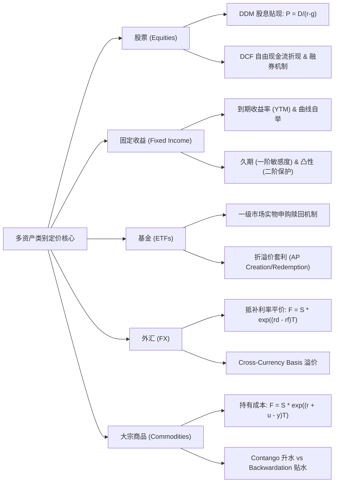
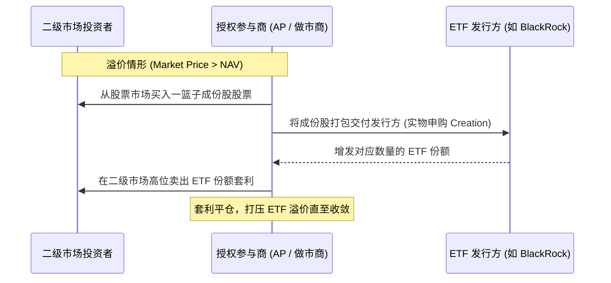
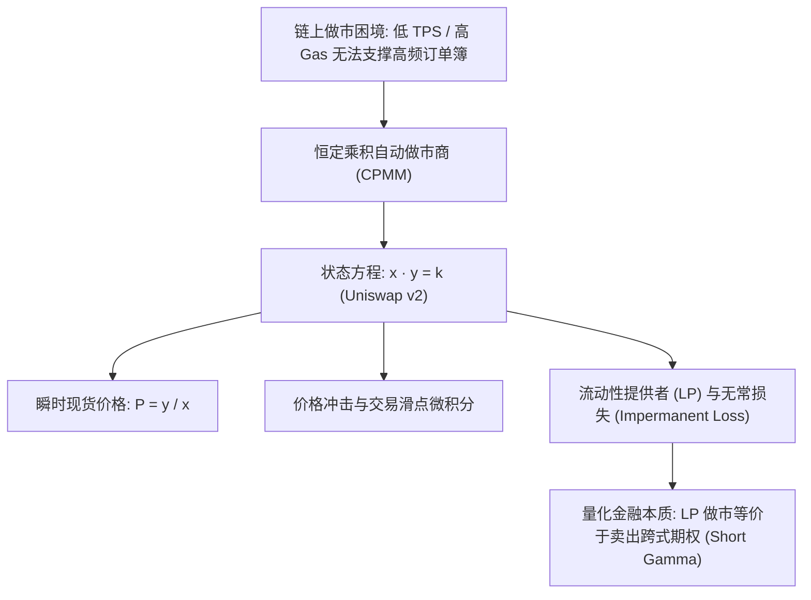

```mermaid
graph TD
    A["现代量化金融知识架构"] --> B["微观结构与执行<br>(LOB, Impact, Market Making)"]
    A --> C["多资产类别基础<br>(Equities, Rates, ETFs, FX, Commodities)"]
    A --> D["DeFi & AMM 微观机制<br>(CPMM, Impermanent Loss, Short Gamma)"]
    A --> E["衍生品深度大师课<br>(Forwards, Swaps, BSM, Greeks, Vol Surface)"]
    A --> F["组合理论与资产配置<br>(Mean-Variance, CAPM, Multi-Factor, Risk Parity)"]
    
    B --> B1["L1/L2/L3 订单簿 & Micro-Price"]
    B --> B2["Almgren-Chriss 最优执行"]
    B --> B3["Avellaneda-Stoikov 做市库存"]
    
    C --> C1["现金流折现 (DCF, DDM) & 融券做空"]
    C --> C2["久期 (Duration) & 凸性 (Convexity)"]
    C --> C3["ETF 实物申赎折溢价套利"]
    C --> C4["利率平价 (CIP/UIP) & 大宗商品升贴水"]
    
    D --> D1["恒定乘积公式: x · y = k"]
    D --> D2["无常损失严密证明: IL(k) ≤ 0"]
    
    E --> E1["持有成本模型 (Cost of Carry)"]
    E --> E2["BSM PDE 严格推导与鞅解"]
    E --> E3["希腊字母 & Gamma Scalping 现金流"]
    E --> E4["波动率偏斜 (Skew) & 局部/随机波动率"]
    
    F --> F1["马科维茨有效前沿矩阵拉格朗日推导"]
    F --> F2["CAPM & 证券市场线 (SML)"]
    F --> F3["Barra 多因子结构化风险模型"]
    F --> F4["风险平价 (Equal Risk Contribution)"]
```

# Quant 14 · 金融市场微观结构、多资产类别、衍生品全景与现代投资组合理论（Financial Markets, Asset Classes, Derivatives & Portfolio Theory）

在华尔街顶尖量化对冲基金与自营交易公司（如 Jane Street, Citadel, Millennium, Two Sigma, Optiver, IMC, SIG, Jump Trading）的量化研究员（QR）与量化交易员（QT）面试中，**金融市场微观机制、多资产定价、衍生品数学建模与现代投资组合理论**构成了核心专业能力框架。无论是做市商在订单簿毫秒级维度的报价博弈，还是统计套利、CTA、多因子股票组合的构建，亦或是期权做市团队对希腊字母和波动率曲面的动态风控，这四根支柱缺一不可。

本文以**教科书级的深度与严密数学推导**，系统性拆解金融市场底层逻辑，全面涵盖市场微观结构、基础资产（股票、债券、ETF、大宗、外汇）、去中心化金融（AMM 与无常损失）、远期期货互换、Black-Scholes-Merton (BSM) 偏微分方程全推导、希腊字母体系与波动率曲面，以及马科维茨有效前沿、CAPM、Barra 多因子模型与风险平价（Risk Parity）理论。

```text
金融市场与衍生品投资组合核心思维框架：
1. 市场微观与订单簿：价格不是平滑的连续几何路径，而是限价订单簿（LOB）离散队列的撮合结果。微观价格（Micro-price）根据挂单失衡度（Imbalance）修正中间价。做市商的核心挑战是在逆向选择（知情交易者）与库存风险之间寻找动态平衡（Avellaneda-Stoikov）。
2. 固定收益与折现逻辑：任何资产的定价本质都是未来现金流在风险调整测度下的贴现。债券久期是有效到期时间（一阶利率敏感度），凸性是二阶保护；期限结构自举（Bootstrapping）是无套利提取零息利率的基础。
3. 衍生品与无套利定价：衍生品定价的核心不是预测未来走势，而是寻找无套利复制组合。远期与期货通过持有成本模型锁定基差；期权通过动态 Delta 对冲消去标的资产的随机性，导出 BSM 偏微分方程与鞅测度下的期望。
4. 希腊字母与能量守恒：做多 Gamma 意味着享有价格变动的凸性红利，但必须支付 Theta（时间衰减）；BSM PDE 揭示了 Gamma 与 Theta 之间的动态平衡。对冲不是消灭风险，而是将方向性风险（Delta）转换为波动率风险（Vega）与曲率风险（Gamma）。
5. 现代投资组合理论：分散化是金融学中唯一的“免费午餐”。马科维茨均值-方差优化给出了有效前沿，但对输入误差极度敏感；风险平价（Risk Parity）抛弃收益预测，聚焦于均衡各资产的边际风险贡献（MRC），奠定了全天候配置的基石。
```

---



---

## 模块一：金融市场架构与微观结构（Financial Markets & Market Microstructure）

### 1. 交易场所机制与连续双向拍卖（Exchange & Limit Order Book）

现代电子交易所（如 CME、NASDAQ、NYSE、Binance）的核心机制是**连续双向拍卖机制（Continuous Double Auction, CDA）**，由**限价订单簿（Limit Order Book, LOB）**驱动。

```
          卖盘 (Asks / Offers)
 Level 3: $100.03  |  15,000 股
 Level 2: $100.02  |   8,200 股
 Level 1: $100.01  |   3,500 股  <--- 最优卖价 (Best Ask / Offer)
------------------------------------ 买卖价差 Spread = $0.02
 Level 1: $99.99   |   4,100 股  <--- 最优买价 (Best Bid)
 Level 2: $99.98   |   9,600 股
 Level 3: $99.97   |  22,000 股
          买盘 (Bids)
```

#### 核心订单类型与撮合优先级
- **限价单（Limit Order, LO）**：指定价格与数量挂在订单簿中，提供流动性（Maker），但承担执行不确定性与逆向选择风险。
- **市价单（Market Order, MO）**：以对手方最优价格立即成交，消耗流动性（Taker），保证立即执行但支付买卖价差（Spread）并承担市场冲击。
- **挂钩单（Pegged Orders）**：根据当前对手盘或中间价动态跟踪浮动报价，常见于暗池（Dark Pools）与高级电子经纪商。
- **冰山单（Iceberg Orders）**：仅公开显示极小比例的挂单量（Display Size），剩余大额数量在后台隐蔽，防止冲击订单簿心理价位。
- **撮合优先级原则**：
  - **价格优先（Price Priority）**：更高买价优于更低买价；更低卖价优于更高卖价。
  - **时间优先（Time Priority / FIFO）**：相同价位下，先到达的订单先撮合成交。
  - **比例分配（Pro-Rata）**：常见于短期利率期货（如 CME SOFR 期货），相同价位下按各家挂单量占总深度的比例分配成交额。

---

### 2. 订单簿微观度量与微观价格（LOB Metrics & Micro-Price）

#### （1）买卖价差（Bid-Ask Spread）与中间价（Mid-Price）
设最优买价为 $P_b$，最优卖价为 $P_a$，对应档位挂单量分别为 $Q_b, Q_a$：

$$
S = P_a - P_b, \quad P_{\text{mid}} = \frac{P_a + P_b}{2}
$$

中间价未考虑挂单深度不对称性。若买一挂单 10,000 股，卖一仅挂 100 股，下一笔成交向上突破中间价的概率远高于向下突破。

#### （2）订单簿失衡度（Order Book Imbalance, OBI）与微观价格（Micro-Price）
定义 L1 买卖失衡度：

$$
I = \frac{Q_b - Q_a}{Q_b + Q_a} \in [-1, 1]
$$

**微观价格（Micro-Price）**通过将买卖量反向加权，修正中间价偏倚：

$$
P_{\text{micro}} = \frac{Q_b P_a + Q_a P_b}{Q_b + Q_a} = P_b + \frac{Q_b}{Q_b + Q_a}(P_a - P_b) = P_{\text{mid}} + \frac{1}{2} I \cdot S
$$

微观价格在毫秒级预测未来短周期价格走势方面显著优于朴素中间价，是高频做市与执行算法的基础特征。

#### （3）订单流毒性度量：VPIN (Volume-Synchronized Probability of Toxicity)
知情交易者进入市场时，会单边大举吃掉对手盘流动性。Easley 等人提出的 VPIN 模型将交易流按**等成交量区间（Volume Buckets）**切分，统计各区间内买方发起量与卖方发起量的失衡度：

$$
\text{VPIN} = \frac{\sum_{\tau=1}^N |V_\tau^B - V_\tau^S|}{N \cdot V}
$$

其中 $V$ 为每个 Bucket 的固定成交量，$V_\tau^B, V_\tau^S$ 分别为利用 BVC（Bulk Volume Classification）估算的买/卖成交量。VPIN 飙升预示着知情交易暴增与流动性枯竭（如 2010 年闪崩 Flash Crash）。

---

### 3. 市场冲击与最优执行模型（Market Impact & Execution）

大额订单直接发送至市场会造成显著的价格滑点（Slippage）。量化交易必须将大单拆分执行。

#### （1）市场冲击分类
- **瞬时冲击（Temporary Impact）**：由于瞬间吃光浅层深度而偏离的价格，随着流动性提供者重新挂单补全，价格迅速回弹。
- **永久冲击（Permanent Impact）**：知情交易向市场泄露了信息，导致市场共识价格永久性位移。Kyle (1985) 模型指出永久冲击与交易量成正比：

$$
\Delta P_{\text{perm}} = \lambda \cdot Q
$$

其中 $\lambda$ 称为 **Kyle's Lambda**（逆流动性参数）。

#### （2）Almgren-Chriss (2000) 最优执行框架
设交易者需在时间 $[0, T]$ 内将持仓 $X_0$ 清零。将时间离散化为 $N$ 步，$t_k = k \tau$。交易轨迹为 $x_k$（持仓量），交易速率 $v_k = (x_{k-1} - x_k)/\tau$。

价格演化满足：

$$
S_k = S_{k-1} + \sigma \tau^{1/2} \xi_k - \tau \gamma(v_k)
$$

目标是极小化**期望执行成本与持仓方差的加权惩罚**（风险厌恶系数 $\lambda_{\text{risk}}$）：

$$
\min_{\{x_k\}} \mathbb{E}[x_{\text{cost}}] + \lambda_{\text{risk}} \operatorname{Var}(x_{\text{cost}})
$$

在永久冲击为线性 $\gamma(v) = \gamma v$、瞬时冲击为线性 $\eta(v) = \eta v$ 的假设下，变分法导出的最优轨迹为双曲正弦函数：

$$
x_j = \frac{\sinh(\kappa (T - t_j))}{\sinh(\kappa T)} X_0, \quad \kappa \approx \sqrt{\frac{\lambda_{\text{risk}} \sigma^2}{\eta}}
$$

- 当 $\lambda_{\text{risk}} \to 0$ 时，$\kappa \to 0$，$x_j$ 退化为线性直线，对应 **TWAP（时间加权平均算法）**；
- 当交易者高度厌恶风险（$\lambda_{\text{risk}}$ 很大）时，轨迹迅速下凹，交易者在前段极快执行以消除未来价格波动风险。

---

### 4. 做市商博弈与库存风险管理（Avellaneda-Stoikov 模型）

做市商（Market Maker, MM）通过双边挂单赚取买卖价差（Spread），面临两大风险：
1. **逆向选择风险（Adverse Selection）**：买到跌势资产，卖给涨势资产；
2. **库存风险（Inventory Risk）**：持仓偏离目标敞口，承受标的资产价格波动。

Avellaneda 与 Stoikov (2008) 建立了连续时间做市优化模型。设标的遵循 $dS_t = \sigma dW_t$，做市商当前库存为 $q$。
做市商对资产的**主观评价价格（Reservation Price / Indifference Price）**为：

$$
r(s, q, t) = s - q \gamma \sigma^2 (T - t)
$$

其中 $\gamma$ 为做市商风险厌恶系数，$T - t$ 为剩余交易时间。
- 若 $q > 0$（持有多头库存），$r < s$，做市商必须降低中间评价，促使其下调挂单价格（更靠近卖价，远离买价），以此吸引买单成交、抑制多头累积；
- 最优买卖挂单距离 $\delta_a^*, \delta_b^*$ 围绕 $r(s, q, t)$ 对称分布，实现库存自适应回正（Mean-reverting inventory）。

---

## 模块二：多资产类别核心机制与定价逻辑（Asset Classes Deep Dive）



### 1. 股票市场与权益资本（Equities）

#### （1）多头（Long）vs 融券做空（Short Selling）机制
- **多头**：以自有资金或融资买入标的资产，享有资本利得与分红，下行损失受限于 100% 本金。
- **融券做空流程**：
  1. **借券（Borrowing）**：向券商借入股票并在现货市场卖出，获得现金；
  2. **等待与归还（Covering）**：在未来某一时刻从市场以当前市价买回等额股票还给出借方；
  3. **损益结构**：$\text{PnL} = S_{\text{entry}} - S_{\text{exit}} - \text{借券利息 (Borrow Fee)}$。
- **做空的四大核心风险**：
  - **无限亏损敞口**：股价理论上没有上涨上限；
  - **借券成本（Cost of Borrow / Rebate Rate）**：流动性差的股票被归为 Hard-to-Borrow (HTB)，借券年化利率可能高达数十甚至上百个百分点；
  - **召回风险（Recall Risk）**：出借人有权随时要求赎回股票，若市场券源枯竭，空头将被迫平仓；
  - **空头挤压（Short Squeeze）**：股价快速飙升逼迫空头集中平仓买入，踩踏推高价格形成正反馈螺旋。

#### （2）股息贴现模型（Dividend Discount Model, DDM）
Gordon 恒定增长模型假设未来股息以恒定比率 $g$ 增长，贴现率（权益资本成本）为 $r_e$：

$$
P_0 = \sum_{t=1}^\infty \frac{D_0 (1+g)^t}{(1+r_e)^t} = \frac{D_1}{r_e - g} \quad (r_e > g)
$$

#### （3）现金流折现（Discounted Cash Flow, DCF）与加权平均资本成本（WACC）
企业价值（Firm Enterprise Value, EV）等于无杠杆自由现金流（FCFF）以 WACC 折现：

$$
\text{EV} = \sum_{t=1}^T \frac{\text{FCFF}_t}{(1 + \text{WACC})^t} + \frac{\text{Terminal Value}}{(1 + \text{WACC})^T}
$$

$$
\text{WACC} = \frac{E}{E+D} r_e + \frac{D}{E+D} r_d (1 - \tau_c)
$$

其中 $E, D$ 分别为权益与债务市值，$r_d$ 为税前债务成本，$\tau_c$ 为企业所得税率。

#### （4）除权除息机制（Ex-Dividend / Ex-Rights）
在除息日（Ex-Dividend Date）开盘时，交易所系统扣除分红金额 $D$：

$$
S_{\text{ex}} = S_{\text{cum}} - D
$$

这导致股票期权在除权除息日产生价格跳跃，美式期权持有者面临提前行权的最优停止时机决策。

---

### 2. 固定收益、债券定价与利率风险（Fixed Income & Yield Curve）

#### （1）到期收益率（Yield to Maturity, YTM）
面值为 $M$、年息票为 $C$、剩余期限为 $T$ 的附息债券，当前价格 $P$ 与 YTM $y$ 满足非线性代数方程：

$$
P = \sum_{t=1}^T \frac{C}{(1+y)^t} + \frac{M}{(1+y)^T}
$$

#### （2）零息利率与曲线自举法（Bootstrapping the Yield Curve）
市场国债通常只提供少数离散到期日的平价收益率。自举法利用没有息票剥离风险的零息券或平价附息券递归提取连续即期利率（Spot Rates）$r(t)$。
若已知 $t_1, t_2, \dots, t_{k-1}$ 的折现因子 $Z(t) = e^{-r(t) t}$，对于第 $k$ 只附息债券：

$$
P_k = \sum_{i=1}^{k-1} C_k Z(t_i) + (C_k + M) Z(t_k) \implies Z(t_k) = \frac{P_k - \sum_{i=1}^{k-1} C_k Z(t_i)}{C_k + M}
$$

由此推得连续复合即期利率 $r(t_k) = -\frac{\ln Z(t_k)}{t_k}$。

#### （3）利率风险三剑客：麦考利久期、修正久期与凸性
- **麦考利久期（Macaulay Duration, $D_{\text{mac}}$）**：现金流发生时间的贴现加权平均，反映债券本金与利息收回的平均时间跨度：

$$
D_{\text{mac}} = \frac{\sum_{t=1}^T t \cdot \frac{C_t}{(1+y)^t}}{P}
$$

- **修正久期（Modified Duration, $D_{\text{mod}}$）**：衡量价格对收益率的一阶导数百分比敏感度：

$$
D_{\text{mod}} = \frac{D_{\text{mac}}}{1+y} = - \frac{1}{P} \frac{dP}{dy} \implies \frac{dP}{P} \approx - D_{\text{mod}} \cdot dy
$$

- **DV01 / PV01（Dollar Value of a Basis Point）**：基准利率变动 1 个基点（1 bp = 0.01% = 0.0001）时债券价格的绝对变动金额：

$$
\text{DV01} = - \frac{dP}{10000 \cdot dy} = P \cdot D_{\text{mod}} \cdot 0.0001
$$

- **凸性（Convexity, $C$）**：二阶导数度量，刻画收益率变化对久期的敏感度：

$$
C = \frac{1}{P} \frac{d^2 P}{dy^2} = \frac{\sum_{t=1}^T t(t+1) \frac{C_t}{(1+y)^{t+2}}}{P}
$$

- **二阶泰勒价格展开式**：

$$
\frac{\Delta P}{P} \approx - D_{\text{mod}} \Delta y + \frac{1}{2} C (\Delta y)^2
$$

> **量化面试金律**：对于不含权的普通债券，凸性恒为正（$C > 0$）。这意味着：**无论利率上升还是下降，凸性项 $\frac{1}{2} C (\Delta y)^2$ 永远为正，对持有人有利**！利率下跌时价格上涨幅度大于一阶久期预测，利率上升时价格下跌幅度小于一阶久期预测。凸性越大，抗跌助涨能力越强，因此市场中高凸性债券通常拥有定价溢价（即收益率更低）。

---

### 3. ETF 与指数基金（Exchange-Traded Funds）

#### （1）一级市场实物申购/赎回与折溢价套利
ETF 依靠**授权参与商（Authorized Participants, AP）的实物申赎机制**维持市价与净值（NAV）严格贴合：



- **溢价套利（Trading at Premium: $P_{\text{ETF}} > \text{NAV}$）**：AP 低价买入一篮子成份股，向发行方实物申购 ETF 份额并在二级市场高价卖出，锁定无风险利润并压平溢价。
- **折价套利（Trading at Discount: $P_{\text{ETF}} < \text{NAV}$）**：AP 在二级市场低价买入 ETF 份额，向发行方实物赎回成份股并在股市抛售，推升 ETF 价格消除折价。

#### （2）跟踪误差（Tracking Error, TE）
ETF 收益率与标的指数收益率差值的样本标准差：

$$
\text{TE} = \sqrt{\frac{1}{T-1} \sum_{t=1}^T (R_{\text{ETF}, t} - R_{\text{Index}, t} - \overline{\Delta R})^2}
$$

---

### 4. 外汇市场与国际平价关系（Foreign Exchange & FX Parities）

#### （1）抵补利率平价（Covered Interest Parity, CIP）
设本币无风险利率为 $r_d$（Domestic），外币无风险利率为 $r_f$（Foreign），即期汇率 $S$（1 单位外币兑换本币数），远期汇率 $F$：

$$
F = S \cdot e^{(r_d - r_f)T}
$$

- 若 $r_d > r_f$（本币利率高于外币），$F > S$，外币在远期处于**升水（Forward Premium）**，以抵消本币的高利息收益；
- 若 CIP 被打破，跨国量化团队可通过外汇掉期无风险套利。

#### （2）无抵补利率平价（UIP）与息差交易（Carry Trade）
UIP 认为远期汇率等于市场对未来即期汇率的无偏预期 $\mathbb{E}[S_T] = F$。
然而现实中 **Forward Premium Puzzle（远期溢价之谜）**长期存在：高利率货币未来汇率往往不跌反涨。量化对冲基金借低息货币（如日元 JPY、瑞郎 CHF）、投资高息货币（如澳元 AUD、拉美货币），形成著名的 **FX Carry Trade** 策略。

---

### 5. 大宗商品与现货溢价/期货升水（Commodities）

#### （1）持有成本模型（Cost-of-Carry Model）
对于可储存商品（如原油、黄金、铜），期货定价公式需引入物理**仓储费与保险费率 $u$** 以及持有实物所带来的**便利收益率 $y$（Convenience Yield）**：

$$
F(t, T) = S_t e^{(r + u - y)(T - t)}
$$

- **便利收益（Convenience Yield, $y$）**：持有现货实物库存以防止突发供应链断裂或享受突发溢价所获得的隐性收益。

#### （2）升水与贴水期限结构
- **期货升水（Contango）**：远月合约价格高于近月合约价格（$F_2 > F_1 > S$）。通常发生在现货供给极其过剩、仓储成本极高（$r + u > y$）时。多头展期面临持续负展期收益（Negative Roll Yield，如 2020 年负油价前夕）。
- **现货溢价 / 期货贴水（Backwardation）**：近月价格高于远月价格（$S > F_1 > F_2$）。当现货突发极度短缺时，便利收益 $y \gg r + u$。多头买入远月期货自然享受正展期收益（Positive Roll Yield）。

---

## 模块三：去中心化金融与自动做市商（DeFi & AMM Primitives）

在区块链与加密原生金融（Web3）中，受制于链上 TPS 吞吐瓶颈与高昂 Gas 费，传统高频订单簿（CLOB）无法直接部署，由此催生了**自动做市商（Automated Market Maker, AMM）**机制。



### 1. 恒定乘积做市商（CPMM, Uniswap v2）数学模型

设流动性池中包含代币 $X$（数量 $x$）和代币 $Y$（数量 $y$）。池子的核心不变量由公式锁定：

$$
x \cdot y = k
$$

#### （1）边际现货价格（Spot Price）
对状态方程两边对 $x$ 求全微分：

$$
y dx + x dy = 0 \implies -\frac{dy}{dx} = \frac{y}{x}
$$

因此以代币 $X$ 标价代币 $Y$ 的现货边际价格为：

$$
P = \frac{y}{x}
$$

#### （2）兑换方程与价格滑点（Slippage）推导
交易者输入 $\Delta x$ 个代币 $X$，想要兑换出 $\Delta y$ 个代币 $Y$。由乘积守恒：

$$
(x + \Delta x)(y - \Delta y) = k = x y \implies \Delta y = \frac{y \cdot \Delta x}{x + \Delta x}
$$

实际成交均价 $P_{\text{exec}}$ 为：

$$
P_{\text{exec}} = \frac{\Delta y}{\Delta x} = \frac{y}{x + \Delta x} = \frac{P_{\text{spot}}}{1 + \frac{\Delta x}{x}}
$$

当交易规模相对于池子不可忽略时，买入代价急剧上升，形成 AMM 内建的**价格自稳定机制与非线性价格冲击（Price Impact）**。

---

### 2. 无常损失（Impermanent Loss, IL）严密数学证明

流动性提供者（LP）将资产注入 AMM 池赚取手续费，但面临外部市场价格变动带来的资产折损——无常损失（Impermanent Loss）。

#### （1）严格数学推导
1. **初始状态**：池中有 $x_0$ 份代币 $X$ 和 $y_0$ 份代币 $Y$，现货价格为 $P_0 = \frac{y_0}{x_0}$。LP 注入的总资产初始市值（以 $Y$ 计价）为：
   $$V_0 = x_0 P_0 + y_0 = 2 y_0$$
2. **外部价格变动**：假设代币 $X$ 的价格变为 $P_1 = k P_0$（$k > 0$ 为价格乘数）。套利使得池内现货价格收敛到 $P_1$：
   $$\frac{y_1}{x_1} = P_1 = k \frac{y_0}{x_0}, \quad x_1 y_1 = x_0 y_0$$
3. **联立求解新资产数量**：
   $$x_1 = \frac{x_0}{\sqrt{k}}, \quad y_1 = y_0 \sqrt{k}$$
4. **价值对比**：
   - **LP 组合当前市值**：$V_{\text{LP}} = x_1 P_1 + y_1 = 2 y_0 \sqrt{k}$
   - **直接持有两币（HODL）**：$V_{\text{HODL}} = x_0 P_1 + y_0 = y_0 (1 + k)$
5. **无常损失比例（IL Ratio）公式**：

$$
\text{IL}(k) = \frac{V_{\text{LP}}}{V_{\text{HODL}}} - 1 = \frac{2 \sqrt{k}}{1 + k} - 1 = - \frac{(\sqrt{k} - 1)^2}{1 + k}
$$

#### （2）极值与不等式分析
由算术-几何均值不等式（AM-GM Inequality）：$\frac{1+k}{2} \ge \sqrt{k}$，等号仅在 $k=1$ 成立。因此对任意 $k \neq 1$：

$$
\text{IL}(k) \le 0 \quad \text{恒成立！}
$$

> **量化金融本质剖析**：无常损失说明，**无论外部价格上涨还是下跌，LP 相比于单纯持币不动总是亏损的**！因为 AMM 在价格上涨时自动被动卖出升值代币、买入贬值代币，这在金融工程上完全等价于**卖出跨式期权（Short Straddle / Short Gamma）**。LP 的全部收益必须依靠高额交易手续费（Fee Yield）来覆盖其负 Gamma 带来的下行风险。

---

## 模块四：衍生品深度大师课与数学定价（Derivatives Masterclass）

衍生品是量化金融皇冠上的明珠。我们将从远期、期货、互换出发，全面贯穿 Black-Scholes-Merton 微积分体系、希腊字母对冲与非平坦波动率曲面。

---

### 1. 远期（Forwards）与期货（Futures）机制与定价

```
+-------------------+-----------------------------------+-----------------------------------+
| 维度              | 远期合约 (Forward)                | 期货合约 (Futures)                |
+-------------------+-----------------------------------+-----------------------------------+
| 交易场所          | OTC 场外双边交易 (场外非标准化)   | 集中交易所标准化交易 (CME, etc.)  |
| 违约信用风险      | 存在单边交易对手违约风险          | 交易所清算所担保，几乎零违约风险  |
| 现金流结算        | 到期日一次性结算本金差额          | 每日盯市无负债结算 (Mark-to-Market)|
| 流动性与展期      | 流动性低，定制化，平仓困难        | 极高流动性，随时可反向对冲平仓    |
+-------------------+-----------------------------------+-----------------------------------+
```

#### （1）无套利远期定价推导
设标的资产当前价格 $S_0$，无风险复利 $r$。如果在生命周期内支付离散股息现值为 $\text{PV}(\text{Div})$，或支付连续股息率 $q$：
构造复制组合：
- **组合 A**：一份远期多头合约 + 现金折现值 $K e^{-rT}$；
- **组合 B**：买入 $e^{-qT}$ 份标的资产股票，所有股息全部再投资。
在到期日 $T$，组合 A 价值为 $(S_T - K) + K = S_T$；组合 B 价值为 $e^{-qT} \cdot S_T \cdot e^{qT} = S_T$。
由于在 $T$ 时刻二者终值处处相等，无套利原理要求在 $t=0$ 时刻初值必然相等：

$$
F_0 = S_0 e^{(r - q)T}
$$

#### （2）远期与期货的凸性偏差（Convexity Bias）
当利率为常数时，远期价格与期货价格严格相等。但当**利率 $r$ 本身是随机游走过程**时：
- 若标的资产价格 $S$ 与利率 $r$ **正相关**：当资产上涨时，期货多头获利，结算资金可在更高的利率环境下再投资；当资产下跌时，期货多头亏损，是在更低的利率环境下借款弥补保证金。因此，期货多头比远期多头更有利，此时 **$\text{Futures Price} > \text{Forward Price}$**。
- 反之，若资产与利率负相关，远期价格高于期货价格。

---

### 2. 利率互换（IRS）与信用违约互换（CDS）

#### （1）普通固定-浮动利率互换（Vanilla Interest Rate Swap, IRS）
互换双方约定名义本金 $N$。一方定期支付固定利率 $R_{\text{swap}}$，另一方支付浮动基准利率（如 SOFR、LIBOR）。

```
        固定利率支付方 (Fixed Payer)  ------ 固定利率 R_swap ------>  浮动利率支付方 (Floating Payer)
                                     <----- 浮动利率 SOFR -------- 
```

**互换利率（Swap Rate）闭式推导**：
在合约签署初值时，互换公允价值必须为零（$V_{\text{IRS}} = 0$）。
浮动端每个重置日其价值重回平价面值 1，因此浮动端在 $t=0$ 的现值等价于：

$$
V_{\text{floating}} = 1 - P(0, t_n)
$$

其中 $P(0, t_i)$ 为自零息收益率曲线提取的贴现因子。
固定端支付各期利息，现值为：

$$
V_{\text{fixed}} = \sum_{i=1}^n R_{\text{swap}} \cdot \tau_i \cdot P(0, t_i) + P(0, t_n) \cdot 0 = R_{\text{swap}} \sum_{i=1}^n \tau_i P(0, t_i)
$$

令 $V_{\text{floating}} = V_{\text{fixed}}$，立即解得公允互换利率：

$$
R_{\text{swap}} = \frac{1 - P(0, t_n)}{\sum_{i=1}^n \tau_i P(0, t_i)}
$$

互换利率本质上是**整个贴现期限结构的加权平均**！

#### （2）信用违约互换（Credit Default Swap, CDS）
CDS 为参考实体（Reference Entity）的信用违约提供保险。
- 保护买方定期支付固定年化点差（CDS Spread $s$）；
- 若发生信用违约事件（Bankruptcy, Failure to pay, Restructuring），保护卖方赔偿面值与回收率之差 $(1 - R)$。
设违约到达强度为泊松过程强度 $\lambda$（Hazard Rate），则 $t$ 时刻未违约概率为 $e^{-\lambda t}$。在连续时间一阶近似下：

$$
s \approx (1 - R) \lambda
$$

此式在量化信用交易中用于违约概率与市场利差之间的快速秒级互算。

---

### 3. 期权核心机制与严格无套利边界（Options Fundamentals）

#### （1）看涨与看跌期权内在价值与时间价值
设标的价格为 $S$，行权价为 $K$，到期日为 $T$：
- 欧式看涨期权到期收益：$C_T = \max(S_T - K, 0)$
- 欧式看跌期权到期收益：$P_T = \max(K - S_T, 0)$
任何期权的市场价格 $V$ 均可分解为两部分：

$$
V = \text{内在价值 (Intrinsic Value)} + \text{时间价值 (Time Value / Extrinsic Value)}
$$

其中 Call 的内在价值为 $\max(S - K, 0)$。时间价值来源于标的资产在剩余到期日内的波动潜力（凸性红利）。

#### （2）看涨-看跌平价（Put-Call Parity）严格数学证明与套利表
对于相同标的、相同行权价 $K$ 与相同到期日 $T$ 的欧式期权，设无风险利率为 $r$，标的连续红利率为 $q$：

$$
C_t - P_t = S_t e^{-q(T-t)} - K e^{-r(T-t)}
$$

```
证明（无红利 q = 0 情况）：
构造两个投资组合：
组合 A: 买入 1 份欧式看涨期权 C + 存入无风险现金 K * exp(-r(T-t))
组合 B: 买入 1 份欧式看跌期权 P + 买入 1 股现货 S

考察到期日 T 的终值状态：
情况 1: 若 S_T >= K
- 组合 A: (S_T - K) + K = S_T
- 组合 B: 0 + S_T = S_T
情况 2: 若 S_T < K
- 组合 A: 0 + K = K
- 组合 B: (K - S_T) + S_T = K

结论: 无论 S_T 取何值，两组合在到期日的支付完全恒等！
根据无套利第一基本定理，在任意时刻 t，组合的市场价值必然处处严格相等：
C_t + K e^{-r(T-t)} = P_t + S_t  ==>  C_t - P_t = S_t - K e^{-r(T-t)}。证明完毕。
```

**套利失衡操作表**：
- 若 $C - P > S - K e^{-rT}$（Call 相对被高估）：
  - **策略（Reversal / 反转套利）**：卖出 Call，买入 Put，买入股票 $S$，借入现金 $K e^{-rT}$。期初立即锁定正套利现金流，持有至到期风险完全归零。
- 若 $C - P < S - K e^{-rT}$（Put 相对被高估）：
  - **策略（Conversion / 转换套利）**：买入 Call，卖出 Put，融券卖出股票 $S$，将现金存入无风险资产。

#### （3）美式期权的提前行权边界（Early Exercise Boundary）
- **无股息美式看涨期权定理**：对不分红股票，**美式看涨期权绝不应提前行权**（$C_{\text{American}} \equiv C_{\text{European}}$）。
  - *反证法证明*：由平价公式及 $P \ge 0$，有 $C \ge S - K e^{-r(T-t)} > S - K$（因为 $r > 0$ 导致 $K e^{-r(T-t)} < K$）。若提前行权，只能拿到内在价值 $S - K$；而若在市场上直接卖掉该期权，拿到的价格 $C > S - K$；若想获得股票，行权需立即交出现金 $K$ 损失利息，不如持有期权到期日前再行权。因此提前行权是严格劣势选择。
- **美式看跌期权（American Put）**：当标的股票跌破某个临界行权价格边界 $S^*(t) \le K$（极端情况下 $S \to 0$）时，持有者应当**立即提前行权**。因为看跌期权行权获得现金 $K$，提前行权可以立刻将现金存入银行吃利息，等待到期只会白白损失利息现值。

---

### 4. Black-Scholes-Merton (BSM) 框架全推导与微观直觉

#### （1）几何布朗运动（GBM）假设
在物理测度 $\mathbb{P}$ 下，标的资产价格遵循随机微分方程（SDE）：

$$
\frac{dS_t}{S_t} = \mu dt + \sigma dW_t
$$

其中漂移率 $\mu$ 包含风险溢价，$\sigma$ 为年化恒定波动率，$W_t$ 为标准一维布朗运动。

#### （2）BSM 偏微分方程（BSM PDE）严格推导
设期权衍生品价值为 $V(S, t)$。应用伊藤引理（Itô's Lemma）对 $V(S, t)$ 展开：

$$
dV = \left( \frac{\partial V}{\partial t} + \mu S \frac{\partial V}{\partial S} + \frac{1}{2} \sigma^2 S^2 \frac{\partial^2 V}{\partial S^2} \right) dt + \sigma S \frac{\partial V}{\partial S} dW_t
$$

构造无风险对冲资产组合 $\Pi$：持有 1 份衍生品空头，并做多 $\Delta$ 份标的股票：

$$
\Pi = - V + \Delta \cdot S
$$

该组合在 $dt$ 内的价值增量为：

$$
d\Pi = - dV + \Delta dS = - \left( \frac{\partial V}{\partial t} + \mu S \frac{\partial V}{\partial S} + \frac{1}{2} \sigma^2 S^2 \frac{\partial^2 V}{\partial S^2} \right) dt - \sigma S \frac{\partial V}{\partial S} dW_t + \Delta (\mu S dt + \sigma S dW_t)
$$

整理随机项 $dW_t$ 的系数：

$$
d\Pi = \left( - \frac{\partial V}{\partial t} - \frac{1}{2} \sigma^2 S^2 \frac{\partial^2 V}{\partial S^2} + (\Delta - \frac{\partial V}{\partial S}) \mu S \right) dt + \left( \Delta - \frac{\partial V}{\partial S} \right) \sigma S dW_t
$$

**关键消除随机性步骤**：选取对冲比率 $\Delta = \frac{\partial V}{\partial S}$，使得 $dW_t$ 前的项恒等于零！
此时组合 $\Pi$ 变成了完全无风险的确定性资产。由无套利假定，任何无风险组合的瞬时收益率必须严格等于无风险利率 $r$：

$$
d\Pi = r \Pi dt = r (-V + \Delta S) dt = r \left( -V + S \frac{\partial V}{\partial S} \right) dt
$$

将 $d\Pi$ 表达式两边对齐并消去 $dt$：

$$
- \frac{\partial V}{\partial t} - \frac{1}{2} \sigma^2 S^2 \frac{\partial^2 V}{\partial S^2} = - r V + r S \frac{\partial V}{\partial S}
$$

移项即得名垂青史的 **Black-Scholes-Merton 偏微分方程**：

$$
\frac{\partial V}{\partial t} + r S \frac{\partial V}{\partial S} + \frac{1}{2} \sigma^2 S^2 \frac{\partial^2 V}{\partial S^2} - r V = 0
$$

> **震撼的经济学结论**：方程中**完全不包含主观资产漂移率 $\mu$**！这意味着不管投资者对股票未来涨跌如何乐观或悲观（哪怕 $\mu = +100\%$ 或 $\mu = -50\%$），期权的公允价格完全不受影响。因为通过动态 Delta 对冲，股票的方向性漂移被完全中和对冲掉了。

#### （3）风险中性定价测度与鞅解析解
利用 Girsanov 定理，存在唯一的等价鞅测度（风险中性测度 $\mathbb{Q}$），在 $\mathbb{Q}$ 下折现资产价格过程 $e^{-rt} S_t$ 是鞅，即 $S_t$ 的漂移率被无风险利率 $r$ 替换：

$$
dS_t = r S_t dt + \sigma S_t dW_t^{\mathbb{Q}} \implies S_T = S_0 \exp\left( (r - \frac{1}{2}\sigma^2)T + \sigma \sqrt{T} Z \right), \quad Z \sim \mathcal{N}(0, 1)
$$

期权价值为风险中性期望折现：

$$
C_0 = e^{-rT} \mathbb{E}^{\mathbb{Q}}[(S_T - K)^+] = e^{-rT} \int_{-\infty}^{\infty} \max\left( S_0 e^{(r - \frac{1}{2}\sigma^2)T + \sigma\sqrt{T} z} - K, 0 \right) \frac{1}{\sqrt{2\pi}} e^{-z^2/2} dz
$$

积分的下限满足 $S_T \ge K$，即 $z \ge -d_2$。展开分解为两项后得到闭式解析解：

$$
C(S, K, T, r, \sigma) = S \mathcal{N}(d_1) - K e^{-rT} \mathcal{N}(d_2)
$$

$$
P(S, K, T, r, \sigma) = K e^{-rT} \mathcal{N}(-d_2) - S \mathcal{N}(-d_1)
$$

其中：

$$
d_1 = \frac{\ln(S/K) + (r + \frac{1}{2}\sigma^2)T}{\sigma \sqrt{T}}, \quad d_2 = d_1 - \sigma \sqrt{T} = \frac{\ln(S/K) + (r - \frac{1}{2}\sigma^2)T}{\sigma \sqrt{T}}
$$

$\mathcal{N}(x) = \frac{1}{\sqrt{2\pi}} \int_{-\infty}^x e^{-u^2/2} du$ 为标准正态累积分布函数。

#### （4）$d_1$ 与 $d_2$ 的深刻物理直觉
量化面试中极高频的问题是：“解释 BSM 公式中 $d_1$ 和 $d_2$ 的实际含义是什么？”
- **$\mathcal{N}(d_2)$**：
  在风险中性测度 $\mathbb{Q}$ 下，期权**到期被行权（$S_T > K$）的理论概率**！
  $$\mathbb{Q}(S_T > K) = \mathcal{N}(d_2)$$
  因此，$K e^{-rT} \mathcal{N}(d_2)$ 就是行权成本在当期的期望贴现值。
- **$\mathcal{N}(d_1)$**：
  期权复制组合中的**现货股票对冲份额（Replication Delta $\Delta$）**！
  同时，它代表了以标的资产本身作为计价单位（Numeraire / 股票测度）下，期权到期被行权的概率：
  $$\mathcal{N}(d_1) = \frac{\mathbb{E}^{\mathbb{Q}}[S_T \cdot \mathbf{1}_{\{S_T \ge K\}}]}{S_0 e^{rT}}$$
  因此，$S \mathcal{N}(d_1)$ 正是行权后所收到的股票资产的当前现值。

---

### 5. 希腊字母体系（The Greeks）全解与动态对冲管理

希腊字母是量化交易员调控风险敞口的“仪表盘”。

```
期权价格变动泰勒展开式:
dV ≈ Delta * dS + (1/2) * Gamma * (dS)^2 + Theta * dt + Vega * dσ + Rho * dr
```

| 希腊字母 | 符号 | 欧式 Call 公式 | 经济学含义与对冲角色 |
| :--- | :---: | :--- | :--- |
| **Delta** | $\Delta = \frac{\partial V}{\partial S}$ | $\mathcal{N}(d_1) \in [0, 1]$ | 标的价格一阶敏感度；对冲股票方向性风险的对冲比率 |
| **Gamma** | $\Gamma = \frac{\partial^2 V}{\partial S^2}$ | $\frac{n(d_1)}{S \sigma \sqrt{T}} > 0$ | 凸性风险，Delta 对价格的变动速度；ATM 处最大 |
| **Theta** | $\Theta = \frac{\partial V}{\partial t}$ | $-\frac{S n(d_1)\sigma}{2\sqrt{T}} - r K e^{-rT}\mathcal{N}(d_2)$ | 时间价值流逝（通常为负）；做多 Gamma 的持有成本 |
| **Vega** | $\nu = \frac{\partial V}{\partial \sigma}$ | $S \sqrt{T} n(d_1) > 0$ | 波动率敏感度；Call 与 Put 的 Vega 完全相等 |
| **Rho** | $\rho = \frac{\partial V}{\partial r}$ | $K T e^{-rT} \mathcal{N}(d_2) > 0$ | 无风险利率敏感度 |

*注：$n(x) = \frac{1}{\sqrt{2\pi}} e^{-x^2/2}$ 为标准正态概率密度函数。*

#### （1）Gamma 与 Theta 的能量守恒定理
把希腊字母代入 BSM PDE：

$$
\Theta + r S \Delta + \frac{1}{2} \sigma^2 S^2 \Gamma - r V = 0
$$

对于一个 Delta 中性组合（$\Pi = V - \Delta S$，其价值为 $V - S \Delta$）：

$$
\Theta + \frac{1}{2} \sigma^2 S^2 \Gamma = r \Pi
$$

若无风险利率 $r \approx 0$：

$$
\Theta \approx - \frac{1}{2} \sigma^2 S^2 \Gamma
$$

> **核心交易直觉**：**Theta 与 Gamma 是一对天生的死对头**。做多 Gamma（$\Gamma > 0$）享有标的价格大幅变动带来的凸性盈利，但每天必须吞咽 Theta 的时间价值损失（$\Theta < 0$）；做空 Gamma 每天收割时间流逝收益，但在黑天鹅暴涨暴跌时面临灾难性穿仓。

#### （2）Gamma 剥头皮（Gamma Scalping）与已实现波动率
设交易员持有做多 Gamma 的 Delta 中性期权组合，并按离散时间间隔 $\Delta t$ 调仓。若真实市场实现的波动率为 $\sigma_{\text{realized}}$，而期权开仓时定价的隐含波动率为 $\sigma_{\text{implied}}$，则每次调仓累计的 PnL 为：

$$
d\Pi \approx \frac{1}{2} S^2 \Gamma \left( \sigma_{\text{realized}}^2 - \sigma_{\text{implied}}^2 \right) dt
$$

- 若真实已实现波动率高于买入时付出的隐含波动率（$\sigma_{\text{realized}} > \sigma_{\text{implied}}$），高抛低吸动态对冲即可产生持续的无方向正 Alpha！

#### （3）高阶希腊字母
- **Vanna** ($\frac{\partial^2 V}{\partial S \partial \sigma} = \frac{\partial \Delta}{\partial \sigma}$)：标的价格与波动率的交叉敏感度。在波动率大幅上升时衡量 Delta 的偏移量。
- **Volga / Vomma** ($\frac{\partial^2 V}{\partial \sigma^2} = \frac{\partial \nu}{\partial \sigma}$)**：Vega 对波动率的二阶导数（波动率凸性），构建长端跨式（Straddle）组合不可或缺。
- **Charm** ($\frac{\partial \Delta}{\partial t}$)**：Delta 随时间衰减的速率，指导日终过夜时的 Delta 预先补齐。

---

### 6. 波动率曲面、波动率微笑与超越 BSM（Volatility Surface）

现实交易中，所有期权从业者都知道 BSM 的最大谬误是：**波动率 $\sigma$ 根本不是常数**。

```
       隐含波动率 IV
           |        股票指数典型偏斜 (Skew)         外汇典型微笑 (Smile)
           |             \                             \     /
           |              \                             \   /
           |               \____                         \_/
           +-------------------------> Strike K        --------------> Strike K
                         Deep OTM Put                                ATM
```

#### （1）波动率微笑（Smile）与波动率偏斜（Skew）的微观成因
- **波动率微笑（Smile）**：通常出现在外汇市场，两端深度虚值（OTM Put 和 OTM Call）的隐含波动率都高于平值（ATM），反映了底层资产收益率存在比正态分布更厚的双向**肥尾（Fat Tails / Leptokurtosis）**。
- **波动率偏斜（Skew / Smirk）**：典型见于股票与股指期权市场。低行权价的 OTM Put 隐含波动率奇高无比。成因：
  - **杠杆效应（Leverage Effect）**：股价下跌导致公司债务股权比上升，财务杠杆增大，公司风险与股票未来波动率自然升高；
  - **崩盘恐惧（Crashophobia）**：机构投资者持有大量股票现货，极度渴求低价位看跌期权作为巨灾保险，对 OTM Put 的结构性超额需求推高了其隐含波动率。

#### （2）超越 BSM 模型：局部波动率与随机波动率
- **Dupire 局部波动率模型（Local Volatility, 1994）**：
  假设波动率是资产价格 $S$ 和时间 $t$ 的确定性二元函数 $\sigma(S, t)$。由市场观察到的连续期权价格曲面 $C(K, T)$，Dupire 证明局部波动率可唯一解析反解：

$$
\sigma_{\text{local}}^2(K, T) = \frac{\frac{\partial C}{\partial T} + q C + (r - q) K \frac{\partial C}{\partial K}}{\frac{1}{2} K^2 \frac{\partial^2 C}{\partial K^2}}
$$

- **Heston 随机波动率模型（1993）**：
  将瞬时方差 $v_t$ 建模为均值回归的 CIR 过程，并与资产布朗运动相关联：

$$
\begin{aligned}
dS_t &= \mu S_t dt + \sqrt{v_t} S_t dW_t^S \\
dv_t &= \kappa (\theta - v_t) dt + \xi \sqrt{v_t} dW_t^v \\
\mathbb{E}[dW_t^S dW_t^v] &= \rho dt
\end{aligned}
$$

当相关系数 $\rho < 0$ 时，标的下跌伴随波动率上升，完美自然刻画出股票市场的 Volatility Skew。

---

## 模块五：现代投资组合理论与进阶资产配置（Portfolio Theory & Asset Allocation）

### 1. 风险与收益基础度量指标

- **夏普比率（Sharpe Ratio）**：每承担一单位总波动所获得的超额收益：
  $$SR = \frac{\mathbb{E}[R_p] - R_f}{\sigma_p}$$
- **索提诺比率（Sortino Ratio）**：仅惩罚下行波动（Downside Deviation）：
  $$\text{Sortino} = \frac{\mathbb{E}[R_p] - R_f}{\sigma_{\text{down}}}, \quad \sigma_{\text{down}} = \sqrt{\frac{1}{T}\sum_{t=1}^T \min(R_t - R_{\text{target}}, 0)^2}$$
- **最大回撤（Maximum Drawdown, MDD）**：历史峰值到底部的最极端跌幅：
  $$\text{MDD} = \max_{0 \le s \le t \le T} \frac{P_s - P_t}{P_s}$$

---

### 2. 马科维茨均值-方差框架与有效前沿严格矩阵推导（Markowitz MVO）

设市场包含 $N$ 个风险资产，期望收益向量为 $\boldsymbol{\mu} = (\mu_1, \dots, \mu_N)^T$，协方差矩阵为对称正定阵 $\boldsymbol{\Sigma} \in \mathbb{R}^{N \times N}$。投资组合权重向量为 $\mathbf{w} = (w_1, \dots, w_N)^T$。

组合收益率与方差分别为：

$$
\mu_p = \mathbf{w}^T \boldsymbol{\mu}, \quad \sigma_p^2 = \mathbf{w}^T \boldsymbol{\Sigma} \mathbf{w}
$$

#### （1）严格数学优化问题：给定预期收益极小化方差
全仓投资约束为 $\mathbf{w}^T \mathbf{1} = 1$。构建拉格朗日函数：

$$
\mathcal{L}(\mathbf{w}, \lambda_1, \lambda_2) = \frac{1}{2} \mathbf{w}^T \boldsymbol{\Sigma} \mathbf{w} - \lambda_1 (\mathbf{w}^T \mathbf{1} - 1) - \lambda_2 (\mathbf{w}^T \boldsymbol{\mu} - \mu_p)
$$

对权重向量求梯度并令其为零（一阶条件 FOC）：

$$
\nabla_{\mathbf{w}} \mathcal{L} = \boldsymbol{\Sigma} \mathbf{w} - \lambda_1 \mathbf{1} - \lambda_2 \boldsymbol{\mu} = 0 \implies \mathbf{w}^* = \lambda_1 \boldsymbol{\Sigma}^{-1} \mathbf{1} + \lambda_2 \boldsymbol{\Sigma}^{-1} \boldsymbol{\mu}
$$

将 $\mathbf{w}^*$ 代回两个等式约束 $\mathbf{1}^T \mathbf{w}^* = 1$ 和 $\boldsymbol{\mu}^T \mathbf{w}^* = \mu_p$：

$$
\begin{cases}
\lambda_1 (\mathbf{1}^T \boldsymbol{\Sigma}^{-1} \mathbf{1}) + \lambda_2 (\mathbf{1}^T \boldsymbol{\Sigma}^{-1} \boldsymbol{\mu}) = 1 \\
\lambda_1 (\boldsymbol{\mu}^T \boldsymbol{\Sigma}^{-1} \mathbf{1}) + \lambda_2 (\boldsymbol{\mu}^T \boldsymbol{\Sigma}^{-1} \boldsymbol{\mu}) = \mu_p
\end{cases}
$$

定义四大特征标量：

$$
A = \mathbf{1}^T \boldsymbol{\Sigma}^{-1} \mathbf{1}, \quad B = \mathbf{1}^T \boldsymbol{\Sigma}^{-1} \boldsymbol{\mu} = \boldsymbol{\mu}^T \boldsymbol{\Sigma}^{-1} \mathbf{1}, \quad C = \boldsymbol{\mu}^T \boldsymbol{\Sigma}^{-1} \boldsymbol{\mu}, \quad \Delta = AC - B^2 > 0
$$

线性方程组的解为：

$$
\lambda_1 = \frac{C - B \mu_p}{\Delta}, \quad \lambda_2 = \frac{A \mu_p - B}{\Delta}
$$

将乘子代回方差公式，即得**有效前沿在 $(\sigma_p^2, \mu_p)$ 平面上的经典双曲线方程**：

$$
\sigma_p^2 = \frac{A \mu_p^2 - 2B \mu_p + C}{\Delta}
$$

- **全局最小方差组合（Global Minimum Variance, GMV）**：
  令 $\frac{d(\sigma_p^2)}{d\mu_p} = 0 \implies \mu_{\text{GMV}} = \frac{B}{A}$，此时最小方差为 $\sigma_{\text{GMV}}^2 = \frac{1}{A}$，权重为：

$$
\mathbf{w}_{\text{GMV}} = \frac{\boldsymbol{\Sigma}^{-1} \mathbf{1}}{\mathbf{1}^T \boldsymbol{\Sigma}^{-1} \mathbf{1}}
$$

#### （2）两基金分离定理（Two-Fund Separation Theorem）
由 $\mathbf{w}^* = \lambda_1 \boldsymbol{\Sigma}^{-1} \mathbf{1} + \lambda_2 \boldsymbol{\Sigma}^{-1} \boldsymbol{\mu}$ 可知，有效前沿上的任意组合均可由任意两个互不相同的有效组合线性表出。投资者无需研究全市场所有资产，仅需在两个基础基金之间按偏好配置。

#### （3）引入无风险资产：资本市场线（CML）与切点组合（Tangency Portfolio）
若存在利率为 $R_f$ 的无风险借贷，有效前沿演化为一条由 $(0, R_f)$ 出发的射线——**资本市场线（Capital Market Line, CML）**：

$$
\mathbb{E}[R_p] = R_f + \left( \frac{\mu_T - R_f}{\sigma_T} \right) \sigma_p
$$

切点投资组合（最大化夏普比率 Sharpe Ratio 的组合）权重闭式解为：

$$
\mathbf{w}_{\text{tangency}} = \frac{\boldsymbol{\Sigma}^{-1} (\boldsymbol{\mu} - R_f \mathbf{1})}{\mathbf{1}^T \boldsymbol{\Sigma}^{-1} (\boldsymbol{\mu} - R_f \mathbf{1})}
$$

---

### 3. 资本资产定价模型（CAPM）与绩效归因

#### （1）CAPM 核心方程与证券市场线（SML）
在所有投资者同质信念与市场出清的假设下，切点投资组合等价于全市场组合 $M$。对于任意单个资产或组合 $i$：

$$
\mathbb{E}[R_i] = R_f + \beta_i (\mathbb{E}[R_m] - R_f), \quad \beta_i = \frac{\operatorname{Cov}(R_i, R_m)}{\operatorname{Var}(R_m)}
$$

```
CML (资本市场线) vs SML (证券市场线) 极高频辨析:
+-------------------+------------------------------------+------------------------------------+
| 维度              | 资本市场线 (CML)                   | 证券市场线 (SML)                   |
+-------------------+------------------------------------+------------------------------------+
| 横坐标            | 总风险: 标准差 \sigma_p            | 系统性风险: 贝塔 \beta_i           |
| 适用对象          | 仅适用于完全分散化的“有效组合”     | 适用于任何单个资产、组合或低效资产 |
| 定价内涵          | 衡量承担单位全波动的风险补偿       | 衡量不可分散的系统性风险补偿       |
+-------------------+------------------------------------+------------------------------------+
```

#### （2）阿尔法、贝塔与主动投资基本法则
任何投资组合的收益均可拆解为系统性贝塔暴露与特质阿尔法：

$$
R_{p, t} - R_{f, t} = \alpha_p + \beta_p (R_{m, t} - R_{f, t}) + \epsilon_{p, t}
$$

- **詹森阿尔法（Jensen's Alpha）**：超额收益截距项 $\alpha_p$；
- **特雷诺比率（Treynor Ratio）**：$TR = \frac{R_p - R_f}{\beta_p}$；
- **信息比率（Information Ratio, IR）**：$IR = \frac{\alpha}{\sigma_\epsilon}$；
- **Grinold & Kahn 主动投资基本法则（Fundamental Law of Active Management）**：

$$
IR \approx IC \cdot \sqrt{BR}
$$

其中 $IC$ 为信息系数（选股胜率相关性），$BR$ 为广度（Breadth，每年独立下注次数）。想要提升主动策略表现，要么提升每次预测的胜率（$IC$），要么扩大独立不相关的策略下注数量（$BR$）。

---

### 4. 多因子模型族与 Barra 风险结构（Multi-Factor Models）

单一市场因子不足以解释截面超额收益。APT（套利定价理论）为多因子定价提供了理论基石：

$$
R_i = \alpha_i + \sum_{k=1}^K \beta_{ik} F_k + \epsilon_i
$$

```
多因子模型演进里程碑:
1976 APT (Ross): 因子线性定价与无套利约束
1993 Fama-French 3 因子: Market + SMB (市值 Size) + HML (账面市值比 Value)
1997 Carhart 4 因子: + WML / UMD (动量 Momentum)
2015 Fama-French 5 因子: + RMW (盈利 Profitability) + CMA (投资偏好 Investment)
工业界标杆 Barra 模型: 风格因子 (Style) + 行业因子 (Industry) + 稀疏特质波动
```

#### Barra 结构化协方差矩阵分解
若全市场有 $N = 5000$ 只股票，样本协方差矩阵需要估计 $\frac{5000 \times 5001}{2} \approx 1.25 \times 10^7$ 个参数，数据严重过拟合。
Barra 将个股收益投影到 $K$ 个因子暴露（$K \ll N$，如 $K \approx 50$）：

$$
\mathbf{R} = \mathbf{X} \mathbf{F} + \boldsymbol{\epsilon}
$$

由此，庞大的资产协方差矩阵被精确解耦为：

$$
\boldsymbol{\Sigma}_{N \times N} = \mathbf{X} \boldsymbol{\Omega}_F \mathbf{X}^T + \mathbf{D}
$$

其中 $\mathbf{X} \in \mathbb{R}^{N \times K}$ 为因子暴露矩阵，$\boldsymbol{\Omega}_F \in \mathbb{R}^{K \times K}$ 为紧凑的因子协方差矩阵，$\mathbf{D} = \operatorname{diag}(\sigma_{\epsilon, 1}^2, \dots, \sigma_{\epsilon, N}^2)$ 为特质风险对角阵。这极大增强了数值求逆的稳定度。

---

### 5. 进阶资产配置与稳健组合优化（Advanced Allocation）

#### （1）马科维茨的“误差放大器”（The Error Maximizer）
在工程实践中，直接对样本均值与协方差矩阵进行 $\boldsymbol{\Sigma}^{-1} \boldsymbol{\mu}$ 求解是极其危险的。Michaud 指出：**均值-方差优化器本质上是估算误差放大器**。它倾向于给“估算误差最大（虚高期望收益、偏低方差）”的资产分配极端过量的杠杆仓位。

#### （2）Black-Litterman 模型：贝叶斯后验融合
Black 与 Litterman (1992) 巧妙地反转了流程：
1. **中性先验市场均衡收益**：由市场权重反解隐含超额收益 $\boldsymbol{\Pi} = \delta \boldsymbol{\Sigma} \mathbf{w}_{\text{mkt}}$；
2. **量化观点与置信度矩阵**：投资经理的主观阿尔法或量化预测表示为 $\mathbf{P} \mathbf{r} = \mathbf{q} + \boldsymbol{\epsilon}, \boldsymbol{\epsilon} \sim \mathcal{N}(0, \boldsymbol{\Omega})$；
3. **贝叶斯后验更新**：结合先验与观点，输出平滑无极端杠杆的后验期望收益与方差。

#### （3）风险平价策略（Risk Parity）与全天候策略
传统 60/40 组合（60% 股票 + 40% 债券）在资金比例看似平衡，但因为股票年化波动率（~18%）远大于债券（~5%），股票贡献了总资产组合 **90% 以上的方差波动**。一旦遇到股市熊市，40% 的债券根本无法提供缓冲。

**风险平价核心数学公式**：
组合总方差为 $\sigma_p = \sqrt{\mathbf{w}^T \boldsymbol{\Sigma} \mathbf{w}}$。
资产 $i$ 对组合波动率的**边际风险贡献（Marginal Risk Contribution, MRC）**为：

$$
\text{MRC}_i = \frac{\partial \sigma_p}{\partial w_i} = \frac{(\boldsymbol{\Sigma} \mathbf{w})_i}{\sigma_p}
$$

资产 $i$ 的**总风险贡献（Total Risk Contribution, TRC）**为：

$$
\text{TRC}_i = w_i \cdot \text{MRC}_i = \frac{w_i (\boldsymbol{\Sigma} \mathbf{w})_i}{\sigma_p}
$$

由欧拉齐次函数定理，总波动率恰好等于各资产总风险贡献之和：

$$
\sum_{i=1}^N \text{TRC}_i = \frac{\sum_{i=1}^N w_i (\boldsymbol{\Sigma} \mathbf{w})_i}{\sigma_p} = \frac{\mathbf{w}^T \boldsymbol{\Sigma} \mathbf{w}}{\sigma_p} = \sigma_p
$$

**风险平价优化目标**：使得每一个资产的风险贡献严格均衡：

$$
\text{TRC}_1 = \text{TRC}_2 = \dots = \text{TRC}_N = \frac{\sigma_p}{N}
$$

若两两不相关，则权重与波动率成严格反比：$w_i \propto \frac{1}{\sigma_i}$。低波动的债券将被大幅超配，再通过合理的杠杆率提升整体收益，这构成了桥水基金全天候策略（All Weather）的数学内核。

---

## 模块六：Python 原生量化金融引擎实战（Self-Contained Python Implementations）

以下提供完整、独立可运行且遵循最高工程水准的 Python 脚本，涵盖 BSM 解析定价与希腊字母计算器、马科维茨有效前沿优化器以及风险平价分配器。

### 1. BSM 解析定价器与希腊字母计算引擎

```python
import math
from typing import Dict, Literal


class BSMOptionEngine:
    """Black-Scholes-Merton (BSM) 分析定价与所有希腊字母解析求解引擎。"""

    @staticmethod
    def _phi(x: float) -> float:
        """标准正态概率密度函数 (PDF)。"""
        return math.exp(-0.5 * x * x) / math.sqrt(2.0 * math.pi)

    @staticmethod
    def _n_cdf(x: float) -> float:
        """标准正态累积分布函数 (CDF)。"""
        return 0.5 * (1.0 + math.erf(x / math.sqrt(2.0)))

    @classmethod
    def calculate(
        cls,
        s: float,
        k: float,
        t: float,
        r: float,
        sigma: float,
        option_type: Literal["call", "put"] = "call",
        q: float = 0.0,
    ) -> Dict[str, float]:
        """计算期权公允价值与一阶/二阶全套希腊字母。

        :param s: 标的现货价格 (Spot Price)
        :param k: 行权价 (Strike Price)
        :param t: 剩余到期时间 (年化 Years to Expiry)
        :param r: 无风险连续复合利率 (Risk-free Rate)
        :param sigma: 年化波动率 (Implied Volatility)
        :param option_type: 'call' 或 'put'
        :param q: 连续股息率 (Dividend Yield)
        :return: 包含价格与 Greeks 的字典
        """
        if t <= 0.0:
            payoff = max(s - k, 0.0) if option_type == "call" else max(k - s, 0.0)
            return {"price": payoff, "delta": 0.0, "gamma": 0.0, "theta": 0.0, "vega": 0.0, "rho": 0.0}

        sqrt_t = math.sqrt(t)
        d1 = (math.log(s / k) + (r - q + 0.5 * sigma * sigma) * t) / (sigma * sqrt_t)
        d2 = d1 - sigma * sqrt_t

        n_d1 = cls._phi(d1)
        cdf_d1 = cls._n_cdf(d1)
        cdf_d2 = cls._n_cdf(d2)
        cdf_neg_d1 = cls._n_cdf(-d1)
        cdf_neg_d2 = cls._n_cdf(-d2)

        df_r = math.exp(-r * t)
        df_q = math.exp(-q * t)

        # 价格与单期权 Greeks
        if option_type == "call":
            price = s * df_q * cdf_d1 - k * df_r * cdf_d2
            delta = df_q * cdf_d1
            theta = (
                - (s * df_q * n_d1 * sigma) / (2.0 * sqrt_t)
                - r * k * df_r * cdf_d2
                + q * s * df_q * cdf_d1
            )
            rho = k * t * df_r * cdf_d2
        else:
            price = k * df_r * cdf_neg_d2 - s * df_q * cdf_neg_d1
            delta = - df_q * cdf_neg_d1
            theta = (
                - (s * df_q * n_d1 * sigma) / (2.0 * sqrt_t)
                + r * k * df_r * cdf_neg_d2
                - q * s * df_q * cdf_neg_d1
            )
            rho = - k * t * df_r * cdf_neg_d2

        # 跨期权通用 Greeks
        gamma = (df_q * n_d1) / (s * sigma * sqrt_t)
        vega = s * df_q * sqrt_t * n_d1

        return {
            "price": price,
            "delta": delta,
            "gamma": gamma,
            "theta": theta / 365.0,  # 常用单日时间衰减表达
            "vega": vega / 100.0,    # 1 个波动率百分点变化对应的价值变动
            "rho": rho / 100.0,      # 1 个基准点变化对应的价值变动
            "d1": d1,
            "d2": d2,
            "exercise_prob_q": cdf_d2 if option_type == "call" else cdf_neg_d2,
        }

    @classmethod
    def implied_volatility(
        cls,
        target_price: float,
        s: float,
        k: float,
        t: float,
        r: float,
        option_type: Literal["call", "put"] = "call",
        q: float = 0.0,
        max_iter: int = 100,
        tolerance: float = 1e-7,
    ) -> float:
        """利用 Newton-Raphson 迭代法求解隐含波动率 (IV)。"""
        sigma = 0.25  # 初始猜测
        for _ in range(max_iter):
            res = cls.calculate(s, k, t, r, sigma, option_type, q)
            diff = res["price"] - target_price
            if abs(diff) < tolerance:
                return sigma
            vega_raw = res["vega"] * 100.0
            if abs(vega_raw) < 1e-12:
                break
            sigma -= diff / vega_raw
            if sigma <= 1e-5:
                sigma = 1e-5
        return sigma


# 快速验证演示
if __name__ == "__main__":
    res = BSMOptionEngine.calculate(s=100.0, k=100.0, t=1.0, r=0.05, sigma=0.20, option_type="call")
    print("ATM 欧式看涨期权分析结果:")
    for k, v in res.items():
        print(f"  {k:16s}: {v:10.5f}")
```

---

### 2. 马科维茨有效前沿与风险平价组合优化器

```python
import numpy as np
from scipy.optimize import minimize


class QuantitativePortfolioEngine:
    """包含马科维茨有效前沿求解与风险平价 (Equal Risk Contribution) 优化器。"""

    def __init__(self, expected_returns: np.ndarray, cov_matrix: np.ndarray):
        self.mu = np.array(expected_returns, dtype=float)
        self.cov = np.array(cov_matrix, dtype=float)
        self.n = len(self.mu)

    def portfolio_performance(self, weights: np.ndarray) -> tuple[float, float]:
        """计算给定权重的年化收益率与波动率。"""
        weights = np.array(weights)
        p_return = float(np.dot(weights, self.mu))
        p_vol = float(np.sqrt(np.dot(weights.T, np.dot(self.cov, weights))))
        return p_return, p_vol

    def solve_tangency_portfolio(self, rf: float = 0.02) -> np.ndarray:
        """求解无摩擦借贷条件下的切点组合 (最大化夏普比率)。"""
        def neg_sharpe(w):
            r, v = self.portfolio_performance(w)
            return -(r - rf) / v if v > 1e-8 else 1e5

        constraints = [{"type": "eq", "fun": lambda w: np.sum(w) - 1.0}]
        bounds = tuple((0.0, 1.0) for _ in range(self.n))
        init_w = np.ones(self.n) / self.n

        opt = minimize(neg_sharpe, init_w, method="SLSQP", bounds=bounds, constraints=constraints)
        return opt.x

    def solve_risk_parity(self) -> np.ndarray:
        """求解等边际风险贡献 (Risk Parity) 组合权重。"""
        def risk_budget_objective(w):
            w = np.array(w)
            total_vol = np.sqrt(np.dot(w.T, np.dot(self.cov, w)))
            # 边际风险贡献 MRC = (cov * w) / vol
            mrc = np.dot(self.cov, w) / total_vol
            # 绝对风险贡献 TRC = w * MRC
            trc = w * mrc
            target_trc = total_vol / self.n
            # 惩罚各资产 TRC 与目标平分值的偏差平方和
            return np.sum((trc - target_trc) ** 2)

        constraints = [{"type": "eq", "fun": lambda w: np.sum(w) - 1.0}]
        bounds = tuple((0.001, 1.0) for _ in range(self.n))
        init_w = np.ones(self.n) / self.n

        opt = minimize(risk_budget_objective, init_w, method="SLSQP", bounds=bounds, constraints=constraints)
        return opt.x


# 快速运行验证
if __name__ == "__main__":
    # 设 3 资产示例：股票 (高波高收益)、债券 (低波低收益)、商品 (中波中收益)
    expected_ret = np.array([0.10, 0.04, 0.07])
    cov = np.array([
        [0.0400, 0.0020, 0.0080],  # 股票波幅 20%
        [0.0020, 0.0025, 0.0010],  # 债券波幅 5%
        [0.0080, 0.0010, 0.0225],  # 商品波幅 15%
    ])

    engine = QuantitativePortfolioEngine(expected_ret, cov)
    w_tangency = engine.solve_tangency_portfolio(rf=0.02)
    w_rp = engine.solve_risk_parity()

    print("\n最大夏普切点组合权重 (Tangency):", np.round(w_tangency, 4))
    print("风险平价组合权重 (Risk Parity):    ", np.round(w_rp, 4))
```

---

## 模块七：华尔街 Top Quant 高频面试经典考题题库（Interview Q&A Cards）

---

### 题 1：看跌-看涨期权平价与套利机制（Put-Call Parity with Arbitrage Construction）

> **面试题目**：
> 某股票当前价格为 $\$100$，年化无风险连续复利为 $5\%$。市场上 1 年期行权价为 $\$100$ 的欧式 Call 报价为 $\$10$，1 年期相同行权价的欧式 Put 报价为 $\$4$。股票在未来 1 年内不分红。
> 1. 当前市场是否存在无套利定价机会？
> 2. 请构造确定盈利的套利组合，列出今天与 1 年后的现金流矩阵，证明套利利润是绝对锁定的。

#### 【完整严密解答】
**步骤 1：检验看跌-看涨平价关系**
理论平价等式要求：

$$
C - P = S_0 - K e^{-rT}
$$

将已知参数代入计算：
- 左侧（市场期权差额）：$C - P = 10 - 4 = \$6.00$
- 右侧（合成标的差额）：$S_0 - K e^{-rT} = 100 - 100 \cdot e^{-0.05 \times 1} = 100 - 100 \times 0.95123 = 100 - 95.123 = \$4.877$

由于 $C - P = 6.00 > 4.877$，左侧显著大于右侧！这说明 **Call 相对现货与 Put 被严重高估，或者 Put 被低估**。存在反转套利（Reversal Arbitrage）空间。

**步骤 2：构造套利组合（做空贵的，做多便宜的）**
- 卖出 1 份高估的 Call，收入现金 $+\$10.00$；
- 买入 1 份低估的 Put，支出现金 $-\$4.00$；
- 买入 1 股股票现货，支出现金 $-\$100.00$；
- 借入无风险现金现值 $\$95.123$（未来还本付息 $\$100$）。

完整现金流矩阵如下表：

| 交易操作 | 期初现金流 $t=0$ | 到期日现金流 $t=T$ ($S_T \ge 100$) | 到期日现金流 $t=T$ ($S_T < 100$) |
| :--- | :---: | :---: | :---: |
| 卖出 Call ($K=100$) | $+\$10.00$ | $-(S_T - 100) = 100 - S_T$ | $\$0.00$ |
| 买入 Put ($K=100$) | $-\$4.00$ | $\$0.00$ | $+(100 - S_T)$ |
| 买入股票现货 | $-\$100.00$ | $+S_T$ | $+S_T$ |
| 借入现金现值 $\$95.123$ | $+\$95.123$ | $-\$100.00$ | $-\$100.00$ |
| **净现金流汇总** | **$+\$1.123$** | **$\$0.00$** | **$\$0.00$** |

**结论**：在 $t=0$ 时刻，套利者凭空获得净现金流 $+\$1.123$，在到期日 $T$ 无论股票价格涨到 $\$500$ 还是跌到 $\$0$，后续净现金流处处为零！套利者在零风险下实现绝对套利。

---

### 题 2：ATM 二元看涨期权（Digital / Binary Option）的复制与对冲

> **面试题目**：
> 一个现金支付二元看涨期权（Cash-or-Nothing Digital Call）在到期日当 $S_T > K$ 时支付 $\$1$，否则支付 $\$0$。
> 1. 给出该二元期权在 BSM 框架下的理论价格解析表达式；
> 2. 当标的价格极其接近行权价（$S \to K$）且临近到期日（$T \to 0$）时，该期权的 Delta 会发生什么现象？做市商能否对其进行动态 Delta 对冲？

#### 【完整严密解答】
**步骤 1：理论定价推导**
在风险中性测度 $\mathbb{Q}$ 下，二元期权价值为其贴现期望：

$$
V_{\text{digital}} = e^{-rT} \mathbb{E}^{\mathbb{Q}}[\mathbf{1}_{\{S_T > K\}}] = e^{-rT} \mathbb{Q}(S_T > K) = e^{-rT} \mathcal{N}(d_2)
$$

**步骤 2：Delta 推导与极限病态行为**
对 $S$ 求一阶导数：

$$
\Delta_{\text{digital}} = \frac{\partial V}{\partial S} = e^{-rT} n(d_2) \frac{\partial d_2}{\partial S} = e^{-rT} n(d_2) \frac{1}{S \sigma \sqrt{T}}
$$

注意到当 $T \to 0$ 且 $S \to K$ 时：
- $d_2 \to 0$，$n(d_2) \to \frac{1}{\sqrt{2\pi}}$；
- 分母中包含 $\sqrt{T}$。因此：

$$
\lim_{T \to 0, S \to K} \Delta_{\text{digital}} = \lim_{T \to 0} \frac{e^{-rT}}{\sqrt{2\pi} K \sigma \sqrt{T}} = +\infty
$$

**步骤 3：交易做市实操陷阱**
该期权的收益函数在 $S_T = K$ 处存在狄拉克 $\delta$ 函数般的不连续阶跃跳跃（Discontinuous Jump）。
- 其 Gamma 表现为在 $K$ 点两侧剧烈由 $+\infty$ 震荡至 $-\infty$；
- 临近到期时，只要现货价格在 $K$ 上下跳动 1 个分钱，Delta 就会从 0 暴增到无穷大，再跌回 0。做市商若按理论模型对冲，将被迫以极高频率全仓买入、全仓抛售现货，在买卖价差与滑点中迅速亏光！
- **工业界真实应对方案**：永远不要直接用标的做动态连续 Delta 对冲，而是使用一组窄间距的普通香草期权**牛市价差组合（Tight Call Spread）**进行静态或半静态超额复制：

$$
V_{\text{digital}} \approx \frac{C(K - \epsilon) - C(K + \epsilon)}{2\epsilon}
$$

---

### 题 3：如果波动率上升，美式期权与欧式期权价值如何变化？在什么极端情况下美式看跌期权应立即提前行权？

> **面试题目**：
> 1. 波动率 $\sigma$ 上升时，欧式期权和美式期权价值必定上升吗？请给出严格的凸性与占优论证。
> 2. 美式看跌期权（American Put）在什么极限场景下必须立刻提前行权？此时该期权的价值等于多少？

#### 【完整严密解答】
**步骤 1：波动率上升对期权价值的影响**
- 欧式期权的 Vega 公式为 $\nu = S \sqrt{T} n(d_1) > 0$（对于 $T>0, S>0$ 恒正）。
- 从经济学本质看，期权的到期收益 $\max(S_T - K, 0)$ 是标的资产价格 $S_T$ 的**严格凸函数（Convex Function）**。根据詹森不等式（Jensen's Inequality），当波动率增加时，标的资产未来分布发生**均值保留展宽（Mean-Preserving Spread）**，下行风险被截断在 0，而上行收益无限延伸，因此期权期望贴现价值必然严格单调递增。
- 对美式期权而言，由于美式期权价值等价于对所有停时集合的最优选择价值：$V_{\text{American}} = \sup_{\tau \in [0, T]} \mathbb{E}[e^{-r\tau} g(S_\tau)]$，波动率放大扩大了路径样本空间的极值范围，故其价值同样单调递增。

**步骤 2：美式看跌期权立即提前行权的极端场景**
设标的资产遭遇毁灭性打击，股价跌为 $0$（$S = 0$ 且为吸收壁，如公司彻底破产清算）。
- 如果**不提前行权**而等待到期 $T$：持有人将在到期日获得现金 $K - 0 = K$。该笔现金在当前时刻的现值仅为 $K e^{-r(T-t)} < K$（假设无风险利率 $r > 0$）；
- 如果**立即提前行权**：持有人立刻收回现金 $K$，并可立即将这笔资金存入无风险资产投资，在到期日 $T$ 增长为 $K e^{r(T-t)} > K$！
- 因此，当 $S \to 0$ 时，美式看跌期权必须立即行权，此时其市场价值严格等于：

$$
P_{\text{American}}(S=0) = K
$$

而相同条件下的欧式看跌期权价值仅为 $K e^{-r(T-t)}$，严格小于美式期权。

---

### 题 4：为什么债券久期是现金流时间关于贴现现金流权重的加权平均？负久期在实际金融产品中如何产生？

> **面试题目**：
> 1. 从债券价格关于收益率一阶导数的定义出发，推导麦考利久期公式，阐明其物理本质；
> 2. 传统不含权债券的久期均为正数。金融工程中是否存在“负久期（Negative Duration）”的证券？举出具体例子并解释机制。

#### 【完整严密解答】
**步骤 1：麦考利久期数学推导**
债券现金流为 $(C_1, C_2, \dots, C_T)$，在离散复合 YTM $y$ 下价格为：

$$
P(y) = \sum_{t=1}^T \frac{C_t}{(1+y)^t}
$$

对收益率 $y$ 求一阶导数：

$$
\frac{dP}{dy} = \sum_{t=1}^T (-t) \frac{C_t}{(1+y)^{t+1}} = - \frac{1}{1+y} \sum_{t=1}^T t \frac{C_t}{(1+y)^t}
$$

两边同时除以价格 $P$ 并取负号：

$$
- \frac{1}{P} \frac{dP}{dy} = \frac{1}{1+y} \left[ \sum_{t=1}^T t \cdot \left( \frac{\frac{C_t}{(1+y)^t}}{P} \right) \right]
$$

定义权重 $w_t = \frac{C_t / (1+y)^t}{P}$。由于所有贴现现金流之和恰好等于债券现价 $P$，故 $\sum_{t=1}^T w_t = 1$。
定义中括号内的项为**麦考利久期**：

$$
D_{\text{mac}} = \sum_{t=1}^T t \cdot w_t
$$

这证明了麦考利久期在数学上严格是**各个现金流到达时间 $t$ 以其现值占总现值比重为权重的加权平均时间**。

**步骤 2：负久期（Negative Duration）的存在与成因**
负久期意味着：**当市场基准利率上升时，资产价格不降反升**（$\frac{dP}{dy} > 0$）！
现实中典型的负久期资产包括：
1. **住房抵押贷款支持证券的仅付息券（MBS Interest-Only Strip, IO 券）**：
   - 房贷借款人拥有在利率下行时“再融资提前还款（Prepayment）”的内嵌美式看涨期权。
   - 当利率下降时，房主疯狂提前全额还款，本金迅速还清，导致后续所有预期的利息现金流瞬间归零消失，IO 证券价格暴跌；
   - 反之，当市场利率上升时，再融资锁死，没有人提前还贷，未来高额利息现金流的存续周期大幅拉长，IO 证券的实际现金流大幅攀升，导致其价格逆势上涨！
2. **逆浮动利率票据（Inverse Floaters）**：
   - 票面利息约定为 $\text{Coupon} = \max(K - L \cdot \text{SOFR}, 0)$。利率上升直接削减息票支付，使其展现超长或受杠杆放大的久期特征。

---

### 题 5：60/40 组合与风险平价组合（Risk Parity）在风险暴露上的本质差异？如何去杠杆/加杠杆？

> **面试题目**：
> 某投资组合由标普 500 股票指数基金（年化波动率 $18\%$）与 10 年期美国国债基金（年化波动率 $6\%$）构成。两者相关系数为 $0$。
> 1. 计算传统 60% 股 / 40% 债配置下，股票与债券分别贡献的总方差百分比；
> 2. 计算风险平价（Risk Parity）策略下的无杠杆名义资金配置权重；
> 3. 为什么机构实施风险平价策略必须配合“杠杆（Leverage）”？加杠杆时会引入哪些隐性系统性风险？

#### 【完整严密解答】
**步骤 1：60/40 组合的方差贡献测算**
设股票权重 $w_s = 0.6, \sigma_s = 0.18$；债券权重 $w_b = 0.4, \sigma_b = 0.06$。相关系数 $\rho = 0$。
组合总方差为：

$$
\sigma_p^2 = w_s^2 \sigma_s^2 + w_b^2 \sigma_b^2 = (0.6)^2 (0.18)^2 + (0.4)^2 (0.06)^2 = 0.36 \times 0.0324 + 0.16 \times 0.0036 = 0.011664 + 0.000576 = 0.01224
$$

总波动率 $\sigma_p = \sqrt{0.01224} \approx 11.06\%$。
各资产方差贡献百分比为：
- 股票方差贡献：$\frac{w_s^2 \sigma_s^2}{\sigma_p^2} = \frac{0.011664}{0.01224} = \mathbf{95.29\%}$！
- 债券方差贡献：$\frac{w_b^2 \sigma_b^2}{\sigma_p^2} = \frac{0.000576}{0.01224} = \mathbf{4.71\%}$！
**震撼直觉**：所谓的 60/40 平衡配置，在风险层面上超过 $95\%$ 的波动完全由股票决定，债券几乎纯粹是陪衬。

**步骤 2：风险平价无杠杆名义权重**
在相关系数为 0 时，平分风险贡献要求：

$$
w_s \sigma_s = w_b \sigma_b \implies \frac{w_s}{w_b} = \frac{\sigma_b}{\sigma_s} = \frac{0.06}{0.18} = \frac{1}{3}
$$

结合全仓约束 $w_s + w_b = 1$：

$$
w_s = \frac{1}{4} = \mathbf{25\%}, \quad w_b = \frac{3}{4} = \mathbf{75\%}
$$

**步骤 3：为什么必须加杠杆与伴随风险**
- **加杠杆原因**：无杠杆的风险平价组合中，75% 的资金被锁定在低收益的债券上。尽管夏普比率极高，但组合的绝对年化收益率可能只有 $4\% \sim 5\%$，无法满足养老金或高净值客户（要求 $8\% \sim 10\%$）的收益目标。为了在维持极高夏普比率的同时提高绝对回报，基金经理会以低成本融入资金，按 $1.5\times \sim 2.5\times$ 杠杆同步放大股债头寸。
- **引入的新风险**：
  1. **股债同跌风险（Breakdown of Stock-Bond Correlation）**：在通胀失控周期（如 2022 年），美联储激进加息引发利率暴涨，股票与国债呈现强正相关同时暴跌，风险平价模型预设的分散化效应瞬间失效；
  2. **流动性与强制平仓螺旋（Liquidity & De-leveraging Spiral）**：高杠杆依赖稳定的回购（Repo）与期货保证金市场。当市场剧烈波动导致保证金要求提高（Margin Call）时，基金被迫机械式不计成本砍仓去杠杆，反向踩踏加剧市场流动性枯竭。

---

### 题 6：股票分红日前夕，美式看涨期权的最佳提前行权决策

> **面试题目**：
> 某股票在明日开盘时将进行除息，每股派发现金红利 $D$。当前股票市价为 $S$，年化无风险利率为 $r$。你持有一手深度实值的美式看涨期权，行权价为 $K$，距离除息日之后还有 3 个月到期。
> 1. 请推导是否应该在今天收盘前提前行权的严格充要条件；
> 2. 解释背后的期权时间价值与利息权衡机理。

#### 【完整严密解答】
**步骤 1：除息对股价与期权的影响**
设除息日前夕时刻为 $t_-$，除息后时刻为 $t_+$。在无套利假设下，除息后股票价格跳空下跌现金红利等额值：

$$
S(t_+) = S(t_-) - D
$$

若持有者**选择不提前行权**：
在除息后持有该美式看涨期权，其价值为 $C(S(t_+), K, T - t_+)$。由美式期权性质，其价值大于等于其内含价值：

$$
C(S(t_+), K) \ge S(t_+) - K = S(t_-) - D - K
$$

且享有剩余时间价值。
若持有者**选择提前行权**：
在今天收盘前行权，付出行权价 $K$ 获得股票，并有资格在明天获得现金分红 $D$。行权所获得的即时总价值为：

$$
V_{\text{exercise}} = S(t_-) - K
$$

**步骤 2：充要决策条件推导**
选择提前行权当且仅当提前行权价值严格大于继续持有期权的价值：

$$
S(t_-) - K > C(S(t_+), K, T - t_+)
$$

由看涨-看跌平价，除息后欧式 Call 的价值满足：

$$
C(S(t_+), K) = P(S(t_+), K) + S(t_+) - K e^{-r(T - t_+)}
$$

将 $S(t_+) = S(t_-) - D$ 代入：

$$
C(S(t_+), K) = P(S(t_+), K) + S(t_-) - D - K e^{-r(T - t_+)}
$$

因此，提前行权的条件变为：

$$
S(t_-) - K > P(S(t_+), K) + S(t_-) - D - K e^{-r(T - t_+)}
$$

两边消去 $S(t_-)$ 并移项：

$$
D > K (1 - e^{-r(T - t_+)}) + P(S(t_+), K)
$$

> **结论与物理直觉**：
> 提前行权的充要条件是：**派发的现金股息 $D$ 必须足以弥补两大代价**：
> 1. **提前支付行权价 $K$ 所损失的无风险利息收益**：$K (1 - e^{-r\Delta t})$；
> 2. **放弃看涨期权自带的下行保护保险价值（即对应看跌期权价值 $P$）**。
> 只有当期权极度深度实值（$P \approx 0$）且股息 $D$ 显著大于利息损失时，在除息日前夕提前行权才是最优的！

---

### 题 7：AMM 恒定乘积流动性提供者（LP）的无常损失与短波动率（Short Gamma）本质

> **面试题目**：
> 1. 请给出 Uniswap v2 恒定乘积池（$x \cdot y = k$）中无常损失（Impermanent Loss）作为相对价格变动乘数 $k$ 的函数表达式，并证明为什么它恒小于等于 0；
> 2. 从量化期权视角，为什么说在 AMM 提供流动性本质上是“卖出跨式期权（Short Straddle / Short Gamma）”？

#### 【完整严密解答】
**步骤 1：无常损失闭式推导与不等式证明**
设外部套利后价格变动为原价格的 $k$ 倍（$P_1 = k P_0$）。
LP 资产市值相对直接持有（HODL）的损失百分比定义为：

$$
\text{IL}(k) = \frac{V_{\text{LP}}}{V_{\text{HODL}}} - 1 = \frac{2 \sqrt{k}}{1 + k} - 1 = - \frac{(\sqrt{k} - 1)^2}{1 + k}
$$

因为分母 $1 + k > 0$ 且分子为完全平方项 $(\sqrt{k} - 1)^2 \ge 0$，所以对任意 $k > 0$：

$$
\text{IL}(k) \le 0 \quad \text{恒成立}
$$

当且仅当 $k = 1$（价格未发生任何相对漂移）时取等号，此时无常损失为 0。

**步骤 2：短波动率（Short Gamma）期权本质**
- 在标准期权交易中，卖出平值跨式期权（Short ATM Straddle = Short ATM Call + Short ATM Put）的收益特征是：每天收取 Theta 时间租金，但在标的资产发生大幅价格单边突破时承受凸性亏损（Gamma Risk）；
- 在 AMM 中，LP 每天赚取交易流水产生的手续费收益（等价于 Theta 收入）；但是只要资产价格向任意方向发生剧烈偏离，无常损失就会呈二次凸性快速扩大（等价于 Short Gamma 亏损）；
- 若市场实际波动率超出手续费率所隐含的补偿，LP 整体必定跑输 HODL。做市商的核心收益来源即是已实现波动率小于手续费隐含波动率。
