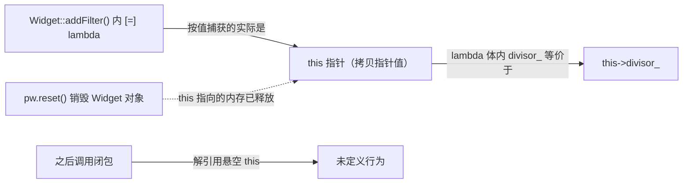

# Effective Modern C++ 5 · Lambda 表达式与工程细节（条款 31-34、41-42）

> 声明：本篇是围绕 Scott Meyers《Effective Modern C++》相关条款主题独立整理的学习笔记，内容为原创总结、示例代码与图解，不摘录、不改写原书文字，仅标注对应的条款编号和主题方便对照阅读，不构成对原书版权内容的复制。

这一讲把 Scott Meyers《Effective Modern C++》第 6 章"Lambda Expressions"（条款 31-34）和第 8 章"Tweaks"（条款 41-42）合并成一讲——两章篇幅都不长，但都是面试里出现频率很高的细节题。Lambda 一章的核心矛盾是"闭包捕获的东西到底是什么、活多久"：默认捕获模式看起来省事，实际上把捕获细节藏了起来，一旦闭包的生存期和被捕获对象的生存期不一致，就会产生悬空引用/悬空指针；C++14 引入的初始化捕获和泛型 lambda 又带来了新的语法组合（移动捕获、`auto&&` 参数）需要单独掌握转发写法。"Tweaks"一章则是两条相对独立的工程实践建议，分别讨论参数传递方式和容器插入方式的性能权衡，共同点是都强调"没有免费的午餐"——每种优化手段都有明确的适用边界和例外场景。

```text
看到 lambda / 参数传递 / 容器插入问题该检查什么：
1. 看到 lambda 的捕获列表，先确认是不是默认捕获（[&] 或 [=]）——默认捕获模式的本质问题是"看代码看不出捕获了什么、捕获的东西活多久"，优先检查显式捕获列表能不能替代。
2. 看到 [=] 且 lambda 定义在成员函数内部并引用了成员变量，立刻检查：这是不是在隐式按值捕获 this 指针？this 指针指向的对象销毁后，lambda 依然会悬空，[=] 并不能保证安全。
3. 看到需要把一个移动语义对象（unique_ptr、大对象）"塞进"闭包里，先看是不是 C++14 环境——是的话用初始化捕获 [x = std::move(y)]，不是的话才考虑 std::bind 模拟。
4. 看到 C++14 泛型 lambda（形参是 auto&& 或 auto&&...）内部需要完美转发，检查转发写法是不是 std::forward<decltype(param)>(param)，而不是试图写一个不存在的模板参数 T。
5. 看到 std::bind 的调用点，先问：能不能用 lambda 替代？多数场景下 lambda 在可读性、移动捕获、内联优化、重载消歧四个维度都更有优势。
6. 看到一个"总是要把参数拷贝进内部存储"的函数在同时维护 const T& 和 T&& 两个重载，评估按值传递单一重载是否划算——前提是这个类型移动开销确实很低,且这个参数在函数的每条路径上都会被用到。
7. 看到 push_back/insert 构造临时对象再塞进容器的写法，评估换成 emplace_back/emplace 是否单纯是效率优化，还是可能绕开了容器的去重逻辑、explicit 构造函数的保护，或者资源管理类型的异常安全设计。
```

---

## Lambda 表达式（条款 31-34）

## 条款 31：避免使用默认捕获模式

**核心结论**：C++11/14 的 lambda 有两种默认捕获模式——`[&]`（默认按引用捕获所有用到的外部变量）和 `[=]`（默认按值捕获所有用到的外部变量），书里建议两种都尽量避免，改用显式捕获列表；原因不是这两种模式在语法上有什么缺陷，而是它们都会掩盖一个关键信息：闭包实际捕获了什么、这些被捕获的东西的生存期是否覆盖闭包被调用的时刻。

**默认按引用捕获 `[&]` 的问题**：闭包里保存的是外部变量的引用（或者说，编译器生成的引用），如果这个闭包的生存期超过了被引用的局部变量，调用闭包时就是在访问一个已经销毁的对象——典型场景是把 lambda 存进容器、注册成回调、或者从函数返回，而它引用的局部变量是该函数的栈上变量。

```cpp
using FilterContainer = std::vector<std::function<bool(int)>>;
FilterContainer filters;

void addDivisorFilter() {
    int divisor = 5;
    filters.emplace_back(
        [&](int value) { return value % divisor == 0; }   // 按引用捕获 divisor
    );
}   // addDivisorFilter 返回后，divisor 被销毁

// 之后调用 filters[0](10) 时，lambda 内部访问的 divisor 已经是悬空引用，未定义行为
```

**默认按值捕获 `[=]` 看起来安全，其实有一个隐蔽陷阱**：直觉上"按值捕获"意味着闭包拿到了一份独立拷贝，不会有悬空问题；但如果 lambda 定义在某个成员函数内部，并且函数体里直接使用了成员变量（不通过 `this->` 显式限定），`[=]` 实际捕获的不是这个成员变量本身，而是外层成员函数的 `this` 指针——这是因为成员变量本质上是通过 `this` 访问的，`[=]` 只能捕获在 lambda 作用域内可见的具名局部变量或形参，而 `this` 才是这样的"局部变量"，成员变量不是。一旦 `this` 指向的对象在闭包被调用之前销毁，闭包访问成员变量时同样是在解引用一个悬空指针，和 `[&]` 的悬空引用问题本质相同，只是从捕获列表 `[=]` 上完全看不出来。

```cpp
class Widget {
public:
    void addFilter() const {
        filters.emplace_back(
            [=](int value) { return value % divisor_ == 0; }
            // 看起来"按值"捕获了 divisor_，实际上捕获的是 this 指针（按值拷贝 this 本身）
            // divisor_ 在 lambda 体内等价于 this->divisor_
        );
    }
private:
    int divisor_ = 5;
};

void useWidget() {
    auto pw = std::make_unique<Widget>();
    pw->addFilter();
    pw.reset();          // Widget 对象被销毁，filters 里的闭包持有的 this 指针变成悬空指针
    // 之后调用 filters[0](10) 触发未定义行为：解引用一个已经销毁对象的 this 指针
}
```



C++14 起可以用初始化捕获把成员变量的值真正拷贝进闭包（`[divisor = divisor_](int value) { ... }`），彻底避免依赖 `this`；C++11 下则只能先把成员变量拷贝到一个局部变量，再按值捕获这个局部变量。

**推荐做法：显式捕获列表**。写出 `[divisor](int value) { ... }` 而不是 `[=]`，代价是多打几个字符，收益是捕获了什么、按什么方式捕获，在捕获列表这一处就完全暴露出来，阅读代码或审查生存期问题时不需要再去逐行分析 lambda 体内用到了哪些外部名字。

**常见追问 / 面试陷阱**

> 面试官常问"`[=]` 捕获成员变量安全吗"，标准答案是不安全，且不安全的原因和 `[&]` 悬空引用是同一类问题（依赖一个可能提前销毁的外部实体），区别只是 `[=]` 把这层依赖藏在了 `this` 指针背后，看起来像是拿到了独立拷贝。

**要记住**
- `[&]` 默认按引用捕获，闭包生存期超过被捕获局部变量的生存期时会产生悬空引用。
- `[=]` 默认按值捕获看起来更安全，但在成员函数内部访问成员变量时，实际捕获的是 `this` 指针本身，而非成员变量的拷贝，`this` 指向对象销毁后同样悬空。
- 两种默认捕获模式的共同缺陷是"从捕获列表看不出实际捕获了什么、以什么方式捕获"，不利于生存期分析。
- 优先使用显式捕获列表，逐个写出要捕获的变量及方式；需要真正拷贝成员变量时，用 C++14 初始化捕获或先拷贝到局部变量再捕获。

---

## 条款 32：使用初始化捕获来移动对象到闭包中

**核心结论**：C++11 的捕获列表只能"捕获一个已经存在的变量"，方式只有按引用或按值（拷贝构造）两种，这意味着无法把一个只能移动、不能拷贝的对象（如 `std::unique_ptr`）放进闭包，也无法在需要移动语义时避免一次不必要的拷贝；C++14 引入的初始化捕获（generalized lambda capture，也叫广义 lambda 捕获）允许在捕获列表里用任意表达式初始化一个全新的闭包成员，语法是 `[新名字 = 表达式]`，把移动操作也纳入了捕获的能力范围。

**问题场景**：`unique_ptr` 这样的移动语义类型无法被拷贝，C++11 的捕获列表要么按引用捕获（面临和条款 31 一样的悬空风险），要么试图按值捕获（编译失败，因为拷贝构造函数被删除），没有第三条路可以把所有权真正转移进闭包。

```cpp
auto makePtr = []() { return std::make_unique<Widget>(); };
auto pw = makePtr();

// C++11 下没有办法把 pw 移动进 lambda：
// auto func = [pw]() { pw->doWork(); };        // 编译失败：unique_ptr 拷贝构造被删除
// auto func = [&pw]() { pw->doWork(); };       // 能编译，但如果 pw 提前销毁，悬空
```

**C++14 初始化捕获的解法**：在捕获列表里直接写一次移动构造，闭包内部生成一个独立拥有该对象的新成员。

```cpp
auto pw = std::make_unique<Widget>();

auto func = [pw = std::move(pw)]() {   // 闭包内新建一个叫 pw 的成员，用 std::move(外层 pw) 初始化
    pw->doWork();
};
// 此时外层 pw 已经被移空（变成 nullptr），所有权完全转移进了闭包，
// 闭包的生存期不再依赖外部任何变量，不存在悬空问题
```

初始化捕获的等号左边（闭包里新成员的名字）和右边（初始化表达式，作用域仍是定义 lambda 时的外部作用域）可以是完全不同的名字，也可以是任意合法表达式，不限于变量名，比如可以直接在捕获列表里构造一个临时对象：

```cpp
auto func2 = [ptr = std::make_unique<Widget>()]() {   // 捕获列表里直接构造，不依赖任何外部变量
    ptr->doWork();
};
```

**C++11 下的历史替代方案：`std::bind` 模拟移动捕获**。思路是把要移动的对象作为额外参数绑定进 `std::bind` 返回的函数对象，`std::bind` 内部会用移动构造保存这个参数，再在调用时把它转发给真正的 lambda：

```cpp
// C++11 用 std::bind 模拟"移动捕获"
auto func3 = std::bind(
    [](std::unique_ptr<Widget>& pw) { pw->doWork(); },
    std::move(pw)     // std::bind 内部按值保存这个参数，从 pw 移动构造
);
```

这种写法能达到类似效果，但语法明显更绕，也是条款 34 里"优先用 lambda 而非 `std::bind`"这一建议的一个具体动机——一旦 C++14 可用，初始化捕获直接替代了这一类 `std::bind` 用法。

**要记住**
- C++11 捕获列表只能按引用或按值（拷贝）捕获已存在的变量，无法移动只能移动不能拷贝的对象进闭包。
- C++14 初始化捕获 `[新名字 = 表达式]` 允许用任意表达式（包括 `std::move`）初始化闭包的新成员，实现移动捕获。
- 初始化捕获的新成员名字可以和外层变量名相同也可以不同，右侧表达式的作用域是 lambda 定义处的外部作用域。
- C++11 下可以用 `std::bind` 搭配移动构造模拟同样的效果，但语法更繁琐，这也是后续条款建议优先用 lambda 而非 `std::bind` 的原因之一。

---

## 条款 33：对 auto&& 类型的形参使用 decltype 以 std::forward 之

**核心结论**：C++14 允许 lambda 参数列表里使用 `auto`（泛型 lambda），编译器会把这个 `auto` 参数按每次调用的实参类型单独推导，行为等价于一个模板参数是万能引用的场景；但完美转发通常写作 `std::forward<T>(param)`，这里的 `T` 需要一个具名的模板参数，而泛型 lambda 并没有这样一个显式声明的 `T` 可用，正确的写法是用 `decltype(param)` 替代 `T`，即 `std::forward<decltype(param)>(param)`。

**为什么 `decltype(param)` 能替代 `T`**：`param` 是 `auto&&` 类型的参数，它本身就是一个万能引用，绑定左值时是左值引用类型，绑定右值时是非引用类型（这正是条款 1/24/28 讨论的引用折叠机制）；对这个参数取 `decltype`，得到的类型恰好携带了它本该对应的模板参数 `T` 的全部信息（左值实参对应 `T&`，右值实参对应 `T`），把这个类型直接喂给 `std::forward` 的模板参数位置，`std::forward` 内部基于这个类型做的条件转换逻辑就能正确工作，效果和显式模板函数里的 `std::forward<T>(param)` 完全一致。

```cpp
auto forwardCall = [](auto&& param) {
    return someFunc(std::forward<decltype(param)>(param));
};
```

**完整示例：一个基于泛型 lambda 的完美转发包装器**，可以接受任意数量、任意类型的实参并原样转发给内部函数，同时正确保留每个实参的值类别：

```cpp
template<typename F>
auto makeLogger(F&& func) {
    return [func = std::forward<F>(func)](auto&&... args) {
        // args... 是若干个 auto&& 参数（形参包），每一个都要单独用 decltype 转发
        std::cout << "[log] calling with " << sizeof...(args) << " args\n";
        return func(std::forward<decltype(args)>(args)...);
    };
}

std::string makeGreeting(std::string&& name) {
    return "Hello, " + std::move(name);
}

auto loggedGreeting = makeLogger(makeGreeting);
auto result = loggedGreeting(std::string("Quant"));
// 参数包里的每个 args 都按 std::forward<decltype(args)>(args) 单独转发，
// 保证传入的右值 std::string("Quant") 在传递链路上始终保持右值属性，触发移动而非拷贝
```

这个例子里 `func` 本身也用了条款 32 的初始化捕获配合完美转发（`func = std::forward<F>(func)`），把外部传入的可调用对象正确地移动/拷贝进闭包，两条条款经常一起出现在真实代码里。

**要记住**
- C++14 泛型 lambda 的 `auto&&` 参数在语义上等价于模板函数里的万能引用参数，但没有一个显式命名的模板参数 `T` 可用。
- 正确的转发写法是 `std::forward<decltype(param)>(param)`，用 `decltype(param)` 代替 `T` 提供 `std::forward` 所需的类型信息。
- 形参包场景下（`auto&&... args`）同样成立，写作 `std::forward<decltype(args)>(args)...`，对包里的每个参数单独转发。
- 这一写法的正确性建立在条款 1/24/28 描述的引用折叠规则之上：`decltype(param)` 对左值实参得到 `T&`，对右值实参得到 `T`，恰好是 `std::forward` 需要的信息。

---

## 条款 34：优先使用 lambda 表达式而非 std::bind

**核心结论**：`std::bind` 在 C++11 之前（`std::tr1::bind`/`boost::bind`）曾是"延迟调用/适配函数签名"的主要工具，但在有 lambda 可用的现代 C++ 里，书里建议绝大多数场景优先选择 lambda，理由集中在四点：可读性、移动捕获能力、被编译器内联优化的难易程度、重载函数场景下是否容易产生歧义。

**可读性对比**：`std::bind` 依赖占位符（`std::placeholders::_1`、`_2` 等）描述参数如何从调用点传递到被绑定的函数，阅读时需要在"绑定表达式"和"占位符对应关系"之间来回对照；lambda body 里直接写出真实的函数调用，捕获的值和调用逻辑出现在同一处，不需要额外的心智翻译。

```cpp
using Time = std::chrono::steady_clock::time_point;
enum class Sound { Beep, Siren };
using Duration = std::chrono::steady_clock::duration;

void setAlarm(Time t, Sound s, Duration d);

// std::bind 写法：延迟调用 setAlarm，把时间点固定为“1 小时后”
using namespace std::chrono;
using namespace std::placeholders;

auto setSoundB = std::bind(setAlarm,
                            steady_clock::now() + hours(1),
                            _1,
                            seconds(30));
// 阅读时需要回忆：_1 对应调用 setSoundB(Sound::Beep) 时传入的第一个实参，
// 而 steady_clock::now() 在 std::bind 调用发生时就已经求值并固定下来

// lambda 写法：捕获逻辑和调用逻辑写在一起，一眼看清参数怎么传递
auto setSoundL = [](Sound s) {
    setAlarm(steady_clock::now() + hours(1), s, seconds(30));
};
// steady_clock::now() 在每次调用 setSoundL 时才求值，语义和 std::bind 版本其实不同，
// 这也是 bind 版本一个容易被忽视的陷阱：绑定表达式里的子表达式在 bind 调用时就求值，而非每次调用时
```

上面这个例子还顺带暴露了 `std::bind` 一个容易被忽略的语义陷阱：`steady_clock::now() + hours(1)` 作为 `std::bind` 的实参，在调用 `std::bind` 的那一刻就被求值并存储下来，之后每次调用 `setSoundB` 用的都是同一个固定时间点；如果本意是"每次调用时都重新计算当前时间 + 1 小时"，需要把这个子表达式也包一层 lambda 或 `std::bind` 才能得到延迟求值的效果，而 lambda 写法天然就是每次调用时才对 body 里的表达式求值，语义更符合直觉。

**移动捕获**：条款 32 讨论的初始化捕获让 lambda 可以直接把移动语义对象放进闭包；`std::bind` 在 C++14 下虽然也能通过传入一个已经 `std::move` 过的参数达到类似效果（如条款 32 末尾的例子），但语法明显更绕，可读性上处于劣势。

**编译器内联优化**：lambda 的闭包类型是一个编译器生成的、对优化器完全透明的普通类类型，调用 `operator()` 通常能被内联展开；`std::bind` 返回的对象类型由标准库实现决定，内部往往涉及更复杂的类型擦除或参数打包机制，一些实现下调用路径的间接层次更多，内联难度更高，在热路径代码里可能有实际可测的性能差异（具体差异因标准库实现而异，不是所有实现都有明显区别）。

**重载函数的歧义问题**：如果要绑定的是一个有多个重载版本的函数名，`std::bind` 单凭函数名无法确定绑定哪一个重载，必须借助显式的函数指针类型转换来消除歧义；lambda 则不存在这个问题，因为 lambda body 里写的就是一次普通函数调用，重载决议在调用点根据实参的实际类型正常发生。

```cpp
void doWork(int x);
void doWork(double x);

// auto b = std::bind(doWork, _1);   // 编译失败：doWork 有两个重载，编译器不知道绑定哪一个
auto b = std::bind(
    static_cast<void(*)(int)>(doWork), _1   // 必须显式指定重载版本对应的函数指针类型
);

auto l = [](int x) { doWork(x); };   // lambda body 里的调用在调用点正常做重载决议，无需额外转换
```

**要记住**
- lambda 把捕获的值和调用逻辑写在同一处，可读性通常优于依赖占位符 `_1`、`_2` 的 `std::bind` 表达式。
- `std::bind` 绑定的子表达式在 `bind` 调用时就求值，容易和"每次调用时求值"的直觉不一致；lambda body 里的表达式天然是每次调用时求值。
- lambda 直接支持移动捕获（条款 32），`std::bind` 在 C++14 下能模拟但语法更繁琐。
- lambda 的闭包类型对编译器优化更透明，通常比 `std::bind` 更容易被内联；具体幅度因标准库实现而异。
- 绑定重载函数名会产生歧义，需要显式函数指针类型转换消歧；lambda body 里的普通调用在调用点正常做重载决议，没有这个问题。

---

## 工程细节调优（条款 41-42）

## 条款 41：对于可移动且总被拷贝的形参，考虑按值传递

**核心结论**：如果一个函数参数无论如何都会被拷贝进某个内部存储（比如一个 setter 把传入的字符串存进成员变量），传统做法需要维护两个重载——`const T&` 处理左值实参（一次拷贝）、`T&&` 处理右值实参（一次移动）——以达到每种实参类型下的最优开销；改成单一的按值传递形参（`void setName(std::string name)`），可以用一个函数同时覆盖两种情况，代价是某些路径上多付出一次移动操作。

**开销对比**：设内部存储动作是"用形参构造/赋值给成员变量"。

- 双重载方案：左值实参匹配 `const T&` 重载，函数体内做一次拷贝存入成员——总计 1 次拷贝；右值实参匹配 `T&&` 重载，函数体内做一次移动存入成员——总计 1 次移动。
- 按值传递方案：左值实参先拷贝构造出形参（1 次拷贝），函数体内再把形参移动进成员（1 次移动）——总计 1 次拷贝 + 1 次移动；右值实参移动构造出形参（1 次移动），函数体内再移动进成员（1 次移动）——总计 2 次移动。

```cpp
class Widget {
public:
    // 双重载方案：两份函数体（或至少两个符号），维护成本高，但每种实参路径开销最优
    void setNameOverload(const std::string& newName) { name_ = newName; }        // 左值：1 次拷贝
    void setNameOverload(std::string&& newName)      { name_ = std::move(newName); }  // 右值：1 次移动

    // 按值传递方案：单一函数，代码更少，但两条路径都比对应的重载多付出 1 次移动
    void setNameByValue(std::string newName) {
        name_ = std::move(newName);
        // 左值实参：调用处 1 次拷贝构造 newName + 函数体内 1 次移动 = 1 拷贝 + 1 移动
        // 右值实参：调用处 1 次移动构造 newName + 函数体内 1 次移动 = 2 次移动
    }
private:
    std::string name_;
};
```

可以看到,按值传递方案在两条路径下都比"完美调优"的双重载方案多一次移动操作,这正是这个技巧的核心权衡:用"少写一份重载、少一个符号"换来的是"始终多付出一次移动的成本"——如果目标类型移动开销确实很低(如 `std::string`、`std::vector` 这类内部只是转移几个指针/大小字段的类型),这次额外开销通常可以接受;如果移动开销很高,这笔账就不划算了。

**三个不适用/需要谨慎评估的场景**：

1. **类型移动开销不低**：如果目标类型没有实现廉价的移动构造（回忆条款 29 的告诫——不是所有"看起来该支持移动"的类型都真的移动得很便宜，比如某些没有自定义移动构造、退化成拷贝的类型，或者内部持有定长数组等不可能"转移所有权"只能整体拷贝的成员），按值传递里那次额外的"移动"实际上退化成一次额外的拷贝，双重载方案的优势被放大。

2. **参数并非每条路径都会被使用/拷贝**：如果函数内部存在提前返回、条件判断只在部分分支才使用这个参数、或者只在满足某些条件时才把参数拷贝进内部存储（例如先做校验，校验不通过就直接返回，不接触这个参数），按值传递会在函数入口处无条件构造这个形参，即使某条执行路径根本用不上它，这份构造开销也已经产生并且无法收回；而 `const T&` 重载不产生任何构造开销，`T&&` 重载的移动开销通常也远低于按值传递的构造开销，这种场景下双重载或者干脆使用 `const T&`（如果不需要移动）更合适。

3. **基类形参的对象切片问题**：如果参数类型是一个多态基类，按值传递会退化出对象切片（object slicing）问题——传入派生类对象时，按值构造的形参只保留基类部分，派生类特有的数据和虚函数表信息全部丢失。这与本条款讨论的拷贝/移动开销权衡是两个独立的问题，值得单独留意：只要形参涉及多态基类类型，无论是否考虑本条款的技巧，都不应该按值传递。

**要记住**
- 参数无条件会被拷贝进内部存储、且目标类型移动开销低时，按值传递可以用一个函数覆盖左值/右值两种实参，减少重载数量和代码体积。
- 代价是相对于"完美调优"的双重载方案，按值传递在左值和右值两条路径上都多付出一次移动操作。
- 目标类型移动开销不低时，这个技巧不划算，额外的"移动"退化为额外的拷贝。
- 函数内部并非每条路径都会使用/拷贝这个参数时（提前返回、条件拷贝），按值传递会造成无条件的构造浪费，不适用本技巧。
- 基类类型的按值传递参数存在对象切片问题，这是与拷贝/移动开销无关的独立风险，多态场景下应避免按值传递基类对象。

---

## 条款 42：考虑使用置入代替插入

**核心结论**：容器的"插入"类接口（`push_back`、`insert` 等）接受一个已经构造好的、类型等于（或能隐式转换为）容器元素类型的对象，再把它拷贝或移动进容器；"置入"类接口（`emplace_back`、`emplace` 等）则直接接受构造函数所需的参数，在容器内部为新元素分配的存储位置上就地构造，省去了"先构造一个独立的临时对象，再把它拷贝/移动进容器，再销毁临时对象"这一整套流程。

**效率对比的具体例子**：

```cpp
std::vector<std::string> vs;

vs.push_back(std::string("hello"));
// 1. 用字符串字面量 "hello" 构造一个临时 std::string 对象
// 2. 把这个临时对象移动构造进 vector 的存储空间
// 3. 临时对象在语句结束时被销毁
// 总计：1 次构造（临时对象）+ 1 次移动构造（进容器）+ 1 次析构（临时对象）

vs.emplace_back("hello");
// 直接用 "hello" 这个 C 字符串参数，在 vector 内部为新元素分配的存储位置上
// 调用 std::string 的转换构造函数就地构造
// 总计：1 次构造，没有额外的临时对象，也没有对应的移动和析构
```

`push_back(std::string("hello"))` 这种写法比"多余"更进一步：即使写成 `vs.push_back("hello")`（不显式构造临时对象），`push_back` 的形参类型是 `std::string`，编译器仍然会先用 `"hello"` 隐式构造一个临时 `std::string`，再把这个临时对象移动进容器——`push_back` 这条路径下，只要传入的实参类型和容器元素类型不完全一致，就必然会经过至少一次临时对象的构造/移动/析构；`emplace_back` 则把参数原样转发给元素类型的构造函数，跳过了这个中间环节。

**置入不总是更优的三类例外情况**：

1. **容器可能拒绝这个元素（去重容器场景）**。像 `std::set`、`std::map` 这类要求键唯一的容器，如果新元素和已有元素等价，插入操作最终会被拒绝。用 `insert` 时，如果传入的实参类型和容器元素类型不一致，同样要先构造一个临时对象用于比较/插入，被拒绝后销毁这个临时对象；用 `emplace` 时,元素也是先在容器内部就地构造出来,发现重复后再被销毁——两种做法在"元素最终被丢弃"这一具体场景下都免不了一次构造+一次析构，效率上大体相当，`emplace` 的理论优势在这里被明显削弱,不能一概而论地认为 `emplace` 更快。

2. **绕开 explicit 构造函数的隐式转换检查**。`insert`/`push_back` 走的是拷贝初始化路径，只能使用非 `explicit` 的转换构造函数完成隐式转换；`emplace`/`emplace_back` 走的是直接初始化路径，可以调用 `explicit` 构造函数。如果某个类型的构造函数被特意标记为 `explicit`，目的通常是防止调用方无意间发生隐式转换（这是设计者刻意设下的一道保护），用 `insert` 尝试传入一个需要隐式转换的实参会在编译期直接报错，提醒调用方这里的转换可能不是本意；换成 `emplace` 后,这次原本会被编译器拦下的隐式转换会悄悄编译通过,构造函数被正常调用,失去了这层本该有的编译期保护。这意味着不应该仅仅因为"这样能绕过 explicit 限制"就选择 emplace，遇到这种情况更应该先想清楚：设计者当初把构造函数标记为 explicit 是不是有意为之。

3. **资源管理类型下更容易出现异常安全或构造歧义问题**。`insert`/`push_back` 操作的是一个已经完整构造好、生命周期语义清晰的对象；`emplace` 系列函数是把裸的构造参数转发进容器内部，如果元素类型是一个手动管理资源（如原始指针）而不是通过 RAII 包装的类型，构造过程中一旦发生异常，資源泄漏的风险更高，因为容器内部转发参数、就地构造的过程比"先构造好一个独立对象再插入"多了一些实现细节，不如插入路径直观；此外，如果构造函数存在多个重载,置入函数直接转发参数进行重载决议,更容易在意料之外匹配到某个非预期的重载版本。

**结论**：置入通常是安全的效率优化，尤其是元素类型有非平凡构造成本、且不涉及键唯一性约束时收益明显；但它并非无条件优于插入——去重容器场景下收益消失，涉及 `explicit` 构造函数的保护性设计时可能绕开预期的编译期检查，管理原始资源的类型下异常安全性也需要更仔细地评估。

**要记住**
- 插入操作先构造一个独立对象再拷贝/移动进容器；置入操作把构造参数直接转发给容器内部，就地构造元素，省去中间的临时对象。
- 只要传入插入函数的实参类型和容器元素类型不完全一致，插入路径几乎必然产生至少一次临时对象的构造/移动/析构，这正是置入的效率来源。
- 去重容器（`set`/`map`）里如果新元素最终被判定为重复而丢弃，插入和置入两种做法都免不了一次构造+析构，置入的效率优势在这个场景下基本消失。
- 置入走直接初始化路径，能够调用 `explicit` 构造函数，可能绕开插入路径本该触发的隐式转换编译期检查，这一优点在某些设计里其实是风险。
- 元素类型是手动管理资源、非 RAII 封装的类型时，置入直接转发裸参数就地构造，异常安全性和重载匹配的可控性都不如先构造好一个完整对象再插入。
